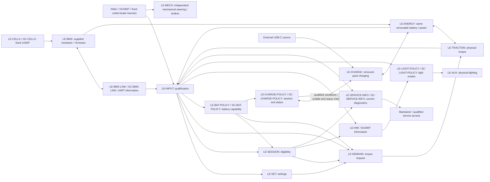

# ARCH-001 — Logical architecture and allocation

**Draft 0.2 — 2026-09-11.** Proposed architecture developed under the owner's instruction to progress both requirements completion points. [PD](../../README.md), [item definition](../Requirements/ID-001_Item_Definition.md) and [requirement model](../Requirements/REQ-001_Requirements.md#requirement-types-and-architecture-model) remain controlling. REQ-001-R1.6 approves the current requirement Type/Target assignments and allocation bindings referenced by those records. The wider architecture remains Draft and partial: unresolved decomposition, realization/hosts and interface/resource contracts are not released by the requirements approval. Completion point B remains open.

## Configuration and logical responsibilities

LE-VEH and LE-EPCS remain overlapping scope views, not a containment pair. Installed riding uses the fitted EPCS functions; the same physical battery also participates in removed-pack charging and storage. The upstream USB-C source is external. A logical element is a responsibility, not a separate controller, PCB or enclosure.

| Logical element | Responsibility / configuration | Allocation and realization |
|---|---|---|
| LE-MECH | Retained independent steering and front/rear mechanical braking; installed vehicle, including off/fault/battery-removed conditions | **Hardware:** retained steering and mechanical brake assemblies, HC-MECH. Independence requirements allocated below; expanded-duty suitability remains unverified. |
| LE-SET | Requested, pending and active riding-setting policy | **Software:** SC-SET. Allocation covers four level and four speed-selection requirements. Source qualification, actual speed/cutoff and physical profile application remain system integration responsibilities. |
| LE-SESSION | Riding Ready eligibility, current-session inhibition and fresh restart assessment | **Software:** SC-SESSION. Consumes qualified information and self-test results; does not itself establish diagnostic coverage or physical inhibition. |
| LE-DEMAND | Signed wheel-torque command policy and arbitration | **Software:** SC-DEMAND. Physical wheel torque, conversion/protection and measurement remain separate system responsibilities. |
| LE-HMI | VD18MT protocol interpretation and outgoing information | **Software:** SC-HMI. Electrical transport and selected-unit visible presentation require integration evidence. |
| LE-INPUT | Rider, motion, battery and temperature information qualification; electrical communication endpoints | **Partially allocated composite:** includes software LE-BMS-LINK; physical acquisition/transport protection, other interpretation and diagnostics still require decomposition and evidence. |
| LE-TRACTION | Realize permitted signed torque with the installed motor; provide qualified applied-torque/motion information | **Unallocated composite:** inverter, motor-control software, motor and feedback interfaces. Motor/axle envelopes and fault-energy behavior remain open. |
| LE-ENERGY | Same removable battery, distribution, permitted power/charge envelopes, residual loads and energy protection in applicable configurations | **Partially allocated composite:** contains LE-CELLS, supplied LE-BMS and software LE-BAT-POLICY; fixed 14S5P 35E bank, nominal 50.4 V, selected SP14S004P14S50A/UART. Distribution, thermal/protection coordination and remaining information responsibilities are open. |
| LE-AUX | Physical front/rear lighting, including dim/full rear operation and protected auxiliary supply | **Partially allocated composite:** software LE-LIGHT-POLICY selects logical modes; lamp driving, startup/reset output, retained lamps and protected supply still require allocation and electrical/visibility qualification. |
| LE-CHARGE | Dry off-vehicle charging from the owner-selected 9 V / 2 A minimum up to permitted 140 W USB input; source qualification, protection and visible status | **Partially allocated composite:** LE-CHARGE-POLICY owns session/indication policy; source qualification, physical conversion/protection/indication, pack-versus-charger deployment and power/reset domains remain open. |
| LE-INTEGRATION | Vehicle mounting, retention, routing, access, weather exposure and mechanical compatibility | **Unallocated composite:** [BAT-003](../Requirements/System_Requirements/Battery_Handling_and_Charging.md#req-sys-bat-003) assigns accessible-interface integration acceptance here; physical contact/protection realization and other integration responsibilities remain to be decomposed. |
| LE-SERVICE | Current diagnostic/configuration access, controlled servicing and return to operation | **Partially allocated composite:** LE-SERVICE-INFO owns current diagnostic information presentation. Physical access/isolation, configuration-change controls, tools and service procedures remain open. |
| LE-CELLS | Fixed electrochemical storage bank, part of LE-ENERGY in fitted/removed configurations | **Hardware:** HC-CELLS, owner-built 14S5P / 70 Samsung INR18650-35E cells. Initial bay fit confirmed; integrated acceptance remains open. |
| LE-BMS | Supplied battery monitoring, balancing and protective switching within LE-ENERGY | **Supplied composite:** JBD SP14S004P14S50A; HC-BMS electronics hosting SC-BMS vendor firmware. Selection is fixed; actual revision/settings and interface acceptance remain open. Internal implementation is vendor-supplied; do not invent an entirely hardware leaf or internal software units. |
| LE-BMS-LINK | UART information interpretation/qualification within LE-INPUT; applicable riding/charging consumer configurations | **Software:** SC-BMS-LINK. Physical UART/ground/power integration and valid source measurements remain outside this leaf. Final host and removed-pack deployment remain open. |
| LE-BAT-POLICY | Battery capability, operation-specific restriction and fault-information policy within LE-ENERGY | **Software:** SC-BAT-POLICY. Consumes qualified observations/configuration and provides information to riding/charging consumers; physical regulation, protection and their diagnostic coverage remain system responsibilities. |
| LE-LIGHT-POLICY | Retain current-session normal-light requests and arbitrate front/rear logical modes within LE-AUX | **Software:** SC-LIGHT-POLICY. Consumes accepted VD18MT commands and qualified lever/actual-braking states; physical lamp output, power/reset continuity and supply protection remain outside this leaf. |
| LE-CHARGE-POLICY | Initial eligibility, completion/fault recovery, charge-enable intent and four logical charging modes within LE-CHARGE | **Software:** SC-CHARGE-POLICY. Consumes qualified source/battery/session/activity evidence; physical current, protection, indication and state continuity remain integration responsibilities. Host must support removed-pack use; none is selected. |
| LE-SERVICE-INFO | Current diagnostic/self-test and configuration information within LE-SERVICE | **Software:** SC-SERVICE-INFO. Preserves producer/reset context, validity and policy-state distinctions; does not grant operation or perform every diagnostic. Transport, physical access and riding/detached-charge hosts remain open. |

The nine project software leaves belong to the EPCS control responsibility; their names do not prescribe separate tasks, processes or executables. HC-MECH is the supplied mechanical realization, not a new brake design. The given passive coded brake harness is a supplied physical interface to LE-INPUT; its topology and coding remain fixed by the [released reference](../Requirements/evidence/Brake_Input_Reference.md). Its sensing realization remains open.

Arrows show principal interactions only. Mechanical braking remains effective without EPCS operation; a software output is not proof of physical output. Rear Full is required for qualified lever actuation or active electrical braking, and for unqualified lever or actual-braking information under LGT-009. A torque request alone does not establish actual braking.

## Allocation records and component contracts

Unchanged requirements may be reclassified without invented parents. New children below contribute only their stated interface/command obligations; their system parents and integration verification remain mandatory.

| Requirement allocation | Realization / responsibility | Parent coverage and remaining evidence |
|---|---|---|
| [REQ-SYS-LVL-001–004](../Requirements/Abstract_Software_Requirements/Settings_and_Control_Policy.md#level-selection-and-application), [REQ-SYS-SPD-002/004/005/008](../Requirements/Abstract_Software_Requirements/Settings_and_Control_Policy.md#speed-selection-and-application) → LE-SET | SC-SET maintains requested/pending/active level and normalized speed limit | Eight existing obligations and sources unchanged. Qualified requests and simultaneous standstill/rest, startup receipt and physical cutoff/profile application remain integration dependencies. |
| [REQ-SYS-CTL-001](../Requirements/Abstract_Software_Requirements/Settings_and_Control_Policy.md#req-sys-ctl-001) → LE-SESSION | SC-SESSION produces eligibility/inhibition state | Partial contribution to startup/fault parents; qualified inputs, actual self-tests, power/reset behavior and physical zero torque remain system work. |
| [REQ-SYS-CTL-002](../Requirements/Abstract_Software_Requirements/Settings_and_Control_Policy.md#req-sys-ctl-002) → LE-DEMAND | SC-DEMAND produces a signed wheel-torque command | Partial command-interface contribution to rider/limit parents; [Released calibration acceptance](../Requirements/System_Requirements/Rider_Control.md#torque-profile-calibration-acceptance) defines normalized shape/endpoints and distinct dynamics/taper. Numeric calibration, timing and physical tracking remain open. |
| [REQ-SYS-CTL-003](../Requirements/Abstract_Software_Requirements/Settings_and_Control_Policy.md#req-sys-ctl-003) → LE-HMI | SC-HMI forms/consumes VD18MT protocol fields | Partial information-interface contribution to HMI parents; electrical transport, update bounds and visible display correspondence remain open. |
| [REQ-VEH-BRK-001](../Requirements/Abstract_Hardware_Requirements/Retained_Mechanical_Control.md#req-veh-brk-001), [REQ-VEH-MEC-001](../Requirements/Abstract_Hardware_Requirements/Retained_Mechanical_Control.md#req-veh-mec-001) → LE-MECH | HC-MECH retains mechanical braking and steering independence | Existing obligations unchanged; inspect/test complete integration for independence and interference. This allocation does not qualify retained parts for 40 km/h, 130 kg or environmental/life duty. |
| [REQ-SYS-CELL-001](../Requirements/Abstract_Hardware_Requirements/Cell_Bank.md#req-sys-cell-001) → LE-CELLS | HC-CELLS realizes the fixed series/parallel bank | Partial physical contribution to REQ-SYS-BAT-002; selected BMS/UART and whole-pack acceptance remain System Requirements. |
| [REQ-SYS-BMSIF-001](../Requirements/Abstract_Software_Requirements/BMS_Information.md#req-sys-bmsif-001) → LE-BMS-LINK | SC-BMS-LINK interprets/qualifies the selected-unit UART read responses | Partial contribution to REQ-SYS-BMS-003; electrical transport, observation accuracy, SOC qualification and dependent physical reactions remain system work. |
| [REQ-SYS-BMSPOL-001](../Requirements/Abstract_Software_Requirements/Battery_Capability_Policy.md#req-sys-bmspol-001) → LE-BAT-POLICY | SC-BAT-POLICY produces qualified battery envelopes, permission/restriction reasons and battery-fault information | Partial contribution to BMS-001/006–008; physical limit enforcement, independent protection, source qualification and session behavior remain system/other-component obligations. |
| [REQ-SYS-CTL-004](../Requirements/Abstract_Software_Requirements/Settings_and_Control_Policy.md#req-sys-ctl-004) → LE-SESSION | SC-SESSION selects/retains the fault-group report, using the lowest assigned code only for indistinguishable earliest ties | Physical reaction applies to every recognized fault; recognition timing/coverage and visible HMI acceptance remain open. |
| [REQ-SYS-LGTPOL-001](../Requirements/Abstract_Software_Requirements/Lighting_Policy.md#req-sys-lgtpol-001) → LE-LIGHT-POLICY | SC-LIGHT-POLICY retains normal request and selects independent front/rear modes | Partial contribution to LGT-001–009. Actual brightness, unqualified-state power-on/reset behavior before software execution and protected continuity remain physical integration obligations. |
| [REQ-SYS-CHGPOL-001](../Requirements/Abstract_Software_Requirements/Charging_Session_Policy.md#req-sys-chgpol-001) → LE-CHARGE-POLICY | SC-CHARGE-POLICY maintains charge eligibility/completion, recovery and logical enable/status | Partial contribution to CHG-001/003–010. Source/initial-SOC qualification, physical current/protection/indication, reset-state continuity and off-vehicle hosting remain open. |
| [REQ-SYS-SVCIF-001](../Requirements/Abstract_Software_Requirements/Service_Information.md#req-sys-svcif-001) → LE-SERVICE-INFO | SC-SERVICE-INFO exposes current observations, identity, qualification and state with producer/reset context | Partial contribution to SYS-SVC-001. Source accuracy/diagnostics, service transport/tools, physical access/isolation and return-to-operation acceptance remain system responsibilities. |
| [REQ-SYS-INT-004](../Requirements/System_Requirements/Interface_Qualification.md#req-sys-int-004) → LE-TRACTION | System command-authority contract; realization remains mixed/unallocated | Authorization withdrawal and command validity must propagate through realization; software zero command alone does not establish physical inhibition, especially with failed output stages. |

[BAT-001](../Battery/BAT-001_Selected_Pack_and_BMS.md) fixes component evidence and derived envelopes. HC-BMS and its hosted SC-BMS are a purchased assembly, not project-developed BMS firmware; system interface/integration acceptance substitutes for invented vendor-internal derivation. [Battery integration requirements](../Requirements/System_Requirements/Battery_Integration.md) target the integrating LE-ENERGY composite. Protect the cell bank against its own limits even where the BMS family defaults permit more. BMS recovery does not release system-session inhibition.

Each software component has the corresponding logical leaf's input/output contract below. Component execution order, scheduling, resource budgets and deployment must satisfy derived end-to-end bounds. Software hosting is **unresolved for the final vehicle**. The [FK743M2-IIT6 documentation](../README.md) identifies the supported development board; it is not evidence of final vehicle power, environmental, timing or fault qualification. Existing HSI assumptions are not silently adopted. No detailed software units are defined.

| Interface | Producer → consumer | Contract / source | Open acceptance and gate |
|---|---|---|---|
| IF-A-001: qualified rider/motion data | LE-INPUT → LE-SET / LE-SESSION / LE-DEMAND / LE-LIGHT-POLICY | Accelerator travel/rest; four-state brake actuation or unknown; motion direction/standstill; value, validity and freshness kept distinct. [Input requirements](../Requirements/System_Requirements/Interface_Qualification.md) | Endpoint ranges, tolerances, time coherence and diagnostic coverage: WS-OI-001/002/012; before dependent input/control requirements freeze. |
| IF-A-002: settings | LE-HMI / LE-INPUT → LE-SET / LE-SESSION / LE-DEMAND | Current-startup receipt versus retained last-valid settings; decoded level 0–5 and normalized speed request; active/pending identity explicit. LE-SET owns LVL-001–004 and SPD-002/004/005/008 | VD18MT encoding/transport, unrecognized frames and qualification timing: WS-OI-008/009/015. No fallback setting creates startup qualification. |
| IF-A-003: power envelope/status | LE-ENERGY / LE-TRACTION ↔ LE-INPUT; LE-BAT-POLICY → LE-SESSION / LE-DEMAND / LE-CHARGE-POLICY | Qualified observations/configuration feed battery policy; outputs distinguish physical charge/discharge capability, propulsion versus charge restriction, required-data qualification and recognized faults. LE-SESSION owns fault/Ready retention, LE-DEMAND owns rider/re-entry arbitration and LE-CHARGE-POLICY owns detached session policy | Limits, margins, source freshness and fault classification: WS-OI-005/018/019, OI-041/048/049/061. |
| IF-A-004: eligibility and torque command | LE-SESSION / LE-DEMAND → LE-TRACTION | Current qualified authority plus valid, unexpired signed rear-wheel command under INT-004; positive means forward. Reject obsolete/restarted-context commands and withdraw command on lost authority. Physical response/protection remain separate | Command representation, complete arbitration, transfer/update/watchdog bounds and physical torque tolerance: WS-OI-003/007/010/015, OI-043/049. |
| IF-A-005: actual output information | LE-TRACTION / LE-INPUT → LE-DEMAND / LE-LIGHT-POLICY | Qualified actual motion/applied torque and active braking, with unqualified state explicit. FLT-012 covers recognized loss; LGT-009 requires Full while braking state is unqualified. Request alone proves neither powered travel nor actual braking | Derive observability/reference/uncertainty/latency; no torque sensor or estimation method selected: WS-OI-001/006/016. |
| IF-A-006: rider information/light commands | LE-SESSION → LE-HMI → VD18MT; LE-HMI / LE-INPUT → LE-LIGHT-POLICY → physical LE-AUX | Error/charge/current fields remain LE-HMI outputs. LE-LIGHT-POLICY retains accepted normal-light requests and arbitrates front On/Off and rear Off/Dim/Full from qualified lever/braking states; unqualified state requires Full | Electrical transport, quantization, brightness and trigger/update timing: WS-OI-008/009/016. |
| IF-A-007: charging session/status | USB-C source / removed battery ↔ physical LE-CHARGE ↔ LE-CHARGE-POLICY | Qualified source limits/events, initial need, battery conditions, state continuity and actual activity feed policy; enable intent and four logical modes feed realization. Unexpected controller restart shows Waiting during fresh checks, discards old fault history and retains completion/initial eligibility; new faults take priority. [Policy contract](../Requirements/Abstract_Software_Requirements/Charging_Session_Policy.md#state-and-event-contract) | OI-041/042/057/061: source/cable/connection qualification, physical current/status correspondence, fresh checks, host/state continuity and indication acceptance before charging requirements/allocation freeze. |
| IF-A-008: service/configuration | Applicable functions → LE-SERVICE-INFO → documented service access / competent maintainer; physical LE-SERVICE supports the task | [Information contract](../Requirements/Abstract_Software_Requirements/Service_Information.md#information-contract): current observations/identity, qualification and distinct fault/inhibition/report/output states retain producer/reset context. Return to riding uses fresh Ready qualification; detached charging uses its own session checks and recovery. Service completion alone grants neither permission nor a new session | OI-041/045/047/049/050: transport/schema, update/coherence bounds, qualified tools/access/isolation and host/loading effects before service/architecture acceptance. No parameter-writing path is selected. |
| IF-A-009: selected BMS UART | LE-BMS ↔ LE-BMS-LINK, through the still-to-be-qualified electrical interface | BAT-001: 9600 8N1 read protocol, pack/SOC/current/14-group/temperature/protection/path information; current positive charging, negative discharging. Preserve validity/freshness and actual-unit scaling. | OI-041/045/046/049/061: resolve manufacturer non-isolated UART restriction, actual pin/logic/ground/B+ references, supported firmware/commands, update/timeout/accuracy, sleep load and reset behavior before electrical/software integration acceptance. |

### Battery protection and reset responsibilities

The [battery qualification/event matrix](../Requirements/System_Requirements/Battery_Integration.md#battery-event-and-recovery-matrix) and [energy-state acceptance](../Requirements/System_Requirements/Energy_and_Protection.md#energy-state-configuration-and-protection-acceptance) define required system observations. Startup checks need source/configuration/path evidence; neither an accepted frame nor a FET status bit proves physical protection. Protective functions for remaining energized paths must satisfy BMS-009 when vehicle host, vehicle supply or UART is unavailable. Their implementation, common dependencies and coverage remain to be allocated within LE-ENERGY/LE-TRACTION/LE-CHARGE.

| Event domain | Required retained/requalified behavior |
|---|---|
| BMS reset, sleep/wake, UART outage/return | Requalify affected data as required by its age/reset evidence. Do not clear a riding/charging session latch merely because the BMS restarts or packets return. |
| Riding-controller normal/unexpected restart | Clear past-failure history and repeat all current-startup checks/Ready guards. Battery-dependent qualification follows BMS-006; a still-present/new fault creates fresh inhibition. |
| Charging-controller unexpected restart | Discard old fault history/indication and show Waiting during fresh checks; newly recognized faults take priority. Completion/initial eligibility persist and require qualification; no charge until fresh checks and conditions permit. No new charge session merely from internal reset (DEC-CHG-003). |
| Physical charging reconnection or qualified USB power cycle | Opens a new initial charge-need assessment subject to checks and valid conditions. If initially full, remain complete despite a later SOC decline. |
| Shared power/reset event | Identify every affected domain and satisfy all applicable rows; a shared MCU or rail must not conflate their different state lifetimes. Physical domains/retention mechanism remain unselected. |

The [speed-cutoff budget](../Requirements/System_Requirements/Interface_Qualification.md#speed-cutoff-uncertainty-and-response-budget) connects source error/age and zero-command delay to the active cutoff without selecting a threshold. The [input/coherence and transport contracts](../Requirements/System_Requirements/Interface_Qualification.md#information-coherence-and-command-authority) define current-context authority and nominal wire-time contributions. The [startup/runtime catalogue](../Requirements/System_Requirements/Power_Startup_and_Faults.md#startup-and-runtime-fault-scope) assigns diagnostic contributors and coverage gaps. Neither selects a sensing circuit, execution monitor or completed protective architecture.

For every numerical or temporal contract, define its reference, valid range, uncertainty, qualification/freshness and response budget before dependent allocation can be accepted. Logical validity metadata need not imply a particular wire format, timestamp implementation or sensor.

## Remaining allocation coverage

Canonical record metadata gives the responsible target. The following contributors do not silently retarget other requirements or establish satisfaction.

| System obligation group | Principal contributors still requiring derivation/allocation |
|---|---|
| Vehicle mass, range, performance, life and environment | LE-ENERGY, LE-TRACTION, LE-MECH and LE-INTEGRATION; retain integrated acceptance at LE-VEH |
| Battery handling, fitted/detached storage and charging | LE-ENERGY, LE-CHARGE including allocated LE-CHARGE-POLICY, LE-INTEGRATION and LE-SERVICE; physical acceptance and state continuity remain open. Preserve DEC-STO-002 normal-full storage entry and the same physical pack |
| Input, Ready, fault and temperature behavior | LE-INPUT, LE-SESSION, LE-ENERGY and LE-TRACTION; detection, self-test coverage and physical inhibition are not closed by policy allocation |
| Rider torque, regeneration, speed and SOC behavior | LE-SET, LE-DEMAND, LE-TRACTION and LE-ENERGY; calibrated demand and physical envelopes/response still required |
| HMI, lights and auxiliary continuity | LE-HMI, LE-INPUT, LE-LIGHT-POLICY, physical LE-AUX and LE-ENERGY; mode policy is allocated, while startup/reset physical output, lamps and protection remain open |
| Energy/protection, connectivity independence and service | All affected contributors, including allocated LE-SERVICE-INFO; presentation does not establish diagnostic coverage, physical isolation or service acceptance. Derive fault-energy outcomes, responsibilities and coverage before corresponding commitments |

**Completion point B remains open:** decompose remaining project-developed composites, assign each project leaf entirely to HW or SW, qualify supplied-component acceptance boundaries, identify realization components and software hosts, complete interface/timing/resource contracts, and demonstrate parent coverage with planned system-level acceptance. No allocation percentage or completed safety assessment is asserted.
