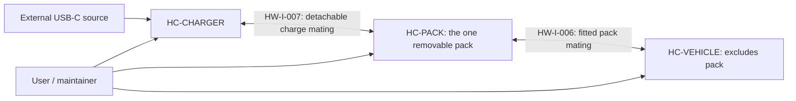

# ARCH-002 — Hardware architecture and physical allocation

**Released 1.0 — 2026-09-13; ARCH-002-R1.0.** This physical architecture refines the approved allocation in [ARCH-001](ARCH-001_System_Architecture.md) for the owner-confirmed separate mobile charger adapter. It preserves the released requirement targets and the fixed cell bank, supplied BMS/firmware, retained mechanics and fixed rider interfaces. Its component allocation is approved under the [architecture release record](ARCH-001_System_Architecture.md#release-record). Detailed design and physical acceptance remain open under completion point B.

## Scope and interpretation

The three root assemblies are **HC-VEHICLE** (without the removable pack), **HC-PACK**, and **HC-CHARGER**. HC-PACK is the one physical 14S5P battery in every applicable configuration: fitted riding, connected-but-unseated handling, removed storage, detached charging and service. It mounts in HC-CARRIER when fitted; mounting, electrical mating and containment do not make a duplicate pack or put HC-PACK inside HC-VEHICLE.

An assembly row may contain boards, wiring, connectors, thermal parts, fasteners and enclosures needed to realize its stated boundary. It does not select a discrete component, connector pinout, isolation topology, fuse, sensor, threshold, diagnostic coverage or timing bound. Human removal/refitting, charging and service procedures are external collaborators, not hardware components.

HC-CELLS and HC-BMS remain supplied/fixed integration boundaries. HC-BMS includes its manufacturer firmware (**SC-BMS**); this document neither decomposes nor changes it. The WeAct STM32H723VGT6 and DRV8300DRGE-EVM remain development references only, not selected final-vehicle assemblies or evidence of final resource, environmental or fault performance.

## Containment and configurations

The diagram shows configuration relationships only. HC-PACK may mate with HC-VEHICLE **or** HC-CHARGER; normal operation uses one mating configuration and one active BMS endpoint. Every logical channel need not have a separate connector. Prevention or treatment of unintended simultaneous attachment remains physical-interface acceptance work. A mating assembly may carry energy and data channels, but the connector, pinout, sequencing, reference management and isolation remain open.

| Configuration | Present assemblies and intended boundary | Required architecture consequence |
|---|---|---|
| Fitted riding / normal shutdown | HC-VEHICLE + one seated, locked HC-PACK | HC-CARRIER provides the tray/original lock and physical retention. Connection before seating conveys no Ready. HC-CONTROLLER and HC-TRACTION-POWER are vehicle-resident. |
| Removal/refitting / empty bay | HC-VEHICLE, HC-PACK and handler, across the prescribed physical sequence | HC-PACK is not contained by HC-VEHICLE while lifted or detached. HC-PACK-IF, HC-VEH-HARNESS, HC-CARRIER and enclosures contribute to accessible-contact, residual-energy, routing and inspection boundaries. No connection/lock sensor or interlock is implied. |
| Detached charging | HC-PACK + HC-CHARGER + dry external USB-C source; HC-VEHICLE unpowered/unavailable | HC-CHARGE-HOST, source handling, charge conversion and four-state indication are local to HC-CHARGER. Vehicle power, HMI and vehicle communication are not dependencies for normal charging. |
| Storage / service | HC-PACK fitted or removed; applicable assembly may be powered, unpowered or disconnected | Energy, wake/polling, access, residual energy and current service state require configuration-specific qualification. Service access does not grant a BMS write, a new charge session, or propulsion/charge permission. |

## Hardware components

Each canonical ID appears once. “Parent” declares containment only; attachment/mating and electrical connections are described in the interface tables.

| ID | Type / parent | Physical allocation and boundary contribution |
|---|---|---|
| HC-VEHICLE | Root assembly / — | The scooter without HC-PACK. Contains retained vehicle hardware and HC-VEH-EPCS; accepts the one removable pack through the fitted mating. |
| HC-PACK | Root assembly / — | The one removable battery assembly. Contains the fixed cells, supplied BMS and pack interface/enclosure. Fits HC-CARRIER; it is never a second vehicle-contained cell bank. |
| HC-CHARGER | Root assembly / — | Separate mobile adapter for dry, removed-pack charging. Contains its host, USB input, conversion, indication, interface and enclosure. |
| HC-MECH | Retained hardware / HC-VEHICLE | Retained steering and front/rear mechanical brake assemblies. Mechanical steering/braking remain physically independent of EPCS power, rider-network interpretation and regeneration. |
| HC-CARRIER | Retained/modified carrier / HC-VEHICLE | Frame, wheels/tyres, running-gear bearings/attachments, battery tray, original mechanical lock and retention features; excludes HC-MOTOR and its internal parts. Supplies physical support, pack fit/retention, HC-MOTOR attachment interface, mounting clearances and routing/environment interfaces; does not contain HC-MOTOR or sense lock/pack state. |
| HC-MOTOR | Supplied replacement assembly / HC-VEHICLE | Fixed replacement rear hub motor mounted by HC-CARRIER. Its mechanical/electrical output and thermal/mounting compatibility require system acceptance. |
| HC-RIDER | Supplied interface assembly / HC-VEHICLE | VD18MT with its opaque supplied SC-VD18MT firmware, accelerator and the fixed passive coded brake electrical network. This treats the display as a supplied assembly, not proof that its behavior is wholly hardware. The brake network remains one shared two-wire coded interface; no independent electrical channels or new sensing coverage is asserted. |
| HC-LAMPS | Retained/supplied lamps / HC-VEHICLE | Physical front and rear lamps. Their electrical characteristics, visibility, dim/full realization and environmental acceptance remain open. |
| HC-VEH-EPCS | Project-developed composite / HC-VEHICLE | Contains vehicle electronic hardware, power distribution, harness and enclosure. It physically joins the rider, motor, lamps and fitted-pack interfaces while keeping their supplied/retained identities. |
| HC-CONTROLLER | Shared vehicle host / HC-VEH-EPCS | One allocated host for supervision and traction-control execution. It receives front-end and BMS observations for software qualification, exchanges command/status with traction hardware and exports HMI/service information. Shared hosting needs later timing, resource, reset and common-cause acceptance; it does not prove independent protection. It provides state retention across its own reset/power loss for the reached-10%-SOC positive-propulsion inhibition required by SOC-006, distinct from fault history. The retention mechanism is open. |
| HC-INPUT-FE | Project-developed input/front-end assembly / HC-VEH-EPCS | Conditions/protects/acquires applicable rider, motion, battery-interface and other required physical observations for HC-CONTROLLER. Exact excitation, filtering, reference, sensing and diagnostic coverage are open. |
| HC-TRACTION-POWER | Project-developed power assembly / HC-VEH-EPCS | Converts/distributes applicable vehicle energy for HC-MOTOR and exposes physical traction-path status to the controller/protection coordination. Generated-energy, zero-command, faulted/off and charge-ineligible outcomes remain to be derived and accepted. |
| HC-ENERGY-DIST | Project-developed distribution assembly / HC-VEH-EPCS | Receives fitted-pack energy and distributes it to vehicle power consumers under the eventual configuration-specific protection and service-isolation arrangement. It does not imply final conductor, switching, pre-charge, fuse or isolation topology. |
| HC-AUX-POWER | Project-developed auxiliary supply assembly / HC-VEH-EPCS | Supplies applicable controller, rider/HMI and lamp-drive auxiliary power. It must be assessed with residual/storage loads and the required continued HMI/lighting behavior; it supplies no all-load protection claim. |
| HC-LAMP-DRIVE | Project-developed output assembly / HC-VEH-EPCS | Drives HC-LAMPS from selected logical modes and provides the powered-start/reset rear-Full default until qualified brake and actual-braking states permit release, including before software executes (REQ-VEH-LGT-009). Full/dim/off output still requires physical qualification. It does not make requested mode proof of actual illumination. |
| HC-VEH-HARNESS | Vehicle wiring/interface assembly / HC-VEH-EPCS | Routes vehicle energy/data/signals to HC-CARRIER, HC-MOTOR, HC-RIDER, HC-LAMPS and HC-PACK-IF. Conductor, connector, sealing, strain relief, reference and powered/unpowered behavior remain open. |
| HC-VEH-ENCLOSURE | Vehicle electronics enclosure / HC-VEH-EPCS | Houses/protects applicable EPCS hardware and contributes mounting, accessible-surface, thermal, ingress and service boundaries. It establishes no environmental rating or service procedure. |
| HC-CELLS | Fixed supplied hardware / HC-PACK | Owner-built 14S5P, 70-cell Samsung INR18650-35E bank. It is one physical cell bank, fixed in HC-PACK. Cell condition, connections, heat transfer, actual energy and pack acceptance remain open. |
| HC-BMS | Supplied composite / HC-PACK | Selected JBD SP14S004P14S50A monitoring/balancing/protective-switching assembly hosting supplied SC-BMS firmware. Its revision, settings, actual protection behavior, UART electrical constraints and coverage require qualification. |
| HC-PACK-IF | Pack interface assembly / HC-PACK | Provides protected physical mating for vehicle and detached charger energy/data channels under the eventual routing/protection arrangement. It contains no automatic immutable electronic identity, no direct external J5 exposure and no normal BMS-write path. |
| HC-PACK-ENCLOSURE | Pack enclosure / HC-PACK | Contains/protects cells, BMS and internal interfaces; contributes retention, accessible-surface, thermal, moisture/contamination, propagation and service/inspection boundaries. Performance and coverage remain open. |
| HC-CHARGE-HOST | Detached charger host / HC-CHARGER | Runs the detached charging execution: BMS-link interpretation and battery capability in charging context, charging-session policy, enable/status coordination and service snapshot. It retains completion and initial-eligibility state across an internal reset or host-power disturbance without a qualified new-session event, separately from current-execution charging fault history. A restart discards old fault indication, reports Waiting while fresh checks run, and does not itself create a session; exact retention method is open. |
| HC-USB-INPUT | USB-C input assembly / HC-CHARGER | Accepts the external USB-C source/cable, qualifies usable source capability and presents input evidence to charge power/host. It also supplies bootstrap/local regulated power to HC-CHARGE-HOST and HC-CHARGE-INDICATOR before charging is enabled; the local power implementation remains open. It supports battery charging only after profile/cable/input qualification; it does not determine pack voltage or prove net charge. |
| HC-CHARGE-POWER | Charger conversion/power assembly / HC-CHARGER | Converts/regulates external energy into the battery-side charge path under host intent and qualified pack/source conditions. Actual current/voltage/temperature limiting, fault withdrawal, stored energy and physical protection must remain effective through host/link failure within the derived arrangement. |
| HC-CHARGE-INDICATOR | Charger indication assembly / HC-CHARGER | Presents Waiting, Charging, Completed and Fault independently of VD18MT during powered detached charging. It represents qualified policy/activity state; indicator implementation, color, visibility and unpowered behavior are open. |
| HC-CHARGE-IF | Charger mating assembly / HC-CHARGER | Mates HC-CHARGER to HC-PACK-IF for detached charging. It carries the logical charge energy/data channels selected by the eventual arrangement without specifying connector/pinout, sequencing, isolation or BMS path bypass. |
| HC-CHARGE-ENCLOSURE | Charger enclosure / HC-CHARGER | Contains/protects charger assemblies and provides dry-use, thermal, accessible-surface, cable/strain-relief and service boundaries. It makes no ingress, shock, thermal or electrical-protection claim. |

## Physical interfaces and power/data paths

The HW interfaces are local physical contracts. They map to logical `IF-A-*` identities in ARCH-001; mapping does not equate an information contract to a connector. All data-bearing channels retain value, validity, freshness/source age and reset/configuration context. Energy protection is distributed across the named assemblies; a status bit, a software disable request or zero torque command is not proof of physical isolation.

| HW interface | Physical parties and channels | Logical mapping | Required boundary / open realization |
|---|---|---|---|
| HW-I-001 — rider and HMI | HC-RIDER ↔ HC-VEH-HARNESS/HC-INPUT-FE/HC-AUX-POWER/HC-CONTROLLER: accelerator, fixed coded brake trunk, VD18MT power/control/UART and applicable status | IF-A-001, IF-A-002, IF-A-006 | Retain the supplied interfaces. Electrical levels, unpowered behavior, source/reference, input protection, qualification and timing require acceptance. |
| HW-I-002 — mechanical carrier | Rider / HC-MECH / HC-MOTOR / HC-PACK ↔ HC-CARRIER | IF-A-012, IF-A-013 | Carrier provides mounting, wheel/motor support, tray and original lock. Mechanical braking/steering are available without electrical operation; retention, loads, clearance and environmental duty remain open. |
| HW-I-003 — vehicle traction path | HC-ENERGY-DIST ↔ HC-TRACTION-POWER ↔ HC-MOTOR, with HC-CONTROLLER command/status | IF-A-004, IF-A-005, IF-A-010, IF-A-011 | Power and control are distinct channels. Define commanded/actual output, generated-energy, failed-control, motor/cable limits and physical response without crediting software command acceptance. |
| HW-I-004 — auxiliary and lamps | HC-AUX-POWER/HC-LAMP-DRIVE/HC-VEH-HARNESS ↔ HC-LAMPS and HC-RIDER | IF-A-006, IF-A-010, IF-A-011 | Carries auxiliary energy and lamp outputs. Startup/reset behavior, lamp electrical data, output protection, load budget and actual visibility require separate qualification. |
| HW-I-005 — vehicle internal energy and service | HC-ENERGY-DIST/HC-AUX-POWER/HC-CONTROLLER ↔ HC-VEH-HARNESS/HC-VEH-ENCLOSURE and qualified maintainer equipment | IF-A-008, IF-A-010, IF-A-011, IF-A-013 | Defines vehicle-internal power/service boundary without selecting a service connector or energized task. Current observations retain producer/reset context; service access cannot grant permission or normal BMS writes. |
| HW-I-006 — fitted pack mating | HC-PACK-IF ↔ HC-VEH-HARNESS/HC-ENERGY-DIST/HC-INPUT-FE | IF-A-003, IF-A-009, IF-A-010, IF-A-011, IF-A-013 | Logical protected pack energy and the selected BMS data channel may share this mating assembly. Exact contact system, data protection, sequencing, reference shifts and isolation are open; connection before seating never proves Ready. |
| HW-I-007 — detached charger mating | HC-PACK-IF ↔ HC-CHARGE-IF/HC-CHARGE-POWER/HC-CHARGE-HOST | IF-A-003, IF-A-007, IF-A-009, IF-A-010, IF-A-011, IF-A-013 | Logical charge energy, session events and BMS data may share this mating assembly. It must avoid BMS-path bypass and protect accessible contacts; no connector, pinout or live-mating behavior is selected. |
| HW-I-008 — BMS data endpoint | HC-BMS ↔ selected HC-INPUT-FE/HC-CONTROLLER **or** HC-CHARGE-HOST through HC-PACK-IF | IF-A-003, IF-A-008, IF-A-009 | One active, protected BMS UART endpoint exists in each mating configuration. J5 stays internal: its B+ is not logic supply and it is not directly exposed. Characterize actual board/firmware, ground/reference shifts, logic levels, unpowered/backfeed behavior and the manufacturer charger/load warning before selecting the electrical arrangement. |
| HW-I-009 — USB-C input | External USB-C source/cable ↔ HC-USB-INPUT | IF-A-007, IF-A-010, IF-A-011 | Qualify current source/cable/profile evidence, source loss/restoration and input limits. Minimum 9 V/2 A and permitted input up to 140 W constrain supported operation; neither is a selected converter topology or battery-side allowance. |
| HW-I-010 — charger power/control | HC-USB-INPUT ↔ HC-CHARGE-POWER ↔ HC-CHARGE-IF, with HC-CHARGE-HOST enable/activity/status | IF-A-003, IF-A-007, IF-A-010, IF-A-011 | Separates source evidence, command intent and actual transfer. Local host/indicator power branches from HC-USB-INPUT without requiring battery charging or a live vehicle; qualified 9 V / 2 A remains the minimum supported charging source. HC-CHARGE-POWER must be assessed for residual/forbidden transfer and host/link loss; software enable or LED state alone does not establish charging. |
| HW-I-011 — charger indication and service | HC-CHARGE-HOST/HC-CHARGE-POWER ↔ HC-CHARGE-INDICATOR and qualified maintainer equipment | IF-A-007, IF-A-008 | The four charging modes are visible locally during powered charging. Service information reports current state/context and cannot turn a controller reset into a new session or clear unrelated latches. |
| HW-I-012 — enclosure, thermal and accessible boundaries | HC-VEH-ENCLOSURE / HC-PACK-ENCLOSURE / HC-CHARGE-ENCLOSURE / HC-CARRIER ↔ people and environment | IF-A-010, IF-A-011, IF-A-013 | Covers physical mounting, heat paths, ingress/contamination, touchable surfaces, cable routing and exposed-bay/charger cases. Criteria, materials, sealing, thermal margins and fault coverage remain open. |
| HW-I-013 — service/handling collaboration | Maintainer/handler procedures ↔ HC-VEHICLE, HC-PACK and HC-CHARGER | IF-A-008, IF-A-011, IF-A-013 | Applies prescribed remove/refit, dry charging, inspection and isolation procedures. Human action is not a sensed hardware state; no new interlock, sensor, programming connector or BMS-write capability follows. |

## Hosts, state and physical protection boundaries

HC-CONTROLLER is the shared vehicle host for supervision and traction. Software components may have separate vehicle and charger execution instances, with isolated state and context, even where they share a component type. HC-CHARGE-HOST is a separate detached host and does not depend on HC-CONTROLLER, vehicle supply or VD18MT.

| State / action | Physical owner | Required separation |
|---|---|---|
| Riding Ready, riding fault history, rider command and traction execution | HC-CONTROLLER with vehicle physical contributors | A vehicle-controller restart starts ineligible and has no old fault history; fresh qualification is required. This does not clear a charging state. |
| Reached-10%-SOC positive-propulsion inhibition | HC-CONTROLLER retention provision | It survives HC-CONTROLLER reset/power loss until actual SOC exceeds 20%, per SOC-006. It is an operating restriction, not retained failure history; exact retention realization remains open. |
| Charge initial eligibility and completion hold | HC-CHARGE-HOST retention provision | It survives an internal HC-CHARGE-HOST restart or power disturbance without a new-session event. A qualified physical charge reconnection or USB interruption/restoration supersedes restored state and opens a fresh initial-charge-need assessment; later SOC decline, BMS reset or UART recovery is not. |
| Charging fault inhibition/indication | HC-CHARGE-HOST current execution, coordinated with HC-CHARGE-POWER | A restart discards old fault history/indication, shows Waiting during fresh checks and preserves completion/initial eligibility. Current conditions and physical transfer still need fresh qualification. |
| Cell-path backstop, balancing and vendor observations | HC-BMS | BMS trip/recovery/telemetry return is not a vehicle or charging policy reset. Its qualified configuration and actual behavior remain supplied-component acceptance work. |

The following are allocation boundaries, not completeness or independence claims:

- **Pack-local:** HC-CELLS, HC-BMS, HC-PACK-IF and HC-PACK-ENCLOSURE contain stored energy and supplied path functions. BMS protection is a backstop, not commanded-current regulation or proof of all fault coverage.
- **Vehicle-local:** HC-ENERGY-DIST, HC-TRACTION-POWER, HC-AUX-POWER, HC-VEH-HARNESS and HC-VEH-ENCLOSURE must provide the eventual assigned response for vehicle energy, residual energy and wheel generation, including unavailable controller/supply/UART states.
- **Charger-local:** HC-USB-INPUT, HC-CHARGE-POWER, HC-CHARGE-IF and HC-CHARGE-ENCLOSURE must contain input and battery-side transfer independently of mere host intent, including source/host/link faults within the derived envelope.
- **Accessible and service boundary:** HC-CARRIER, interfaces, harnesses and enclosures must be assessed through fitted, unseated, removed, empty-bay, charging and service states. A dark HMI, UART response, FET status or zero command does not demonstrate safe physical exposure or isolation.

## Allocation limits and completion work

This architecture baseline introduces no new system requirement or hardware leaf below the stated assemblies. In particular, it selects neither a new sensor/interlock, an immutable electronic pack identity, normal BMS parameter-write capability, charger topology, direct BMS J5 exposure, UART isolation implementation, current/voltage/thermal setpoint, fuse/protection circuit, torque controller circuit or claimed diagnostic coverage.

Before physical allocation acceptance, complete the existing `OI-040`–`049`, `OI-057`, `OI-061`–`063` and applicable `WS-OI` evidence: actual BMS identity/settings/UART electrical behavior; pack/charger/vehicle power, reference and connector arrangement; all-load/storage budget; generated/residual energy and accessible-interface response; charger source/conversion characterization; host reset/state retention; routing, thermal, enclosure, retention and service acceptance; and shared HC-CONTROLLER timing/resource/common-cause analysis. [BAT-001](../Battery/BAT-001_Selected_Pack_and_BMS.md), [battery integration](../Requirements/System_Requirements/Battery_Integration.md), [charging](../Requirements/System_Requirements/Battery_Handling_and_Charging.md), [energy protection](../Requirements/System_Requirements/Energy_and_Protection.md), and ARCH-001 remain controlling.
