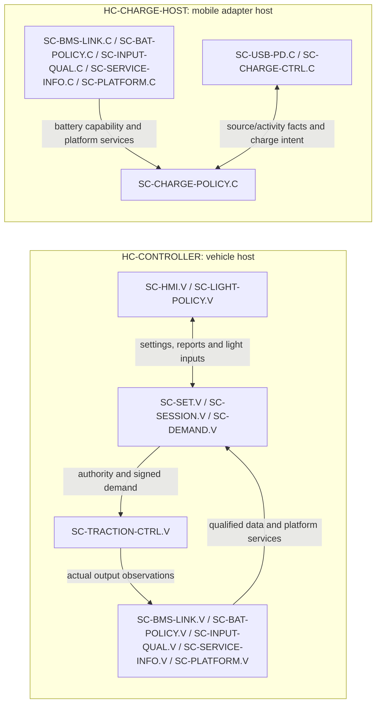

# ARCH-003 — Software architecture and deployment

**Released 1.0 — 2026-09-13; ARCH-003-R1.0.** This is the layer 2 software realization architecture for [ARCH-001](ARCH-001_System_Architecture.md), consistent with released [FC-001](FC-001_Functional_Concept.md), [FC-002](FC-002_Function_Trace.md) and REQ-001-R1.6.  It selects project software components, their instances and hosts; it does not change an approved requirement target or allocation.  All 12 FSC rows remain Draft.  The [architecture release record](ARCH-001_System_Architecture.md#release-record) approves this component/host allocation. Timing, circuit, algorithm, diagnostic-coverage and physical-output acceptance remain derived work.

## Scope, component identities and hosts

`LE-*` remains the requirement-level responsibility.  The five new logical leaves below refine composites only: they do not retarget existing requirements.

| Logical responsibility | Project component | Purpose |
|---|---|---|
| LE-SET | SC-SET | Requested, pending and active level/speed-setting policy. |
| LE-SESSION | SC-SESSION | Ready conjunction, current riding-session inhibition and report selection. |
| LE-DEMAND | SC-DEMAND | Signed wheel-demand and rider/limit arbitration. |
| LE-HMI | SC-HMI | VD18MT protocol interpretation and outgoing information. |
| LE-BMS-LINK | SC-BMS-LINK | Selected BMS UART response interpretation and qualification. |
| LE-BAT-POLICY | SC-BAT-POLICY | Battery capability, restriction and battery-fault information policy. |
| LE-LIGHT-POLICY | SC-LIGHT-POLICY | Normal-light retention and front/rear mode arbitration. |
| LE-CHARGE-POLICY | SC-CHARGE-POLICY | Detached charging eligibility, completion, recovery and indication policy. |
| LE-SERVICE-INFO | SC-SERVICE-INFO | Current producer/reset-context diagnostic presentation. |
| LE-INPUT-QUAL, within LE-INPUT | SC-INPUT-QUAL | Semantic qualification of acquisition and transport observations. |
| LE-MOTOR-CTRL, within LE-TRACTION | SC-TRACTION-CTRL | Authority-context command acceptance, motor-control execution and qualified output observation. |
| LE-PLATFORM | SC-PLATFORM | Local execution, reset-context, persistence and platform-health services. |
| LE-CHARGE-CTRL, within LE-CHARGE | SC-CHARGE-CTRL | Physical charger control/status adaptation; it reports actual activity/path observations to policy. |
| LE-USB-PD, within LE-CHARGE | SC-USB-PD | USB source communication/qualification adaptation. |

The following are supplied opaque software components, deliberately outside the 14 project components above. `SC-BMS` is vendor firmware hosted by `HC-BMS`. `SC-VD18MT` is the display firmware hosted within the VD18MT assembly in `HC-RIDER`; neither receives project units or an invented vendor-internal decomposition. `LE-RIDER-DEVICES` is a supplied composite within LE-INPUT that realizes the fixed rider devices: VD18MT, accelerator and passive coded brake electrical network. Its hardware/firmware boundary does not alter SC-HMI's project responsibility for vehicle-side protocol interpretation.

| Deployment | Instances | Host and boundary |
|---|---|---|
| Vehicle (`.V`) | SC-SET.V, SC-SESSION.V, SC-DEMAND.V, SC-HMI.V, SC-BMS-LINK.V, SC-BAT-POLICY.V, SC-LIGHT-POLICY.V, SC-SERVICE-INFO.V, SC-INPUT-QUAL.V, SC-TRACTION-CTRL.V, SC-PLATFORM.V | **HC-CONTROLLER** is the one selected vehicle host, including motor control. It exchanges electrical signals with the physical input, traction, lighting, energy and HMI components defined by ARCH-001/ARCH-002. |
| Detached charger (`.C`) | SC-BMS-LINK.C, SC-BAT-POLICY.C, SC-CHARGE-POLICY.C, SC-SERVICE-INFO.C, SC-INPUT-QUAL.C, SC-CHARGE-CTRL.C, SC-USB-PD.C, SC-PLATFORM.C | **HC-CHARGE-HOST** is the allocated local host in the owner-selected separate mobile charger adapter. It has no requirement for the vehicle controller, VD18MT or a network connection. |

Shared component types have independent `.V` and `.C` state, reset contexts and validity.  Each instance serves its local configuration; there is no live connection between the vehicle and charger instances; no remote, cloud, vehicle-host or charger-host dependency is introduced.  The WeAct STM32H723VGT6 and fixed DRV8300DRGE-EVM remain development/bring-up references only, as documented in [their board reference](../STM32H723VGT6/README.md) and [EVM reference](../DRV8300DRGE-EVM/README.md); they are not final hosts or qualification evidence.

The deployment view shows execution boundaries; detailed component membership is in the table above. Reused types have separate state, not a runtime cross-host connection.

## Component contracts and owned state

| Component | Inputs / outputs | Owned state and exclusions |
|---|---|---|
| SC-INPUT-QUAL | Raw/transport observations → typed values with qualification, freshness, uncertainty and producer/reset context | Owns qualification lifecycle, not a measurement circuit, physical truth or command authority. |
| SC-SET | Qualified settings receipt → requested/pending/active settings | Owns setting state; retained valid settings are distinct from current-startup receipt. |
| SC-SESSION | Qualified startup facts/self-test results/fault notices → authority, session inhibition and report state | Owns Ready conjunction and current-session fault latch. It neither performs all tests nor proves physical inhibition. |
| SC-DEMAND | Authority, settings, qualified rider/motion and capability → signed wheel command | Owns demand arbitration and regeneration episodes; it does not own actual torque. |
| SC-TRACTION-CTRL | Authority-context command plus physical observations → physical-stage command and qualified actual-output information | Rejects absent, invalid, expired or context-mismatched authority/commands and commands both torque signs to zero within the derived bound (REQ-SYS-INT-004). A commanded zero is not physical protection or proof of zero torque. |
| SC-BMS-LINK | Qualified UART transport → selected-unit battery observations | Owns protocol interpretation only, not UART electrical safety, measurement accuracy or BMS protection. |
| SC-BAT-POLICY | Qualified battery/output/path observations plus configuration/context → distinct charge/discharge envelopes, restrictions and battery-fault information | `.V` owns the reached-10%-cutoff restriction state described below. It does not own hardware protection or the SC-SESSION fault latch. |
| SC-HMI / SC-LIGHT-POLICY | HMI messages/reports and rider-light request; qualified lever/output states → HMI fields and front/rear logical light intent | Light policy owns normal request retention and mode arbitration, not lamp electrical output or visibility. |
| SC-CHARGE-POLICY | Qualified source, battery, connection, activity and fault facts → charge enable/status intent | `.C` owns completion and initial-eligibility state across its own reset. It does not prove physical transfer. |
| SC-CHARGE-CTRL / SC-USB-PD | Policy intent and physical source/charger observations ↔ charger/source control and actual activity/path facts | Adapt physical charging and USB source behavior; neither silently grants policy eligibility. |
| SC-SERVICE-INFO | Producer-tagged current observations → service information | Owns no operation permission, persistent fault history or parameter-writing path. |
| SC-PLATFORM | Reset, scheduling, persistence and local health events → context/retention services and self-test contribution | Owns platform service state only; each consumer owns interpretation of a lost/reset context. |

### Retained restriction and reset state

For [REQ-SYS-SOC-006](../Requirements/System_Requirements/Battery_SOC.md#req-sys-soc-006), **SC-BAT-POLICY.V** owns the `reached10%` propulsion-restriction state.  It sets the state upon qualified entry to the 10% cutoff and exposes the positive-propulsion restriction until qualified actual SOC exceeds 20%.  **HC-CONTROLLER** supplies reset-surviving retention of that state across vehicle reset and relevant battery handling; SC-PLATFORM.V restores it with explicit retention validity/context.  This is an operating restriction, separate from and never implemented as forbidden persistent fault history.  Exact integrity, battery-handling continuity and recovery evidence remain `WS-OI-017` work.

SC-CHARGE-POLICY.C similarly owns detached-session `initial eligibility` and `completion` state; **HC-CHARGE-HOST** retains it across charging-controller reset.  A restart discards old charging fault history, presents Waiting during fresh checks, and retains only the specified completion/initial-eligibility facts subject to their validity.  A qualified physical charge reconnection or USB interruption/restoration supersedes restored session state and starts a fresh initial-charge-need assessment. Ordinary source interruptions that do not qualify as a new-session event keep their automatic-resume rule. Riding fault history remains non-persistent across restart as required by the existing model.

## Typed software interactions

These local interfaces refine, and do not replace, ARCH-001 `IF-A-001` through `IF-A-013`.  Every data exchange contains a value and independently represented qualification/freshness/context; symbolic deadlines are derived later.

| Local interface | Endpoints | Semantic kind | Exchange |
|---|---|---|---|
| SW-I-001 | SC-INPUT-QUAL → SET, SESSION, DEMAND, LIGHT-POLICY | Data publication | IF-A-001 qualified accelerator/rest, coded-brake state/unknown, motion/direction/standstill and required temperature facts. |
| SW-I-002 | SC-HMI + INPUT-QUAL → SET, SESSION, DEMAND | Data publication | IF-A-002 current-startup settings receipt and decoded request; retained settings carry their own context. |
| SW-I-003 | BMS-LINK / INPUT-QUAL / TRACTION-CTRL → BAT-POLICY; BAT-POLICY → SESSION, DEMAND, CHARGE-POLICY | Data publication | IF-A-003/009 observations and capability/fault/restriction outputs; charge and discharge permissions remain separate. |
| SW-I-004 | SESSION → TRACTION-CTRL; DEMAND → TRACTION-CTRL | Control token plus data | IF-A-004 authority context/expiry and signed command/context/expiry. A consumer-side acceptance operation is local and must fail closed. |
| SW-I-005 | TRACTION-CTRL / INPUT-QUAL → SESSION, DEMAND, LIGHT-POLICY | Data publication | IF-A-005 actual motion/applied-output/active-braking state, including unqualified state. |
| SW-I-006 | SESSION/BAT-POLICY → HMI; HMI/INPUT-QUAL/TRACTION-CTRL → LIGHT-POLICY | Data publication | IF-A-006 reports and light inputs; LIGHT-POLICY emits lamp intent to physical LE-AUX. |
| SW-I-007 | USB-PD / CHARGE-CTRL / INPUT-QUAL / BMS-LINK / BAT-POLICY ↔ CHARGE-POLICY | Data plus control | IF-A-007 source/activity/path facts and enable/status intent. An enable call is not evidence of charging. |
| SW-I-008 | All producers → SERVICE-INFO | Data publication | IF-A-008 current, producer-tagged observations, identity and states. |
| SW-I-009 | PLATFORM → all local components | Event and local service call | Startup, reset-context invalidation, retention restore result, watchdog/platform-health and scheduling-service events. |

Calls request a bounded local service and return completion/availability only; they do not transfer permission by themselves.  Data publications are sampled with explicit age/context checks at the consumer.  Events record a discrete reset, withdrawal, detected fault or physical transition; consumers must not reconstruct an event from a static value alone.

## Startup and critical sequences

**Vehicle startup.** SC-PLATFORM.V creates a new context and marks prior observations unusable. SC-INPUT-QUAL.V, SC-BMS-LINK.V and SC-TRACTION-CTRL.V execute their allocated self-tests/qualification without granting torque; SC-SET.V receives current-startup settings; SC-BAT-POLICY.V restores/qualifies `reached10%` and produces the current envelope. Each producer reports pass/fail/incomplete with its context to SC-SESSION.V. SC-SESSION.V alone evaluates the simultaneous Ready guard and issues SW-I-004 authority. SC-DEMAND.V may then publish a context-matched command, which SC-TRACTION-CTRL.V must separately accept. Torque remains commanded to zero until both current authority and a valid command are accepted, and returns to zero when either expires or becomes invalid; physical zero/output protection remains the traction and energy realization responsibility.

**Lever and output sequence.** SC-INPUT-QUAL.V publishes the fixed coded-brake semantic state. SC-DEMAND.V inhibits positive demand for a valid actuated lever while retaining permitted accelerator-requested regeneration according to the existing brake rules. SC-LIGHT-POLICY.V requests rear Full for valid actuation, qualified active electrical braking, or either unqualified brake/actual-braking state. Physical LE-AUX provides the required powered-start/reset behavior before the policy is executing; a software intent is neither lamp output nor visibility evidence.

**Settings sequence.** SC-HMI.V and SC-INPUT-QUAL.V publish current-startup receipt to SC-SET.V. SC-SET.V maintains requested/pending/active identity; absence or uninterpretable initial receipt cannot be replaced by a retained setting for Ready. After Ready, VD18MT link loss alone retains valid active/pending settings and the normal-light request; it does not withdraw driving authority or freeze the rider command. Qualified live accelerator/brake inputs continue to govern demand, with normal command renewal and all other authority/limit checks.

**Charger restart.** SC-PLATFORM.C starts a new charger context and restores only valid completion/initial-eligibility state for SC-CHARGE-POLICY.C from HC-CHARGE-HOST. It discards old fault history, reports Waiting while SC-USB-PD.C, SC-CHARGE-CTRL.C, SC-INPUT-QUAL.C, SC-BMS-LINK.C and SC-BAT-POLICY.C requalify inputs, then applies new faults before enable/status intent. A separately qualified new-session event instead triggers a fresh initial-charge-need assessment; a restored completion hold cannot override that event. Vehicle state is neither read nor required.

## Execution and timing constraints

The architecture uses symbolic bounds only. Let `T_acq`, `T_qual`, `T_pub`, `T_consume`, `T_cmd`, `T_accept`, `T_stage`, and `T_phys` be the allocated contributions from acquisition, qualification, publication, consumer recognition, command production, traction acceptance, physical-stage response and physical output. For an applicable condition, the derived end-to-end bound is the relevant sum of those contributions; interfaces must preserve enough age/context information to assess it. `T_reset` includes context invalidation and any explicit retained-state restoration qualification.

SC-PLATFORM must schedule acquisition/qualification, authority withdrawal, command acceptance, self-test reporting and health supervision so the derived bounds for `IF-A-001`–`IF-A-011`, especially the speed-cutoff and command-authority budgets, are met. No rate, priority, watchdog period, timeout, circuit, motor-control algorithm, estimator or numeric deadline is selected here. Producers must expose incomplete and stale status before a consumer can rely on their value; a platform reset or shared rail event invalidates every affected producer context without conflating riding, BMS and charging session lifetimes.

## Acceptance boundaries

This baseline approves software component ownership, interfaces and deployment; implementation acceptance remains separate. Actual sensing, BMS/UART electrical acceptance, motor/inverter response, unauthorized-output protection, lamp startup/full brightness, energy-path protection and end-to-end timing remain hardware/system acceptance under ARCH-001 and the applicable requirements.  Distributed self-tests contribute evidence; SC-SESSION consuming their results does not establish their coverage.  The FSC contribution rows remain Draft and no component boundary claims independence.
