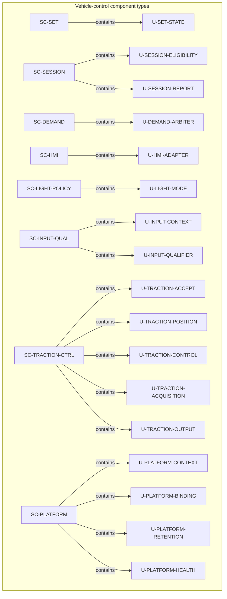
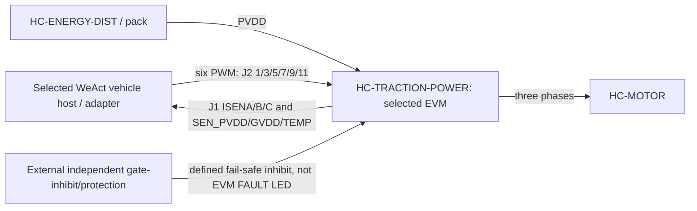
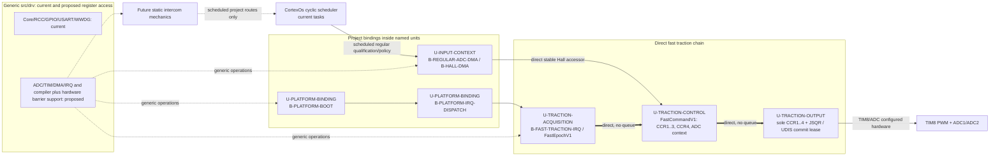
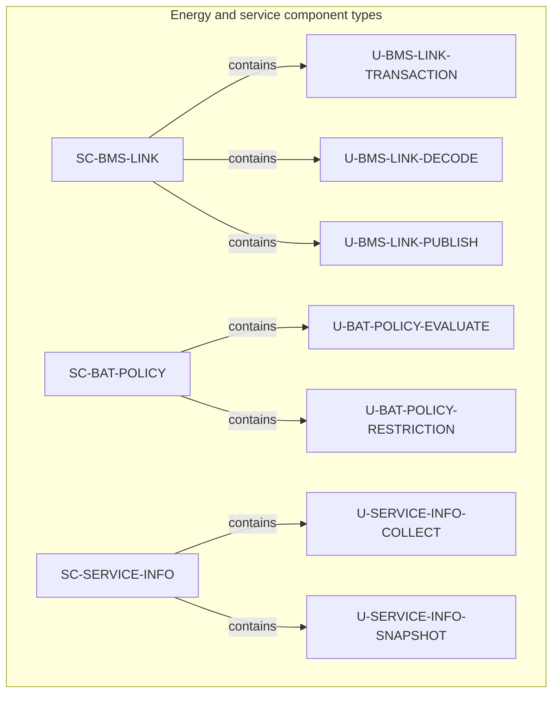
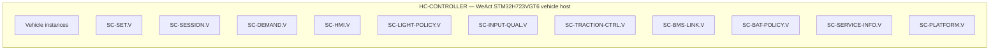

# DD-003 — Static software architecture views

**Draft vehicle baseline — 2026-09-16.** Full static composition, Hall/FOC ownership, runtime realization, battery/BMS/service units, deployment and local-interface views are retained.
**Draft 1.3 — 2026-09-14; successor to DD-003-R1.1.** These controlled views include Hall-position/FOC composition and the selected EVM physical boundary, and make the Draft [ARCH-003 component and host allocation](../SoftwareArchitecture/ARCH-003_Software_Architecture.md) and the unit catalogues in [DD-001](DD-001_Software_Unit_Design.md) and [DD-002](DD-002_Battery_Protection_Unit_Design.md) easier to inspect.

## Scope and notation


The detailed behaviour, qualification, reset, retention and physical-acceptance limits remain authoritative in DD-001, DD-002 and ARCH-003. The [runtime integration contract](../SoftwareArchitecture/Runtime_Integration_Contract.md) separately maps units to project bindings, direct fast calls and deferred scheduled routes; it is not a claim that every unit is a task. A requested zero, a command or an output observation is not proof of physical regeneration, protection or output.

## Static component-to-unit composition

### Vehicle-control domain



### Hall evidence and traction interpretation

```mermaid
flowchart LR
    H[HC-MOTOR Hall1..3] -->|J7 1..3| E[Selected DRV8300 EVM]
    V5[External qualified 5-V Hall supply] -->|planned J3 HALL_EXT then J7-4| E
    E -->|fixed 3.3-V R9/R10/R11 pull-ups and J2 13/15/17| FE[HC-INPUT-FE / host adapter]
    FE -->|conditioned acquired state/edges, open host realization| I[SC-INPUT-QUAL.V]
    I -->|sampled state + edge evidence, validity/freshness/context| P[U-TRACTION-POSITION]
    P -->|qualified electrical sector/direction/edge time| T[SC-TRACTION-CTRL.V]
    P -.->|unavailable without map/alignment| T
    T -.->|separate qualified conversion required| S[mechanical/vehicle speed]
```



The physical prefix records the EVM schematic boundary, not a measured jumper configuration: board revision, J3 setting, common return, backfeed, host thresholds and adapter continuity remain qualification work. `HC-INPUT-FE` owns host-side conditioning/acquisition; it neither owns the EVM pull-ups nor supplies the independent traction gate-inhibit. Static state may support sector at rest after map/alignment qualification; it does not prove speed/standstill. The dashed speed path requires pole-pair and loaded-wheel calibration evidence and is not selected here.

### Selected traction-board ownership boundary



The EVM owns its bridge, shunts, dividers, Hall pull-ups and board-temperature sensor. The selected WeAct `HC-CONTROLLER` plus `HC-INPUT-FE`/host adapter owns the still-unallocated interface and acquisition; `HC-ENERGY-DIST` and the external protection assembly own the additional energy/protection realization. The EVM's J2 `FAULT` is only a host-driven LED indication and is deliberately not drawn as a protection path. All paths remain draft integration contracts rather than acceptance evidence.

`U-INPUT-*`, `U-TRACTION-ACCEPT` and `U-PLATFORM-*` refine approved ASW allocations. `U-TRACTION-POSITION` and `U-TRACTION-CONTROL` are approved Hall interpretation and selected-FOC-control refinements. `U-TRACTION-ACQUISITION` owns completed ADC-epoch publication and `U-TRACTION-OUTPUT` owns compare-latch/inhibit sequencing under Draft HSI-009; the [traction HSI](../DRV8300DRGE-EVM/DRV8300DRGE-EVM_WeAct_STM32H723VGT6_Traction_HSI.md) owns the concrete platform contract. None proves physical output behaviour.

The implementation contract makes the ownership exact: `U-PLATFORM-CONTEXT` orchestrates startup/context invalidation and `U-PLATFORM-BINDING` starts selected resources and dispatches ADC1/ADC2 JEOS to `U-TRACTION-ACQUISITION`; it snapshots JDR data and directly hands an immutable epoch to `U-TRACTION-CONTROL`. Control emits compare/context data, including the next sampling-plan `CCR4`; `U-TRACTION-OUTPUT` alone stages/commits literal TIM8 `CCR1..4` and JSQR. `U-INPUT-CONTEXT` owns regular-ADC and Hall DMA buffers/handlers and its direct stable Hall accessor. The direct fast chain is neither a CortexOs scheduled task nor current intercom usage; the qualified [runtime contract](../SoftwareArchitecture/Runtime_Integration_Contract.md) owns remaining project/generic-driver and future-intercom detail.

### Vehicle runtime realization boundary



Solid fast-path edges are direct calls. Dashed nodes identify capability work, not implemented drivers or intercom endpoints. Project route identity, context, freshness, expiry and fault policy remain outside generic `src/os` transport mechanics.

### Battery, BMS and service domain




## Deployment and instance boundaries

This view separates static type composition above from the local vehicle realization instances below.



`SC-BMS` remains supplied opaque firmware on `HC-BMS`; `SC-VD18MT` remains supplied opaque firmware in the VD18MT assembly within `HC-RIDER`. Neither receives a `U-*` node in these views.

## Static local-interface view

The interface names and endpoint scopes below are the released `SW-I-*` contracts from ARCH-003. Flow labels distinguish **data** publications, **control** token/data, and **event/service** interactions. They do not introduce timing, protocol, electrical or physical semantics. The complete port-to-port route catalogue is [ARCH-003 port registry and route catalogue](../SoftwareArchitecture/ARCH-003_Software_Architecture.md#static-port-registry-and-connection-catalogue); this view intentionally labels interface groups rather than every `P-*` endpoint.

```mermaid
flowchart LR
    subgraph V[HC-CONTROLLER / .V]
        IQ[SC-INPUT-QUAL.V]
        HMI[SC-HMI.V]
        SET[SC-SET.V]
        SES[SC-SESSION.V]
        DEM[SC-DEMAND.V]
        TR[SC-TRACTION-CTRL.V]
        BAT[SC-BAT-POLICY.V]
        LGT[SC-LIGHT-POLICY.V]
        BMS[SC-BMS-LINK.V]
        PLV[SC-PLATFORM.V]
        SIV[SC-SERVICE-INFO.V]
        IQ -->|SW-I-001 data| SET
        IQ -->|SW-I-001 data| SES
        IQ -->|SW-I-001 data| DEM
        IQ -->|SW-I-001 data| LGT
        HMI -->|SW-I-002 data| SET
        HMI -->|SW-I-002 data| SES
        HMI -->|SW-I-002 data| DEM
        BMS -->|SW-I-003 data| BAT
        BAT -->|SW-I-003 data| SES
        BAT -->|SW-I-003 data| DEM
        SES -->|SW-I-004 control token| TR
        DEM -->|SW-I-004 control data| TR
        TR -->|SW-I-005 data| SES
        TR -->|SW-I-005 data| DEM
        TR -->|SW-I-005 data| LGT
        SES -->|SW-I-006 data| HMI
        BAT -->|SW-I-006 data| HMI
        PLV -->|SW-I-009 event/service| IQ
        PLV -->|SW-I-009 event/service| SES
        PLV -->|SW-I-009 event/service| BAT
        PLV -->|SW-I-009 event/service| TR
        PLV -->|SW-I-009 event/service| SIV
        IQ -->|SW-I-008 data| SIV
        SES -->|SW-I-008 data| SIV
        BAT -->|SW-I-008 data| SIV
        TR -->|SW-I-008 data| SIV
    end
        BMSC -->|SW-I-003 data| BATC
        BATC -->|SW-I-003 data| CP
        USB -->|SW-I-007 data| CP
        CC -->|SW-I-007 data| CP
        IQC -->|SW-I-007 data| CP
        CP -->|SW-I-007 control intent| CC
        PLC -->|SW-I-009 event/service| BMSC
        PLC -->|SW-I-009 event/service| BATC
        PLC -->|SW-I-009 event/service| CP
        PLC -->|SW-I-009 event/service| CC
        PLC -->|SW-I-009 event/service| USB
        BMSC -->|SW-I-008 data| SIC
        BATC -->|SW-I-008 data| SIC
        CP -->|SW-I-008 data| SIC
        CC -->|SW-I-008 data| SIC
    end
```

`SW-I-008` is representative in the drawing: ARCH-003 defines it from all local producers to `SC-SERVICE-INFO`; the omitted producer edges are not a change in endpoint scope. `SW-I-009` likewise applies to all local components; selected edges keep the view legible. This figure also suppresses parts of `SW-I-003`, `SW-I-006` and `SW-I-007` where their crossing edges would obscure the host boundary. The complete endpoint, route, fanout and representational-omission record is [ARCH-003 port registry and route catalogue](../SoftwareArchitecture/ARCH-003_Software_Architecture.md#static-port-registry-and-connection-catalogue); the `SW-I-*` interface definitions remain in [ARCH-003](../SoftwareArchitecture/ARCH-003_Software_Architecture.md#typed-software-interactions).

## Cross-view use

Read this document with [DD-001](DD-001_Software_Unit_Design.md) for vehicle-policy unit semantics, [DD-002](DD-002_Battery_Protection_Unit_Design.md) for energy, regenerative acceptance and service semantics, and [DD-004](DD-004_Dynamic_Software_Architecture_Views.md) for documented interaction and state examples. The released ARCH-003 deployment diagram is the source allocation view; this document restates it at unit and instance resolution for detailed-design review only.
