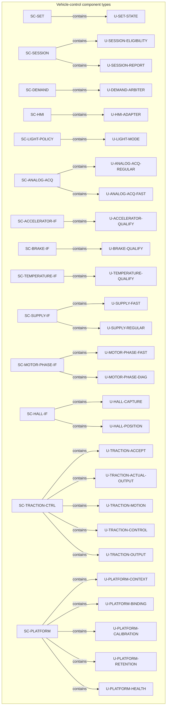
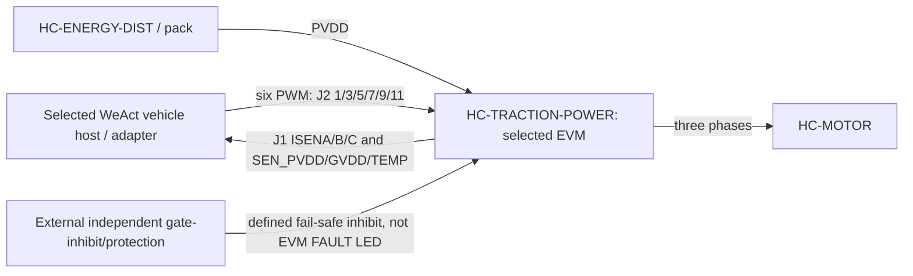
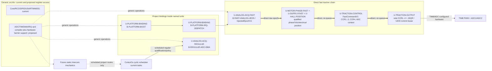
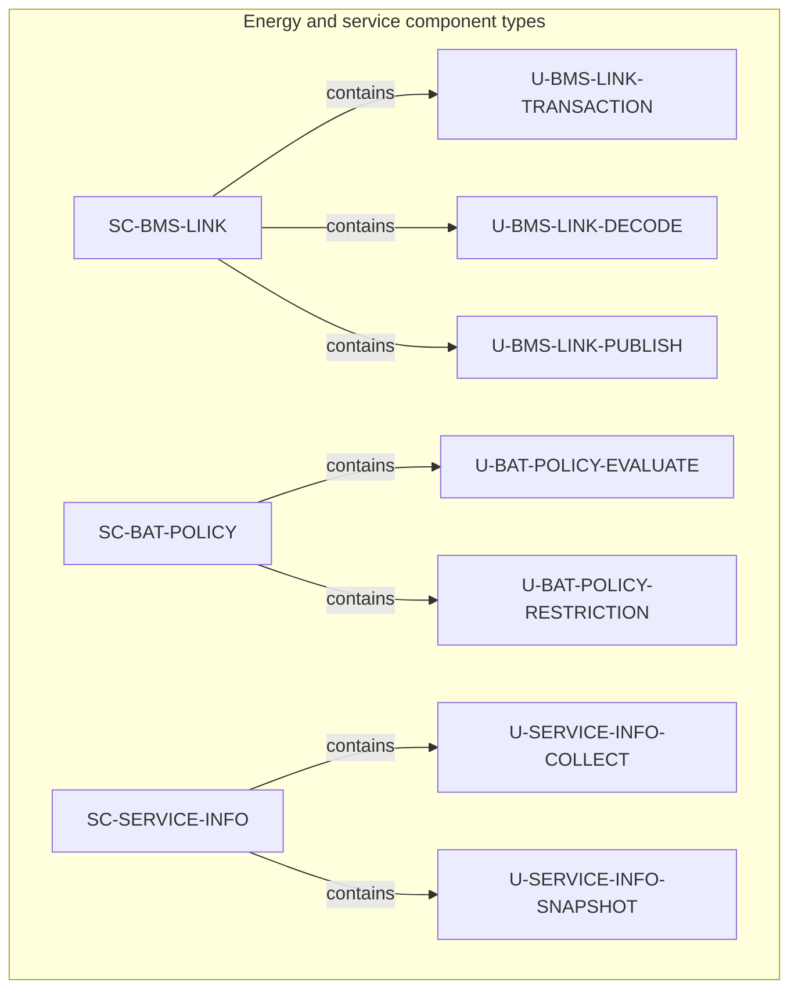
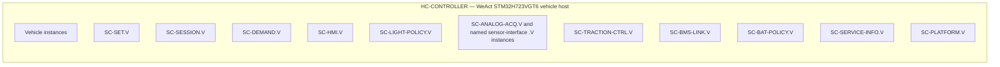
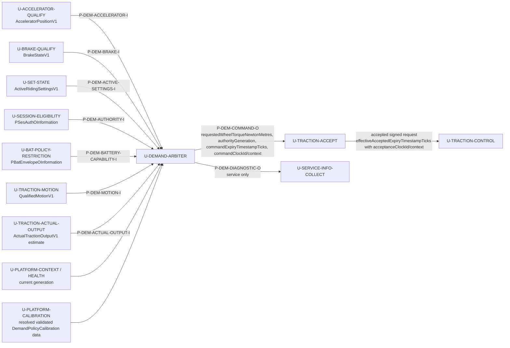
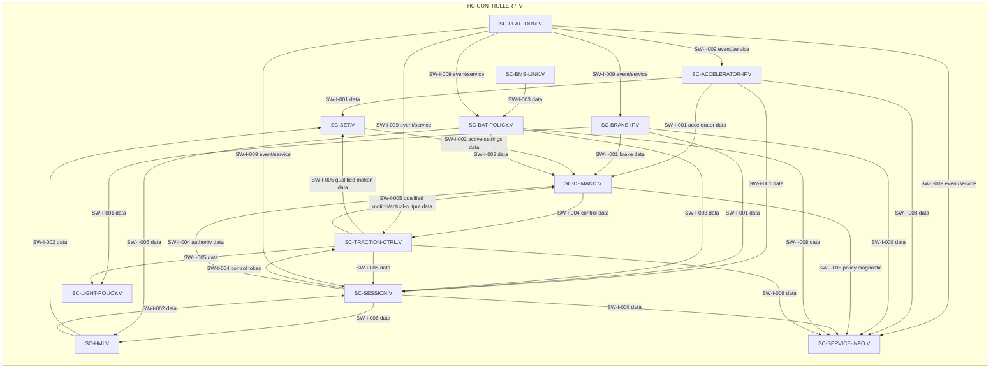

# DD-003 — Static software architecture views

**Draft vehicle baseline — 2026-09-16.** Full static composition, Hall/FOC ownership, runtime realization, battery/BMS/service units, deployment and local-interface views are retained.
**Draft 1.3 — 2026-09-14; successor to DD-003-R1.1.** These controlled views include Hall-position/FOC composition and the selected EVM physical boundary, and make the Draft [ARCH-003 component and host allocation](../SoftwareArchitecture/ARCH-003_Software_Architecture.md) and the unit catalogues in [DD-001](DD-001_Software_Unit_Design.md) and [DD-002](DD-002_Battery_Protection_Unit_Design.md) easier to inspect.

## Scope and notation

The detailed behaviour, qualification, reset, retention and physical-acceptance limits remain authoritative in DD-001, DD-002 and ARCH-003. The [runtime integration contract](../SoftwareArchitecture/Runtime_Integration_Contract.md) separately maps units to project bindings, direct fast calls and deferred scheduled routes; it is not a claim that every unit is a task. A requested zero, a command or an output observation is not proof of physical regeneration, protection or output.

## Static component-to-unit composition

### Vehicle-control domain

### Hall evidence and traction interpretation

```mermaid
flowchart LR
    HM[HC-MOTOR Hall1..3] -->|J7 1..3| E[Selected DRV8300 EVM]
    V5[External qualified 5-V Hall supply] -->|planned J3 HALL_EXT then J7-4| E
    E -->|fixed 3.3-V R9/R10/R11 pull-ups and J2 13/15/17| FE[HC-INPUT-FE / host adapter]
    FE -->|conditioned acquired state/edges, open host realization| HIF[SC-HALL-IF.V]
    HIF -->|capture buffer and valid state/edge evidence| P[U-HALL-POSITION]
    P -->|qualified electrical sector/direction/edge time| T[SC-TRACTION-CTRL.V]
    P -.->|unavailable without map/alignment| T
    T -.->|separate qualified conversion required| S[mechanical/vehicle speed]
```

The physical prefix records the EVM schematic boundary, not a measured jumper configuration: board revision, J3 setting, common return, backfeed, host thresholds and adapter continuity remain qualification work. `HC-INPUT-FE` owns host-side conditioning/acquisition; it neither owns the EVM pull-ups nor supplies the independent traction gate-inhibit. Static state may support sector at rest after map/alignment qualification; it does not prove speed/standstill. The dashed speed path requires pole-pair and loaded-wheel calibration evidence and is not selected here.

### Selected traction-board ownership boundary

The EVM owns its bridge, shunts, dividers, Hall pull-ups and board-temperature sensor. The selected WeAct `HC-CONTROLLER` plus `HC-INPUT-FE`/host adapter owns the still-unallocated interface and acquisition; `HC-ENERGY-DIST` and the external protection assembly own the additional energy/protection realization. The EVM's J2 `FAULT` is only a host-driven LED indication and is deliberately not drawn as a protection path. All paths remain draft integration contracts rather than acceptance evidence.

`U-ANALOG-ACQ-*`, the named sensor-interface units, `U-TRACTION-ACCEPT`, `U-TRACTION-MOTION`, `U-TRACTION-ACTUAL-OUTPUT` and `U-PLATFORM-*` refine approved ASW allocations. `U-HALL-CAPTURE` and `U-HALL-POSITION` own Hall buffer/capture integrity and qualified electrical position; `U-TRACTION-CONTROL` consumes that position with qualified phase feedback and fast Vdc for selected FOC. `U-TRACTION-OUTPUT` owns compare-latch/inhibit sequencing under Draft HSI-009; the [traction HSI](../DRV8300DRGE-EVM/DRV8300DRGE-EVM_WeAct_STM32H723VGT6_Traction_HSI.md) owns the concrete platform contract. None proves physical output behaviour.

The implementation contract makes the ownership exact: `U-PLATFORM-CONTEXT` orchestrates startup/context invalidation and `U-PLATFORM-BINDING` starts selected resources and dispatches ADC1/ADC2 JEOS to `U-ANALOG-ACQ-FAST`, which snapshots raw JDR data into `InjectedEpochV1`. `U-MOTOR-PHASE-FAST` and `U-SUPPLY-FAST` convert the raw epoch into qualified phase feedback and fast Vdc; `U-HALL-CAPTURE`/`U-HALL-POSITION` provide electrical position. `U-TRACTION-CONTROL` consumes those qualified records and emits compare/context data, including the next sampling-plan `CCR4`; `U-TRACTION-OUTPUT` alone stages/commits literal TIM8 `CCR1..4` and JSQR. `U-ANALOG-ACQ-REGULAR` owns regular-DMA completed-record publication, while `U-HALL-CAPTURE` owns Hall capture storage and `U-HALL-POSITION` its interpretation. The direct fast chain is neither a CortexOs scheduled task nor current intercom usage; the qualified [runtime contract](../SoftwareArchitecture/Runtime_Integration_Contract.md) owns remaining project/generic-driver and future-intercom detail.

### Vehicle runtime realization boundary

Solid fast-path edges are direct calls. Dashed nodes identify capability work, not implemented drivers or intercom endpoints. Project route identity, context, freshness, expiry and fault policy remain outside generic `src/os` transport mechanics.

### Battery, BMS and service domain

## Deployment and instance boundaries

This view separates static type composition above from the local vehicle realization instances below.

`SC-BMS` remains supplied opaque firmware on `HC-BMS`; `SC-VD18MT` remains supplied opaque firmware in the VD18MT assembly within `HC-RIDER`. Neither receives a `U-*` node in these views.

## Demand-arbitration typed boundary

`U-DEMAND-ARBITER` has no generic `inputsIn` collection. Each ingress below carries its own value, qualification, freshness, producer/context, configuration identity and generation. Demand evaluates one coherent snapshot; a route being drawn does not make a prior record current.

`U-TRACTION-MOTION` is a real producer route, not a reinterpretation of a Demand command: it interprets current qualified Hall capture/position evidence only with current capture health, map/pole-pair/final-drive/loaded-wheel calibration and a released bounded-observability/standstill criterion before publishing speed, direction and standstill. A static Hall state or no edge alone is unavailable for this purpose. `U-TRACTION-ACTUAL-OUTPUT` publishes `ActualTractionOutputV1` only as a current qualified estimate from post-stage physical evidence with provenance plus same-operation phase-current/position and qualified vehicle-motion evidence with activated estimator calibration. It operates independently of acceptance; `U-TRACTION-ACCEPT` passes that observation without refreshing or gating it while separately issuing accepted demand to control. Its applied-torque and powered-forward-travel fields must be unavailable if that chain has only a requested torque, FOC reference, register/PWM state, output-stage event or acceptance result. The command is a request; neither observation proves physical torque or vehicle travel.

| Decision input/output | Consumer acceptance and ownership |
|---|---|
| Active settings | Only the active level/speed setting is used. Pending values, receipt order and setting activation remain `SC-SET` ownership. |
| Authority and command | `authorityExpiryTimestampTicks` and `commandExpiryTimestampTicks` carry independent decision sequences and named `authorityClockId`/`authorityClockContextId` and `commandClockId`/`commandClockContextId`. Acceptance emits `effectiveAcceptedExpiryTimestampTicks` only after clock/context equality or qualified conversion; Demand cannot refresh authority by issuing a command. |
| Motion and actual output | Demand requires current qualified motion for speed/standstill decisions and current qualified actual positive applied torque plus forward travel to re-arm regeneration after stop. Hand-push travel cannot satisfy the latter proof. |
| Capability | `PBatEnvelopeOInformation` supplies independently qualified positive/negative ceilings, reasons and restriction generations. Demand clamps signs independently, owns regeneration-recovery episode qualification, and does not own protection. |
| Calibration and diagnostic | `DemandPolicyCalibration` carries resolved, validated release-controlled maps, ramps, taper, reference limits and timing-bound data. Diagnostic reason/generation goes one way to service; it has no rider or control route. |

## Static local-interface view

The interface names and endpoint scopes below are the released `SW-I-*` contracts from ARCH-003. Flow labels distinguish **data** publications, **control** token/data, and **event/service** interactions. They do not introduce timing, protocol, electrical or physical semantics. The complete port-to-port route catalogue is [ARCH-003 port registry and route catalogue](../SoftwareArchitecture/ARCH-003_Software_Architecture.md#static-port-registry-and-connection-catalogue); this view intentionally labels interface groups rather than every `P-*` endpoint.

`SW-I-008` is representative in the drawing: ARCH-003 defines it from all local producers to `SC-SERVICE-INFO`; the omitted producer edges are not a change in endpoint scope. `SW-I-009` likewise applies to all local components; selected edges keep the view legible. This figure also suppresses parts of `SW-I-003`, `SW-I-006` and `SW-I-007` where their crossing edges would obscure the host boundary. The complete endpoint, route, fanout and representational-omission record is [ARCH-003 port registry and route catalogue](../SoftwareArchitecture/ARCH-003_Software_Architecture.md#static-port-registry-and-connection-catalogue); the `SW-I-*` interface definitions remain in [ARCH-003](../SoftwareArchitecture/ARCH-003_Software_Architecture.md#typed-software-interactions).

## Cross-view use

Read this document with [DD-001](DD-001_Software_Unit_Design.md) for vehicle-policy unit semantics, [DD-002](DD-002_Battery_Protection_Unit_Design.md) for energy, regenerative acceptance and service semantics, and [DD-004](DD-004_Dynamic_Software_Architecture_Views.md) for documented interaction and state examples. The released ARCH-003 deployment diagram is the source allocation view; this document restates it at unit and instance resolution for detailed-design review only.
