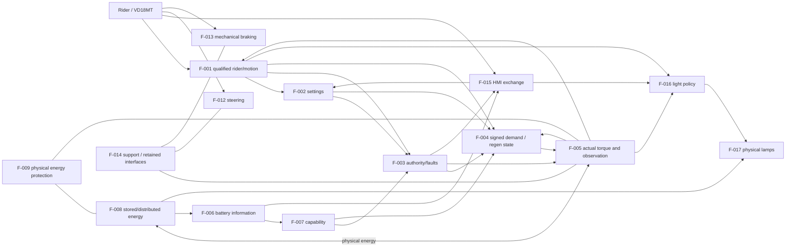
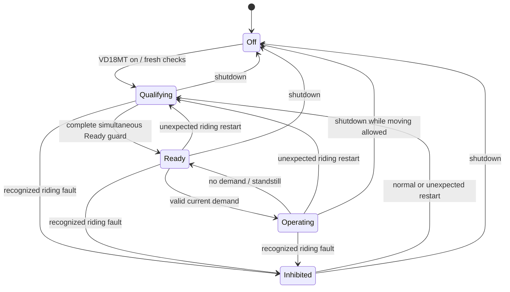

# FC-001 — Functional concept

**Draft vehicle baseline — 2026-09-16.** The complete applicable functional detail is retained for vehicle operation, regeneration, pack handling/storage and service, including independently applicable battery contracts.
| Attribute | Value |
|---|---|
| Revision / status | 1.1 Released, 2026-09-14; **FC-001-R1.1** functional-concept refinement |
| Inputs | REQ-001-R1.6 at `ac43704a3b814143734ee614a1d8c7a50d398c6d`; HARA-001-R1.0 / SG-001-R1.0 at `2d4a39e4c761c148eb777751dae5a78076a2cba8`; their source statuses, assumptions and open gates remain effective |
| Scope | Installed vehicle and its one supplied removable pack across riding, regeneration, handling, storage and service |
| Related work | [Exact requirement/function trace]AFC-002_Function_Trace.md), [logical architecture]AARCH-001_System_Architecture.md), [working requirement catalogue]A../Requirements/REQ-001_Requirements.md), [released goals]A../Safety/SG-001_Safety_Goals.md) |

## Purpose and interpretation

This concept answers **what functions cooperate to deliver the required behavior and safety outcomes**. Functional decomposition connects requirements, behavior and interfaces before detailed realization; NASA describes this role in its [logical-decomposition guidance]Ahttps://www.nasa.gov/reference/4-3-logical-decomposition/). The safety part connects the released goals to functional responses, conditional safe states and derived requirements, within the existing ISO-inspired tailoring; ISO Part 3 identifies the [functional safety concept as a concept-phase work product]Ahttps://www.iso.org/standard/68385.html). No formal ASIL or conformity claim is introduced.

The 16 modeled vehicle functions below are behavior/responsibility views of the existing logical architecture. A function may involve several realization components; functional decomposition is neither a software task list nor proof of independent protection. Existing approved requirement targets and software/hardware allocations are retained. The named logical owner records the proposed coordinating responsibility for each complete function; allocated policy/interpretation leaves supply their explicitly limited contributions. These ownership bindings and the wider structural/behavioural architecture remain provisional, except for the requirement bindings already approved in R1.6.

**Authority:** released requirements and safety goals remain controlling. This release approves the functional definition, contracts, cooperation, modes and response strategy with the qualifications in the [release record]A#release-record). The 12 referenced FSC refinements remain explicitly Draft in REQ-001 Draft1.7; no requirement-status promotion or numeric default follows from the concept release. The trace distinguishes a function's contribution from a requirement derivation parent. Fixed cells/BMS, VD18MT, shared two-wire coded brake interface and original mechanical lock remain given. HARA's broad context assumptions remain assumptions. [MCD-001]A../Motor/MCD-001_Hall_Sensored_FOC_Technical_Design.md) refines F-005's realization with Hall-sensored FOC and does not alter the released functional contract.

## Functional decomposition

The overall purpose is rider-controlled transport with safe lifecycle use. It decomposes into the functional groups below. Physical properties such as mass and durability constrain their combined realization; verification activities are not invented operational functions.

### Shared contract semantics

Every information-bearing interface distinguishes value, validity, freshness/source age, applicable operating context and qualification. Unavailable is not measured zero; receipt time is not automatically measurement time. Each producer owns truthful status for its output; consumers withhold the dependent permission when required information is unqualified. Initial qualification/waiting, ordinary operating restriction and recognized fault retain their separate released meanings.

Required self-tests and detection are distributed across the functions providing observations or physical effects. F-003 owns riding-session inhibition and F-009 coordinates vehicle and pack energy protection. No single diagnostic display or policy function supplies all fault coverage. Known valid-code aliases, shared references, BMS group/probe limitations and physical output faults remain in the fault envelope even when observation cannot distinguish them.

### Function contracts

Each row states one coordinating logical owner, principal inputs/outputs, applicable modes and unavailable/fault behavior. Numeric ranges, timing and verification criteria follow the linked requirements and the budgets below. The [record-level trace]AFC-002_Function_Trace.md) identifies every supporting requirement and safety goal.

| Function / owner | Purpose; inputs → outputs | Modes, limits and unavailable/fault behavior |
|---|---|---|
| F-001 — Qualify rider and motion information · LE-INPUT | Physical accelerator/brake/speed/temperature observations and electrical communication endpoints → qualified travel/rest, four-state lever information, speed/direction/standstill, required temperatures and source/diagnostic status. | Startup, riding, shutdown and controlled diagnostics. Physical rest differs from virtual neutral; unknown speed cannot establish standstill. Preserve unknown/ambiguous input and report recognized faults to F-003. Qualification does not claim detection of all plausible stuck values or coded-brake aliases. Battery observations are F-006. |
| F-002 — Manage rider settings · LE-SET | Qualified VD18MT requests plus coherent standstill/physical rest and startup context → requested, latest pending and active level/speed, and current-startup receipt evidence. | VD18MT selects Levels 0–5; zero or above-40 speed requests normalize to 40. Apply changes only at simultaneous standstill/rest. Retain valid current-session settings on link loss; no stale receipt satisfies a new startup. No pending indication or scooter-defined default is introduced. |
| F-003 — Establish riding authority and fault response · LE-SESSION | Qualified required inputs/settings, self-tests, battery/temperature permission, power/reset events and recognized faults → current Ready/authority, session inhibition and selected fault report. | Every normal/unexpected restart begins ineligible with no past-fault history. Complete simultaneous Ready guards and required valid/released brakes govern drive-off. Recognized faults retain both-sign inhibition until clean restart; every fault reaction applies despite one selected report. VD18MT communication loss alone preserves otherwise permitted function. |
| F-004 — Determine permitted signed wheel torque · LE-DEMAND | Valid current rider demand, active settings, authority, motion/applied-output evidence and capability → one signed rear-wheel command and regenerative-episode state. | Positive means forward torque; Level 0 uses the full positive range and coasts at rest. Levels 1–5 have the common provisional neutral and qualified maps/taper. Brake levers suppress positive demand and never request regen. Both-sign cutoff/fault authority overrides demand; low-SOC speed cap affects positive only. Recovery/ramp and hand-push/actual-powered-forward guards remain distinct. Applied-output feedback qualifies the regeneration re-entry decision; otherwise eligible positive demand after Ready does not require prior positive output. |
| F-005 — Produce and qualify physical wheel torque · LE-TRACTION | Current-context authority and unexpired signed command, physical energy and motor feedback → actual wheel torque, qualified applied-output/braking observations and traction fault/protection status. | Riding and controlled diagnostic operation; no drive before authority. Reject obsolete command context and withdraw on loss of authorization. Actual torque, drag and wheel generation require physical acceptance including failed normal control; a zero command is not a safe-output observation. Unauthorized-output monitoring/protection must remain effective when command acceptance is disabled or authority withdrawn; its operation cannot require acceptance of a new command. F-009 coordinates residual/generated-energy constraints. |
| F-006 — Qualify battery observations and identity · LE-INPUT | Selected BMS/source observations, effective configuration and operation/reset context → qualified pack voltage, signed current, actual SOC, 14 group voltages, available/required temperature/path status and source uncertainty. | Fitted riding, removed storage where available, startup and service. LE-BMS-LINK performs the allocated UART interpretation; the integrating function also needs truthful physical sources and configuration correspondence. Invalid/missing required data cannot authorize propulsion or regenerative transfer. |
| F-007 — Determine battery capability · LE-ENERGY | F-006 observations, qualified component/configuration limits and operation context → separate charge/discharge limits, restrictions, readiness and recognized battery-fault information. | LE-BAT-POLICY supplies allocated policy. Apply cell/group/current/temperature constraints, not only pack SOC. Discharge-valid/charge-invalid temperatures preserve otherwise permitted propulsion and restrict regen. Vehicle-session latches and regen re-entry are owned by F-003/F-004; restoring a capability does not clear them. |
| F-008 — Store, balance and distribute energy · LE-ENERGY | Fixed 14S5P bank, supplied BMS balancing/path functions, charge input and load demands → physical stored/distributed energy and load/path observations. | Installed drive/regen/auxiliaries; removed charge/storage; off/handling/service. Include every auxiliary, residual, polling and self-discharge load. Balance compatibly with the 80% external ceiling. Preserve the distinct 10/20/80/90% policies and qualified cell/storage boundaries. Supplied components require acceptance; their ratings do not prove whole-system performance. |
| F-009 — Bound hazardous energy and interfaces · LE-ENERGY | Physical pack, traction, auxiliary and accessible-path conditions; qualified protection status, configuration and fault envelope → assigned physical protective action, bounded remaining energy and truthful protection status. | All configurations, including controller/UART/supply absence, generated wheel energy, unknown path state and latent pack faults. Required protection remains effective for energized paths within the declared envelope. Detection, prevention and physical exposure limitation cover their assigned cases; do not assume all faults are observable or that a path report proves isolation. F-005/F-014/F-018 supply domain effects. |
| F-012 — Transmit rider steering action · LE-MECH | Rider steering force and supported wheel/road configuration → rider-directed steering action. | Available during riding, off/fault, pushing and battery removal without EPCS power. F-014 preserves clearance/support; faults, wear and environmental impairment require physical qualification and service treatment. No electrical steering fallback is assumed. |
| F-013 — Apply mechanical braking · LE-MECH | Left/front and right/rear lever forces, brake/tyre/surface state → mechanical wheel-braking forces and rider-controlled stopping/rolling restraint. | Independent of power, regen and coded-input interpretation. Include combined mechanical/regen effects and concealed actuation with continuing drive. No automatic motor hold or anti-rollback function is added. Derive lever-use, effort/fade/grip and stopping envelope; a single surviving brake is not credited without evidence. |
| F-014 — Support, retain and protect accessible interfaces · LE-INTEGRATION | Rider/pack loads, original lock/tray/folding/mechanical interfaces, environment and thermal/electrical sources → supported assemblies, retained pack, usable handling access and bounded human exposure. | Installed riding/parking, connected-unseated/unlocked intermediate, empty-bay exposure, removed-pack handling and service. Mechanical structure, sealing/routing/contact protection and accessible temperatures are physical functions/constraints. No sensed lock or carrying-intent detector is presumed. Damaged/misassembled conditions need the derived protection and inspection/recovery treatment. |
| F-015 — Exchange rider settings and information · LE-HMI | Qualified transport/data, selected fault, usable charge/current information and VD18MT messages → decoded requests and protocol fields for the selected HMI. | Current-session retained settings/lighting survive communication loss; link absence prevents delivery, not physical fault response. Preserve 20–80% usable-charge display, unsigned current magnitude/clamp and invalid 0 A fallback without exporting them as control evidence. No dedicated regen, Ready or pending-change indication is added; accepted wheel-setting display error remains separate from true control speed. |
| F-016 — Determine lighting modes · LE-LIGHT-POLICY (`LightModeSelection`) | Qualified `runningLightStateIn`, mechanical `brakeLeverStateIn` and Traction-owned actual `electricalBrakingStateIn` → Front Off/On and Rear Off/Dim/Full modes. | Initial normal request Off; preserve last valid request during VD link loss. Rear Full for either lever, active electrical braking or either unqualified state. Return requires qualified both-released/no-electrical-braking. Passive slowing alone is excluded. Selected modes do not prove physical brightness. |
| F-017 — Produce vehicle lighting · LE-LAMP-HW (`LightActuation`, containing `LightPower`) | LightPower-provided protected supply and F-016 selected modes → physical front illumination/rear dim/full signaling and qualified integration/diagnostic evidence where observable. | Powered startup, riding, torque-inhibited and shutdown transitions wherever protection permits. Provide the required unknown-state startup output before qualified braking information exists. Actual visibility/dim-full distinction, response and supply-loss behavior require acceptance; no indication is promised without usable power. |
| F-018 — Enable controlled service and safe return · LE-VEH | Task, physical configuration/energy state, component condition and effective configuration plus diagnostics → controlled access/isolation or explicitly energized task conditions, inspection/configuration acceptance and return-to-operation evidence. | Inspection, replacement, isolated and energized diagnostics, post-storage/crash and reassembly. Account for wheel generation and residual heat/energy. Service completion grants no torque or regeneration permission; normal riding guards and battery charge-acceptance limits apply. Replacement does not reset the vehicle-life clock. |

Current operational variables may be inspected through the debugger during engineering service. That is an inspection method for the SVC-001 obligation, outside the runtime functional decomposition: it adds no service-information function, aggregation, telemetry/report flow, persistent logger or service authority. It cannot clear latches, prove isolation or create riding authority.

### Hall-sensored FOC realization refinement

F-005 is realized by the selected Hall-sensored FOC method in MCD-001: signed wheel torque maps to a bounded q-axis current reference, the d-axis reference is zero, Hall sectors provide bounded rotor angle, and phase-current/fast-DC-link feedback supports a vector-limited current loop. The functional meanings remain unchanged: actual electrical braking is observed decelerating torque rather than `Iq` sign, mechanical generation is not automatically pack charging, and a zero/PWM-off request is not physical-zero evidence. F-004 keeps all rider/profile/regen permissions; F-007/F-009 retain battery-capability and physical-energy constraints. No field weakening or normal-start alignment/forced motion is added.

### Cross-cutting constraints

| Constraint / accountable scope | Functional contribution and acceptance |
|---|---|
| Mass, payload, fit and retained mechanics · LE-VEH / LE-INTEGRATION | F-005/008/012/013/014 contribute physical mass, loads and packaging; retain the approved 30 kg / 130 kg reference and provisional planning allowances. No weighing result or new battery mass allocation is implied. |
| Range, speed, acceleration and hills · LE-VEH | F-004/005/007/008/012/013 meet the qualified Level 5 duty jointly. F-015/017 and all internal loads enter the range budget. Normal operation remains required in other levels; performance qualification does not assign their calibration. |
| Environmental exposure, storage and life · LE-VEH / LE-EPCS by configuration | F-008/009/012/013/014/017 preserve suitability; F-018 supports inspection/replacement and post-storage qualification. Retain 168 h fitted/exposed-bay and 672 h detached duties at normal-full entry, component-temperature limits and the original commissioning/life origin. |
| Local operation and supplied parts · LE-EPCS | All essential functions operate without phone/cloud/wireless/internet dependency. Qualify the supplied BMS and retained interfaces at their boundary; no vendor software internals or redundant project implementation is invented. |

## Functional interactions

The diagrams show information and physical interactions in their applicable configuration. They do not imply that riding functions occur simultaneously with service/handling states, that arrows are separate wires, or that protection is necessarily implemented by software.

### Interface responsibility

[ARCH-001]AARCH-001_System_Architecture.md#allocation-records-and-component-contracts) owns canonical IF-A contracts. The bindings below identify function endpoints and the physical interfaces added by this concept. Initial values, invalidity, operating context and finite response apply at both ends; no consumer silently substitutes a different mode or reset lifetime.

| Interface | Functional producer → consumer / exchange |
|---|---|
| IF-A-001 | F-001 → F-002/003/004/016: qualified rider/motion/required-temperature information |
| IF-A-002 | F-015 with F-001 transport qualification → F-002/003/004: current-startup receipt, requested/pending/active settings |
| IF-A-003 | F-006/007/008, F-005 → F-003/004/009/010: qualified battery/output envelope, readiness, restriction/fault causes |
| IF-A-004 | F-003/004 → F-005: current authorization and signed wheel command with validity/expiry/context |
| IF-A-005 | F-005 with F-001 → F-003/004/016: qualified actual motion, applied torque and active electrical braking |
| IF-A-006 | F-003/006 → F-015 → VD18MT; F-015/001/005 → F-016 → F-017: rider reports and normal/braking light modes |
| IF-A-009 | Supplied BMS/source → F-006, including LE-BMS-LINK interpretation: protected UART information and source/reset qualification |
| IF-A-010 | F-008 ↔ F-005; F-008 → F-017/other loads: physical energy, current/voltage/thermal bounds and available path evidence |
| IF-A-011 | F-005/008/011/014 ↔ F-009: actual or bounded energy/output conditions, protection requests/actions and evidence; includes absent control/communication |
| IF-A-012 | Rider → F-012/013 → wheels/surface: mechanical steering/braking force independent of coded electrical observations |
| IF-A-013 | F-014 ↔ pack/vehicle/handler and F-018: mechanical retention/access, electrical/thermal exposure and configuration-dependent service boundary |

F-001/F-006 qualification must be possible without granting torque or unsafe regenerative charge. Initial observations are obtained under safe acquisition/test conditions; F-005 does not require a hazardous actuation merely to report ineligibility or qualified inactivity. If a required startup check needs energized motion/transfer, F-018 and the physical safety functions must establish its separately controlled conditions; the normal Ready guard cannot be bypassed. Positive propulsion or regenerative transfer can begin only from qualified vehicle authority and battery acceptance. Applied-positive-output evidence gates post-stop regeneration re-entry,  neither is a prerequisite for its own first permitted transfer. Unauthorized-output monitoring/protection continues without command acceptance; implementation dependencies and coverage still require qualification.

## Modes and transition rules

These are externally relevant behavioral conditions, not a prescribed software state machine. Vehicle-off, removed-pack storage and service are distinct configurations. F-008/009/014 and mechanical controls remain relevant when normal software is unpowered. The item definition retains the canonical VS-001–012 names.

| Mode / transition | Required functional cooperation |
|---|---|
| VS-001 / VS-010 — isolated or controlled energized service | F-018 establishes the task's actual power/access conditions with F-009/014, including stored/generated energy. Debugger inspection distinguishes operational observations from permissions. Energized diagnostics are not normal riding or new riding authority. |
| VS-002 / VS-012 — fitted/off or detached storage | F-008 budgets all losses; F-009/014 retain assigned protection and environmental/access functions. Establish stored condition before conditioning or recharge can mask degradation. |
| VS-003 → VS-004 — startup to Ready | F-001/006 qualify required inputs and information; F-002 supplies fresh VD settings; all distributed checks pass; F-003 verifies simultaneous standstill/physical rest, valid released brakes and remaining permissions. F-004/005 grant no torque before that conjunction. F-016/017 maintain required unknown-state rear brightness while powered. |
| VS-005 / VS-006 — propulsion, coasting or braking | F-004 applies current authority, speed and both-sign fault overrides; positive brake/SOC limits and negative charge/direction/episode gates act on their own branches. F-005 produces qualified actual output, F-008/009 constrain energy, and F-012/013 preserve mechanical control. |
| Valid lever release / cutoff or SOC recovery | F-004 resumes current positive demand using the released level ramp, once only for coincident positive recoveries. Level 0 uses Level 1's resumption ramp; Level 5 adds none. Fresh startup or fault recovery is not implied. |
| Stop / manual forward-backward push / relaunch | F-004 suppresses regen after every stop until F-005/F-001 qualify actual forward travel with applied positive motor torque. Manual motion, a blocked request and torque while still rolling backward do not qualify. Valid deliberate forward launch torque remains possible after Ready; F-013 supplies human-controlled holding. |
| VS-008 — ordinary restriction versus recognized fault | F-007 distinguishes discharge-only temperature or low-SOC restrictions from a recognized fault. F-003 retains recognized riding-fault inhibition until clean restart. Regenerative capability recovery retains its range-exit/standstill and powered-forward gates; ordinary recovery cannot clear an actual fault. |
| VS-009 — moving or stationary shutdown | F-003/004 withdraw both torque signs under the released action; F-005/009 bound actual effects and remaining energy. F-012/013 remain usable. Shutdown does not create a gravity-proof speed limit, stationary hold or physical service-isolation claim. |
| VS-011 — connect, seat, lock / reverse removal | F-014 provides prescribed access/retention/exposure protection; normal removal begins with VD off. Connection-before-seating is intentional and confers no Ready. F-009 protects remaining energized interfaces with host/UART absent. No lock sensor is assumed. |

## Integrated functional safety concept

The selected **functional strategy** is to authorize only qualified current demand, constrain actual physical outputs/energy, preserve independent human mechanical control, and retain configuration-specific recovery and service boundaries. Faults that cannot be observed reliably require prevention or physical outcome limitation in the assigned concept; fabricated diagnostics are not a solution. The detailed mechanisms, coverage evidence and numeric safe envelope remain open.

In this concept, FSC-nnn is shorthand for the unique catalogue ID ending in FSC-nnn; [FC-002]AFC-002_Function_Trace.md#safety-goal-contribution-and-derivation) provides each complete ID and canonical link. The following goal decomposition is a partial functional derivation. Each safety goal remains independently mandatory, including its complete hazardous-event scope. Existing R1.6 requirements contribute approved behavior; new FSC rows add distinct physical interaction requirements and remain Draft.

| Goal | Contributing functions | New functional requirement contribution / evidence boundary |
|---|---|---|
| SG-001 — positive torque authority | F-001/002/003/004/005/013/018 | FSC-001 actual output, FSC-003 profile/traction interaction, FSC-004 concealed-brake stopping authority; existing startup/command rules remain necessary. |
| SG-002 — reverse/braking/restraint | F-001/004/005/007/009/013 | FSC-001/003/005: permitted actual torque, combined effects and generated-energy/drag transitions; no arbitrary negative torque or protection-induced restraint. |
| SG-003 — drive transition control | F-003/004/005/007/012/013 | FSC-002/003: loss/recovery under grip, load, slope and human reaction; no continuous drive or automatic hold guarantee. |
| SG-004 — stopping through regen changes | F-004/005/007/009/013 | FSC-002/005: independent mechanical stopping through charge/speed/fault transitions without crediting a dedicated availability warning. |
| SG-005 — steering/support | F-012/014/018 | FSC-009: integration/load/life effects on physical steering/support, with retained mechanisms and inspection. |
| SG-006 — mechanical braking | F-001/004/005/013/014/018 | FSC-002/004/009: transition control, undetected actuation faults with persisting drive and physical integration effects. |
| SG-007 — visibility/information | F-001/003/005/015/016/017 | FSC-012 adds actual signal/visibility acceptance. Existing HMI limits and truthful operational HMI information remain supporting constraints; no new indication is implied. |
| SG-008 — energy/material release | F-005/006/007/008/009/010/011/014/018 | FSC-005/006/007/008: generated energy, interface faults, repeated reset energy and unobservable pack-local failures; supplied BMS qualification alone is insufficient. |
| SG-009 — accessible heat | F-005/008/009/011/014/018 | FSC-010: material/contact-duration/exposure limits including passive solar heat and post-use handling, distinct from cell-surface operating ratings. |
| SG-010 — electrical exposure | F-005/006/008/009/011/014/018 | FSC-005/006: supplied, stored and generated energy through power/reference states, with physical access/isolation evidence. |
| SG-011 — retention/handling/motion | F-003/004/005/013/014/018 | FSC-011: drop/pinch/entanglement/retention cases, with normal no-propulsion handling and human mechanical restraint. |

### Safe conditions and competing responses

| Condition | Functional response, retained functions and release condition |
|---|---|
| Unauthorized/stale/wrong wheel output | F-003/004 revoke affected intent and F-005 bounds the actual torque under FSC-001; F-009 manages residual energy. Steering/mechanical braking remain available. A recognized riding fault retains both-sign inhibition until the released clean-restart guard; communication loss alone is not that fault. |
| Regen forbidden or energy sink lost | F-007/004 withdraw forbidden charge intent, F-005/009 limit actual generated energy/drag, and F-013 provides stopping. Continuing unsafe battery charge to preserve deceleration is inadmissible. Recovery needs the relevant capability and episode guards; no increase during continuous moving regenerative demand without the qualifying event. |
| Thermal/protection fault | The affected domain applies its recognized-fault response; F-009 protects energy paths while F-003 retains the correct session inhibition. A normal discharge-only temperature range is a different condition. Torque inhibition alone does not protect auxiliaries or internal cell faults. |
| Lost auxiliary power or uncertain braking observation | F-016/017 apply the required powered-state light output, while F-009 retains protection limits. An inability to produce light is not concealed as verified output. Visibility consequences are assessed under FSC-012; no new display or guaranteed unpowered lamp is selected. |

**Response budgets:** derive event-specific bounds before accepting a dependent protection/control function. For an available hazard margin `M` and a conservatively bounded approach rate `r>0`, `t_response + t_uncertainty ≤ M/r` is a sufficient initial response-budget condition under the stated bounded-rate model; changing dynamics or multiple limits require the more restrictive justified reachability result. Allocate source age, detection/qualification, transfer, decision and physical response without double-counting overlap, including uncertainty and safe-condition duration. A UART wire time or software cycle is not a fault-tolerant interval. If no reliable observation/time margin exists, derive prevention or physical exposure limitation instead of assigning a fictitious deadline.

Use the existing [speed-cutoff uncertainty budget]A../Requirements/System_Requirements/Interface_Qualification.md#speed-cutoff-uncertainty-and-response-budget). For charge ceiling planning in actual-SOC percentage points, a sufficient bound is `z_trigger + U_z + 100 I_max t_withdraw / A3600 Q_min) ≤ z_ceiling`, with current in A, time in s, qualified minimum charge capacity in Ah, and all other estimation/transfer errors included conservatively. Apply independently to external 80% and regenerative 90% policy; cell voltage/temperature may require earlier protection. This expression selects neither a charge voltage nor a numeric delay. Reset/retry energy requires a cumulative bound over the physically credible reset sequence, not only a per-pulse limit.

Store each numeric reference, uncertainty, applicable state, safety outcome and allocation in its eventual canonical qualification/calibration record under the existing issue gates. The concept requires those bounds but supplies no unverified values. Response ordering must satisfy all simultaneous goals; assigning zero torque, opening a path or removing a supply alone cannot establish this.

## Scenario walkthroughs and planned acceptance

These are **document-level walkthroughs**, not executed vehicle tests. The scenario list exercises the functional contracts across all 39 released hazardous events. HARA remains the canonical risk record; its event/goal relations are unchanged.

| Scenario | Function sequence and distinguishing outcome | HARA event coverage |
|---|---|---|
| FC-S-001 — startup and moving restart | F-001/006/002 produce fresh qualification; F-003 requires all Ready guards together before F-004/005 grant torque. Held pedal, unknown speed, held/invalid brake and late input arrival remain ineligible. F-016/017 retain powered unknown-state rear Full. | HE-001, HE-033, HE-035 |
| FC-S-002 — demand and settings | F-015/002 retain latest pending settings until standstill/rest; F-004 keeps the active signed map; F-005 checks actual direction/authority. Include wrong sign, late setting, full endpoints and true-speed versus HMI wheel-size error. | HE-003, HE-005, HE-006, HE-007, HE-039 |
| FC-S-003 — brakes and concealed actuation | F-013 brakes physically while F-001/004 enforce positive priority for qualified actuation; valid-code alias cases exercise FSC-004 without claiming electronic detection. Negative pedal demand may add regen; lever action cannot request it. | HE-004, HE-008, HE-016 |
| FC-S-004 — regenerative episodes | F-007 restriction reduction/clearance and F-004 range-exit/standstill state are varied in both orders; partial recovery obeys the same episode rule. Actual powered-forward travel after each stop remains an additional gate. | HE-009, HE-010, HE-012, HE-013 |
| FC-S-005 — pushing and rollback | After a stop, F-004/005 apply no regen to manual motion; F-013 supplies rider holding. Valid positive demand while rolling backward produces forward torque. Only actual powered forward travel qualifies post-stop regen. | HE-002, HE-010, HE-011, HE-037, HE-039 |
| FC-S-006 — cutoffs, withdrawal and resumption | Cross active/40 km/h cutoff with both signs; apply low-SOC positive-only caps; trigger fault/shutdown while descending or launching. F-005/009 bound physical effects, F-012/013 preserve control, and F-004 resumes positive demand with one appropriate ramp after all guards. | HE-007, HE-011, HE-012, HE-013, HE-014 |
| FC-S-007 — protection and wheel generation | Lose a charge path/control/UART or spin the wheel externally at high SOC/charge-invalid temperature. F-005/008/009 preserve the wheel, energy and exposure envelopes simultaneously; an open-path report or zero command is not acceptance. | HE-014, HE-020, HE-021, HE-025, HE-036 |
| FC-S-009 — regeneration temperature restriction | F-006/007 distinguish discharge-valid/charge-invalid temperature from actual thermal fault. F-004 withdraws or limits regenerative demand while F-009 protects the physical energy path; mechanical stopping remains available. | HE-008, HE-009, HE-021, HE-028 |
| FC-S-011 — storage and latent damage | F-008/009/014 support fitted 168 h and detached 672 h storage at qualified normal-full entry; include residual loads, weather, internal fault and unsafe depleted-entry misuse. F-018 establishes stored condition before recharging/conditioning. | HE-027, HE-028, HE-030, HE-038 |
| FC-S-012 — handling/access | Apply connect-seat-lock and reverse removal through F-014/018 with F-003/005 no-propulsion behavior and F-009 protection. Include connected-unseated, wet/contaminated/incorrectly mated contacts, retained heat, drop/pinch and wheel-generated energy. | HE-002, HE-025, HE-028, HE-029, HE-030, HE-031, HE-032 |
| FC-S-013 — maintenance and life | F-018 controls isolated/energized tasks and configuration/replacement acceptance; debugger inspection keeps unknown/current/latched/actual states distinct for engineering diagnosis. Inspect steering/brakes/retention after wear or crash; return uses F-003 guards without resetting the vehicle-life origin. | HE-002, HE-015, HE-016, HE-019, HE-025, HE-029, HE-031, HE-032, HE-033, HE-034 |
| FC-S-014 — visibility and HMI loss | F-015 retains valid settings/light request through link loss; F-016/017 enforce actual front/rear modes and unknown-state brightness. Verify dim/full perception, return after qualified release and passive-slowing exclusion. Exercise complete/inadequate normal illumination in dark/wet riding and consequent path/obstacle perception, plus unavailable or misleading charge/current/fault information under link loss and the accepted information omissions. | HE-017, HE-018, HE-019, HE-035 |
| FC-S-015 — physical and environmental limits | Exercise F-012/013/014/009 load, grip, retention, heat, internal-cell/material and protection boundaries, with F-018 inspection/recovery. Foreseeable overload/ice/excess grade/unsupported use retains hazard treatment without a normal-performance guarantee. | HE-015, HE-016, HE-020, HE-029, HE-030, HE-034, HE-038 |
| FC-S-016 — integrated performance and energy | F-004/005/007/008 plus mechanical/auxiliary functions are assessed together for the approved Level 5 speed, launch/hill, descent and RQ duties. Apply full RQ load/stop/temperature/SOC trace; actual in-window regen may contribute, while preliminary sizing retains zero credit. A feasibility failure triggers impact review, never an implicit target reduction. | Performance constraints; withdrawal/energy consequences also HE-011, HE-020, HE-027, HE-034 |

## Completion and remaining gates

All six requested definition steps are represented: scope/decomposition, contracts, interactions/modes, safety derivation, requirement/goal trace and scenario review. The released concept defines **19 functions** and references **12 Draft System Requirement refinements in three coherent safety clusters**. It preserves the 176 R1.6 records and 11 separately released goals. Documentary coverage is not physical satisfaction or an approved final functional safety concept.

**Document review — 2026-09-13:** bounded riding, energy and lifecycle reviews plus integration walkthroughs found no remaining conflict with released behavior. Checks confirmed exact coverage of 188 catalogue records, 11 goals and 39 hazardous events, 19 function owners, 13 interface identities, valid local links/anchors and acyclic explicit requirement derivation A76 retained and 23 new parent edges). The 176 released catalogue records and both released safety documents remain unchanged. Diagram/table structure was inspected; no physical tests were executed.

The stated function contracts form this Draft concept baseline; physical realization, quantitative acceptance and release remain open. The existing conservative HARA context remains effective. The following evidence and approval gates remain explicit.

| Work / owner | Required output / gate |
|---|---|
| Concept review / requirement refinement · project owner | Functional-concept review and release completed 2026-09-13. Approval of the 12 Draft FSC requirements remains a separate REQ-001 revision gate; logical ownership and structural allocation remain provisional. A later conflict with a fixed interface or behavior requires a concrete decision and impact analysis before dependent acceptance. |
| Physical torque, input/diagnostic coverage and human controllability · engineering | Qualify F-001/003/004/005/012/013 envelopes, latent brake aliases, fault response and visibility transitions; derive numeric budgets under HA-OI-002/003/005 and WS-OI-001/002/003/005/006/007/010/012/013/015/016 before dependent functional-safety/control acceptance. |
| Battery/source/access/thermal and reset protection · engineering | Qualify F-006–011/014/018 data, BMS configuration, physical protection, cell-local fault exposure, generated energy, cumulative reset energy and contact/storage limits under HA-OI-004/005 and OI-040–046/049/057/061–063 before relevant integration/energization acceptance. |
| Architecture and realization · engineering | Refine project-developed composites, allocate remaining leaves, software hosts and physical endpoints, demonstrate coverage/independence where credited, and complete resource/timing contracts under WS-OI-020AB). F-009 is a distributed responsibility; no universal protection controller is selected. |
| Validation and residual-risk acceptance · engineering / owner | Execute planned acceptance against the released configuration and all goal/event conditions; record anomalies and justified remaining risk. No ASIL classification, safe-state validation, protection coverage or vehicle release is established by the document walkthroughs. |

The functional architecture, timing and fault envelope must be revised together when source facts, allocation or calibration change. Keep executed evidence and qualification records with their canonical artifacts; Git holds prior document baselines.

## Release identity

**FC-001-R1.0 / FC-002-R1.0 — released 2026-09-13 by the project owner.** The release identity covers the functional concept and trace. Current Draft refinements remain unreleased; Git retains review history, snapshots and detailed release checks.
