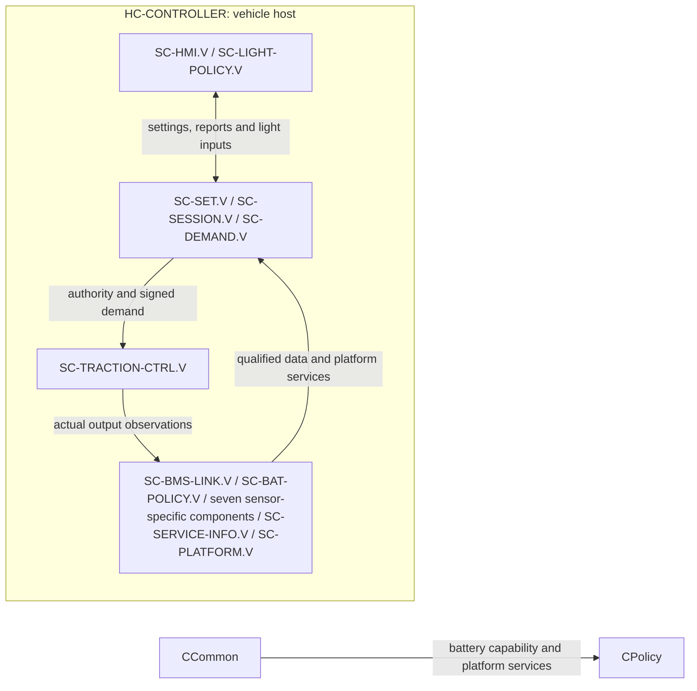
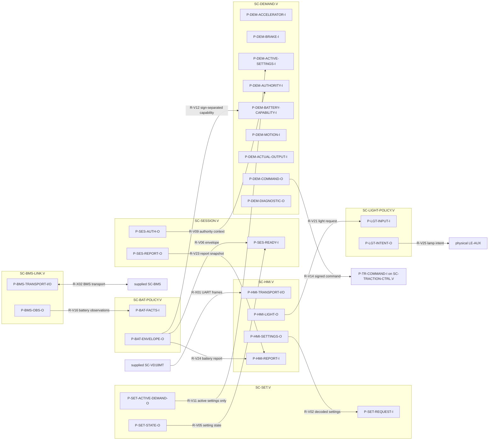
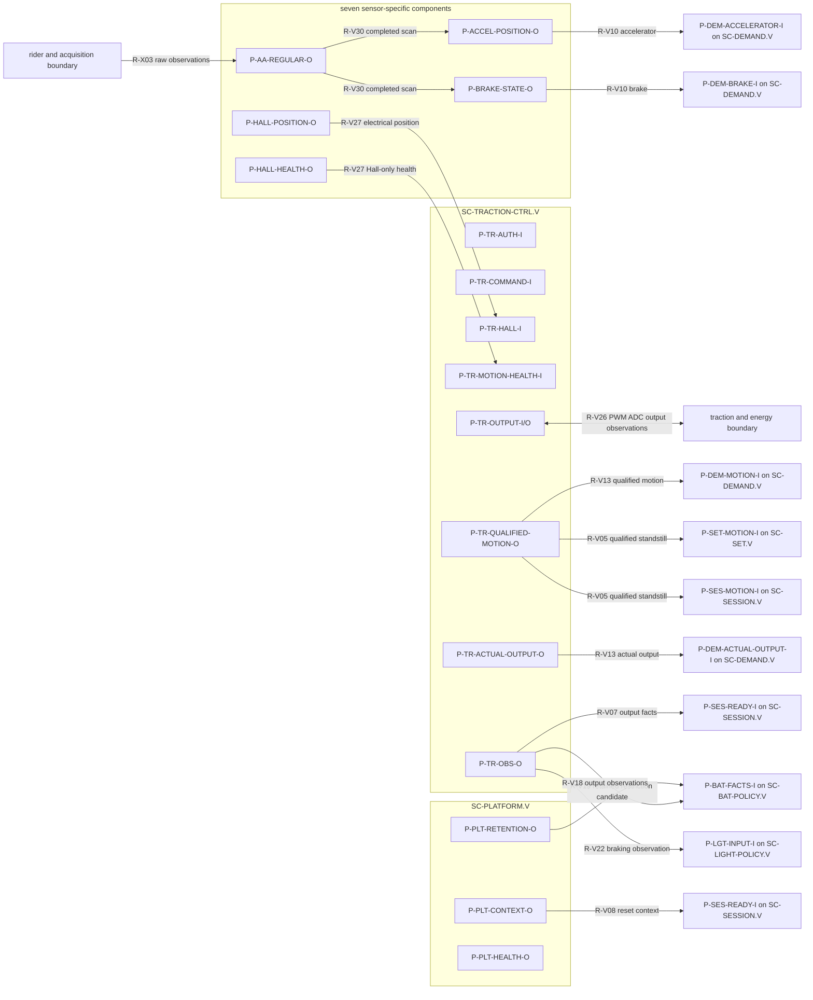
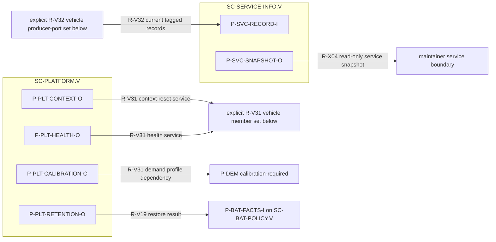

# ARCH-003 — Software architecture and deployment

**Draft vehicle baseline — 2026-09-16.** The full vehicle component catalogue, typed ports, `R-V*` route families, external boundaries, endpoint diagrams, state ownership and timing contracts are retained.
**Draft 1.4 — 2026-09-14; successor to ARCH-003-R1.1.** This controlled refinement records Hall interpretation and Hall-sensored FOC responsibility with the selected EVM traction-board and WeAct vehicle-host boundaries while preserving existing released requirement targets. It remains consistent with [FC-001](../FC-001_Functional_Concept.md), [FC-002](../FC-002_Function_Trace.md) and REQ-001-R2.0. Timing, circuit, algorithm, diagnostic-coverage and physical-output acceptance remain derived work.

## Reading this architecture

ARCH-003 is the canonical software architecture document. It contains the static component, port, dataflow and state-ownership view. Its `SW-I-*`, `P-*` and `R-*` names are stable cross-view architecture identifiers. Component interfaces define contracts, not literal Rust statics, pins, task contexts, firmware APIs or presently delivered intercom endpoints. Supplied `SC-BMS` and `SC-VD18MT` remain external opaque components. All project component instances in this document are vehicle-scoped (`.V`) with independent producer/reset context and validity.

## Scope, component identities and hosts

`LE-*` remains the requirement-level responsibility.  The five new logical leaves below refine composites only: they do not retarget existing requirements.

| Logical responsibility | Project component | Purpose |
|---|---|---|
| LE-SET | SC-SET | Requested, pending and active level/speed-setting policy. |
| LE-SESSION | SC-SESSION | Ready conjunction, current riding-session inhibition and report selection. |
| LE-DEMAND | SC-DEMAND | Signed wheel-demand and rider/limit arbitration. |
| LE-HMI | SC-HMI | VD18MT protocol interpretation and outgoing information. |
| LE-BMS-LINK | SC-BMS-LINK | Selected BMS UART response interpretation and qualification. |
| LE-BAT-POLICY | SC-BAT-POLICY | Battery capability, restriction and battery-fault information policy. |
| LE-LIGHT-POLICY | SC-LIGHT-POLICY | Normal-light retention and front/rear mode arbitration. |
| LE-SERVICE-INFO | SC-SERVICE-INFO | Current producer/reset-context diagnostic presentation. |
| LE-INPUT, within LE-INPUT | SC-ANALOG-ACQ, SC-ACCELERATOR-IF, SC-BRAKE-IF, SC-TEMPERATURE-IF, SC-SUPPLY-IF, SC-MOTOR-PHASE-IF and SC-HALL-IF | The seven existing acquisition/sensor-specific components own their respective raw-record access, semantic qualification and health publications. |
| LE-MOTOR-CTRL, within LE-TRACTION | SC-TRACTION-CTRL | Authority-context command acceptance, configuration-qualified electrical rotor-sector/direction/edge-time interpretation, selected Hall-sensored FOC execution and qualified output/energy observation. |
| LE-PLATFORM | SC-PLATFORM | Local execution, reset-context, persistence and platform-health services. |

The following are supplied opaque software components, deliberately outside the 14 project components above. `SC-BMS` is vendor firmware hosted by `HC-BMS`. `SC-VD18MT` is the display firmware hosted within the VD18MT assembly in `HC-RIDER`; neither receives project units or an invented vendor-internal decomposition. `LE-RIDER-DEVICES` is a supplied composite within LE-INPUT that realizes the fixed rider devices: VD18MT, accelerator and passive coded brake electrical network. Its hardware/firmware boundary does not alter SC-HMI's project responsibility for vehicle-side protocol interpretation.

| Deployment | Instances | Host and boundary |
|---|---|---|
| Vehicle (`.V`) | SC-SET.V, SC-SESSION.V, SC-DEMAND.V, SC-HMI.V, SC-BMS-LINK.V, SC-BAT-POLICY.V, SC-LIGHT-POLICY.V, SC-SERVICE-INFO.V, SC-ANALOG-ACQ.V, SC-ACCELERATOR-IF.V, SC-BRAKE-IF.V, SC-TEMPERATURE-IF.V, SC-SUPPLY-IF.V, SC-MOTOR-PHASE-IF.V, SC-HALL-IF.V, SC-TRACTION-CTRL.V and SC-PLATFORM.V | **HC-CONTROLLER** is the one selected vehicle host, including motor control. It exchanges electrical signals with the physical input, traction, lighting, energy and HMI components defined by ARCH-001/ARCH-002. |

The DRV8300DRGE-EVM and WeAct STM32H723VGT6 are selected vehicle traction board and `HC-CONTROLLER`, respectively, under their [integration contracts](../DRV8300DRGE-EVM/DRV8300DRGE-EVM_Integration_and_Requirements_Fit.md), [vehicle-host contract](../DRV8300DRGE-EVM/DRV8300DRGE-EVM_WeAct_STM32H723VGT6_Traction_HSI.md), [allocated traction HSI](../DRV8300DRGE-EVM/DRV8300DRGE-EVM_WeAct_STM32H723VGT6_Traction_HSI.md), and [runtime integration contract](Runtime_Integration_Contract.md). The HSI assigns acquisition and FOC execution to SC-TRACTION-CTRL.V using a configuration-identified ADC epoch; SC-ANALOG-ACQ.V owns raw regular/injected records and the named sensor interfaces own their semantic records. The runtime contract maps logical owners to project bindings and direct/scheduled execution without making a component or unit synonymous with an OS task. It does not establish physical qualification evidence.

For the bounded MotorControl specialization pilot, `SC-TRACTION-CTRL` is the
software specialization of the canonical `MotorControl` boundary represented by
`LE-MOTOR-CTRL`. Its detailed-design specialization and the one selected occurrence
are documented with the five existing unit parts in [DD-003 — Static software
architecture views](TractionControl/DetailedDesign/TractionControl_Detailed_Design.md#draft-motorcontrol-specialization-pilot).
The `:>>` selection is an occurrence mapping across these views; it does not add a
runtime component or task. This pilot covers this chain only, while the remaining
architecture chains retain their existing modeling relationships.

The deployment view shows execution boundaries; detailed component membership is in the table above. Each deployed type has the explicit vehicle-local state shown below.

## Component contracts and owned state

| Component | Inputs / outputs | Owned state and exclusions |
|---|---|---|
| SC-ANALOG-ACQ and SC-ACCELERATOR-IF / SC-BRAKE-IF / SC-TEMPERATURE-IF / SC-SUPPLY-IF / SC-MOTOR-PHASE-IF / SC-HALL-IF | Raw acquisition records → each owner’s typed value and health record with qualification, freshness and producer/reset context | These seven components keep acquisition, sensor semantics and Hall position distinct. None owns a rider-demand decision, physical truth or command authority. |
| SC-SET | Qualified settings receipt → requested/pending/active settings | Owns setting state; retained valid settings are distinct from current-startup receipt. |
| SC-SESSION | Qualified startup facts/self-test results/fault notices → authority, session inhibition and report state | Owns Ready conjunction and current-session fault latch. It neither performs all tests nor proves physical inhibition. |
| SC-DEMAND | Individually typed accelerator, brake, active-settings, authority, battery-capability, qualified-motion and actual-output evidence → signed requested wheel command plus policy diagnostic | Owns demand arbitration and regeneration/restriction episodes. Pending settings never govern demand; it does not own actual torque, raw ADC, FOC, hardware or authority issuance. |
| SC-TRACTION-CTRL | Authority-context command plus physical observations → physical-stage command, qualified physical-motion and actual-output evidence | It publishes vehicle speed/direction/standstill separately from actual applied wheel torque/active electrical braking. Its `U-TRACTION-ACQUISITION` owns direct JEOS/JDR epoch publication, `U-TRACTION-CONTROL` produces next compare/context data including `CCR4`, and `U-TRACTION-OUTPUT` alone stages/commits CCR1..4/JSQR. It executes the MCD-001 Hall-sensored FOC contract only with valid current/voltage/configuration evidence; then rejects absent, invalid, expired or context-mismatched authority/commands and commands both torque signs to zero within the derived bound (REQ-SYS-INT-004). A commanded zero is not physical protection or proof of zero torque. |
| SC-BMS-LINK | Qualified UART transport → selected-unit battery observations | Owns protocol interpretation only, not UART electrical safety, measurement accuracy or BMS protection. |
| SC-BAT-POLICY | Qualified battery/output/path observations plus configuration/context → distinct charge/discharge envelopes, restrictions and battery-fault information | `.V` owns the reached-10%-cutoff restriction state described below. It does not own hardware protection or the SC-SESSION fault latch. |
| SC-HMI / SC-LIGHT-POLICY | HMI messages/reports and rider-light request; qualified lever/output states → HMI fields and front/rear logical light intent | Light policy owns normal request retention and mode arbitration, not lamp electrical output or visibility. |
| SC-SERVICE-INFO | Producer-tagged current observations → service information | Owns no operation permission, persistent fault history or parameter-writing path. |
| SC-PLATFORM | Reset, scheduling, persistence and local health events → context/retention services and self-test contribution | Owns project startup/peripheral/IRQ bindings, execution priority/scheduling selection and platform service state; each consumer owns interpretation of a lost/reset context. Generic register drivers remain resource access only. |

### Retained restriction and reset state

For [REQ-SYS-SOC-006](../../Requirements/System_Requirements/Battery_SOC.md#req-sys-soc-006), **SC-BAT-POLICY.V** owns the `reached10%` propulsion-restriction state.  It sets the state upon qualified entry to the 10% cutoff and exposes the positive-propulsion restriction until qualified actual SOC exceeds 20%.  **HC-CONTROLLER** supplies reset-surviving retention of that state across vehicle reset and relevant battery handling; SC-PLATFORM.V restores it with explicit retention validity/context.  This is an operating restriction, separate from and never implemented as forbidden persistent fault history.  Exact integrity, battery-handling continuity and recovery evidence remain `WS-OI-017` work.

## Typed software interactions

These local interfaces refine, and do not replace, ARCH-001 `IF-A-001` through `IF-A-013`.  Every data exchange contains a value and independently represented qualification/freshness/context; symbolic deadlines are derived later.

| Local interface | Endpoints | Semantic kind | Exchange |
|---|---|---|---|
| SW-I-001 | SC-ACCELERATOR-IF / SC-BRAKE-IF → SET, SESSION, DEMAND, LIGHT-POLICY; SC-TRACTION-CTRL → DEMAND | Data publication | IF-A-001 qualified accelerator/rest and coded-brake state/unknown; IF-A-005 qualified physical vehicle motion/direction/standstill. |
| SW-I-002 | SC-HMI + SC-ACCELERATOR-IF → SET; SC-SET active projection → DEMAND | Data publication | IF-A-002 current-startup settings receipt and decoded request; only already-applied active level/speed settings reach demand. |
| SW-I-003 | BMS-LINK / sensor-specific interfaces / TRACTION-CTRL → BAT-POLICY; BAT-POLICY → SESSION and DEMAND | Data publication | IF-A-003/009 observations and capability/fault/restriction outputs; charge and discharge permissions remain separate. |
| SW-I-004 | SESSION → TRACTION-CTRL; DEMAND → TRACTION-CTRL | Control token plus data | IF-A-004 authority context/expiry and signed command/context/expiry. A consumer-side acceptance operation is local and must fail closed. |
| SW-I-005 | TRACTION-CTRL → SESSION, DEMAND, LIGHT-POLICY | Data publication | IF-A-005 actual applied-output/active-braking evidence and qualified physical motion. |
| SW-I-006 | SESSION/BAT-POLICY → HMI; HMI/BRAKE-IF/TRACTION-CTRL → LIGHT-POLICY | Data publication | IF-A-006 reports and light inputs; LIGHT-POLICY emits lamp intent to physical LE-AUX. |
| SW-I-008 | All producers → SERVICE-INFO | Data publication | IF-A-008 current, producer-tagged observations, identity and states. |
| SW-I-009 | PLATFORM → all local components | Event and local service call | Startup, reset-context invalidation, retention restore result, watchdog/platform-health and scheduling-service events. |

Calls request a bounded local service and return completion/availability only; they do not transfer permission by themselves.  Data publications are sampled with explicit age/context checks at the consumer.  Events record a discrete reset, withdrawal, detected fault or physical transition; consumers must not reconstruct an event from a static value alone.

## Static port registry and connection catalogue

This is the canonical static architecture view: it identifies component instances, their explicit architectural ports, the payloads exchanged, connection ownership and the local host boundary. “Static” describes this structural view. It does **not** require global/static-memory variables, create an API, task, queue or intercom endpoint, or expose private implementation fields. Detailed unit-local fields, IRQ mechanics and implementation bindings remain in [DD-003](DetailedDesign/DD-003_Static_Software_Architecture_Views.md) and the [runtime integration contract](Runtime_Integration_Contract.md).

Each publication carries producer identity, producer/reset context, applicable configuration, semantic value, qualification and freshness/source-age evidence. Its common timing metadata preserves source timestamp/clock/context and, where a consumer uses a common policy clock, the converted timestamp/clock/context plus conversion qualification. Capture-timer time remains distinct until conversion is qualified. Consumers independently validate what they use. `Unknown`, `Invalid`, `Stale` and `Qualified` remain different outcomes. A control intent, zero request, command acceptance or output/activity observation is not physical-state evidence.

### Reading port views

The four endpoint-level views below show every selected `P-*` contract inside its host-scoped component. Each arrow is an existing `R-*` route with a short payload label. The registry remains the complete contract definition and the catalogue remains the complete connection index.

### Owned shared records and retained state

“Shared” here means a named owner publishes or gives bounded read access to a record. It does not mean a global variable. State private to a component is deliberately not listed.

| Owner | Named state or snapshot | Readers / route family | Boundary |
|---|---|---|---|
| `SC-ANALOG-ACQ.V` and SC-HALL-IF.V | `RegularAdcScan`, injected epochs and Hall capture rings with sampled state | the named sensor interfaces and `U-HALL-POSITION` | Analog acquisition owns scan storage/loss admissibility; Hall owns its capture and electrical-position interpretation. |
| `U-TRACTION-ACQUISITION` / `U-TRACTION-CONTROL` / `U-TRACTION-OUTPUT` | Direct fast records internal to Detailed Design, including `FastEpoch` and `PWMAndADCSamplingPlan` | the immediately following detailed unit only | These are not SC public ports or ARCH-003 `R-V*` routes. The runtime contract and DD own the direct JEOS-to-output allocation. |
| `SC-SET.V` | requested, pending and active setting state plus active-only demand projection | session, service and demand routes | A retained active setting is not a current-startup receipt; a pending setting is never a demand input. |
| `SC-SESSION.V` | authority context, current riding-session inhibition and selected report state | demand, traction and HMI routes | Session owns Ready conjunction and its volatile fault latch. |
| `SC-DEMAND.V` | signed requested wheel-torque command plus policy diagnostic | traction through R-V14 and service through R-V32 | Demand owns arbitration and diagnostic explanation, never actual torque or authority. |
| `SC-BAT-POLICY.V` | `reached10%` restriction state and current envelope | session, demand and HMI routes | Only the validity-tagged restriction may be retained by the vehicle host. |
| Every local producer | current producer-tagged service snapshot | service-info fanout R-V32 | Service reads do not return control or permission. |

### Complete port registry

The port registry names each vehicle instance explicitly; the `.V` suffix keeps every concrete producer, consumer and reset context unambiguous.

| Port ID | Owner and instance scope | Direction | Payload or service contract | Lifecycle and ownership |
|---|---|---|---|---|
| `P-PLT-CONTEXT-O` | `SC-PLATFORM.V` | provided | New local context, startup/reset invalidation and component-start service | Platform owns local context creation. A reset withdraws affected prior-context records before they can be used. |
| `P-PLT-RETENTION-O` | `SC-PLATFORM.V` | provided | Validity-tagged retention restore candidate/result | Vehicle use is limited to validity-tagged `reached10%`; it is never fault history. |
| `P-PLT-HEALTH-O` | `SC-PLATFORM.V` | provided | Watchdog/platform-health, scheduling and local resource events | Components interpret their own lost/reset context. This port grants neither operating permission nor physical safety reaction. |
| `P-PLT-CALIBRATION-O` | `SC-PLATFORM.V` | provided | Immutable activated calibration bundle, including populated paired/order-validated demand maps, neutral, positive-resumption and Level 1–4 regeneration gradients, taper/reference limits, named-clock timing/coherency bounds, and actual-output-estimator constants/bounds | Any missing, malformed or unvalidated required value keeps the corresponding profile/estimator unavailable. Timing accepts only positive finite bounds with a derived accepted end-to-end bound; this architecture selects no numerical value. |
| `P-AA-REGULAR-O` / `P-AA-FAST-O` | `SC-ANALOG-ACQ.V` | provided internal record | Completed regular scan / injected epoch snapshot | Acquisition owns storage and loss detection. DMA error, overwrite, cache/coherency loss, context change or incomplete scan is unavailable. |
| `P-ACCEL-POSITION-O` / `P-BRAKE-STATE-O` | `SC-ACCELERATOR-IF.V` / `SC-BRAKE-IF.V` | provided | Qualified accelerator/rest and coded brake state | These distinct owners publish semantic rider facts; neither infers demand or actual output. |
| `P-HALL-POSITION-O` | `SC-HALL-IF.V` | provided | Qualified electrical position only | Electrical direction/edge evidence is not physical vehicle speed, direction or standstill. |
| `P-HALL-HEALTH-O` | `SC-HALL-IF.V` | provided | Hall capture/position health evidence | HallInterface owns capture and position interpretation; this health is also the motion-specific qualification input. |
| `P-HMI-TRANSPORT-I/O` | `SC-HMI.V` | required/provided external boundary | VD18MT UART bytes, framing/error observations and outgoing report bytes | `U-HMI-ADAPTER` owns parser/TX state and project byte queues. Link/byte loss is interpreted here; it does not itself create a generic system fault. |
| `P-HMI-SETTINGS-O` | `SC-HMI.V` | provided | Current-context decoded settings receipt/request | A setting exists only after valid frame interpretation. Initial receipt is distinct from retained active settings. |
| `P-HMI-LIGHT-O` | `SC-HMI.V` | provided | Rider normal-light request and current HMI availability | A valid retained normal-light request follows the existing HMI loss rule. |
| `P-HMI-REPORT-I` | `SC-HMI.V` | required | Riding/session/battery report snapshot | Transmission is not display receipt confirmation. |
| `P-SET-REQUEST-I` | `SC-SET.V` | required | Qualified HMI/input settings receipt and request | Current-startup receipt is required where the Ready guard requires it. |
| `P-SET-MOTION-I` | `SC-SET.V` | required | `QualifiedMotion` for the standstill application guard | It is unavailable until validated criteria support physical standstill; pending state cannot replace it. |
| `P-SET-STATE-O` | `SC-SET.V` | provided | Requested, pending and active setting state with context | `SC-SET.V` owns setting identity and does not make a retained setting a current-startup receipt. |
| `P-SET-ACTIVE-DEMAND-O` | `SC-SET.V` | provided | Active level/speed projection with active-setting generation | The projection excludes requested and pending values; only it can select the demand profile/cutoff. |
| `P-SES-READY-I` | `SC-SESSION.V` | required | Qualified startup/self-test facts, setting receipt and inhibition/fault notices | Producers own their fact; session owns conjunction and current riding-fault latch. |
| `P-SES-MOTION-I` | `SC-SESSION.V` | required | `QualifiedMotion` for the Ready standstill prerequisite | It is published independently of Ready and command acceptance; unknown is not standstill. |
| `P-SES-AUTH-O` | `SC-SESSION.V` | provided | Current authority generation, decision sequence/timestamp and expiry timestamp in named authority clock/context | A consumer must fail closed on loss, mismatch, invalidity, clock/context mismatch or expiry. A newer command cannot refresh authority. It is not physical permit proof. |
| `P-SES-REPORT-O` | `SC-SESSION.V` | provided | Session readiness, inhibition and selected report state | Current session state is volatile across restart except as parents explicitly prescribe. |
| `P-DEM-ACCELERATOR-I` / `P-DEM-BRAKE-I` | `SC-DEMAND.V` | required | Individually qualified accelerator/rest and coded-brake state | Brake valid actuation blocks positive accelerator demand only. The brake never requests regeneration. |
| `P-DEM-ACTIVE-SETTINGS-I` | `SC-DEMAND.V` | required | `ActiveRidingSettings` | Pending/requested settings cannot select a demand profile or speed cutoff. |
| `P-DEM-AUTHORITY-I` | `SC-DEMAND.V` | required | Current riding authority with generation and expiry | Loss, invalidity, expiry or context mismatch withdraws both command signs without creating a new fault latch. |
| `P-DEM-BATTERY-CAPABILITY-I` | `SC-DEMAND.V` | required | Independently qualified positive-propulsion and negative-regeneration capability | Unavailability/restriction withdraws only the dependent permission; positive-only low-SOC restriction does not prohibit permitted regeneration. |
| `P-DEM-MOTION-I` / `P-DEM-ACTUAL-OUTPUT-I` | `SC-DEMAND.V` | required | Qualified physical speed/direction/standstill / actual applied wheel torque and active electrical-braking evidence | Demand uses motion for both-sign speed cutoff and uses actual powered-forward positive torque with forward motion for post-stop regeneration rearm. Requested torque is never evidence. |
| `P-DEM-COMMAND-O` | `SC-DEMAND.V` | provided | Requested signed rear-wheel torque in N m, validity/context, authority generation, decision sequence/timestamp and expiry timestamp with named policy clock/context | `SC-DEMAND.V` owns arbitration, not actual torque. Command age/renewal never refreshes authority and is independent of telemetry routes. |
| `P-DEM-DIAGNOSTIC-O` | `SC-DEMAND.V` | provided service-only | Current active profile, sign dispositions, restriction episode and post-stop rearm state | It is read-only service information and cannot grant authority or control traction. |
| `P-BMS-TRANSPORT-I/O` | `SC-BMS-LINK.V` | required/provided external boundary | Selected BMS UART read transaction and received transport observations | Vendor firmware is opaque. No BMS write/control capability is exposed by this architecture. |
| `P-BMS-OBS-O` | `SC-BMS-LINK.V` | provided | Current-context accepted battery observations, field freshness, layout/scale metadata | Transaction/decode/publication owns protocol interpretation. Packet return or BMS wake does not restore vehicle authority or regenerative charge acceptance. |
| `P-BAT-FACTS-I` | `SC-BAT-POLICY.V` | required | BMS facts, input/output/path observations, configuration and local context | Separate charge/discharge candidates require their needed qualified inputs. |
| `P-BAT-ENVELOPE-O` | `SC-BAT-POLICY.V` | provided | Independently qualified positive-propulsion torque/speed cap and negative-regeneration torque cap, with branch reasons/episodes plus aggregate restriction and battery-fault information | The vehicle instance owns `reached10%` propulsion restriction and retains no battery-fault history. Aggregate envelope validity cannot replace a branch’s own qualification. |
| `P-TR-AUTH-I` | `SC-TRACTION-CTRL.V` | required | `P-SES-AUTH-O` authority context | Traction independently accepts or rejects authority. Loss/mismatch/expiry commands zero in the software realization. |
| `P-TR-COMMAND-I` | `SC-TRACTION-CTRL.V` | required | `P-DEM-COMMAND-O` signed command | A command is accepted only with valid current authority, context and configuration. |
| `P-TR-HALL-I` | `SC-TRACTION-CTRL.V` | required | Qualified `HallElectricalPosition` | `U-TRACTION-CONTROL`, `U-TRACTION-MOTION` and `U-TRACTION-ACTUAL-OUTPUT` consume the position; SC-HALL-IF owns capture and electrical-position interpretation/admissibility. |
| `P-TR-MOTION-HEALTH-I` | `SC-TRACTION-CTRL.V` | required | Hall capture/position health for motion qualification | `U-TRACTION-MOTION` consumes this Hall-only health; the broader FOC health fan-in remains on `sensorHealthIn`. |
| `P-TR-OUTPUT-I/O` | `SC-TRACTION-CTRL.V` | required/provided external boundary | Staged PWM/ADC context and output-stage state, timestamp, source and configuration provenance | `U-TRACTION-ACTUAL-OUTPUT` combines this physical-stage evidence with qualified current/position/motion and active estimator calibration to publish wheel-torque estimate; the boundary is not a demand command. `U-TRACTION-OUTPUT` alone commits literal `CCR1..4`/JSQR. |
| `P-TR-QUALIFIED-MOTION-O` | `SC-TRACTION-CTRL.V` | provided | Physical vehicle speed, direction and standstill with independent qualification | It is a validated interpretation of existing Hall/capture-health and calibration evidence; static or absent edges alone are unavailable, not standstill. Its criteria, timing and diagnostic coverage remain WS-OI-001/006 validation gates. |
| `P-TR-ACTUAL-OUTPUT-O` | `SC-TRACTION-CTRL.V` | provided | Actual applied wheel-torque estimate/evidence, active electrical-braking, output availability and powered-forward travel | It is not a demand command. Positive applied torque and powered-forward travel are independently qualified. |
| `P-TR-OBS-O` | `SC-TRACTION-CTRL.V` | provided | Aggregate output/energy/fault availability observation for existing Session, Battery, Light and service consumers | It reports observation, never proof that a command achieved physical torque or zero output. |
| `P-LGT-INPUT-I` | `SC-LIGHT-POLICY.V` | required | HMI request, qualified/unknown brake, traction braking/output and session/light context | Unknown brake or actual-braking state remains distinct from a valid lever state. |
| `P-LGT-INTENT-O` | `SC-LIGHT-POLICY.V` | provided external intent | Front/rear logical lamp intent to physical `LE-AUX` | Policy owns mode arbitration, not lamp electrical output, conservative startup behaviour or visibility. |
| `P-SVC-RECORD-I` | `SC-SERVICE-INFO.V` | required | Current producer-tagged identity, state, context, quality and observations | The collector drops old source-context entries and never promotes a fallback to a qualified value. |
| `P-SVC-SNAPSHOT-O` | `SC-SERVICE-INFO.V` | provided external read-only service boundary | Atomic current diagnostic/service snapshot | No control return route exists. A service read cannot clear a latch, grant authority or grant riding authority. |

The registry contains **vehicle-scoped port contracts**, expressed by **the retained distinct `P-*` names**. The `.V` scopes identify the vehicle-local instances. This is not a count of physically instantiated endpoints, MCU pins or deployed API objects. Multiple consumer attachments to one output port are intentional fanout; a port's data owner remains its producer and each consumer owns acceptance/use.

### Complete connection route catalogue

Route IDs are used in every figure. Delivery labels describe the selected architectural realization, not a completed firmware transport. `Scheduled direct/owned snapshot` means a project-selected direct call or owner-managed record until a separately qualified intercom extension exists. `Direct fast` is a same-handler handoff. `Service` is a bounded local call/event, not an authorization transfer.

| Route | Producer port -> consumer port | `SW-I` / contract | Delivery and data owner | Freshness, loss and lifecycle rule |
|---|---|---|---|---|
| `R-V01` | `SC-ACCELERATOR-IF.V.P-ACCEL-POSITION-O` -> `SC-SET.V.P-SET-REQUEST-I` | SW-I-001/002, IF-A-001/002 | Scheduled direct/owned snapshot; accelerator owner publishes rest evidence | Initial absence cannot be replaced by retained active setting. |
| `R-V02` | `SC-HMI.V.P-HMI-SETTINGS-O` -> `SC-SET.V.P-SET-REQUEST-I` | SW-I-002, IF-A-002 | Scheduled adapter publication; HMI owns record | Only a valid current-context frame supplies receipt. |
| `R-V03` | named sensor-interface outputs -> `SC-SESSION.V.P-SES-READY-I` | SW-I-001 | Scheduled direct/owned snapshots; each sensor owner retains its record | Unknown/stale prerequisite blocks its Ready contribution. |
| `R-V04` | `SC-HMI.V.P-HMI-SETTINGS-O` -> `SC-SESSION.V.P-SES-READY-I` | SW-I-002 | Scheduled adapter publication; HMI owns record | Current-startup receipt is independently checked by session. |
| `R-V05` | `SC-SET.V.P-SET-STATE-O` -> `SC-SESSION.V.P-SES-READY-I` | SW-I-002 | Scheduled direct/owned snapshot; set owns state | Active/pending identity does not prove current-startup receipt. |
| `R-V06` | `SC-BAT-POLICY.V.P-BAT-ENVELOPE-O` -> `SC-SESSION.V.P-SES-READY-I` | SW-I-003 | Scheduled direct/owned snapshot; battery policy owns envelope | Battery fault/restriction is evaluated in the current context. |
| `R-V07` | `SC-TRACTION-CTRL.V.P-TR-OBS-O` -> `SC-SESSION.V.P-SES-READY-I` | SW-I-005 | Scheduled direct/owned snapshot; traction owns observation | Unavailable output/self-test facts cannot satisfy Ready. |
| `R-V05-SET` / `R-V05-SESSION` | `SC-TRACTION-CTRL.V.P-TR-QUALIFIED-MOTION-O` -> `SC-SET.V.P-SET-MOTION-I` / `SC-SESSION.V.P-SES-MOTION-I` | SW-I-001/005 | Scheduled direct/owned snapshots; traction owns qualified motion | Settings application and Ready use physical standstill only when validated; motion qualification/self-test publishes independently of Ready and command acceptance. |
| `R-V08` | `SC-PLATFORM.V.P-PLT-CONTEXT-O` -> `SC-SESSION.V.P-SES-READY-I` | SW-I-009 | Service/event; platform owns context | Reset invalidates old prerequisite evidence. |
| `R-V09` | `SC-SESSION.V.P-SES-AUTH-O` -> `SC-DEMAND.V.P-DEM-AUTHORITY-I` | SW-I-004 | Scheduled direct/owned snapshot; session owns authority | Demand rejects invalid/expired/foreign authority. |
| `R-V10` | `SC-ACCELERATOR-IF.V.P-ACCEL-POSITION-O` / `SC-BRAKE-IF.V.P-BRAKE-STATE-O` -> their individual demand inputs | SW-I-001 | Scheduled direct/owned snapshots; rider-interface owners retain their records | Qualified live rider inputs govern demand after HMI link loss. A brake blocks positive demand and never requests regeneration. |
| `R-V11` | `SC-SET.V.P-SET-ACTIVE-DEMAND-O` -> `SC-DEMAND.V.P-DEM-ACTIVE-SETTINGS-I` | SW-I-002 | Scheduled direct/owned projection; set owns active state | Pending/requested settings cannot govern profile, ramp or speed cutoff. |
| `R-V12` | `SC-BAT-POLICY.V.P-BAT-ENVELOPE-O` -> `SC-DEMAND.V.P-DEM-BATTERY-CAPABILITY-I` | SW-I-003 | Scheduled direct/owned snapshot; battery policy owns envelope | Unknown input never enlarges command permission; positive and negative capability remain independent. |
| `R-V13` | `SC-TRACTION-CTRL.V.P-TR-QUALIFIED-MOTION-O` / `P-TR-ACTUAL-OUTPUT-O` -> their individual demand inputs | SW-I-005 | Scheduled direct/owned snapshots; traction owns the evidence | The physical speed cutoff applies to both signs; actual powered-forward positive torque is required after a stop before regeneration becomes eligible. |
| `R-V14` | `SC-DEMAND.V.P-DEM-COMMAND-O` -> `SC-TRACTION-CTRL.V.P-TR-COMMAND-I` | SW-I-004, IF-A-004 | Current command snapshot/direct acceptance; demand owns command | Traction rejects absent, invalid, expired, context- or configuration-mismatched command. |
| `R-V15` | `SC-SESSION.V.P-SES-AUTH-O` -> `SC-TRACTION-CTRL.V.P-TR-AUTH-I` | SW-I-004, IF-A-004 | Current authority snapshot/direct acceptance; session owns authority | Expiry/loss/mismatch causes commanded zero in traction realization. |
| `R-V16` | `SC-BMS-LINK.V.P-BMS-OBS-O` -> `SC-BAT-POLICY.V.P-BAT-FACTS-I` | SW-I-003, IF-A-003/009 | Scheduled direct/owned snapshot; BMS link owns observations | Returned packet is not a restored permission or session state. |
| `R-V17` | named temperature/supply/phase sensor-interface outputs -> `SC-BAT-POLICY.V.P-BAT-FACTS-I` | SW-I-003 | Scheduled direct/owned snapshots; each interface owner retains its record | Relevant temperature/configuration facts must be current. |
| `R-V18` | `SC-TRACTION-CTRL.V.P-TR-OBS-O` -> `SC-BAT-POLICY.V.P-BAT-FACTS-I` | SW-I-003 | Scheduled direct/owned snapshot; traction owns observation | Output/path facts remain observations, not physical protection proof. |
| `R-V19` | `SC-PLATFORM.V.P-PLT-RETENTION-O` -> `SC-BAT-POLICY.V.P-BAT-FACTS-I` | SW-I-009, SOC-006 | Service/result; platform owns retention candidate | Only valid restored `reached10%` state is considered; no battery fault history is restored. |
| `R-V20` | `SC-BRAKE-IF.V.P-BRAKE-STATE-O` -> `SC-LIGHT-POLICY.V.P-LGT-INPUT-I` | SW-I-001/006 | Scheduled direct/owned snapshot; brake interface owns record | Unknown brake input invokes existing conservative physical-boundary rule, not an inferred lever state. |
| `R-V21` | `SC-HMI.V.P-HMI-LIGHT-O` -> `SC-LIGHT-POLICY.V.P-LGT-INPUT-I` | SW-I-006 | Scheduled direct/owned snapshot; HMI owns request | Valid normal-light request retains across HMI link loss under the existing rule. |
| `R-V22` | `SC-TRACTION-CTRL.V.P-TR-OBS-O` -> `SC-LIGHT-POLICY.V.P-LGT-INPUT-I` | SW-I-005/006 | Scheduled direct/owned snapshot; traction owns observation | Qualified active braking and unqualified actual-braking state remain distinct. |
| `R-V23` | `SC-SESSION.V.P-SES-REPORT-O` -> `SC-HMI.V.P-HMI-REPORT-I` | SW-I-006, IF-A-006 | Scheduled direct/owned snapshot; session owns report | HMI transmission does not prove display receipt. |
| `R-V24` | `SC-BAT-POLICY.V.P-BAT-ENVELOPE-O` -> `SC-HMI.V.P-HMI-REPORT-I` | SW-I-006, IF-A-006 | Scheduled direct/owned snapshot; battery policy owns envelope | Presentation fallback is not a qualified battery fact. |
| `R-V25` | `SC-LIGHT-POLICY.V.P-LGT-INTENT-O` -> physical `LE-AUX` | SW-I-006, IF-A-006 | Local output intent; light policy owns intent | Intent does not prove lamp output or visibility. |
| `R-V26` | physical traction/energy boundary -> `SC-TRACTION-CTRL.V.P-TR-OUTPUT-I/O` | HSI-004/009 | Direct hardware acquisition/output binding | Hardware break/external inhibit withdraw physical permit independently. |
| `R-V27` | `SC-HALL-IF.V.P-HALL-POSITION-O` -> `SC-TRACTION-CTRL.V.P-TR-HALL-I`; `SC-HALL-IF.V.P-HALL-HEALTH-O` -> `SC-TRACTION-CTRL.V.P-TR-MOTION-HEALTH-I` | HSI-009, traction HSI | Direct read-only position/health publication; Hall interface owns records | The three traction consumers reject overrun, incoherent, stale or foreign-context position; motion consumes Hall-only health separately from the broader FOC health fan-in. |
| `R-V30` | `SC-ANALOG-ACQ.V.P-AA-REGULAR-O` -> each named regular sensor-interface raw input | runtime contract | Owned completed-record handoff; analog acquisition owns record and sensor interfaces consume it | A failed, overwritten, incomplete or old-context scan remains unavailable to semantic qualification. |
| `R-V31` | `SC-PLATFORM.V.P-PLT-CONTEXT-O`, `P-PLT-HEALTH-O` and required calibration outputs -> vehicle components' context-dependent ports | SW-I-009 | Service/event fanout; platform owns context/health/calibration events | Applies to every applicable vehicle component; figures show selected edges only. |
| `R-V32` | vehicle producer output ports -> `SC-SERVICE-INFO.V.P-SVC-RECORD-I` | SW-I-008, IF-A-008 | Current producer snapshots; each producer owns its record | Applies to all local vehicle producers. Service drops old-context cache entries and has no control return. |
| `R-X01` | supplied VD18MT -> `SC-HMI.V.P-HMI-TRANSPORT-I/O` | IF-A-002/006 | Electrical/transport boundary, HMI adapter owns interpretation | No decoded setting exists on loss, restart or invalid frame. |
| `R-X02` | supplied BMS -> `SC-BMS-LINK.V.P-BMS-TRANSPORT-I/O` | IF-A-003/009 | One active protected endpoint in the fitted-pack vehicle configuration | BMS vendor internals are out of scope; no second master or exposed vendor endpoint is created. |
| `R-X03` | rider/input acquisition -> `SC-ANALOG-ACQ.V` and the named sensor interfaces’ raw routes | IF-A-001 | Local acquisition boundary | Raw signals/transfer alone are not qualified semantic observations. |
| `R-X04` | `SC-SERVICE-INFO.V.P-SVC-SNAPSHOT-O` -> maintainer/service boundary | IF-A-008/013 | Read-only local service presentation | Snapshot cannot energize endpoint, clear latch or write BMS configuration. |

The vehicle catalogue uses route families rather than a fixed route count; individual family members are named where their source or consumer is distinct. `R-V31` and `R-V32` are explicit local fanout families, not invented message APIs. Every selected port in the registry participates in at least one route or is a local external-boundary endpoint.

### Endpoint-level static dataflow views

#### Vehicle policy and rider-information ports

#### Vehicle input, traction and platform ports

#### Vehicle platform and service ports

`R-V31` applies its `P-PLT-CONTEXT-O` and `P-PLT-HEALTH-O` service/event family to context-dependent consumption in `SC-SET.V`, `SC-SESSION.V`, `SC-DEMAND.V`, `SC-HMI.V`, `SC-BMS-LINK.V`, `SC-BAT-POLICY.V`, `SC-LIGHT-POLICY.V`, `SC-SERVICE-INFO.V`, the seven sensor-specific components, `SC-TRACTION-CTRL.V` and `SC-PLATFORM.V`; its calibration family supplies SC-DEMAND.V’s resolved profile and SC-TRACTION-CTRL.V’s actual-output estimator dependency. `R-V32` sources current records from explicit vehicle producer ports, including `P-DEM-DIAGNOSTIC-O`, `P-TR-QUALIFIED-MOTION-O` and `P-TR-ACTUAL-OUTPUT-O`; service has no control return route. Each is scoped `.V` and keeps its producer ownership.

## Behavioural summaries and timing allocation

The material below explains lifecycle and execution constraints that apply to the static contracts. It does not alter the port ownership or route catalogue above. Detailed sequence/state views remain in [DD-004](DetailedDesign/DD-004_Dynamic_Software_Architecture_Views.md).

**Vehicle startup.** SC-PLATFORM.V creates a new context, marks prior observations unusable and activates only a validated immutable calibration bundle. SC-ANALOG-ACQ.V, the named sensor interfaces, SC-BMS-LINK.V and SC-TRACTION-CTRL.V execute their allocated self-tests/qualification without granting torque; SC-SET.V receives current-startup settings; SC-BAT-POLICY.V restores/qualifies `reached10%` and produces the current envelope. Each producer reports pass/fail/incomplete with its context to SC-SESSION.V. SC-SESSION.V alone evaluates the simultaneous Ready guard and issues SW-I-004 authority. SC-DEMAND.V may then publish a context-matched command only with its individually usable dependencies and active demand profile, which SC-TRACTION-CTRL.V must separately accept. Torque remains commanded to zero until both current authority and a valid command are accepted, and returns to zero when either expires or becomes invalid; physical zero/output protection remains the traction and energy realization responsibility.

**Lever and output sequence.** SC-BRAKE-IF.V publishes the fixed coded-brake semantic state. SC-DEMAND.V inhibits positive demand for a valid actuated lever while retaining permitted accelerator-requested regeneration; a brake never requests regeneration. It applies the active speed limit and 40 km/h cutoff to both signs, holds Level 0 non-regenerative, and uses qualified physical motion plus actual powered-forward positive-torque evidence for the post-stop regeneration guard. SC-LIGHT-POLICY.V requests rear Full for valid actuation, qualified active electrical braking, or either unqualified brake/actual-braking state. Physical LE-AUX provides the required powered-start/reset behavior before the policy is executing; a software intent is neither lamp output nor visibility evidence.

**Settings sequence.** SC-HMI.V and SC-ACCELERATOR-IF.V publish current-startup receipt/rest evidence to SC-SET.V. SC-SET.V maintains requested/pending/active identity; absence or uninterpretable initial receipt cannot be replaced by a retained setting for Ready. Only its active projection reaches SC-DEMAND.V: a pending setting cannot alter its torque mapping, regeneration profile or speed cutoff. After Ready, VD18MT link loss alone retains valid active/pending settings and the normal-light request; it does not withdraw driving authority or freeze the rider command. Qualified live accelerator/brake inputs continue to govern demand, with normal command renewal and all other authority/limit checks.

**Demand-policy contract.** SC-DEMAND.V produces zero for every applicable both-sign inhibition, including lost/invalid/expired authority, unusable active setting/profile, unusable required qualified motion, and the active speed limit or 40 km/h forward cutoff. It consumes the immutable `DemandPolicyCalibration` values only when `profileActivationPermitted` is true: paired, strictly ordered input breakpoints and output values cover the normalized full range and endpoints; the profile validates Level 5 linear maps, equal positive endpoints, progressively increasing regenerative maxima, and separate Level 1–4 regenerative torque-time gradients. Level 5 has no intentional dynamic gradient and the taper remains separate. The same activation requires a named current clock/context; positive finite maximum input ages, coherence window, decision period, command validity and authority maximum age; and an accepted derived end-to-end bound. Command decision sequence/timestamp/expiry use that clock/context. A valid command age or renewal never refreshes authority generation, authority age or authority expiry. Traction acceptance independently checks a common qualified clock/context and gives an accepted command the earlier of authority expiry, command expiry and the accepted freshness bound. A valid brake inhibits positive accelerator demand only; the accelerator alone selects permitted regeneration. Level 0 remains non-regenerative. Levels 1–5 use the active calibrated profile with the provisional 35% neutral only as an unvalidated calibration premise. The independently qualified positive battery branch supplies current positive torque and speed caps, while the negative branch supplies regenerative torque cap; a positive low-SOC restriction does not cancel otherwise permitted regeneration. SC-DEMAND.V owns each regeneration recovery episode and its qualification from underlying battery capability changes; a previous stop cannot qualify a later episode. Following a stop from riding, regeneration remains inhibited until qualified actual positive applied torque during qualified forward travel occurs. Profile maps, level-dependent resumption ramps, low-speed taper, thresholds, timing, source qualification and diagnostic coverage remain validation gates; no numerical calibration or timing is selected here.

## Execution and timing constraints

The architecture uses symbolic bounds only. Let `T_acq`, `T_qual`, `T_pub`, `T_consume`, `T_cmd`, `T_accept`, `T_stage`, and `T_phys` be the allocated contributions from acquisition, qualification, publication, consumer recognition, command production, traction acceptance, physical-stage response and physical output. For an applicable condition, the derived end-to-end bound is the relevant sum of those contributions; interfaces must preserve enough age/context information to assess it. `T_reset` includes context invalidation and any explicit retained-state restoration qualification.

SC-PLATFORM must schedule acquisition/qualification, authority withdrawal, command acceptance, self-test reporting and health supervision so the derived bounds for `IF-A-001`–`IF-A-011`, especially the speed-cutoff and command-authority budgets, are met. The timer-triggered ADC/PWM chain is an explicit exception to cyclic scheduling: project startup/IRQ bindings dispatch JEOS directly to `U-TRACTION-ACQUISITION`, which directly calls control and output before the selected latch boundary. It is neither a 1-ms task nor an intercom queue route and may not perform blocking UART work, allocation or synchronous logging. `U-PLATFORM-BINDING` owns the shared fast-resource wrappers and uses only short fixed-operation checked token scopes for snapshot/commit/fault work; FOC and polling remain outside. PRIMASK defers software break service for the measured scope, while TIM8 break hardware and external inhibit withdraw physical permit immediately; the post-unmask break owner latches the fault and completes the software-safe state. [MCD-001](../../Motor/MCD-001_Hall_Sensored_FOC_Technical_Design.md) selects Hall-sensored FOC; platform rate, priority, watchdog period, timeout, circuit, estimator implementation and numeric deadline remain unqualified. Producers must expose incomplete and stale status before a consumer can rely on their value; a platform reset or shared rail event invalidates every affected producer context without conflating riding and BMS lifetimes.

## Acceptance boundaries

This baseline approves software component ownership, interfaces and deployment; implementation acceptance remains separate. Actual sensing, BMS/UART electrical acceptance, motor/inverter response, unauthorized-output protection, lamp startup/full brightness, energy-path protection and end-to-end timing remain hardware/system acceptance under ARCH-001 and the applicable requirements.  Distributed self-tests contribute evidence; SC-SESSION consuming their results does not establish their coverage.  The FSC contribution rows remain Draft and no component boundary claims independence.
