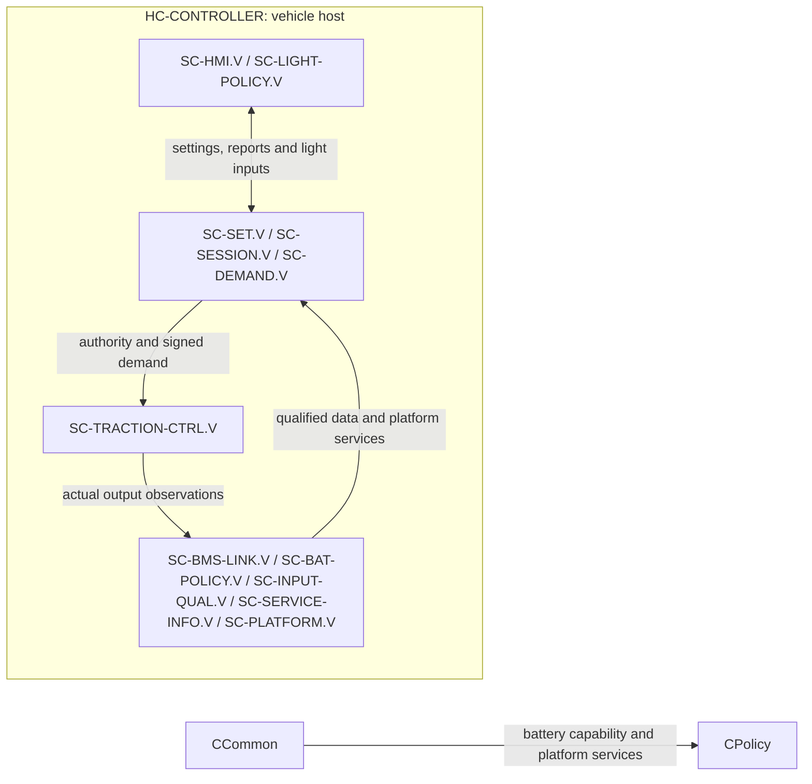
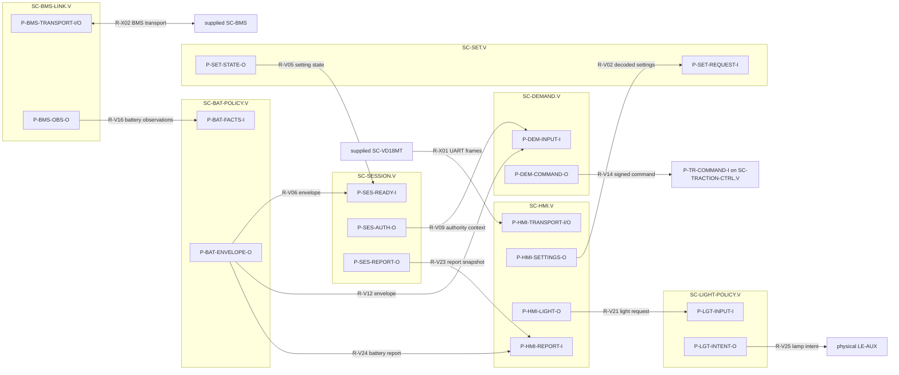
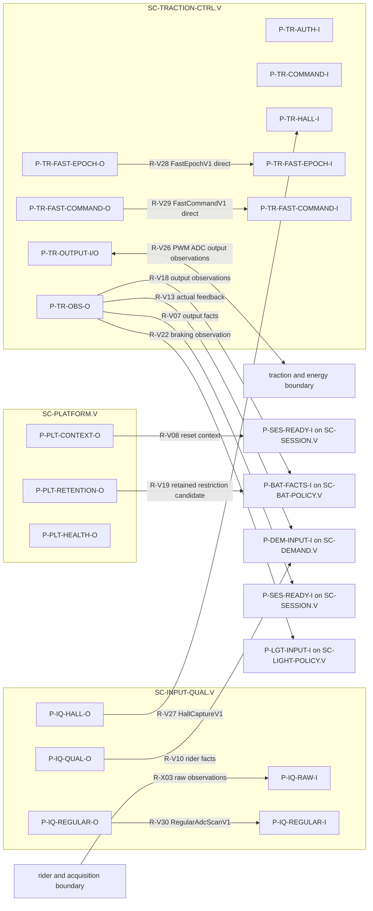
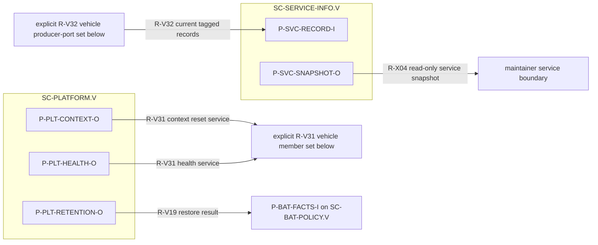

# ARCH-003 — Software architecture and deployment

**Draft vehicle baseline — 2026-09-16.** The full vehicle component catalogue, typed ports, 32 `R-V*` routes, external boundaries, endpoint diagrams, state ownership and timing contracts are retained.
**Draft 1.4 — 2026-09-14; successor to ARCH-003-R1.1.** This controlled refinement records Hall interpretation and Hall-sensored FOC responsibility with the selected EVM traction-board and WeAct vehicle-host boundaries while preserving existing released requirement targets. It remains consistent with [FC-001](../FC-001_Functional_Concept.md), [FC-002](../FC-002_Function_Trace.md) and REQ-001-R2.0. Timing, circuit, algorithm, diagnostic-coverage and physical-output acceptance remain derived work.

## Reading this architecture

ARCH-003 is the canonical software architecture document. It contains the static component, port, dataflow and state-ownership view. Its `SW-I-*`, `P-*` and `R-*` names are stable cross-view architecture identifiers. Component interfaces define contracts, not literal Rust statics, pins, task contexts, firmware APIs or presently delivered intercom endpoints. Supplied `SC-BMS` and `SC-VD18MT` remain external opaque components. All project component instances in this document are vehicle-scoped (`.V`) with independent producer/reset context and validity.

## Scope, component identities and hosts

`LE-*` remains the requirement-level responsibility.  The five new logical leaves below refine composites only: they do not retarget existing requirements.

| Logical responsibility | Project component | Purpose |
|---|---|---|
| LE-SET | SC-SET | Requested, pending and active level/speed-setting policy. |
| LE-SESSION | SC-SESSION | Ready conjunction, current riding-session inhibition and report selection. |
| LE-DEMAND | SC-DEMAND | Signed wheel-demand and rider/limit arbitration. |
| LE-HMI | SC-HMI | VD18MT protocol interpretation and outgoing information. |
| LE-BMS-LINK | SC-BMS-LINK | Selected BMS UART response interpretation and qualification. |
| LE-BAT-POLICY | SC-BAT-POLICY | Battery capability, restriction and battery-fault information policy. |
| LE-LIGHT-POLICY | SC-LIGHT-POLICY | Normal-light retention and front/rear mode arbitration. |
| LE-SERVICE-INFO | SC-SERVICE-INFO | Current producer/reset-context diagnostic presentation. |
| LE-INPUT-QUAL, within LE-INPUT | SC-INPUT-QUAL | Semantic qualification of acquisition and transport observations, including Hall sampled-state/edge evidence. |
| LE-MOTOR-CTRL, within LE-TRACTION | SC-TRACTION-CTRL | Authority-context command acceptance, configuration-qualified electrical rotor-sector/direction/edge-time interpretation, selected Hall-sensored FOC execution and qualified output/energy observation. |
| LE-PLATFORM | SC-PLATFORM | Local execution, reset-context, persistence and platform-health services. |

The following are supplied opaque software components, deliberately outside the 14 project components above. `SC-BMS` is vendor firmware hosted by `HC-BMS`. `SC-VD18MT` is the display firmware hosted within the VD18MT assembly in `HC-RIDER`; neither receives project units or an invented vendor-internal decomposition. `LE-RIDER-DEVICES` is a supplied composite within LE-INPUT that realizes the fixed rider devices: VD18MT, accelerator and passive coded brake electrical network. Its hardware/firmware boundary does not alter SC-HMI's project responsibility for vehicle-side protocol interpretation.

| Deployment | Instances | Host and boundary |
|---|---|---|
| Vehicle (`.V`) | SC-SET.V, SC-SESSION.V, SC-DEMAND.V, SC-HMI.V, SC-BMS-LINK.V, SC-BAT-POLICY.V, SC-LIGHT-POLICY.V, SC-SERVICE-INFO.V, SC-INPUT-QUAL.V, SC-TRACTION-CTRL.V, SC-PLATFORM.V | **HC-CONTROLLER** is the one selected vehicle host, including motor control. It exchanges electrical signals with the physical input, traction, lighting, energy and HMI components defined by ARCH-001/ARCH-002. |

The DRV8300DRGE-EVM and WeAct STM32H723VGT6 are selected vehicle traction board and `HC-CONTROLLER`, respectively, under their [integration contracts](../DRV8300DRGE-EVM/DRV8300DRGE-EVM_Integration_and_Requirements_Fit.md), [vehicle-host contract](../DRV8300DRGE-EVM/DRV8300DRGE-EVM_WeAct_STM32H723VGT6_Traction_HSI.md), [allocated traction HSI](../DRV8300DRGE-EVM/DRV8300DRGE-EVM_WeAct_STM32H723VGT6_Traction_HSI.md), and [runtime integration contract](Runtime_Integration_Contract.md). The HSI assigns acquisition and FOC execution to SC-TRACTION-CTRL.V using a configuration-identified ADC epoch; `SC-INPUT-QUAL.V` owns the distinct regular-ADC/Hall DMA records. The runtime contract maps logical owners to project bindings and direct/scheduled execution without making a component or unit synonymous with an OS task. It does not establish physical qualification evidence.

The deployment view shows execution boundaries; detailed component membership is in the table above. Each deployed type has the explicit vehicle-local state shown below.

## Component contracts and owned state

| Component | Inputs / outputs | Owned state and exclusions |
|---|---|---|
| SC-INPUT-QUAL | Raw/transport observations → typed values with qualification, freshness, uncertainty and producer/reset context; Hall sampled state/edge evidence remains distinct | Owns qualification lifecycle and vehicle regular-ADC/Hall DMA completed-record access, not a measurement circuit, physical truth, rotor map or command authority. |
| SC-SET | Qualified settings receipt → requested/pending/active settings | Owns setting state; retained valid settings are distinct from current-startup receipt. |
| SC-SESSION | Qualified startup facts/self-test results/fault notices → authority, session inhibition and report state | Owns Ready conjunction and current-session fault latch. It neither performs all tests nor proves physical inhibition. |
| SC-DEMAND | Authority, settings, qualified rider/motion and capability → signed wheel command | Owns demand arbitration and regeneration episodes; it does not own actual torque. |
| SC-TRACTION-CTRL | Authority-context command plus physical observations → physical-stage command and qualified actual-output information | Interprets Hall evidence as electrical sector/direction/edge time only with qualified map/alignment; its `U-TRACTION-ACQUISITION` owns direct JEOS/JDR epoch publication, `U-TRACTION-CONTROL` produces next compare/context data including `CCR4`, and `U-TRACTION-OUTPUT` alone stages/commits CCR1..4/JSQR. It executes the MCD-001 Hall-sensored FOC contract only with valid current/voltage/configuration evidence; then rejects absent, invalid, expired or context-mismatched authority/commands and commands both torque signs to zero within the derived bound (REQ-SYS-INT-004). A commanded zero is not physical protection or proof of zero torque. |
| SC-BMS-LINK | Qualified UART transport → selected-unit battery observations | Owns protocol interpretation only, not UART electrical safety, measurement accuracy or BMS protection. |
| SC-BAT-POLICY | Qualified battery/output/path observations plus configuration/context → distinct charge/discharge envelopes, restrictions and battery-fault information | `.V` owns the reached-10%-cutoff restriction state described below. It does not own hardware protection or the SC-SESSION fault latch. |
| SC-HMI / SC-LIGHT-POLICY | HMI messages/reports and rider-light request; qualified lever/output states → HMI fields and front/rear logical light intent | Light policy owns normal request retention and mode arbitration, not lamp electrical output or visibility. |
| SC-SERVICE-INFO | Producer-tagged current observations → service information | Owns no operation permission, persistent fault history or parameter-writing path. |
| SC-PLATFORM | Reset, scheduling, persistence and local health events → context/retention services and self-test contribution | Owns project startup/peripheral/IRQ bindings, execution priority/scheduling selection and platform service state; each consumer owns interpretation of a lost/reset context. Generic register drivers remain resource access only. |

### Retained restriction and reset state

For [REQ-SYS-SOC-006](../../Requirements/System_Requirements/Battery_SOC.md#req-sys-soc-006), **SC-BAT-POLICY.V** owns the `reached10%` propulsion-restriction state.  It sets the state upon qualified entry to the 10% cutoff and exposes the positive-propulsion restriction until qualified actual SOC exceeds 20%.  **HC-CONTROLLER** supplies reset-surviving retention of that state across vehicle reset and relevant battery handling; SC-PLATFORM.V restores it with explicit retention validity/context.  This is an operating restriction, separate from and never implemented as forbidden persistent fault history.  Exact integrity, battery-handling continuity and recovery evidence remain `WS-OI-017` work.

## Typed software interactions

These local interfaces refine, and do not replace, ARCH-001 `IF-A-001` through `IF-A-013`.  Every data exchange contains a value and independently represented qualification/freshness/context; symbolic deadlines are derived later.

| Local interface | Endpoints | Semantic kind | Exchange |
|---|---|---|---|
| SW-I-001 | SC-INPUT-QUAL → SET, SESSION, DEMAND, LIGHT-POLICY | Data publication | IF-A-001 qualified accelerator/rest, coded-brake state/unknown, motion/direction/standstill and required temperature facts. |
| SW-I-002 | SC-HMI + INPUT-QUAL → SET, SESSION, DEMAND | Data publication | IF-A-002 current-startup settings receipt and decoded request; retained settings carry their own context. |
| SW-I-003 | BMS-LINK / INPUT-QUAL / TRACTION-CTRL → BAT-POLICY; BAT-POLICY → SESSION and DEMAND | Data publication | IF-A-003/009 observations and capability/fault/restriction outputs; charge and discharge permissions remain separate. |
| SW-I-004 | SESSION → TRACTION-CTRL; DEMAND → TRACTION-CTRL | Control token plus data | IF-A-004 authority context/expiry and signed command/context/expiry. A consumer-side acceptance operation is local and must fail closed. |
| SW-I-005 | TRACTION-CTRL / INPUT-QUAL → SESSION, DEMAND, LIGHT-POLICY | Data publication | IF-A-005 actual motion/applied-output/active-braking state, including unqualified state. |
| SW-I-006 | SESSION/BAT-POLICY → HMI; HMI/INPUT-QUAL/TRACTION-CTRL → LIGHT-POLICY | Data publication | IF-A-006 reports and light inputs; LIGHT-POLICY emits lamp intent to physical LE-AUX. |
| SW-I-008 | All producers → SERVICE-INFO | Data publication | IF-A-008 current, producer-tagged observations, identity and states. |
| SW-I-009 | PLATFORM → all local components | Event and local service call | Startup, reset-context invalidation, retention restore result, watchdog/platform-health and scheduling-service events. |

Calls request a bounded local service and return completion/availability only; they do not transfer permission by themselves.  Data publications are sampled with explicit age/context checks at the consumer.  Events record a discrete reset, withdrawal, detected fault or physical transition; consumers must not reconstruct an event from a static value alone.

## Static port registry and connection catalogue

This is the canonical static architecture view: it identifies component instances, their explicit architectural ports, the payloads exchanged, connection ownership and the local host boundary. “Static” describes this structural view. It does **not** require global/static-memory variables, create an API, task, queue or intercom endpoint, or expose private implementation fields. Detailed unit-local fields, IRQ mechanics and implementation bindings remain in [DD-003](../DetailedDesign/DD-003_Static_Software_Architecture_Views.md) and the [runtime integration contract](Runtime_Integration_Contract.md).

Each publication carries producer identity, producer/reset context, applicable configuration, semantic value, qualification and freshness/source-age evidence. Consumers independently validate what they use. `Unknown`, `Invalid`, `Stale` and `Qualified` remain different outcomes. A control intent, zero request, command acceptance or output/activity observation is not physical-state evidence.

### Reading port views

The four endpoint-level views below show every selected `P-*` contract inside its host-scoped component. Each arrow is an existing `R-*` route with a short payload label. The registry remains the complete contract definition and the catalogue remains the complete connection index.

### Owned shared records and retained state

“Shared” here means a named owner publishes or gives bounded read access to a record. It does not mean a global variable. State private to a component is deliberately not listed.

| Owner | Named state or snapshot | Readers / route family | Boundary |
|---|---|---|---|
| `SC-INPUT-QUAL.V` through `U-INPUT-CONTEXT` | `RegularAdcScanV1` and Hall capture rings with sampled state | its qualifier and `U-TRACTION-POSITION` through R-V27/R-V30 | Input context owns storage, producer context and loss admissibility. |
| `U-TRACTION-ACQUISITION` | immutable completed-slot `FastEpochV1` | `U-TRACTION-CONTROL` through R-V28 | Direct fast handoff only. |
| `U-TRACTION-CONTROL` | `FastCommandV1`, including next `CCR1..3`, `CCR4` plan and ADC context | `U-TRACTION-OUTPUT` through R-V29 | Control calculates command data. Output alone commits literal registers. |
| `SC-SET.V` | requested, pending and active setting state | session and demand routes | A retained active setting is not a current-startup receipt. |
| `SC-SESSION.V` | authority context, current riding-session inhibition and selected report state | demand, traction and HMI routes | Session owns Ready conjunction and its volatile fault latch. |
| `SC-DEMAND.V` | signed command with context and expiry | traction through R-V14 | Demand owns arbitration, never actual torque. |
| `SC-BAT-POLICY.V` | `reached10%` restriction state and current envelope | session, demand and HMI routes | Only the validity-tagged restriction may be retained by the vehicle host. |
| Every local producer | current producer-tagged service snapshot | service-info fanout R-V32 | Service reads do not return control or permission. |

### Complete port registry

The port registry names each vehicle instance explicitly; the `.V` suffix keeps every concrete producer, consumer and reset context unambiguous.

| Port ID | Owner and instance scope | Direction | Payload or service contract | Lifecycle and ownership |
|---|---|---|---|---|
| `P-PLT-CONTEXT-O` | `SC-PLATFORM.V` | provided | New local context, startup/reset invalidation and component-start service | Platform owns local context creation. A reset withdraws affected prior-context records before they can be used. |
| `P-PLT-RETENTION-O` | `SC-PLATFORM.V` | provided | Validity-tagged retention restore candidate/result | Vehicle use is limited to validity-tagged `reached10%`; it is never fault history. |
| `P-PLT-HEALTH-O` | `SC-PLATFORM.V` | provided | Watchdog/platform-health, scheduling and local resource events | Components interpret their own lost/reset context. This port grants neither operating permission nor physical safety reaction. |
| `P-IQ-RAW-I` | `SC-INPUT-QUAL.V` | required external input | Acquired rider, motion, temperature, connection or transport observations | The component owns semantic qualification, not the circuit or physical truth. Invalid or incomplete acquisition is unavailable. |
| `P-IQ-QUAL-O` | `SC-INPUT-QUAL.V` | provided | Qualified accelerator, coded-brake, motion, direction, standstill and vehicle temperature facts | Each value carries its own qualification and freshness. The vehicle instance publishes rider, motion and thermal facts with independent qualification. |
| `P-IQ-REGULAR-O` | `SC-INPUT-QUAL.V` | provided internal record | `RegularAdcScanV1` completed regular-scan snapshot | `U-INPUT-CONTEXT` owns DMA storage and loss detection. DMA error, overwrite, cache/coherency loss, context change or incomplete scan is unavailable. |
| `P-IQ-REGULAR-I` | `SC-INPUT-QUAL.V` | required internal record | `RegularAdcScanV1` consumed by `U-INPUT-QUALIFIER` | The qualifier owns semantic interpretation only; it cannot treat a failed record as a refreshed value. |
| `P-IQ-HALL-O` | `SC-INPUT-QUAL.V` | provided internal record/accessor | `HallCaptureV1`, sampled Hall state and direct stable read-only accessor | `U-INPUT-CONTEXT` owns capture rings. `U-TRACTION-POSITION` reads only a bounded stable snapshot and withholds sector data on age, coherence, overrun or context failure. |
| `P-HMI-TRANSPORT-I/O` | `SC-HMI.V` | required/provided external boundary | VD18MT UART bytes, framing/error observations and outgoing report bytes | `U-HMI-ADAPTER` owns parser/TX state and project byte queues. Link/byte loss is interpreted here; it does not itself create a generic system fault. |
| `P-HMI-SETTINGS-O` | `SC-HMI.V` | provided | Current-context decoded settings receipt/request | A setting exists only after valid frame interpretation. Initial receipt is distinct from retained active settings. |
| `P-HMI-LIGHT-O` | `SC-HMI.V` | provided | Rider normal-light request and current HMI availability | A valid retained normal-light request follows the existing HMI loss rule. |
| `P-HMI-REPORT-I` | `SC-HMI.V` | required | Riding/session/battery report snapshot | Transmission is not display receipt confirmation. |
| `P-SET-REQUEST-I` | `SC-SET.V` | required | Qualified HMI/input settings receipt and request | Current-startup receipt is required where the Ready guard requires it. |
| `P-SET-STATE-O` | `SC-SET.V` | provided | Requested, pending and active setting state with context | `SC-SET.V` owns setting identity and does not make a retained setting a current-startup receipt. |
| `P-SES-READY-I` | `SC-SESSION.V` | required | Qualified startup/self-test facts, setting receipt and inhibition/fault notices | Producers own their fact; session owns conjunction and current riding-fault latch. |
| `P-SES-AUTH-O` | `SC-SESSION.V` | provided | Current authority context with independent validity/expiry | A consumer must fail closed on loss, mismatch, invalidity or expiry. It is not physical permit proof. |
| `P-SES-REPORT-O` | `SC-SESSION.V` | provided | Session readiness, inhibition and selected report state | Current session state is volatile across restart except as parents explicitly prescribe. |
| `P-DEM-INPUT-I` | `SC-DEMAND.V` | required | Authority, setting state, qualified rider/motion facts, battery capability and actual-output feedback | Availability loss or a restriction cannot enlarge positive or regenerative demand permission. |
| `P-DEM-COMMAND-O` | `SC-DEMAND.V` | provided | Signed wheel command with command context, validity and expiry | `SC-DEMAND.V` owns arbitration, not actual torque. Command renewal is independent of telemetry routes. |
| `P-BMS-TRANSPORT-I/O` | `SC-BMS-LINK.V` | required/provided external boundary | Selected BMS UART read transaction and received transport observations | Vendor firmware is opaque. No BMS write/control capability is exposed by this architecture. |
| `P-BMS-OBS-O` | `SC-BMS-LINK.V` | provided | Current-context accepted battery observations, field freshness, layout/scale metadata | Transaction/decode/publication owns protocol interpretation. Packet return or BMS wake does not restore vehicle authority or regenerative charge acceptance. |
| `P-BAT-FACTS-I` | `SC-BAT-POLICY.V` | required | BMS facts, input/output/path observations, configuration and local context | Separate charge/discharge candidates require their needed qualified inputs. |
| `P-BAT-ENVELOPE-O` | `SC-BAT-POLICY.V` | provided | Charge/discharge envelope, restrictions, reason set and battery-fault information | The vehicle instance owns `reached10%` propulsion restriction and retains no battery-fault history. |
| `P-TR-AUTH-I` | `SC-TRACTION-CTRL.V` | required | `P-SES-AUTH-O` authority context | Traction independently accepts or rejects authority. Loss/mismatch/expiry commands zero in the software realization. |
| `P-TR-COMMAND-I` | `SC-TRACTION-CTRL.V` | required | `P-DEM-COMMAND-O` signed command | A command is accepted only with valid current authority, context and configuration. |
| `P-TR-HALL-I` | `SC-TRACTION-CTRL.V` | required internal | Stable sampled Hall state and `HallCaptureV1` edge record | `U-TRACTION-POSITION` is the consumer; `U-INPUT-CONTEXT` remains owner of capture storage and record admissibility. |
| `P-TR-FAST-EPOCH-O` | `SC-TRACTION-CTRL.V` | provided internal | `FastEpochV1` published by `U-TRACTION-ACQUISITION` | Acquisition reads the JEOS/JDR hardware record and is its sole writer. IRQ dispatch only enters this owner; it does not produce a sample. |
| `P-TR-FAST-EPOCH-I` | `SC-TRACTION-CTRL.V` | required internal | `FastEpochV1` from JEOS/JDR acquisition | Direct same-context fast handoff only. No task release, queue, allocation or logging is permitted on this chain. |
| `P-TR-FAST-COMMAND-O` | `SC-TRACTION-CTRL.V` | provided internal | `FastCommandV1`: next `CCR1..3`, `CCR4` plan and ADC context | `U-TRACTION-CONTROL` calculates it; invalid/late command keeps the output transaction unavailable. |
| `P-TR-FAST-COMMAND-I` | `SC-TRACTION-CTRL.V` | required internal | `FastCommandV1` handed to `U-TRACTION-OUTPUT` | Output validates it in the guarded transaction and is the sole literal PWM/ADC-context commit owner. |
| `P-TR-OUTPUT-I/O` | `SC-TRACTION-CTRL.V` | required/provided external boundary | Hall/current/DC-link/configuration inputs, staged PWM/ADC context and actual-output/energy observations | `U-TRACTION-OUTPUT` alone commits literal `CCR1..4`/JSQR. Hardware break and external inhibit are independent of software. |
| `P-TR-OBS-O` | `SC-TRACTION-CTRL.V` | provided | Actual motion, applied-output, active-braking, energy and fault/availability observations | It reports observation, never proof that a command achieved physical torque or zero output. |
| `P-LGT-INPUT-I` | `SC-LIGHT-POLICY.V` | required | HMI request, qualified/unknown brake, traction braking/output and session/light context | Unknown brake or actual-braking state remains distinct from a valid lever state. |
| `P-LGT-INTENT-O` | `SC-LIGHT-POLICY.V` | provided external intent | Front/rear logical lamp intent to physical `LE-AUX` | Policy owns mode arbitration, not lamp electrical output, conservative startup behaviour or visibility. |
| `P-SVC-RECORD-I` | `SC-SERVICE-INFO.V` | required | Current producer-tagged identity, state, context, quality and observations | The collector drops old source-context entries and never promotes a fallback to a qualified value. |
| `P-SVC-SNAPSHOT-O` | `SC-SERVICE-INFO.V` | provided external read-only service boundary | Atomic current diagnostic/service snapshot | No control return route exists. A service read cannot clear a latch, grant authority or grant riding authority. |

The registry contains **vehicle-scoped port contracts**, expressed by **the retained distinct `P-*` names**. The `.V` scopes identify the vehicle-local instances. This is not a count of physically instantiated endpoints, MCU pins or deployed API objects. Multiple consumer attachments to one output port are intentional fanout; a port's data owner remains its producer and each consumer owns acceptance/use.

### Complete connection route catalogue

Route IDs are used in every figure. Delivery labels describe the selected architectural realization, not a completed firmware transport. `Scheduled direct/owned snapshot` means a project-selected direct call or owner-managed record until a separately qualified intercom extension exists. `Direct fast` is a same-handler handoff. `Service` is a bounded local call/event, not an authorization transfer.

| Route | Producer port -> consumer port | `SW-I` / contract | Delivery and data owner | Freshness, loss and lifecycle rule |
|---|---|---|---|---|
| `R-V01` | `SC-INPUT-QUAL.V.P-IQ-QUAL-O` -> `SC-SET.V.P-SET-REQUEST-I` | SW-I-001/002, IF-A-001/002 | Scheduled direct/owned snapshot; input owns record | Initial absence cannot be replaced by retained active setting. |
| `R-V02` | `SC-HMI.V.P-HMI-SETTINGS-O` -> `SC-SET.V.P-SET-REQUEST-I` | SW-I-002, IF-A-002 | Scheduled adapter publication; HMI owns record | Only a valid current-context frame supplies receipt. |
| `R-V03` | `SC-INPUT-QUAL.V.P-IQ-QUAL-O` -> `SC-SESSION.V.P-SES-READY-I` | SW-I-001 | Scheduled direct/owned snapshot; input owns record | Unknown/stale prerequisite blocks its Ready contribution. |
| `R-V04` | `SC-HMI.V.P-HMI-SETTINGS-O` -> `SC-SESSION.V.P-SES-READY-I` | SW-I-002 | Scheduled adapter publication; HMI owns record | Current-startup receipt is independently checked by session. |
| `R-V05` | `SC-SET.V.P-SET-STATE-O` -> `SC-SESSION.V.P-SES-READY-I` | SW-I-002 | Scheduled direct/owned snapshot; set owns state | Active/pending identity does not prove current-startup receipt. |
| `R-V06` | `SC-BAT-POLICY.V.P-BAT-ENVELOPE-O` -> `SC-SESSION.V.P-SES-READY-I` | SW-I-003 | Scheduled direct/owned snapshot; battery policy owns envelope | Battery fault/restriction is evaluated in the current context. |
| `R-V07` | `SC-TRACTION-CTRL.V.P-TR-OBS-O` -> `SC-SESSION.V.P-SES-READY-I` | SW-I-005 | Scheduled direct/owned snapshot; traction owns observation | Unavailable output/self-test facts cannot satisfy Ready. |
| `R-V08` | `SC-PLATFORM.V.P-PLT-CONTEXT-O` -> `SC-SESSION.V.P-SES-READY-I` | SW-I-009 | Service/event; platform owns context | Reset invalidates old prerequisite evidence. |
| `R-V09` | `SC-SESSION.V.P-SES-AUTH-O` -> `SC-DEMAND.V.P-DEM-INPUT-I` | SW-I-004 | Scheduled direct/owned snapshot; session owns authority | Demand rejects invalid/expired/foreign authority. |
| `R-V10` | `SC-INPUT-QUAL.V.P-IQ-QUAL-O` -> `SC-DEMAND.V.P-DEM-INPUT-I` | SW-I-001 | Scheduled direct/owned snapshot; input owns record | Qualified live rider/motion facts govern demand after HMI link loss. |
| `R-V11` | `SC-SET.V.P-SET-STATE-O` -> `SC-DEMAND.V.P-DEM-INPUT-I` | SW-I-002 | Scheduled direct/owned snapshot; set owns state | Demand distinguishes active setting from new receipt. |
| `R-V12` | `SC-BAT-POLICY.V.P-BAT-ENVELOPE-O` -> `SC-DEMAND.V.P-DEM-INPUT-I` | SW-I-003 | Scheduled direct/owned snapshot; battery policy owns envelope | Unknown input never enlarges command permission. |
| `R-V13` | `SC-TRACTION-CTRL.V.P-TR-OBS-O` -> `SC-DEMAND.V.P-DEM-INPUT-I` | SW-I-005 | Scheduled direct/owned snapshot; traction owns observation | Actual-braking/output state is not inferred from requested command. |
| `R-V14` | `SC-DEMAND.V.P-DEM-COMMAND-O` -> `SC-TRACTION-CTRL.V.P-TR-COMMAND-I` | SW-I-004, IF-A-004 | Current command snapshot/direct acceptance; demand owns command | Traction rejects absent, invalid, expired, context- or configuration-mismatched command. |
| `R-V15` | `SC-SESSION.V.P-SES-AUTH-O` -> `SC-TRACTION-CTRL.V.P-TR-AUTH-I` | SW-I-004, IF-A-004 | Current authority snapshot/direct acceptance; session owns authority | Expiry/loss/mismatch causes commanded zero in traction realization. |
| `R-V16` | `SC-BMS-LINK.V.P-BMS-OBS-O` -> `SC-BAT-POLICY.V.P-BAT-FACTS-I` | SW-I-003, IF-A-003/009 | Scheduled direct/owned snapshot; BMS link owns observations | Returned packet is not a restored permission or session state. |
| `R-V17` | `SC-INPUT-QUAL.V.P-IQ-QUAL-O` -> `SC-BAT-POLICY.V.P-BAT-FACTS-I` | SW-I-003 | Scheduled direct/owned snapshot; input owns record | Relevant temperature/configuration facts must be current. |
| `R-V18` | `SC-TRACTION-CTRL.V.P-TR-OBS-O` -> `SC-BAT-POLICY.V.P-BAT-FACTS-I` | SW-I-003 | Scheduled direct/owned snapshot; traction owns observation | Output/path facts remain observations, not physical protection proof. |
| `R-V19` | `SC-PLATFORM.V.P-PLT-RETENTION-O` -> `SC-BAT-POLICY.V.P-BAT-FACTS-I` | SW-I-009, SOC-006 | Service/result; platform owns retention candidate | Only valid restored `reached10%` state is considered; no battery fault history is restored. |
| `R-V20` | `SC-INPUT-QUAL.V.P-IQ-QUAL-O` -> `SC-LIGHT-POLICY.V.P-LGT-INPUT-I` | SW-I-001/006 | Scheduled direct/owned snapshot; input owns record | Unknown brake input invokes existing conservative physical-boundary rule, not an inferred lever state. |
| `R-V21` | `SC-HMI.V.P-HMI-LIGHT-O` -> `SC-LIGHT-POLICY.V.P-LGT-INPUT-I` | SW-I-006 | Scheduled direct/owned snapshot; HMI owns request | Valid normal-light request retains across HMI link loss under the existing rule. |
| `R-V22` | `SC-TRACTION-CTRL.V.P-TR-OBS-O` -> `SC-LIGHT-POLICY.V.P-LGT-INPUT-I` | SW-I-005/006 | Scheduled direct/owned snapshot; traction owns observation | Qualified active braking and unqualified actual-braking state remain distinct. |
| `R-V23` | `SC-SESSION.V.P-SES-REPORT-O` -> `SC-HMI.V.P-HMI-REPORT-I` | SW-I-006, IF-A-006 | Scheduled direct/owned snapshot; session owns report | HMI transmission does not prove display receipt. |
| `R-V24` | `SC-BAT-POLICY.V.P-BAT-ENVELOPE-O` -> `SC-HMI.V.P-HMI-REPORT-I` | SW-I-006, IF-A-006 | Scheduled direct/owned snapshot; battery policy owns envelope | Presentation fallback is not a qualified battery fact. |
| `R-V25` | `SC-LIGHT-POLICY.V.P-LGT-INTENT-O` -> physical `LE-AUX` | SW-I-006, IF-A-006 | Local output intent; light policy owns intent | Intent does not prove lamp output or visibility. |
| `R-V26` | physical traction/energy boundary -> `SC-TRACTION-CTRL.V.P-TR-OUTPUT-I/O` | HSI-004/009 | Direct hardware acquisition/output binding | Hardware break/external inhibit withdraw physical permit independently. |
| `R-V27` | `SC-INPUT-QUAL.V.P-IQ-HALL-O` -> `SC-TRACTION-CTRL.V.P-TR-HALL-I` | HSI-009, traction HSI | Direct read-only stable accessor; input context owns records | Position rejects overrun, incoherent, stale or foreign-context Hall evidence. |
| `R-V28` | `SC-TRACTION-CTRL.V.P-TR-FAST-EPOCH-O` -> `SC-TRACTION-CTRL.V.P-TR-FAST-EPOCH-I` | HSI-009, runtime contract | Direct fast `FastEpochV1`; acquisition owns one immutable completed slot | Acquisition itself reads JEOS/JDR. Dispatch only enters acquisition; partial, duplicate, stale or context-mismatched epoch is rejected. |
| `R-V29` | `SC-TRACTION-CTRL.V.P-TR-FAST-COMMAND-O` -> `SC-TRACTION-CTRL.V.P-TR-FAST-COMMAND-I` | HSI-009, runtime contract | Direct fast `FastCommandV1`; control owns command data | Output leaves UDIS/master-disarmed and withdraws permit for absent, invalid or late command. |
| `R-V30` | `SC-INPUT-QUAL.V.P-IQ-REGULAR-O` -> `SC-INPUT-QUAL.V.P-IQ-REGULAR-I` | runtime contract | Owned completed-record handoff; input context owns record and qualifier consumes it | A failed, overwritten, incomplete or old-context scan remains unavailable to semantic qualification. |
| `R-V31` | `SC-PLATFORM.V.P-PLT-CONTEXT-O` and `P-PLT-HEALTH-O` -> vehicle components' context-dependent ports | SW-I-009 | Service/event fanout; platform owns context/health events | Applies to all 11 vehicle instances; figures show selected edges only. |
| `R-V32` | vehicle producer output ports -> `SC-SERVICE-INFO.V.P-SVC-RECORD-I` | SW-I-008, IF-A-008 | Current producer snapshots; each producer owns its record | Applies to all local vehicle producers. Service drops old-context cache entries and has no control return. |
| `R-X01` | supplied VD18MT -> `SC-HMI.V.P-HMI-TRANSPORT-I/O` | IF-A-002/006 | Electrical/transport boundary, HMI adapter owns interpretation | No decoded setting exists on loss, restart or invalid frame. |
| `R-X02` | supplied BMS -> `SC-BMS-LINK.V.P-BMS-TRANSPORT-I/O` | IF-A-003/009 | One active protected endpoint in the fitted-pack vehicle configuration | BMS vendor internals are out of scope; no second master or exposed vendor endpoint is created. |
| `R-X03` | rider/input acquisition -> `SC-INPUT-QUAL.V.P-IQ-RAW-I` | IF-A-001 | Local acquisition boundary | Raw signals/transfer alone are not qualified semantic observations. |
| `R-X04` | `SC-SERVICE-INFO.V.P-SVC-SNAPSHOT-O` -> maintainer/service boundary | IF-A-008/013 | Read-only local service presentation | Snapshot cannot energize endpoint, clear latch or write BMS configuration. |

The vehicle catalogue contains **32 vehicle route IDs** and its applicable external-boundary routes. This is a catalogue count, not a count of fully expanded producer/consumer endpoint pairs or physical wires. `R-V31` and `R-V32` are explicit local fanout families; they are counted once because the selected port contracts, not an invented per-message API, are the architecture item. Every selected port in the registry participates in at least one route or is a local external-boundary endpoint.

### Endpoint-level static dataflow views

#### Vehicle policy and rider-information ports

#### Vehicle input, traction and platform ports

#### Vehicle platform and service ports

`R-V31` applies its `P-PLT-CONTEXT-O` and `P-PLT-HEALTH-O` service/event family to context-dependent consumption in these local members: `SC-SET.V`, `SC-SESSION.V`, `SC-DEMAND.V`, `SC-HMI.V`, `SC-BMS-LINK.V`, `SC-BAT-POLICY.V`, `SC-LIGHT-POLICY.V`, `SC-SERVICE-INFO.V`, `SC-INPUT-QUAL.V`, `SC-TRACTION-CTRL.V` and `SC-PLATFORM.V`. `R-V32` sources the current records from these explicit vehicle output ports: `P-IQ-QUAL-O`, `P-IQ-REGULAR-O`, `P-IQ-HALL-O`, `P-HMI-SETTINGS-O`, `P-HMI-LIGHT-O`, `P-SET-STATE-O`, `P-SES-AUTH-O`, `P-SES-REPORT-O`, `P-DEM-COMMAND-O`, `P-BMS-OBS-O`, `P-BAT-ENVELOPE-O`, `P-LGT-INTENT-O`, `P-TR-OBS-O`, `P-PLT-CONTEXT-O`, `P-PLT-RETENTION-O` and `P-PLT-HEALTH-O`. Each is scoped `.V` and keeps its producer ownership.

## Behavioural summaries and timing allocation

The material below explains lifecycle and execution constraints that apply to the static contracts. It does not alter the port ownership or route catalogue above. Detailed sequence/state views remain in [DD-004](../DetailedDesign/DD-004_Dynamic_Software_Architecture_Views.md).

**Vehicle startup.** SC-PLATFORM.V creates a new context and marks prior observations unusable. SC-INPUT-QUAL.V, SC-BMS-LINK.V and SC-TRACTION-CTRL.V execute their allocated self-tests/qualification without granting torque; SC-SET.V receives current-startup settings; SC-BAT-POLICY.V restores/qualifies `reached10%` and produces the current envelope. Each producer reports pass/fail/incomplete with its context to SC-SESSION.V. SC-SESSION.V alone evaluates the simultaneous Ready guard and issues SW-I-004 authority. SC-DEMAND.V may then publish a context-matched command, which SC-TRACTION-CTRL.V must separately accept. Torque remains commanded to zero until both current authority and a valid command are accepted, and returns to zero when either expires or becomes invalid; physical zero/output protection remains the traction and energy realization responsibility.

**Lever and output sequence.** SC-INPUT-QUAL.V publishes the fixed coded-brake semantic state. SC-DEMAND.V inhibits positive demand for a valid actuated lever while retaining permitted accelerator-requested regeneration according to the existing brake rules. SC-LIGHT-POLICY.V requests rear Full for valid actuation, qualified active electrical braking, or either unqualified brake/actual-braking state. Physical LE-AUX provides the required powered-start/reset behavior before the policy is executing; a software intent is neither lamp output nor visibility evidence.

**Settings sequence.** SC-HMI.V and SC-INPUT-QUAL.V publish current-startup receipt to SC-SET.V. SC-SET.V maintains requested/pending/active identity; absence or uninterpretable initial receipt cannot be replaced by a retained setting for Ready. After Ready, VD18MT link loss alone retains valid active/pending settings and the normal-light request; it does not withdraw driving authority or freeze the rider command. Qualified live accelerator/brake inputs continue to govern demand, with normal command renewal and all other authority/limit checks.

## Execution and timing constraints

The architecture uses symbolic bounds only. Let `T_acq`, `T_qual`, `T_pub`, `T_consume`, `T_cmd`, `T_accept`, `T_stage`, and `T_phys` be the allocated contributions from acquisition, qualification, publication, consumer recognition, command production, traction acceptance, physical-stage response and physical output. For an applicable condition, the derived end-to-end bound is the relevant sum of those contributions; interfaces must preserve enough age/context information to assess it. `T_reset` includes context invalidation and any explicit retained-state restoration qualification.

SC-PLATFORM must schedule acquisition/qualification, authority withdrawal, command acceptance, self-test reporting and health supervision so the derived bounds for `IF-A-001`–`IF-A-011`, especially the speed-cutoff and command-authority budgets, are met. The timer-triggered ADC/PWM chain is an explicit exception to cyclic scheduling: project startup/IRQ bindings dispatch JEOS directly to `U-TRACTION-ACQUISITION`, which directly calls control and output before the selected latch boundary. It is neither a 1-ms task nor an intercom queue route and may not perform blocking UART work, allocation or synchronous logging. `U-PLATFORM-BINDING` owns the shared fast-resource wrappers and uses only short fixed-operation checked token scopes for snapshot/commit/fault work; FOC and polling remain outside. PRIMASK defers software break service for the measured scope, while TIM8 break hardware and external inhibit withdraw physical permit immediately; the post-unmask break owner latches the fault and completes the software-safe state. [MCD-001](../../Motor/MCD-001_Hall_Sensored_FOC_Technical_Design.md) selects Hall-sensored FOC; platform rate, priority, watchdog period, timeout, circuit, estimator implementation and numeric deadline remain unqualified. Producers must expose incomplete and stale status before a consumer can rely on their value; a platform reset or shared rail event invalidates every affected producer context without conflating riding and BMS lifetimes.

## Acceptance boundaries

This baseline approves software component ownership, interfaces and deployment; implementation acceptance remains separate. Actual sensing, BMS/UART electrical acceptance, motor/inverter response, unauthorized-output protection, lamp startup/full brightness, energy-path protection and end-to-end timing remain hardware/system acceptance under ARCH-001 and the applicable requirements.  Distributed self-tests contribute evidence; SC-SESSION consuming their results does not establish their coverage.  The FSC contribution rows remain Draft and no component boundary claims independence.
