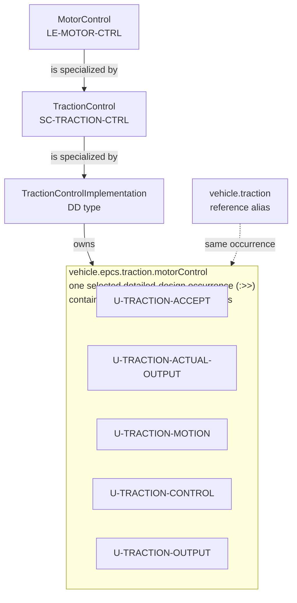
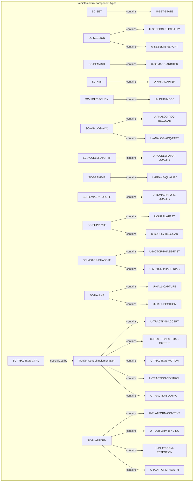
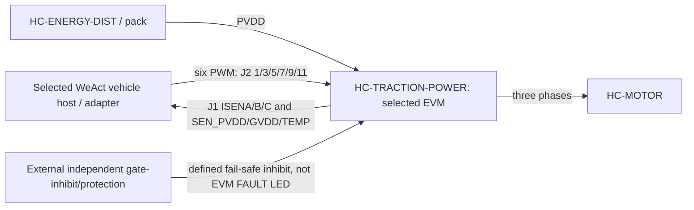
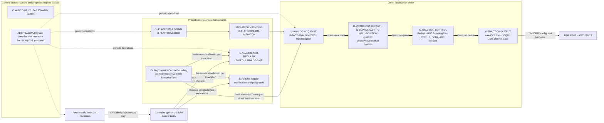
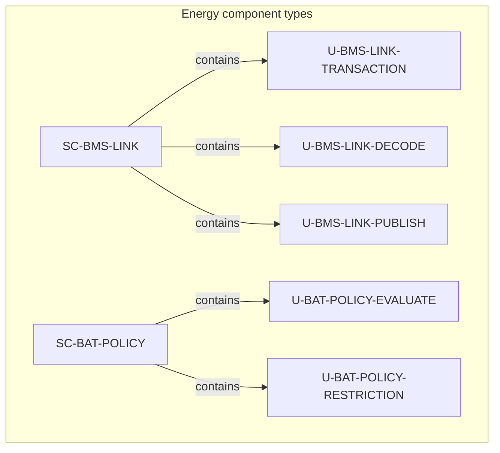
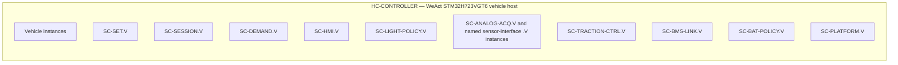
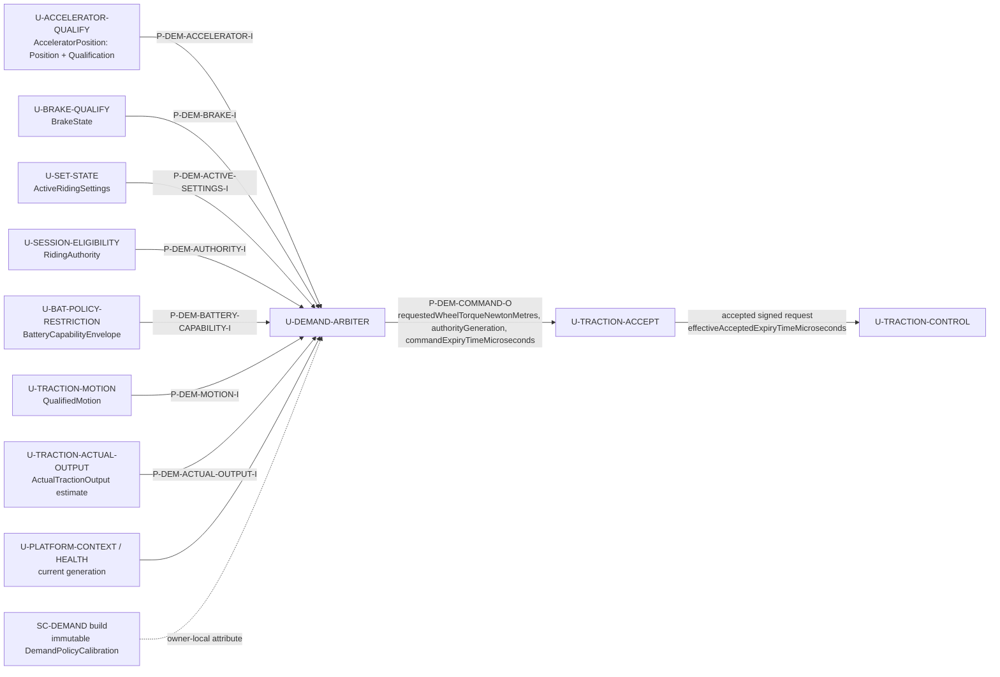
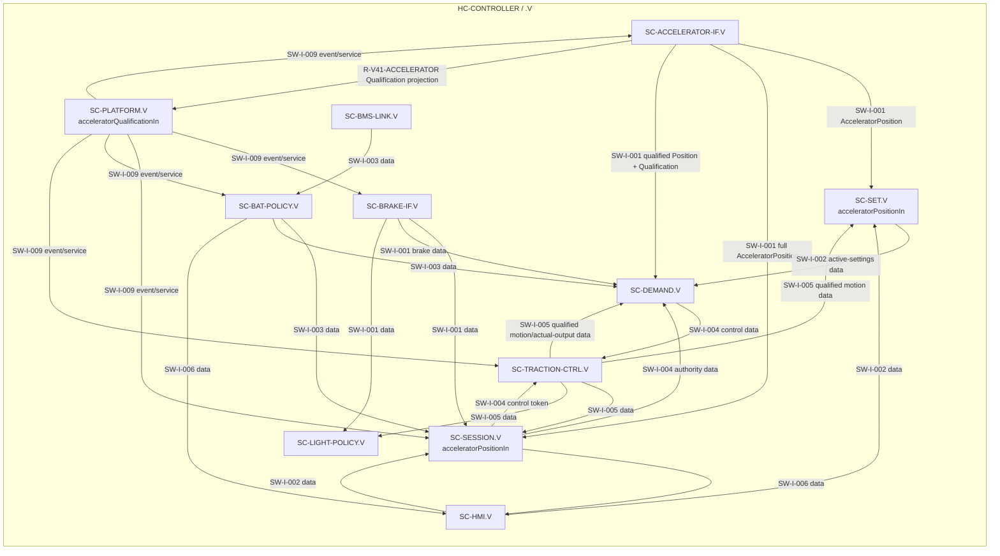

# DD-003 — Static software architecture views

**Draft vehicle baseline — 2026-09-16.** Full static composition, Hall/FOC ownership, runtime realization, battery/BMS units, deployment and local-interface views are retained.
**Draft 1.3 — 2026-09-14; successor to DD-003-R1.1.** These controlled views include Hall-position/FOC composition and the selected EVM physical boundary, and make the Draft [ARCH-003 component and host allocation](../ARCH-003_Software_Architecture.md) and the unit catalogues in [DD-001](DD-001_Software_Unit_Design.md) and [DD-002](DD-002_Battery_Protection_Unit_Design.md) easier to inspect.

## Scope and notation

The detailed behaviour, qualification, reset, retention and physical-acceptance limits remain authoritative in DD-001, DD-002 and ARCH-003. The [runtime integration contract](../Runtime_Integration_Contract.md) separately maps units to project bindings, direct fast calls and deferred scheduled routes; it is not a claim that every unit is a task. A requested zero, a command or an output observation is not proof of physical regeneration, protection or output.

## Draft MotorControl specialization pilot

This draft controlled pilot follows one architecture chain only: the system logical leaf
`LE-MOTOR-CTRL` is modeled by `MotorControl`, `SC-TRACTION-CTRL` specializes that
canonical logical boundary as the software view, and
`TractionControlImplementation` specializes the software view for detailed design.
The implementation owns the five existing traction units shown below; those units
remain unit parts and are not new component types, runtime components or tasks.

The logical and software views select one detailed-design implementation occurrence.
SysML `:>>` feature redefinitions carry the same occurrence selection through the
chain; they do not create a second MotorControl or TractionControl instance. The
selected containing context is defined by the detailed-design model. See the
[system MotorControl model](../../SystemArchitecture/Modelling/MotorControl.sysml),
[software TractionControl model](../TractionControl/TractionControl.sysml),
the [TractionControlImplementation model](../TractionControl/DetailedDesign/TractionControlImplementation.sysml),
and [detailed-design container model](Modelling/X2CityDetailedDesign.sysml).

The selected container path is `vehicle.epcs.traction.motorControl`. The detailed
model specializes `Traction` as `SelectedTraction` and redefines `motorControl` to
the implementation, then specializes `ElectricalPropulsionControlSystem` as
`SelectedEpcs` and redefines `traction`, and specializes `ProjectVehicleModel` as
`VehicleDetailedDesign` and redefines `epcs`. The existing `vehicle.traction` path
is retained as a reference alias to the selected traction occurrence. The system
`x2CityVehicle` and software `tractionControlVehicle` views remain unbound
references; bind statements inside the detailed-design model select the same
occurrence for this pilot.

The selected chain preserves the existing allocation and requirement IDs. It does
not imply that the other system/software/detailed-design chains have been migrated
to the same specialization pattern.

### TractionControl boundary to unit ownership

The table maps every public TractionControl boundary port to the existing detailed
unit owner. `P-*`, `SW-I-*` and `R-*` references remain the canonical ARCH-003
contracts; unit model files are linked for review of the corresponding ports.

| MotorControl / SC-TRACTION-CTRL boundary | Canonical port / route | Existing DD owner and port | Requirement/interface trace |
|---|---|---|---|
| `SC-TRACTION-CTRL.tractionObservationOut` | `P-TR-OBS-O`; `SW-I-005` | [`U-TRACTION-ACCEPT.observationOut`](../TractionControl/DetailedDesign/UTractionAccept.sysml) → Session, Battery and Light consumers | `REQ-SYS-HSI-008`, `REQ-SYS-HSI-009` |
| `ridingAuthorityIn` | `P-TR-AUTH-I`; `SW-I-004` / `R-V15` | [`U-TRACTION-ACCEPT.authorityIn`](../TractionControl/DetailedDesign/UTractionAccept.sysml) | `REQ-SYS-HSI-004`, `REQ-SYS-TRQACC-001` |
| `wheelTorqueRequestIn` | `P-TR-COMMAND-I`; `SW-I-004` / `R-V14` | [`U-TRACTION-ACCEPT.commandIn`](../TractionControl/DetailedDesign/UTractionAccept.sysml) | `REQ-SYS-HSI-004`, `REQ-SYS-TRQACC-001` |
| `hallElectricalPositionIn` | `P-TR-HALL-I`; `R-V27` | [`U-TRACTION-CONTROL.electricalPositionIn`](../TractionControl/DetailedDesign/UTractionControl.sysml), [`U-TRACTION-MOTION.electricalPositionIn`](../TractionControl/DetailedDesign/UTractionMotion.sysml), [`U-TRACTION-ACTUAL-OUTPUT.electricalPositionIn`](../TractionControl/DetailedDesign/UTractionActualOutput.sysml) | `REQ-SYS-TRQPOS-001`, `REQ-SYS-TRQCTL-001` |
| `phaseCurrentEpochIn` | HSI-009 fast feedback boundary | [`U-TRACTION-CONTROL.phaseFeedbackIn`](../TractionControl/DetailedDesign/UTractionControl.sysml), [`U-TRACTION-ACTUAL-OUTPUT.phaseFeedbackIn`](../TractionControl/DetailedDesign/UTractionActualOutput.sysml) | `REQ-SYS-HSI-009`, `REQ-SYS-TRQCTL-001` |
| `fastDcLinkVoltageIn` | HSI-009 fast supply boundary | [`U-TRACTION-CONTROL.fastDcLinkVoltageIn`](../TractionControl/DetailedDesign/UTractionControl.sysml) | `REQ-SYS-HSI-009`, `REQ-SYS-TRQCTL-001` |
| `sensorHealthIn` | HSI-009 health qualification | [`U-TRACTION-CONTROL.sensorHealthIn`](../TractionControl/DetailedDesign/UTractionControl.sysml) | `REQ-SYS-HSI-009`, `UR-TRACTION-CONTROL-001` |
| `motionHealthIn` | `P-TR-MOTION-HEALTH-I`; `R-V27` Hall-health family | [`U-TRACTION-MOTION.motionHealthIn`](../TractionControl/DetailedDesign/UTractionMotion.sysml) | `REQ-SYS-TRQMOTION-001` |
| `tractionOutputStageExchange` | `P-TR-OUTPUT-I/O` | [`U-TRACTION-OUTPUT.outputStageEvidenceIn`](../TractionControl/DetailedDesign/UTractionOutput.sysml) ← boundary; [`U-TRACTION-OUTPUT.outputObservationOut`](../TractionControl/DetailedDesign/UTractionOutput.sysml) → [`U-TRACTION-ACTUAL-OUTPUT.outputStageEvidenceIn`](../TractionControl/DetailedDesign/UTractionActualOutput.sysml) and boundary | `REQ-SYS-HSI-009`, `REQ-SYS-TRQEX-001` |
| `qualifiedMotionOut` | `P-TR-QUALIFIED-MOTION-O`; `SW-I-005` / `R-V05-*`, `R-V13` | [`U-TRACTION-MOTION.qualifiedMotionOut`](../TractionControl/DetailedDesign/UTractionMotion.sysml) | `REQ-SYS-TRQMOTION-001` |
| `appliedTractionStateOut` | `P-TR-ACTUAL-OUTPUT-O`; `SW-I-005` / `R-V13` | [`U-TRACTION-ACTUAL-OUTPUT.appliedTractionStateOut`](../TractionControl/DetailedDesign/UTractionActualOutput.sysml) → [`U-TRACTION-ACCEPT.actualOutputIn`](../TractionControl/DetailedDesign/UTractionAccept.sysml); [`U-TRACTION-ACCEPT.appliedTractionStateOut`](../TractionControl/DetailedDesign/UTractionAccept.sysml) → public boundary | `REQ-SYS-TRQCTL-001`, `UR-TRACTION-ACTUAL-OUTPUT-001` |
| `platformContextIn` | `SW-I-009`; current-context service input | [`U-TRACTION-MOTION.platformContextIn`](../TractionControl/DetailedDesign/UTractionMotion.sysml), [`U-TRACTION-ACTUAL-OUTPUT.platformContextIn`](../TractionControl/DetailedDesign/UTractionActualOutput.sysml) | `REQ-SYS-HSI-007`, `REQ-SYS-PLT-001` |
| `platformHealthIn` | `SW-I-009`; current-health service input | [`U-TRACTION-MOTION.platformHealthIn`](../TractionControl/DetailedDesign/UTractionMotion.sysml), [`U-TRACTION-ACTUAL-OUTPUT.platformHealthIn`](../TractionControl/DetailedDesign/UTractionActualOutput.sysml) | `REQ-SYS-HSI-007`, `REQ-SYS-PLT-001` |

`U-TRACTION-ACCEPT` forwards the independently produced actual-output record to
Demand without gating or refreshing it and publishes the legacy observation
envelope. `U-TRACTION-MOTION` keeps its Hall capture/position-specific health
qualification, while `U-TRACTION-CONTROL.sensorHealthIn` remains the broader FOC
health fan-in. `U-TRACTION-CONTROL` produces the sampling plan, while
`U-TRACTION-OUTPUT` remains the sole literal stage/commit owner. This mapping
records ownership and traceability; it does not change any requirement body or
select a new execution mechanism.

External detailed-design traffic for this pilot terminates at the public
`TractionControlImplementation` boundary. The implementation model contains the
five unit-to-unit flows once; the `vehicle.traction` reference alias does not add
a second wiring graph.

The pilot retains the shared qualification context ancestry: software
`ContextualSoftwareInformation` refines the logical qualified-information record,
and detailed `UnitInformationEnvelope` refines that software context. Traction
unit sensor inputs accept the software schema types; producer wrappers
`HallElectricalPositionRecord`, `PhaseCurrentFeedbackRecord` and
`FastDcLinkVoltageRecord` remain detailed subtypes. The DD observation boundary
`TractionObservationRecord` refines `TractionObservation` while retaining
`UnitInformationEnvelope`. Software `ExpiryTimeMicroseconds` is an `Integer`
refinement, while logical `Expiry` remains abstract and opaque. Values, field
meanings and expiry semantics remain unchanged; this schema alignment is scoped
to the MotorControl pilot and does not alter requirement contracts.

## Static component-to-unit composition

### Vehicle-control domain

### Hall evidence and traction interpretation

```mermaid
flowchart LR
    HM[HC-MOTOR Hall1..3] -->|J7 1..3| E[Selected DRV8300 EVM]
    V5[External qualified 5-V Hall supply] -->|planned J3 HALL_EXT then J7-4| E
    E -->|fixed 3.3-V R9/R10/R11 pull-ups and J2 13/15/17| FE[HC-INPUT-FE / host adapter]
    FE -->|conditioned acquired state/edges, open host realization| HIF[SC-HALL-IF.V]
    HIF -->|capture buffer and valid state/edge evidence| P[U-HALL-POSITION]
    P -->|qualified electrical sector/direction/edge time| T[SC-TRACTION-CTRL.V]
    P -.->|unavailable without map/alignment| T
    T -.->|separate qualified conversion required| S[mechanical/vehicle speed]
```

The physical prefix records the EVM schematic boundary, not a measured jumper configuration: board revision, J3 setting, common return, backfeed, host thresholds and adapter continuity remain qualification work. `HC-INPUT-FE` owns host-side conditioning/acquisition; it neither owns the EVM pull-ups nor supplies the independent traction gate-inhibit. Static state may support sector at rest after map/alignment qualification; it does not prove speed/standstill. The dashed speed path requires pole-pair and loaded-wheel calibration evidence and is not selected here.

### Selected traction-board ownership boundary

The EVM owns its bridge, shunts, dividers, Hall pull-ups and board-temperature sensor. The selected WeAct `HC-CONTROLLER` plus `HC-INPUT-FE`/host adapter owns the still-unallocated interface and acquisition; `HC-ENERGY-DIST` and the external protection assembly own the additional energy/protection realization. The EVM's J2 `FAULT` is only a host-driven LED indication and is deliberately not drawn as a protection path. All paths remain draft integration contracts rather than acceptance evidence.

`U-ANALOG-ACQ-*`, the named sensor-interface units, `U-TRACTION-ACCEPT`, `U-TRACTION-MOTION`, `U-TRACTION-ACTUAL-OUTPUT` and `U-PLATFORM-*` refine approved ASW allocations. `U-HALL-CAPTURE` and `U-HALL-POSITION` own Hall buffer/capture integrity and qualified electrical position; `U-TRACTION-CONTROL` consumes that position with qualified phase feedback and fast Vdc for selected FOC. `U-TRACTION-OUTPUT` owns compare-latch/inhibit sequencing under Draft HSI-009; the [traction HSI](../../DRV8300DRGE-EVM/DRV8300DRGE-EVM_WeAct_STM32H723VGT6_Traction_HSI.md) owns the concrete platform contract. None proves physical output behaviour.

The implementation contract makes the ownership exact: `U-PLATFORM-CONTEXT` orchestrates startup/context invalidation and `U-PLATFORM-BINDING` starts selected resources and dispatches ADC1/ADC2 JEOS to `U-ANALOG-ACQ-FAST`, which snapshots raw JDR data into `InjectedEpoch`. `U-MOTOR-PHASE-FAST` and `U-SUPPLY-FAST` convert the raw epoch into qualified phase feedback and fast Vdc; `U-HALL-CAPTURE`/`U-HALL-POSITION` provide electrical position. `U-TRACTION-CONTROL` consumes those qualified records and emits compare/context data, including the next sampling-plan `CCR4`; `U-TRACTION-OUTPUT` alone stages/commits literal TIM8 `CCR1..4` and JSQR. `U-ANALOG-ACQ-REGULAR` owns regular-DMA completed-record publication, while `U-HALL-CAPTURE` owns Hall capture storage and `U-HALL-POSITION` its interpretation. The direct fast chain is neither a CortexOs scheduled task nor current intercom usage; the qualified [runtime contract](../Runtime_Integration_Contract.md) owns remaining project/generic-driver and future-intercom detail.

### Vehicle runtime realization boundary

Solid fast-path edges are direct calls. `CallingExecutionContextBoundary` represents the task or IRQ caller, not CortexOs as a modeled time-consuming component: it samples live time and supplies `executionTimeIn` directly to each invoked unit or group. Bounded internal leaves may inherit one fixed reference within the parent invocation. Dashed nodes identify capability work, not implemented drivers or intercom endpoints. Project route identity, context, age, expiry and fault policy remain outside generic `src/os` transport mechanics.

### Battery and BMS domain

## Deployment and instance boundaries

This view separates static type composition above from the local vehicle realization instances below.

`SC-BMS` remains supplied opaque firmware on `HC-BMS`; `SC-VD18MT` remains supplied opaque firmware in the VD18MT assembly within `HC-RIDER`. Neither receives a `U-*` node in these views.

## Demand-arbitration typed boundary

`U-DEMAND-ARBITER` has no generic `lightingContextIn` collection. Each ingress below carries its own value, qualification, producer/context, configuration identity and generation; age is evaluated locally from caller supplied `ExecutionTime`. Demand evaluates one coherent snapshot; a route being drawn does not make a prior record current.

`U-TRACTION-MOTION` is a real producer route, not a reinterpretation of a Demand command: it interprets current qualified Hall capture/position evidence only with current capture health, its compiled map/pole-pair/final-drive/loaded-wheel parameters and a released bounded-observability/standstill criterion before publishing speed, direction and standstill. A static Hall state or no edge alone is unavailable for this purpose. `U-TRACTION-ACTUAL-OUTPUT` publishes `ActualTractionOutput` only as a current qualified estimate from post-stage physical evidence with provenance plus same-operation phase-current/position and qualified vehicle-motion evidence with its immutable compiled estimator parameters. It operates independently of acceptance; `U-TRACTION-ACCEPT` passes that observation without refreshing or gating it while separately issuing accepted demand to control. Its applied-torque and powered-forward-travel fields must be unavailable if that chain has only a requested torque, FOC reference, register/PWM state, output-stage event or acceptance result. The command is a request; neither observation proves physical torque or vehicle travel.

| Decision input/output | Consumer acceptance and ownership |
|---|---|
| Active settings | Only the active level/speed setting is used. Pending values, receipt order and setting activation remain `SC-SET` ownership. |
| Authority and command | `authorityExpiryTimeMicroseconds` and `commandExpiryTimeMicroseconds` carry independent decision sequences in the shared host monotonic domain. Acceptance emits `effectiveAcceptedExpiryTimeMicroseconds`; Demand cannot refresh authority by issuing a command. |
| Motion and actual output | Demand requires current qualified motion for speed/standstill decisions and current qualified actual positive applied torque plus forward travel to re-arm regeneration after stop. Hand-push travel cannot satisfy the latter proof. |
| Capability | `BatteryCapabilityEnvelope` supplies independently qualified positive/negative ceilings, reasons and restriction generations. Demand clamps signs independently, owns regeneration-recovery episode qualification, and does not own protection. |
| Calibration | `SC-DEMAND` owns immutable compiled `DemandPolicyCalibration` maps, ramps, taper, reference limits and timing-bound data. Its startup checks govern profile availability; any change needs rebuild, deployment and restart. |

## Static local-interface view

The interface names and endpoint scopes below are the released `SW-I-*` contracts from ARCH-003. Flow labels distinguish **data** publications, **control** token/data, and **event/service** interactions. They do not introduce timing, protocol, electrical or physical semantics. The complete port-to-port route catalogue is [ARCH-003 port registry and route catalogue](../ARCH-003_Software_Architecture.md#static-port-registry-and-connection-catalogue); this view intentionally labels interface groups rather than every `P-*` endpoint.

`SW-I-009` applies to all local components; selected edges keep the view legible. This figure also suppresses parts of `SW-I-003`, `SW-I-006` and `SW-I-007` where their crossing edges would obscure the host boundary. The complete endpoint, route and fanout record is [ARCH-003 port registry and route catalogue](../ARCH-003_Software_Architecture.md#static-port-registry-and-connection-catalogue); the `SW-I-*` interface definitions remain in [ARCH-003](../ARCH-003_Software_Architecture.md#typed-software-interactions).

## Cross-view use

Read this document with [DD-001](DD-001_Software_Unit_Design.md) for vehicle-policy unit semantics, [DD-002](DD-002_Battery_Protection_Unit_Design.md) for energy and regenerative acceptance, and [DD-004](DD-004_Dynamic_Software_Architecture_Views.md) for documented interaction and state examples. The released ARCH-003 deployment diagram is the source allocation view; this document restates it at unit and instance resolution for detailed-design review only.
