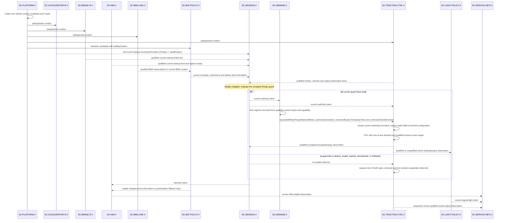
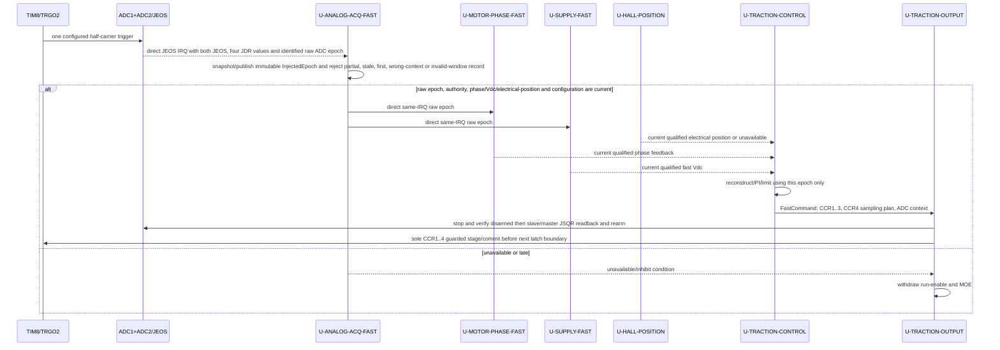
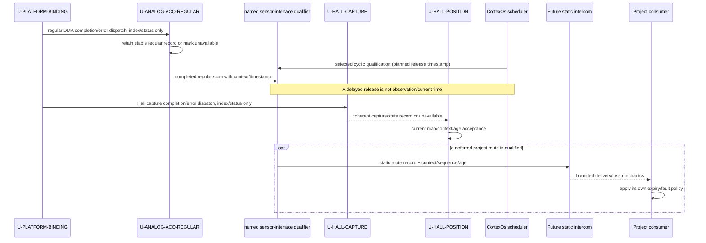
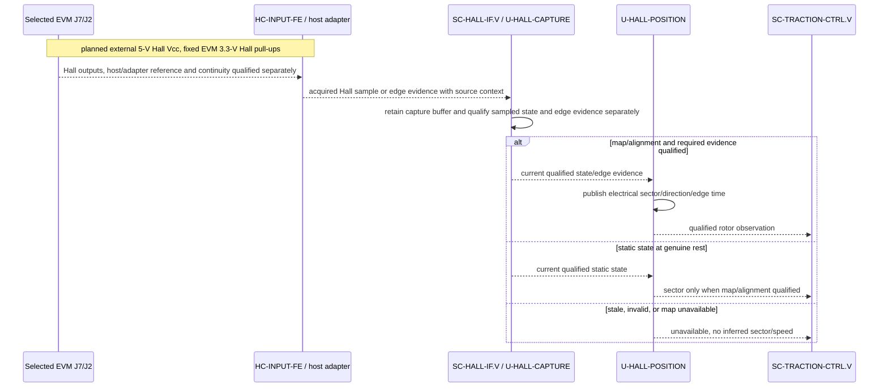
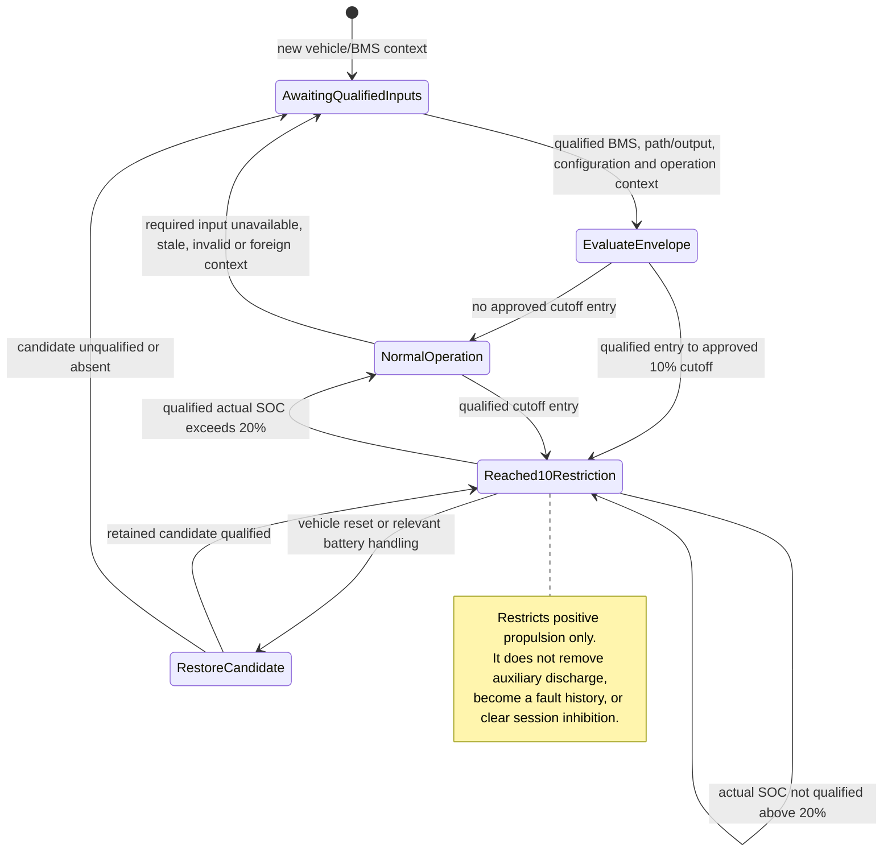

# DD-004 — Dynamic software architecture views

**Draft vehicle baseline — 2026-09-16.** All startup, fast-epoch, Hall, scheduled qualification, settings/HMI/lighting and battery-reset sequence views are retained.
**Draft 1.3 — 2026-09-14; successor to DD-004-R1.1.** These controlled views include the Hall/FOC interaction example and selected EVM physical boundary, and supplement the canonical unit designs in [DD-001](DD-001_Software_Unit_Design.md) and [DD-002](DD-002_Battery_Protection_Unit_Design.md), and the static component, deployment and interface views in [DD-003](DD-003_Static_Software_Architecture_Views.md).

## Scope and reading rules

Every received or published record retains value, qualification/freshness and producer/reset context.  In these diagrams, `qualified` means the consumer may use the stated fact under its canonical contract; it never means a physical condition is proved.  An intent, command, acknowledgement, zero request, or logical light/status mode is software intent.  `actual-output` and `actual-activity/path` are qualified observations; their physical truth, response and protection remain system acceptance work.

The diagrams cover all vehicle ARCH-003 component roles. Supplied BMS and VD18MT firmware are shown only as external participants where their boundary helps explain the interaction.

## Vehicle startup, Ready and command acceptance

This is an example of the successful path after a fresh vehicle context.  The full Ready guard remains [REQ-SYS-STA-001](../../../Requirements/System_Requirements/Power_Startup_and_Faults.md#req-sys-sta-001): simultaneous standstill and physical accelerator rest, current-startup accelerator/brake and VD18MT setting qualification, trustworthy actual SOC, required temperature information, passing required self-tests, no current-session inhibition and applicable permissives.  Before that guard and separate traction acceptance, neither torque sign is authorized.



`SC-TRACTION-CTRL.V` requesting zero does not prove zero physical torque or protection.  `SC-SERVICE-INFO.V` only assembles producer-tagged current observations and cannot grant authority or clear inhibition.

## Fast traction epoch and output latch



The exact pins, commanded-vector-selected ADC contexts, rearm order, cache policy, PWM timing and external gate path are in the [allocated traction HSI](../../DRV8300DRGE-EVM/DRV8300DRGE-EVM_WeAct_STM32H723VGT6_Traction_HSI.md). This direct path is outside the 1-ms scheduler and current intercom; [the runtime contract](../Runtime_Integration_Contract.md) assigns its vector/binding, data ownership and no-blocking rule. Timer break and permit observations are not physical-output proof.

## Scheduled qualification and deferred transport

The selected scheduler can run cyclic slow work; it does not make a software component a task or supply an intercom endpoint. `U-ANALOG-ACQ-REGULAR` owns DMA completed-record stability, while `U-HALL-CAPTURE` owns Hall capture storage and `U-HALL-POSITION` publishes qualified electrical position. Named accelerator, brake, temperature, supply and motor-phase units consume regular scans under their own qualification contracts. A later static intercom transport may carry a project-declared route only after its route-specific context, age, capacity and loss policy are defined.



For example, a lossy telemetry route can surface sequence loss, whereas `SC-SESSION` retains the first reportable fault in owned state and authority/command expiry is rejected at `U-TRACTION-ACCEPT`. VD18MT byte/link loss is interpreted only by `SC-HMI` under its existing continuity rule. These behaviors are not generic queue semantics.

## Hall acquisition and rotor-sector interpretation



This does not require an edge at rest, treat an absent edge as a default fault, or convert electrical edge timing into vehicle speed. The EVM J7/J2 arrangement terminates at the selected WeAct vehicle host only through an unallocated/qualified adapter; it does not prove a J3 setting or supply gate-inhibit protection; independent protection and every electrical reference remain physical acceptance work. Any speed conversion separately requires qualified pole-pair, direction and loaded-wheel calibration evidence.

## Demand decision, withdrawal and post-stop regeneration rearm

`U-DEMAND-ARBITER` samples its typed inputs as one declared coherent decision snapshot. It evaluates `authorityExpiryTimestampTicks` independently from `commandExpiryTimestampTicks`, using their named clock/context fields; a new `decisionSequence` never refreshes authority. A missing, stale, invalid, foreign-generation/configuration or noncoherent **common** contributor causes both-sign withdrawal; an unavailable positive or negative capability branch constrains only that sign. It does not reuse a prior value. The profile/ramp/taper and freshness/coherency bounds are release-controlled parameters, so this interaction claims no numerical response time.

```mermaid
sequenceDiagram
    participant M as U-TRACTION-MOTION
    participant O as U-TRACTION-ACTUAL-OUTPUT
    participant D as U-DEMAND-ARBITER
    participant T as U-TRACTION-ACCEPT
    participant SI as U-SERVICE-INFO-COLLECT
    Note over D: Post-stop regen disabled at new context and on qualified standstill
    M-->>D: current speed, direction, standstill or unavailable
    O-->>D: current qualified applied-torque estimate / powered-forward-travel or unavailable
    D->>D: reject stale, mismatched or expired evidence before profile calculation
    alt current forward travel AND actual positive applied wheel torque
        D->>D: re-arm post-stop regeneration for this context
    else hand-push, command/PWM/Hall-only, zero or unavailable evidence
        D->>D: keep regeneration disabled
    end
    D->>D: apply both-sign inhibits; then sign-specific limits and active profile
    D-->>T: requestedWheelTorqueNewtonMetres, authorityGeneration, commandExpiryTimestampTicks and commandClockId/context
    D-->>SI: reason, decision generation and restriction state only
    Note over SI: no rider indication or control return
```

For simultaneous events, demand applies this order within the coherent decision snapshot: invalidity/reset/platform-health loss, expired/mismatched authority and other both-sign inhibitions withdraw first; hard/active speed limits and other both-sign constraints apply next; post-stop rearm, regeneration recovery hold and the negative capability branch constrain negative only; lever and the positive branch constrain positive only; active-profile/ramp/taper results are then clamped within the remaining envelopes. A restriction recovery or capability increase cannot win over a concurrent withdrawal or tighter limit. `SC-BAT-POLICY` supplies current branch limits and restriction generation; `SC-DEMAND` owns qualification of each reduction episode: regenerative-range exit or standstill qualifies it before or after clearance, while clearance/partial relaxation during continuous moving regenerative demand cannot increase the held negative ceiling. When qualification and current clearance both exist, recovery is automatic, including at standstill; each new reduction starts a new episode. Session fault restart remains `SC-SESSION` state; neither that nor restriction recovery re-arms post-stop regeneration.

## Settings application, HMI loss and lighting feedback

The following interaction separates current VD18MT receipt from retained settings and current rider/traction evidence.  Loss after a valid receipt retains valid active/pending settings and the normal-light request; it neither freezes torque nor creates authority.  Missing current-startup receipt still blocks Ready.

```mermaid
sequenceDiagram
    participant VD as Supplied SC-VD18MT
    participant H as SC-HMI.V
    participant A as SC-ACCELERATOR-IF.V
    participant B as SC-BRAKE-IF.V
    participant SET as SC-SET.V
    participant D as SC-DEMAND.V
    participant T as SC-TRACTION-CTRL.V
    participant L as SC-LIGHT-POLICY.V

    VD->>H: settings and normal-light request
    H-->>SET: current qualified decoded request
    A-->>SET: AcceleratorPosition; use qualified Position.acceleratorAtRest
    T-->>SET: qualified standstill fact
    alt interpretable setting and both application facts hold
        SET->>SET: atomically apply latest valid pending setting
    else setting valid but application guard not complete
        SET->>SET: retain as pending, active setting unchanged
    end
    SET-->>D: current active setting
    A-->>D: AcceleratorPosition; use qualified Position
    B-->>D: qualified brake fact
    T-->>D: qualified vehicle-motion and actual-output observations
    D-->>T: current signed demand when authority and capability permit
    T-->>L: active electrical-braking observation or unqualified state
    B-->>L: qualified lever state or unqualified state
    H-->>L: normal-light request
    L->>L: front follows normal request, rear mode follows canonical policy
    Note over VD,H: endpoint loss after valid receipt
    H-->>SET: no new qualified receipt
    SET->>SET: retain existing active/pending settings
    L->>L: retain normal-light request
    A-->>D: live AcceleratorPosition continues
    B-->>D: live qualified brake fact continues
    T-->>D: live qualified vehicle-motion and actual-output observations continue
    D-->>T: do not reuse a frozen demand
```

A retained active-setting publication after link loss is current state, not a new receipt: it retains the source receipt provenance and cannot refresh it. HMI absence alone does not expire a valid active selection; physical sample age, qualification and source time likewise cannot be refreshed by republishing.

The rear logical mode can be Full for an actuated lever, active electrical braking, or either unqualified fact; it is otherwise Dim for normal request On and Off for Off.  This is logical intent, not lamp output or visible-light evidence.

## Battery capability, reset and retained operating restriction

This state view is intentionally limited to `SC-BAT-POLICY.V` ownership of the retained `reached10%` propulsion restriction.  It is not a BMS state model and does not retain battery-fault history.  `SC-BMS-LINK` requalifies observations after host startup, recognized BMS reset, or required-source qualification loss; a BMS wake/short interruption alone does not by itself clear a justified unexpired record.



`SC-BMS-LINK.V` publishes accepted observations only; rejected frames do not refresh them. `SC-BAT-POLICY.V` keeps regenerative acceptance and discharge envelopes distinct, withholds a dependent permission when a required contribution is unavailable, and reports normal restrictions separately from recognized battery faults. A newly available envelope cannot authorize torque or clear `SC-SESSION.V` inhibition.

## Traceability and limits

The vehicle views elaborate `SW-I-001` through `SW-I-006` and `SW-I-008/009`. They retain the ownership and constraints of [ARCH-003](../ARCH-003_Software_Architecture.md), its [retention rules](../ARCH-003_Software_Architecture.md#retained-restriction-and-reset-state) and [typed interactions](../ARCH-003_Software_Architecture.md#typed-software-interactions); [Vehicle startup, Ready and command acceptance](#vehicle-startup-ready-and-command-acceptance) is the canonical dynamic startup view.

The source remains underdefined on event-detection mechanism, timing and concurrent-sampling realization, physical activity/path evidence, self-test scope, retained-state integrity, and diagnostic coverage. The coherent-snapshot precedence is defined; these views do not resolve the remaining qualification gates.
