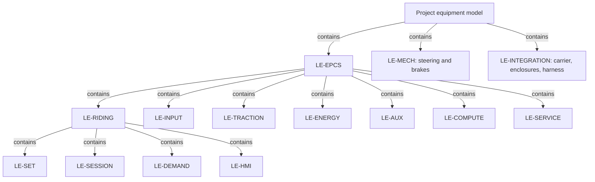
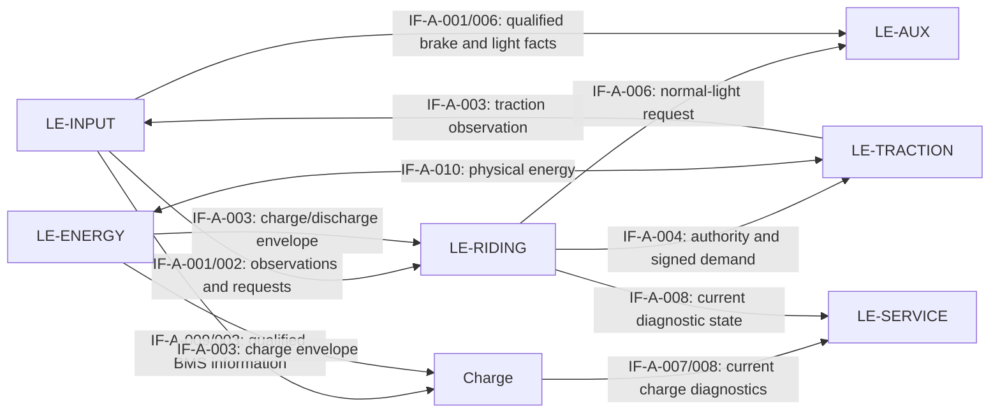

# ARCH-001 — System architecture and logical component decomposition

**Draft vehicle baseline — 2026-09-16.** Full logical decomposition, interface contracts, allocation gates, function bindings and verification notes are retained for the vehicle and fitted pack.

## Release identity

**Released 1.0 — 2026-09-13; ARCH-001-R1.0.** Component architecture developed from released [FC-001-R1.0](../FC-001_Functional_Concept.md), [FC-002-R1.0](../FC-002_Function_Trace.md), REQ-001-R1.6 and HARA/SG-R1.0. [REQ-001](../../Requirements/REQ-001_Requirements.md#requirement-types-and-architecture-model) controls the three-layer model. The 12 FSC refinements remain Draft. The owner-approved scope and retained gates are in the [release record](#release-record); ARCH0.3 remains frozen in the FC release commit `8a97f93427bfceb80151b2ba2b72af1ea087c88a`.

This document defines logical component types, composition and system interfaces for the installed vehicle and supplied removable pack. [ARCH-002](../ARCH-002_Hardware_Architecture.md) defines physical HW assemblies, ports and configurations; [ARCH-003](../SoftwareArchitecture/ARCH-003_Software_Architecture.md) defines SW components, hosting, state ownership and interactions.

## Modelling and configuration rules

A logical component has a bounded responsibility, owned subparts or state, and interfaces to other components. Functions from FC-001 are allocated behaviour; they are not interchangeable with component identities. Containment, connection, function allocation and software hosting are distinct relations. This follows the structural/behavioural and allocation distinctions in the [OMG SysML overview](https://www.omg.org/sysml/sysmlv1/); these Markdown/Mermaid views use the relations declared here without claiming a tool-native SysML model.

The logical type catalogue decomposes the project equipment model. LE-EPCS is the functional electrical-system partition; LE-MECH and LE-INTEGRATION are the mechanical and structural/interface partitions. **LE-VEH is the installed-vehicle scope view**, using applicable parts and the fitted pack; it is the complete vehicle project scope.

Types are not physical instances. Component types in this model have vehicle-local state and hosting. The hardware model has exactly one removable pack instance: installation connects it to the vehicle and removal disconnects it; no duplicate battery containment is implied.

The 19 existing LE identities and all approved requirement Type/Target bindings are preserved. The component boundaries and leaf allocations are approved within this architecture baseline, subject to their recorded engineering acceptance gates. A logical HW leaf can be realized by cooperating HW parts; a SW leaf may have several deployed instances of its component type. Supplied assemblies retain opaque vendor software and boundary acceptance rather than invented project units. Device schematics, code units and numerical parameters remain downstream.

## Logical composition

Edges below mean **composed of**, not communication or power flow. The table gives every immediate parent, including children omitted from the overview.

**Kinds:** Composite = decomposed project component; HW/SW = explicitly allocated logical leaf; Supplied = provided assembly with qualified external behaviour. Realization links identify component types, not satisfaction evidence. Physical parts such as enclosures/interfaces may realize several logical roles; their single physical containment owner is defined in ARCH-002.

| Logical component | Immediate parent | Kind | Boundary / owned responsibility | Realization |
|---|---|---|---|---|
| LE-RIDING | [LE-EPCS](../../Requirements/REQ-001_Requirements.md#le-epcs) | Composite | Riding supervisor; owns settings, driving session, demand and HMI adapter parts. | Owned children below |
| LE-SET | [LE-RIDING](#le-riding) | SW | Requested, pending and active riding-setting policy | [SC-SET](../SoftwareArchitecture/ARCH-003_Software_Architecture.md#sc-set) |
| LE-SESSION | [LE-RIDING](#le-riding) | SW | Riding Ready eligibility, current-session inhibition and fresh restart assessment | [SC-SESSION](../SoftwareArchitecture/ARCH-003_Software_Architecture.md#sc-session) |
| LE-DEMAND | [LE-RIDING](#le-riding) | SW | Signed wheel-torque command policy and arbitration from active settings, authority, qualified facts and feedback; current policy diagnostics are service-only | [SC-DEMAND](../SoftwareArchitecture/ARCH-003_Software_Architecture.md#sc-demand) |
| LE-HMI | [LE-RIDING](#le-riding) | SW | VD18MT protocol interpretation and outgoing information | [SC-HMI](../SoftwareArchitecture/ARCH-003_Software_Architecture.md#sc-hmi) |
| LE-INPUT | [LE-EPCS](../../Requirements/REQ-001_Requirements.md#le-epcs) | Composite | Rider, motion, battery and temperature information qualification; electrical communication endpoints | Owned children below |
| LE-RIDER-DEVICES | [LE-INPUT](#le-input) | Supplied | Fixed VD18MT, accelerator and passive coded brake electrical network; opaque display firmware. Mechanical lever force remains LE-MECH. | [HC-RIDER](../ARCH-002_Hardware_Architecture.md#hc-rider), [SC-VD18MT](../SoftwareArchitecture/ARCH-003_Software_Architecture.md#sc-vd18mt) |
| LE-INPUT-HW | [LE-INPUT](#le-input) | HW | Protected physical acquisition and host communication endpoints; battery and traction references cross the qualified interface boundary. | [HC-INPUT-FE](../ARCH-002_Hardware_Architecture.md#hc-input-fe), [HC-PACK-IF](../ARCH-002_Hardware_Architecture.md#hc-pack-if) |
| LE-INPUT-QUAL | [LE-INPUT](#le-input) | SW | Local observation qualification, coherence, source status and self-tests; preserves BMS/traction producer provenance. | [SC-ANALOG-ACQ.V, SC-ACCELERATOR-IF.V, SC-BRAKE-IF.V, SC-TEMPERATURE-IF.V, SC-SUPPLY-IF.V, SC-MOTOR-PHASE-IF.V and SC-HALL-IF.V](../SoftwareArchitecture/ARCH-003_Software_Architecture.md) |
| LE-BMS-LINK | [LE-INPUT](#le-input) | SW | UART information interpretation/qualification within LE-INPUT; applicable vehicle and service consumer configurations | [SC-BMS-LINK](../SoftwareArchitecture/ARCH-003_Software_Architecture.md#sc-bms-link) |
| LE-TRACTION | [LE-EPCS](../../Requirements/REQ-001_Requirements.md#le-epcs) | Composite | Realize permitted signed torque with the installed motor; provide qualified applied-torque/motion information | Owned children below |
| LE-MOTOR-CTRL | [LE-TRACTION](#le-traction) | SW | Command acceptance, motor control and actual-traction-output observation with domain self-tests. | [SC-TRACTION-CTRL](../SoftwareArchitecture/ARCH-003_Software_Architecture.md#sc-traction-ctrl) |
| LE-TRACTION-HW | [LE-TRACTION](#le-traction) | HW | Physical traction conversion, motor, feedback and assigned protective output behavior. | [HC-TRACTION-POWER](../ARCH-002_Hardware_Architecture.md#hc-traction-power), [HC-MOTOR](../ARCH-002_Hardware_Architecture.md#hc-motor) |
| LE-ENERGY | [LE-EPCS](../../Requirements/REQ-001_Requirements.md#le-epcs) | Composite | Same removable battery, distribution, permitted power/charge envelopes, residual loads and energy protection in applicable configurations | Owned children below |
| LE-CELLS | [LE-ENERGY](#le-energy) | HW | Fixed electrochemical storage bank, part of LE-ENERGY in fitted/removed configurations | [HC-CELLS](../ARCH-002_Hardware_Architecture.md#hc-cells) |
| LE-BMS | [LE-ENERGY](#le-energy) | Supplied | Supplied battery monitoring, balancing and protective switching within LE-ENERGY | [HC-BMS](../ARCH-002_Hardware_Architecture.md#hc-bms), [SC-BMS](../SoftwareArchitecture/ARCH-003_Software_Architecture.md#sc-bms) |
| LE-BAT-POLICY | [LE-ENERGY](#le-energy) | SW | Battery-capability policy; charge/discharge envelopes and restrictions. Vehicle instance owns reached-10% operating restriction separately from failure history. | [SC-BAT-POLICY](../SoftwareArchitecture/ARCH-003_Software_Architecture.md#sc-bat-policy) |
| LE-ENERGY-PATH | [LE-ENERGY](#le-energy) | HW | Protected power distribution/coupling; physical path, residual-load and generated-energy treatment with traction, auxiliaries and service. | [HC-PACK-IF](../ARCH-002_Hardware_Architecture.md#hc-pack-if), [HC-ENERGY-DIST](../ARCH-002_Hardware_Architecture.md#hc-energy-dist) |
| LE-AUX | [LE-EPCS](../../Requirements/REQ-001_Requirements.md#le-epcs) | Composite | Physical front/rear lighting, including dim/full rear operation and protected auxiliary supply | Owned children below |
| LE-LIGHT-POLICY | [LE-AUX](#le-aux) | SW | Retain current-session normal-light requests and arbitrate front/rear logical modes within LE-AUX | [SC-LIGHT-POLICY](../SoftwareArchitecture/ARCH-003_Software_Architecture.md#sc-light-policy) |
| LE-AUX-POWER | [LE-AUX](#le-aux) | HW | Protected vehicle auxiliary supply; controller/HMI/lamp power and startup/shutdown interactions. | [HC-AUX-POWER](../ARCH-002_Hardware_Architecture.md#hc-aux-power) |
| LE-LAMP-HW | [LE-AUX](#le-aux) | HW | Physical lighting: driver/default output and retained front/rear lamps. | [HC-LAMP-DRIVE](../ARCH-002_Hardware_Architecture.md#hc-lamp-drive), [HC-LAMPS](../ARCH-002_Hardware_Architecture.md#hc-lamps) |
| LE-COMPUTE | [LE-EPCS](../../Requirements/REQ-001_Requirements.md#le-epcs) | Composite | Execution platform; host resources and platform services for the vehicle instance. | Owned children below |
| LE-COMPUTE-HW | [LE-COMPUTE](#le-compute) | HW | Vehicle controller host: power/reset, I/O and qualified retained-state resources. | [HC-CONTROLLER](../ARCH-002_Hardware_Architecture.md#hc-controller) |
| LE-PLATFORM | [LE-COMPUTE](#le-compute) | SW | Peripheral transport, execution/timebase, reset-context and retained-state access for domain components. | [SC-PLATFORM](../SoftwareArchitecture/ARCH-003_Software_Architecture.md#sc-platform) |
| LE-SERVICE | [LE-EPCS](../../Requirements/REQ-001_Requirements.md#le-epcs) | Composite | Service endpoints: current information presentation and physical access provisions. Maintainer procedures are external collaborators. | Owned children below |
| LE-SERVICE-INFO | [LE-SERVICE](#le-service) | SW | Current diagnostic/self-test and configuration information within LE-SERVICE | [SC-SERVICE-INFO](../SoftwareArchitecture/ARCH-003_Software_Architecture.md#sc-service-info) |
| LE-SERVICE-ACCESS | [LE-SERVICE](#le-service) | HW | Service access in host interfaces/enclosures; access and actual-isolation verification boundaries remain configuration-specific. | [HC-INPUT-FE](../ARCH-002_Hardware_Architecture.md#hc-input-fe), [HC-VEH-ENCLOSURE](../ARCH-002_Hardware_Architecture.md#hc-veh-enclosure), [HC-PACK-ENCLOSURE](../ARCH-002_Hardware_Architecture.md#hc-pack-enclosure) |
| LE-MECH | Model context | HW | Retained independent steering and front/rear mechanical braking; installed vehicle, including off/fault/battery-removed conditions | [HC-MECH](../ARCH-002_Hardware_Architecture.md#hc-mech) |
| LE-INTEGRATION | Model context | Composite | Carrier, enclosure and harness assemblies; physical support, retention, access, routing and environmental compatibility. | Owned children below |
| LE-CARRIER-HW | [LE-INTEGRATION](#le-integration) | HW | Carrier and attachment interfaces: frame/running gear, original tray/lock and motor/pack support, without duplicating the motor. | [HC-CARRIER](../ARCH-002_Hardware_Architecture.md#hc-carrier) |
| LE-ENCLOSURE-HW | [LE-INTEGRATION](#le-integration) | HW | Vehicle and pack enclosures/mounting/thermal interfaces; physical access/contact/environment provisions. | [HC-VEH-ENCLOSURE](../ARCH-002_Hardware_Architecture.md#hc-veh-enclosure), [HC-PACK-ENCLOSURE](../ARCH-002_Hardware_Architecture.md#hc-pack-enclosure) |
| LE-HARNESS-HW | [LE-INTEGRATION](#le-integration) | HW | Vehicle harness: routing, flex/strain/abrasion protection and connection interfaces. Pack internal connections remain with those assemblies. | [HC-VEH-HARNESS](../ARCH-002_Hardware_Architecture.md#hc-veh-harness) |

The bounded MotorControl specialization pilot is traced from this system row to
`SC-TRACTION-CTRL` and its selected detailed-design occurrence in [DD-003 — Static
software architecture views](../SoftwareArchitecture/TractionControl/DetailedDesign/TractionControl_Detailed_Design.md#draft-motorcontrol-specialization-pilot).
That view records the five existing units, their port ownership and the `:>>`
same-occurrence selection. Other system/software chains retain the current model.

### Structural connections and port contracts

This view shows component exchange through canonical IF-A contracts; containment is defined above. Physical energy and qualified information are different exchanges. Regenerative energy remains a vehicle transfer constrained by the supplied pack charge-acceptance envelope.

Information-port types carry their value plus validity, source age, qualification uncertainty and reset/operation context where applicable. These are semantic fields, not a new wire protocol. Physical ports declare energy/force/reference direction, accessible states and applicable limits. Physical and software component contracts refine these boundaries in ARCH-002/003; one mating connector may carry several logical channels.

| IF-A family | Port type and endpoint boundary |
|---|---|
| IF-A-001/002 | Qualified accelerator/rest and coded-brake inputs go to setting/session/demand/light consumers; traction-owned qualified vehicle motion goes to setting/session/demand. HMI/Input requests feed LE-SET and current-startup receipt reaches LE-SESSION; LE-SET alone projects active settings to LE-DEMAND. Physical rest remains explicit. |
| IF-A-003/009 | Battery condition observation, capability envelope and vendor-UART ports: actual BMS/source to interpretation to battery protection to consumers; independent positive-discharge and negative-charge permissions, electrical endpoint and data validity remain distinct. |
| IF-A-004/005 | Session authority to demand and traction; signed wheel-demand input; traction-owned qualified-vehicle-motion and actual-traction-output/braking feedback, with expiry and producer context. |
| IF-A-006 | HMI information and lighting intent: selected reports/protocol fields and front/rear commands; physical lamp output is a separate result |
| IF-A-008 | Current producer-tagged service and diagnostic records; DemandPolicy policy-status/diagnostic output is read-only and grants no authority. |
| IF-A-010/011 | Physical power and protection ports: voltage/current/reference/thermal boundary plus assigned request/status/action; data status is not physical energy control |
| IF-A-012/013 | Mechanical force/motion/attachment and accessible-interface ports: steering/brakes/wheels, carrier/pack/enclosures/harness and handler/maintainer |

**Selected sensing allocation retained from the current integration baseline.** The vehicle host receives three Hall edge channels; three phase-current observations; fast local DC-link voltage; traction-board and motor temperature; separate accelerator and coded-brake observations; GVDD and three phase-voltage diagnostics; and supplied-BMS pack/group/current/SOC/temperature/path information. The seven rider/rotor/thermal sensing roles (accelerator, coded brake, Hall A/B/C, board temperature and motor temperature) remain distinct from the fast phase-current/DC-link control observations and from slower diagnostic channels. Every record retains source, configuration, aperture/age, reset context, range/window and qualification. This allocation selects interfaces only; sensor accuracy, wiring, protection, calibration and diagnostic coverage remain acceptance gates.

## Architecture decisions and limits

| Decision / status | Selected decomposition and remaining acceptance |
|---|---|
| Shared vehicle host — approved allocation, OI-044 acceptance open | HC-CONTROLLER hosts supervision, observation qualification and motor control. Components retain explicit exchange and state ownership. This avoids extra vehicle host/interconnect boundaries; prove scheduling/resources and common-cause/fault response before accepting sharing. A separate supervisory processor remains a change option if evidence rejects it. |
| Shared code, separate state — approved allocation | SC-BMS-LINK, SC-BAT-POLICY, SC-INPUT-QUAL, SC-PLATFORM and SC-SERVICE-INFO have local V/C instances where used. Type reuse implies neither a live cross-host service nor shared session memory. |
| Physical domain protection — approved responsibility, HA-OI-002–005 | Pack/BMS and vehicle distribution/drive receive protective responsibilities with the controller absent/faulted. A software partition or second host proves no independence; coverage and mechanisms need evidence. |
| Structural/service scope — approved decomposition | LE-INTEGRATION decomposes into carrier, enclosures and harness. Identified interface/enclosure parts provide service access. Inspection, isolation verification and reassembly are maintainer activities using those parts, not software components. |

The fixed brake interface remains one passive two-wire network with four valid codes and ambiguous/unknown cases. HC-MECH retains mechanical braking independently of its interpretation. Naming components selects no new sensor/channel, lock detector, connector pinout, motor algorithm, charge voltage, isolation topology or numerical safety bound.

## Allocation records and component contracts

Unchanged requirements may be reclassified without invented parents. New children below contribute only their stated interface/command obligations; their system parents and integration verification remain mandatory.

| Requirement allocation | Realization / responsibility | Parent coverage and remaining evidence |
|---|---|---|
| [REQ-SYS-LVL-001–004](../../Requirements/Abstract_Software_Requirements/Settings_and_Control_Policy.md#level-selection-and-application), [REQ-SYS-SPD-002/004/005/008](../../Requirements/Abstract_Software_Requirements/Settings_and_Control_Policy.md#speed-selection-and-application) → LE-SET | SC-SET maintains requested/pending/active level and normalized speed limit | Eight existing obligations and sources unchanged. Qualified requests and simultaneous standstill/rest, startup receipt and physical cutoff/profile application remain integration dependencies. |
| [REQ-SYS-CTL-001](../../Requirements/Abstract_Software_Requirements/Settings_and_Control_Policy.md#req-sys-ctl-001) → LE-SESSION | SC-SESSION produces eligibility/inhibition state | Partial contribution to startup/fault parents; qualified inputs, actual self-tests, power/reset behavior and physical zero torque remain system work. |
| [REQ-SYS-CTL-002](../../Requirements/Abstract_Software_Requirements/Settings_and_Control_Policy.md#req-sys-ctl-002) → LE-DEMAND | SC-DEMAND produces a signed wheel-torque command | Partial command-interface contribution to rider/limit parents; [Released calibration acceptance](../../Requirements/System_Requirements/Rider_Control.md#torque-profile-calibration-acceptance) defines normalized shape/endpoints and distinct dynamics/taper. Numeric calibration, timing and physical tracking remain open. |
| [REQ-SYS-CTL-003](../../Requirements/Abstract_Software_Requirements/Settings_and_Control_Policy.md#req-sys-ctl-003) → LE-HMI | SC-HMI forms/consumes VD18MT protocol fields | Partial information-interface contribution to HMI parents; electrical transport, update bounds and visible display correspondence remain open. |
| [REQ-VEH-BRK-001](../../Requirements/Abstract_Hardware_Requirements/Retained_Mechanical_Control.md#req-veh-brk-001), [REQ-VEH-MEC-001](../../Requirements/Abstract_Hardware_Requirements/Retained_Mechanical_Control.md#req-veh-mec-001) → LE-MECH | HC-MECH retains mechanical braking and steering independence | Existing obligations unchanged; inspect/test complete integration for independence and interference. This allocation does not qualify retained parts for 40 km/h, 130 kg or environmental/life duty. |
| [REQ-SYS-CELL-001](../../Requirements/Abstract_Hardware_Requirements/Cell_Bank.md#req-sys-cell-001) → LE-CELLS | HC-CELLS realizes the fixed series/parallel bank | Partial physical contribution to REQ-SYS-BAT-002; selected BMS/UART and whole-pack acceptance remain System Requirements. |
| [REQ-SYS-BMSIF-001](../../Requirements/Abstract_Software_Requirements/BMS_Information.md#req-sys-bmsif-001) → LE-BMS-LINK | SC-BMS-LINK interprets/qualifies the selected-unit UART read responses | Partial contribution to REQ-SYS-BMS-003; electrical transport, observation accuracy, SOC qualification and dependent physical reactions remain system work. |
| [REQ-SYS-BMSPOL-001](../../Requirements/Abstract_Software_Requirements/Battery_Capability_Policy.md#req-sys-bmspol-001) → LE-BAT-POLICY | SC-BAT-POLICY produces qualified battery envelopes, permission/restriction reasons and battery-fault information | Partial contribution to BMS-001/006–008; physical limit enforcement, independent protection, source qualification and session behavior remain system/other-component obligations. |
| [REQ-SYS-CTL-004](../../Requirements/Abstract_Software_Requirements/Settings_and_Control_Policy.md#req-sys-ctl-004) → LE-SESSION | SC-SESSION selects/retains the fault-group report, using the lowest assigned code only for indistinguishable earliest ties | Physical reaction applies to every recognized fault; recognition timing/coverage and visible HMI acceptance remain open. |
| [REQ-SYS-LGTPOL-001](../../Requirements/Abstract_Software_Requirements/Lighting_Policy.md#req-sys-lgtpol-001) → LE-LIGHT-POLICY | SC-LIGHT-POLICY retains normal request and selects independent front/rear modes | Partial contribution to LGT-001–009. Actual brightness, unqualified-state power-on/reset behavior before software execution and protected continuity remain physical integration obligations. |
| [REQ-SYS-SVCIF-001](../../Requirements/Abstract_Software_Requirements/Service_Information.md#req-sys-svcif-001) → LE-SERVICE-INFO | SC-SERVICE-INFO exposes current observations, identity, qualification and state with producer/reset context | Partial contribution to SYS-SVC-001. Source accuracy/diagnostics, service transport/tools, physical access/isolation and return-to-operation acceptance remain system responsibilities. |
| [REQ-SYS-INT-004](../../Requirements/System_Requirements/Interface_Qualification.md#req-sys-int-004) → LE-TRACTION | System command-authority contract; Architecture allocation divides command acceptance into SC-TRACTION-CTRL and physical output into HC-TRACTION-POWER/HC-MOTOR | Authorization withdrawal and command validity must propagate through realization; software zero command alone does not establish physical inhibition, especially with failed output stages. |

[BAT-001](../../Battery/BAT-001_Selected_Pack_and_BMS.md) fixes component evidence and derived envelopes. HC-BMS and its hosted SC-BMS are a purchased assembly, not project-developed BMS firmware; system interface/integration acceptance substitutes for invented vendor-internal derivation. [Battery integration requirements](../../Requirements/System_Requirements/Battery_Integration.md) target the integrating LE-ENERGY composite. Protect the cell bank against its own limits even where the BMS family defaults permit more. BMS recovery does not release system-session inhibition.

[ARCH-003](../SoftwareArchitecture/ARCH-003_Software_Architecture.md) defines software components and their selected host roles; [ARCH-002](../ARCH-002_Hardware_Architecture.md) owns physical assemblies and ports. The owner-selected WeAct STM32H723VGT6 is the vehicle host combining supervisory and motor-control execution; its [vehicle integration contract](../DRV8300DRGE-EVM/DRV8300DRGE-EVM_WeAct_STM32H723VGT6_Traction_HSI.md) retains resource, power, timing and fault qualification open. Execution order, scheduling and resource budgets must satisfy the end-to-end contracts below. No detailed software units are defined.

| Interface | Producer → consumer | Contract / source | Open acceptance and gate |
|---|---|---|---|
| IF-A-001: qualified rider-input/vehicle-motion data | LE-INPUT → LE-SET / LE-SESSION / LE-DEMAND / LE-LIGHT-POLICY; LE-TRACTION → LE-SET / LE-SESSION / LE-DEMAND | LE-INPUT owns qualified accelerator/rest and four-state brake actuation or unknown. LE-TRACTION separately owns qualified vehicle-motion direction/standstill used for setting application, Ready and demand. Value, validity and freshness remain distinct. [Input requirements](../../Requirements/System_Requirements/Interface_Qualification.md) | Endpoint ranges, tolerances, time coherence and diagnostic coverage: WS-OI-001/002/012; before dependent input/control requirements freeze. |
| IF-A-002: settings | LE-HMI / LE-INPUT → LE-SET / LE-SESSION; LE-SET → LE-DEMAND | Current-startup receipt and retained last-valid request remain LE-SET inputs. LE-DEMAND receives only the typed active setting, never pending/request state. LE-SET owns LVL-001–004 and SPD-002/004/005/008 | VD18MT encoding/transport, unrecognized frames and qualification timing: WS-OI-008/009/015. No fallback setting creates startup qualification. |
| IF-A-003: power envelope/status | LE-ENERGY / LE-TRACTION ↔ LE-INPUT; LE-BAT-POLICY → LE-SESSION / LE-DEMAND | Qualified observations/configuration feed battery policy; its envelope keeps positive discharge and negative charge permissions, propulsion versus charge restriction, required-data qualification and recognized faults distinct. LE-SESSION owns fault/Ready retention, LE-DEMAND owns rider/re-entry arbitration | Limits, margins, source freshness and fault classification: WS-OI-005/018/019, OI-041/048/049/061. |
| IF-A-004: eligibility and torque command | LE-SESSION → LE-DEMAND / LE-TRACTION; LE-DEMAND → LE-TRACTION | Current qualified authority informs both demand policy and command acceptance; LE-DEMAND produces the valid, unexpired signed rear-wheel command under INT-004. Positive means forward. Reject obsolete/restarted-context inputs and withdraw on lost authority. Physical response/protection remain separate | Command representation, complete arbitration, transfer/update/watchdog bounds and physical torque tolerance: WS-OI-003/007/010/015, OI-043/049. |
| IF-A-005: actual output information | LE-TRACTION → LE-SESSION / LE-DEMAND / LE-LIGHT-POLICY | LE-TRACTION owns qualified actual applied torque, active braking and distinct motion feedback, with unqualified state explicit. LE-INPUT does not republish output feedback. FLT-012 covers recognized loss; LGT-009 requires Full while braking state is unqualified. Request alone proves neither powered travel nor actual braking. Applied-positive-output evidence qualifies post-stop regeneration re-entry, not the first eligible positive demand. Unauthorized-output monitoring/protection remains effective without command acceptance or riding authority | Derive observability/reference/uncertainty/latency; no torque sensor or estimation method selected: WS-OI-001/006/016. |
| IF-A-006: rider information/light commands | LE-SESSION → LE-HMI → VD18MT; LE-HMI / LE-INPUT → LE-LIGHT-POLICY → physical LE-AUX | Error/charge/current fields remain LE-HMI outputs. LE-LIGHT-POLICY retains accepted normal-light requests and arbitrates front On/Off and rear Off/Dim/Full from qualified lever/braking states; unqualified state requires Full | Electrical transport, quantization, brightness and trigger/update timing: WS-OI-008/009/016. |
| IF-A-008: service/configuration | Applicable functions, including LE-DEMAND policy-status/diagnostic information, → LE-SERVICE-INFO → documented service access / competent maintainer; physical LE-SERVICE supports the task | [Information contract](../../Requirements/Abstract_Software_Requirements/Service_Information.md#information-contract): current observations/identity, qualification and distinct fault/inhibition/report/output states retain producer/reset context. Demand diagnostics are read-only and never provide command or authority. Return to riding uses fresh Ready qualification. Service completion alone grants neither permission nor a new session | OI-041/045/047/049/050: transport/schema, update/coherence bounds, qualified tools/access/isolation and host/loading effects before service/architecture acceptance. No parameter-writing path is selected. |
| IF-A-009: selected BMS UART | LE-BMS ↔ LE-BMS-LINK, through the still-to-be-qualified electrical interface | BAT-001: 9600 8N1 read protocol, pack/SOC/current/14-group/temperature/protection/path information; current positive charging, negative discharging. Preserve validity/freshness and actual-unit scaling. | OI-041/045/046/049/061: resolve manufacturer non-isolated UART restriction, actual pin/logic/ground/B+ references, supported firmware/commands, update/timeout/accuracy, sleep load and reset behavior before electrical/software integration acceptance. |
| IF-A-010: physical energy paths | LE-ENERGY ↔ LE-TRACTION; LE-ENERGY → LE-AUX and other loads | Bidirectional pack/wheel regenerative energy and auxiliary delivery under qualified current/voltage/thermal/path limits. F-008/005/017 endpoints remain configuration-specific; all residual/internal loads count. | HA-OI-004; OI-041/043/045/048/061/063: physical endpoint compatibility, load/storage budgets, path loss and finite residual-transfer acceptance. |
| IF-A-011: physical protection coordination | LE-ENERGY ↔ LE-TRACTION / LE-INTEGRATION / LE-SERVICE | F-009 coordinates actual/bounded energy conditions, assigned protection action and valid status across energized paths. Response includes unavailable normal control/UART, latent faults and generated energy; no universal software protection controller or independence claim is selected. | HA-OI-002/003/004/005; FSC-001/005–008: declare credible fault envelope, prevention/detection/outcome limits, response budgets, dependencies and actual-output evidence before protective allocation acceptance. |
| IF-A-012: rider mechanical control | Rider ↔ LE-MECH ↔ wheels/surface; LE-INTEGRATION preserves interfaces | F-012 steering and F-013 mechanical braking transmit forces independently of EPCS/coded-input operation. Brake use, effort, grip and stopping response must cover qualified torque-fault and regen-loss cases. | HA-OI-002/005; FSC-002/004/009: actual force/trajectory/load/fade and mechanical clearance/retention qualification; no automatic hold or new brake channel. |
| IF-A-013: handling/contact/service boundary | LE-INTEGRATION ↔ pack/vehicle/handler; LE-SERVICE and LE-ENERGY provide task/energy state | F-014 preserves support, retention, access and bounded human electrical/thermal/mechanical exposure across fitted, connected-unseated, detached, empty-bay and service configurations. Context is not necessarily electronically sensed. | HA-OI-004/005; FSC-006/009/010/011: contact/material/duration, load/pinch/drop, residual/generated energy, inspection and permitted energized-task acceptance. |

### Battery protection and reset responsibilities

The [battery qualification/event matrix](../../Requirements/System_Requirements/Battery_Integration.md#battery-event-and-recovery-matrix) and [energy-state acceptance](../../Requirements/System_Requirements/Energy_and_Protection.md#energy-state-configuration-and-protection-acceptance) define required system observations. Startup checks need source/configuration/path evidence; neither an accepted frame nor a FET status bit proves physical protection. Protective functions for remaining energized paths must satisfy BMS-009 when vehicle host, vehicle supply or UART is unavailable. Their implementation, common dependencies and coverage remain to be allocated within LE-ENERGY/LE-TRACTION.

| Event domain | Required retained/requalified behavior |
|---|---|
| BMS reset, sleep/wake, UART outage/return | Requalify affected data as required by its age/reset evidence. Do not clear a riding-session latch merely because the BMS restarts or packets return. |
| Riding-controller normal/unexpected restart | Clear past-failure history and repeat all current-startup checks/Ready guards. Battery-dependent qualification follows BMS-006; a still-present/new fault creates fresh inhibition. |
| Shared power/reset event | Identify every affected domain and satisfy all applicable rows; a shared MCU or rail must not conflate their different state lifetimes. Vehicle and supplied-BMS reset domains are distinct; shared supply disturbances still require assessment. Retention mechanisms and electrical reset behavior require qualification. |

The [speed-cutoff budget](../../Requirements/System_Requirements/Interface_Qualification.md#speed-cutoff-uncertainty-and-response-budget) connects source error/age and zero-command delay to the active cutoff without selecting a threshold. The [input/coherence and transport contracts](../../Requirements/System_Requirements/Interface_Qualification.md#information-coherence-and-command-authority) define current-context authority and nominal wire-time contributions. The [startup/runtime catalogue](../../Requirements/System_Requirements/Power_Startup_and_Faults.md#startup-and-runtime-fault-scope) assigns diagnostic contributors and coverage gaps. Neither selects a sensing circuit, execution monitor or completed protective architecture.

For every numerical or temporal contract, define its reference, valid range, uncertainty, qualification/freshness and response budget before dependent allocation can be accepted. Logical validity metadata need not imply a particular wire format, timestamp implementation or sensor.

## Functional-concept binding

[FC-001](../FC-001_Functional_Concept.md#function-contracts) defines 19 functions; [FC-002](../FC-002_Function_Trace.md) traces every requirement and safety goal to their contributions. Those released functional views retain their contribution trace; the component types and realizations above now refine their structure. Current R1.6 Type/Target bindings remain unchanged. Draft FSC rows each state their responsible logical target; contributors do not become additional targets. FSC-nnn abbreviates the unique catalogue ID ending in FSC-nnn; the trace provides its full ID, canonical requirement and safety-goal parents.

| Logical owner | Coordinated functions / allocated contribution |
|---|---|
| LE-INPUT | F-001 rider-input and vehicle-motion acquisition and F-006 complete battery-source qualification; LE-BMS-LINK supplies only allocated UART interpretation. Physical measurement/transport remains mixed. |
| LE-SET / LE-SESSION / LE-DEMAND | F-002 settings / F-003 riding authority / F-004 signed demand and regen episodes, respectively; existing software leaves retained. |
| LE-TRACTION | F-005 actual torque/observation and FSC-001 physical fault-output responsibility; command and physical protection contributors remain mixed. |
| LE-ENERGY | F-007 capability, F-008 storage/distribution and F-009 energy protection. LE-BAT-POLICY provides capability policy; LE-CELLS and supplied LE-BMS retain their fixed roles. FSC-007/008 target this owner. |
| LE-MECH | F-012 steering and F-013 mechanical braking through retained hardware. Whole-vehicle stopping/interaction acceptance remains at LE-VEH. |
| LE-INTEGRATION | F-014 support, retention and cross-configuration accessible interfaces; FSC-009/010/011 are Draft contributions to this responsibility. |
| LE-HMI / LE-LIGHT-POLICY / LE-AUX | F-015 rider information / F-016 light modes / F-017 physical lighting; FSC-012 targets physical LE-AUX. |
| LE-SERVICE / LE-SERVICE-INFO | F-018 controlled service/access and F-019 current diagnostic presentation, respectively. |
| LE-VEH / LE-EPCS | Whole-item coordination and cross-cutting constraints in applicable overlapping configurations. FSC-002/003/004 remain LE-VEH responsibilities; FSC-005/006 target LE-EPCS. |

A function owner accounts for missing/present information and dependency effects. IF-A-010–013 supplement the nine R1.6 contracts. The HW/SW leaf and host choices above are approved architecture decisions with recorded acceptance gates; fault independence, coverage and numerical acceptance require evidence.

LE-SERVICE coordinates the equipment contribution to F-018. Project engineering owns the service/inspection/isolation/return procedures required by REQ-VEH-SVC-001; the maintainer executes them through IF-A-008/013 using the identified access and information components. Procedure acceptance remains vehicle-level and is not transferred to software presentation.

## Remaining allocation coverage

Canonical record metadata gives the responsible target. The following contributors do not silently retarget other requirements or establish satisfaction.

| System obligation group | Principal contributors still requiring derivation/allocation |
|---|---|
| Vehicle mass, range, performance, life and environment | LE-ENERGY, LE-TRACTION, LE-MECH and LE-INTEGRATION; retain integrated acceptance at LE-VEH |
| Battery handling, fitted/removed storage and regeneration | LE-ENERGY, LE-INTEGRATION and LE-SERVICE; physical acceptance and state continuity remain open. Preserve DEC-STO-002 normal-full storage entry and the same physical pack |
| Input, Ready, fault and temperature behavior | LE-INPUT, LE-SESSION, LE-ENERGY and LE-TRACTION; detection, self-test coverage and physical inhibition are not closed by policy allocation |
| Rider torque, regeneration, speed and SOC behavior | LE-SET, LE-DEMAND, LE-TRACTION and LE-ENERGY; calibrated demand and physical envelopes/response still required |
| HMI, lights and auxiliary continuity | LE-HMI, LE-INPUT, LE-LIGHT-POLICY, physical LE-AUX and LE-ENERGY; mode policy is allocated, while startup/reset physical output, lamps and protection remain open |
| Energy/protection, connectivity independence and service | All affected contributors, including allocated LE-SERVICE-INFO; presentation does not establish diagnostic coverage, physical isolation or service acceptance. Derive fault-energy outcomes, responsibilities and coverage before corresponding commitments |

**Completion point B remains open:** initial component decomposition, HW/SW leaf allocation and host-role selection are now documented. Complete requirement refinements/parent-coverage arguments, numerical information/energy/timing/resource contracts, actual protection/measurement mechanisms and supplied-component/host acceptance before the corresponding baseline. Characterization may require controlled repartitioning. This architecture release does not establish physical qualification or a completed safety assessment.

## Document consistency checks

Document review on 2026-09-13 checked logical/physical containment, realization kinds, software hosts, configuration/reset boundaries and 17 vehicle functional bindings. Structural checks reconciled 33 vehicle logical components, 20 vehicle HW components, 11 vehicle project SW types plus two supplied firmware types and 11 vehicle instances; all 1,339 local links in the reviewed architecture/context set resolved. The 188 requirement records in 23 clusters and released FC/HARA/SG files remain unchanged. PD CON-051 alone gains the owner-selected placement. Markdown table/fence and Mermaid structure checks passed; no diagram rendering, runtime or physical acceptance is claimed. B retains the gates above.

## Release record

**ARCH-002-R1.1 / ARCH-003-R1.1 — released 2026-09-14 by Dominik, project owner.** The owner reviewed the motor-interface/Hall-sensored FOC changes and instructed their release. ARCH-001 remains R1.0. This refinement approves the Hall evidence and the physical/software realization allocations, while leaving components, pinout, algorithms, timing, PWM frequency, current limits, motor map, `Kt`, inductance, temperature curve, power/energy protection, 40-km/h headroom and verification open. It does not close Completion B or establish implementation, ISO certification or vehicle qualification.

**ARCH-001-R1.0 / ARCH-002-R1.0 / ARCH-003-R1.0 — released 2026-09-13 by Dominik, project owner.** The owner confirmed review of the architecture and explicitly instructed its release. This approves the reviewed component architecture for downstream requirement refinement, detailed realization and verification planning within the recorded evidence gates.

**Scope:** ARCH-001's 33 vehicle logical components, containment/configuration rules, realization mappings, the retained vehicle interface contracts and 17 vehicle functional bindings; ARCH-002's 20 vehicle HW components, physical ownership/configurations and the retained vehicle HW interfaces; ARCH-003's the retained project SW types, two supplied firmware types, 11 vehicle instances, nine SW interfaces, deployment, state ownership and interactions. Shared vehicle hosting and the stated retention/protection responsibilities are approved architecture allocations. Their mechanisms, numerical contracts and physical acceptance remain open. No software units or vendor-internal decomposition are introduced.

**Supporting snapshots:** PD1.3, ID1.2, DEC1.6, REQ-001 Draft1.7 and BAT0.1 retain their separate Draft document statuses. The owner-selected adapter placement is recorded in DEC-ARCH-001 and PD CON-051; OI-044 now records the shared-host choice with its acceptance work. This release preserves all 188 canonical requirement records (171 approved, 12 Draft FSC, three Deferred, two Withdrawn), their existing Type/Target and derivation bindings, and the released FC-001/002, HARA-001 and SG-001 files. It neither releases REQ-001-R1.7 nor globally releases its supporting documents.

**Remaining gates:** WS-OI-020(B) stays open for complete requirement refinements/parent coverage, numerical information/energy/timing/resource contracts, sensing/protection mechanisms and component/host acceptance. Existing characterization, diagnostic/protection coverage, controlled energization, physical verification and residual-risk/vehicle-acceptance gates are retained. This is architecture approval, not evidence of physical performance, independence, formal safety classification or completed safety assessment.

**Release checks — passed, 2026-09-13:** component/host/interface inventories, 17 vehicle functional bindings, containment and realization kinds reconcile. The reviewed architecture tables and four Mermaid bodies retain their technical content; changes promote status and record this release. All 188 requirement records in 23 clusters and the released FC/HARA/SG files are unchanged. All 1,348 local links in the architecture/context check resolve; Markdown structure and whitespace checks passed. A bounded release-scope review confirmed the separate statuses and open gates above. No runtime or physical test was executed.

**Git snapshot:** the commit titled `Release component architecture baseline ARCH-001/002/003-R1.0` contains this controlled architecture and its supporting snapshots. Resolve it with `git log --all --format=%H --fixed-strings --grep="Release component architecture baseline ARCH-001/002/003-R1.0"`. Retrieve released content from that commit; later working revisions have their own status. Prior releases remain in Git, without duplicate archives or generated manifests in the repository.
