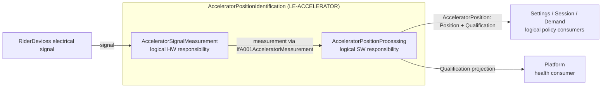

# Accelerator position identification

`AcceleratorPositionIdentification` is the logical end-to-end accelerator function. It receives the rider electrical signal, obtains abstract measurement evidence, and publishes one `AcceleratorPosition` composite containing `Position` and `Qualification`. The decomposition preserves the hardware/software responsibility boundary without selecting a concrete acquisition, transfer, driver, ADC, DMA, circuit, or realized binding.

| Element | Responsibility | Model | Requirements |
| --- | --- | --- | --- |
| `AcceleratorPositionIdentification` (`LE-ACCELERATOR`) | Owns the logical end-to-end composition and external routes. | [SysML](AcceleratorPositionIdentification.sysml) | [System requirements: REQ-SYS-ACC-001, 004–009, 022](AcceleratorPositionIdentification_Requirements.md) |
| `AcceleratorSignalMeasurement` (`LE-ACCELERATOR-HW`) | Converts the unqualified rider electrical observation into abstract measurement evidence. | [SysML](Decomposition/AcceleratorSignalMeasurement.sysml) | [Abstract Hardware requirements: REQ-SYS-ACC-003, 014–016, 023](Decomposition/AcceleratorSignalMeasurement_Requirements.md) |
| `AcceleratorPositionProcessing` (`LE-ACCELERATOR-QUAL`) | Handles measurement evidence and publishes semantic position/rest plus qualification. | [SysML](Decomposition/AcceleratorPositionProcessing.sysml) | [Abstract Software requirements: REQ-SYS-ACC-002, 010–013, 017–021](Decomposition/AcceleratorPositionProcessing_Requirements.md) |

The named members are `signal`, `measurement`, `acceleratorPosition`, and `qualification`. The full `AcceleratorPosition` follows the position route; its `Qualification` is also projected to platform health. Torque mapping, authority, session state, and service-reporting/debug components are outside this decomposition. Physical transfer, accuracy, timing, calibration, and coverage remain unresolved gates for later realization and verification.

The requirements use the [NASA Appendix C writing checklist](https://www.nasa.gov/reference/appendix-c-how-to-write-a-good-requirement/) as a writing basis. Formal System-parent derivation remains separate from related allocation, interface, calibration, caller-time, and open-issue dependencies.

`DEC-STA-001`, `DEC-FLT-002`, and `DEC-TRQ-002` provide decision context; `WS-OI-002`, `WS-OI-003`, `WS-OI-007`, and `WS-OI-010` keep electrical, accuracy, age/skew, response, freshness, and diagnostic gates open. The affected requirements remain Draft pending those values and reference conditions.
