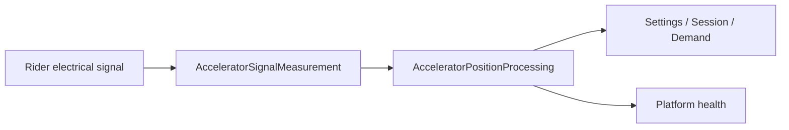

# Accelerator position identification

`AcceleratorPositionIdentification` converts the rider electrical signal into one `AcceleratorPosition` composite. `Position` carries normalized percent, physical-rest status, and actual measurement time. `Qualification` carries usability and source-health attribution.

| Element | Responsibility | Requirements |
| --- | --- | --- |
| `AcceleratorPositionIdentification` (`LE-ACCELERATOR`) | End-to-end composition and policy/health routes. | [System requirements](AcceleratorPositionIdentification_Requirements.md) |
| `AcceleratorSignalMeasurement` (`LE-ACCELERATOR-HW`) | Electrical observation to measured evidence. | [Hardware requirements](Decomposition/AcceleratorSignalMeasurement_Requirements.md) |
| `AcceleratorPositionProcessing` (`LE-ACCELERATOR-QUAL`) | Measurement to position/rest, measurement time, and qualification. | [Software requirements](Decomposition/AcceleratorPositionProcessing_Requirements.md) |

Settings, Session, and Demand consume the composite; Platform consumes its Qualification projection. The lower acquisition boundary may retain raw source, rank, sequence, and compiled binding information, but those details are not exported by `Position`.

Electrical mapping and rest characterization, sensor compatibility, error, freshness, response, and recognized-fault characterization remain Draft acceptance work. This model selects no ADC, DMA, driver, circuit, queue, or Session-latch implementation.
