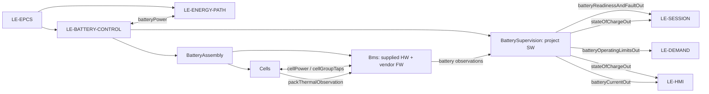

# BatteryControl

`LE-BATTERY-CONTROL` is an `LE-EPCS` child. It contains the owner-built physical `BatteryAssembly` (`Cells` plus the supplied `Bms` hardware and vendor firmware) and the vehicle-host `BatterySupervision` project software, realized by the existing BmsLink and BatteryProtection contributions. The energy wrapper is retired; `LE-ENERGY-PATH` is an EPCS sibling. BatteryControl supplies qualified battery information and capability; it does not own motor-controller enforcement or vehicle-wide physical protection.

## Decomposition and required information contracts

| Port or internal exchange | Mandatory members / consumer | Requirement source |
|---|---|---|
| `batteryPower` ↔ `LE-ENERGY-PATH` | physical pack energy only; energy-path protection and generated/residual energy remain EPCS responsibility | [BMS-004](Battery_Integration.md#req-sys-bms-004), [BMS-005](Battery_Integration.md#req-sys-bms-005), [BMS-009](Battery_Integration.md#req-sys-bms-009) |
| `batteryReadinessAndFaultOut` → `LE-SESSION` | `startupChecksPassed`; recognized thermal and battery faults, each with common `FaultRecognitionOrder` (zero unrecognized; a nonzero tie uses the existing Session rule). BatterySupervision reports all recognized faults; Session selects the existing earliest fault and no battery-local suppression is introduced. No inference of isolation. | [BMS-005](Battery_Integration.md#req-sys-bms-005), [BMS-006](Battery_Integration.md#req-sys-bms-006), [BMS-007](Battery_Integration.md#req-sys-bms-007), [HMI-007/018](../../../../Requirements/System_Requirements/HMI_and_Auxiliary_Continuity.md#req-veh-hmi-007), [HMI-011](../../../../Requirements/System_Requirements/HMI_and_Auxiliary_Continuity.md#req-veh-hmi-011), [HMI-013](../../../../Requirements/System_Requirements/HMI_and_Auxiliary_Continuity.md#req-veh-hmi-013) |
| `batteryOperatingLimitsOut` → `LE-DEMAND` | independent discharge and regenerative-charge branches: `Qualified`, `Permitted`, `CurrentLimitAmperes`, `RestrictionActive/Reason`; plus SOC positive-propulsion permission, torque limit in N·m and speed limit in km/h. The reached-10% latch remains BatterySupervision retention, not a port member. Demand retains demand arbitration and downstream enforcement remains external. | [BMS-001](Battery_Integration.md#req-sys-bms-001), [BMS-008](Battery_Integration.md#req-sys-bms-008), [BMSPOL-001](Decomposition/Battery_Capability_Policy.md#req-sys-bmspol-001), [SOC-001–006](Battery_SOC.md) |
| `stateOfChargeOut` → `LE-HMI`, `LE-SESSION` | qualified `actualStateOfChargePercent` and validity; HMI consumes the display members in HMI-002/003/009 and Session consumes its low-charge-warning state. | [BMS-003](Battery_Integration.md#req-sys-bms-003), [HMI-002/003/009](../../../../Requirements/System_Requirements/HMI_and_Auxiliary_Continuity.md) |
| `batteryCurrentOut` → `LE-HMI` | qualified `signedPackCurrentAmperes` and validity; positive is charging and negative is discharging. Display fallback never authorizes control. | [BMS-003](Battery_Integration.md#req-sys-bms-003), [HMI-020](../../../../Requirements/System_Requirements/HMI_and_Auxiliary_Continuity.md#req-veh-hmi-020) |
| Bms → BatterySupervision read requests/responses | read-only UART `0x03`, `0x04`, `0x05`, carrying `recordKind` (Basic/FourteenGroup/Identity), `packVoltageVolts`, `packCurrentAmperes`, `stateOfChargeCandidatePercent`, `cellGroupVoltagesVolts[14]`, `availableTemperatures` (`probeIdentifier`, `temperatureCelsius`), `protectionPathState` (`protectionFlags`, charge/discharge-path enabled) and `socSourceEvidence` (reported remaining/full capacity, series count, identity/version). Basic `0x03` supplies its version evidence; identity evidence is separately read through `0x05`. | [BMS-003](Battery_Integration.md#req-sys-bms-003), [BMSIF-001](Decomposition/BMS_Information.md#req-sys-bmsif-001) |
| Cells ↔ Bms `cellPower` / `cellGroupTaps` | pack energy and 14-group taps exchange for BMS supervision and balancing | [CELL-001](Decomposition/Cell_Bank.md#req-sys-cell-001), [BMS-002](Battery_Integration.md#req-sys-bms-002), [BMS-003](Battery_Integration.md#req-sys-bms-003) |
| Cells → Bms `packThermalObservation` | available pack thermal observation; count and availability do not prove all individual-cell or thermal fault coverage | [BMS-003](Battery_Integration.md#req-sys-bms-003) |

`BatteryMeasurements` projects these source fields only after fieldwise validity, consistency, qualification and age evidence; each qualified value has an independently named validity indication. Its host-computed update-reference evidence is never a manufactured BMS measurement timestamp. Raw BMS RSOC/capacity is only `stateOfChargeCandidatePercent` until BMS-002/BMS-003 and the SOC policy qualify actual SOC. A UART value, FET/path bit, or project-software limit does not prove physical isolation or protection; the EPCS duties in BMS-004/005/009 remain applicable.
