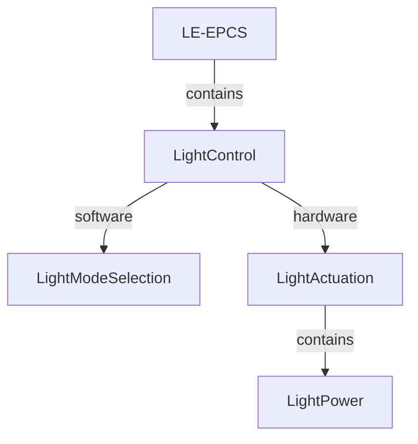

# LightControl

`LE-LIGHT-CONTROL` composes software [LightModeSelection](Decomposition/LightModeSelection_Requirements.md) (`LE-LIGHT-POLICY`) and logical hardware [LightActuation](Decomposition/LightActuation_Requirements.md) (`LE-LAMP-HW`). `LightPower` (`LE-LIGHT-POWER`) is contained within LightActuation and owns its lighting supply. [Canonical system requirements](LightControl_Requirements.md) remain the end-to-end contract; vehicle electrical power is an external boundary supplied through Energy/EnergyPath.

EnergyPath → Energy → LightControl → LightActuation → LightPower; LightPower supplies LightActuation internally.

| Port | Meaning | Owner |
| --- | --- | --- |
| `runningLightStateIn` | Qualified HMI normal-light request; its retained request is internal selection state | LightModeSelection |
| `brakeLeverStateIn` | Qualified mechanical lever state from InputQualification | LightModeSelection |
| `electricalBrakingStateIn` | Actual motor-braking state from Traction | LightModeSelection |
| `lightModesOut` / `lightModesIn` | Front On/Off and rear Off/Dim/Full intent | LightModeSelection → LightActuation |
| `vehicleElectricalPowerIn` | Distributed vehicle electrical energy at the LightControl boundary | Energy / EnergyPath → LightControl |
| `vehicleElectricalPowerOut` | Electrical energy delegated by Energy/EnergyPath toward lighting supply | Energy / EnergyPath |
| `lightingPowerOut` | Lighting power provided by LightPower to the owned actuation path | LightPower → LightActuation |
| `frontIlluminationOut` / `rearIlluminationOut` | Physical illumination results | LightActuation |

Actual electrical braking includes rollback retardation and constant-speed descent motor braking; it is not merely negative torque or battery charging. Physical continuity remains conditional on protection under [AUX-001](../../../../Requirements/System_Requirements/HMI_and_Auxiliary_Continuity.md#req-veh-aux-001).
