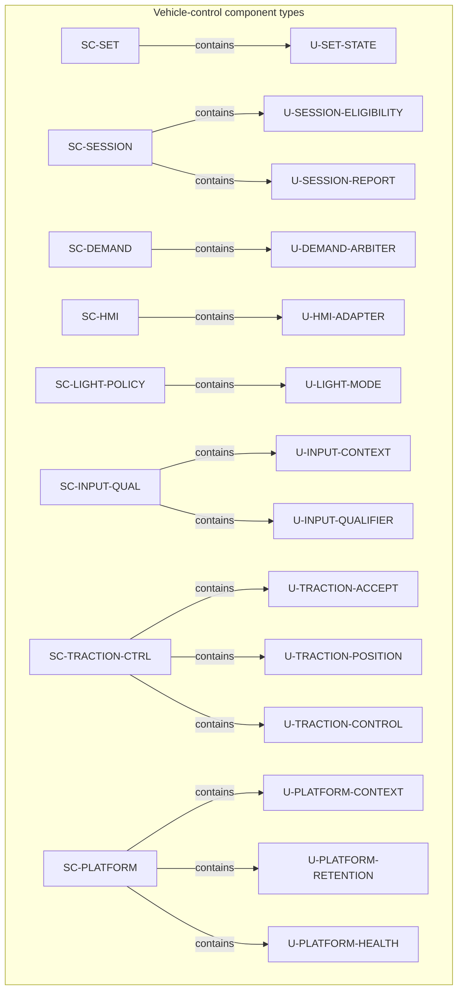
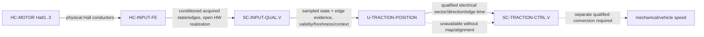
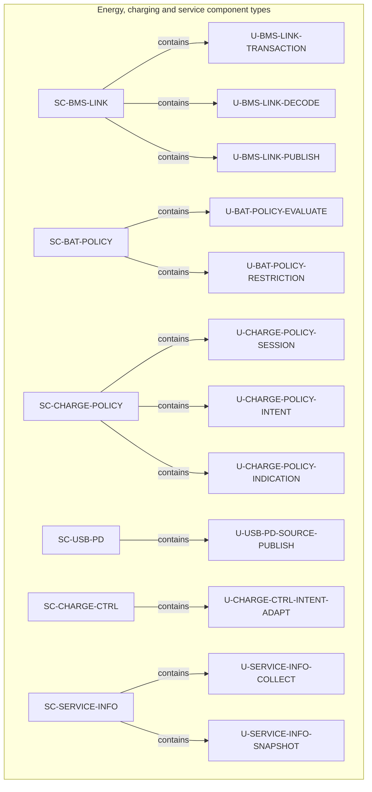
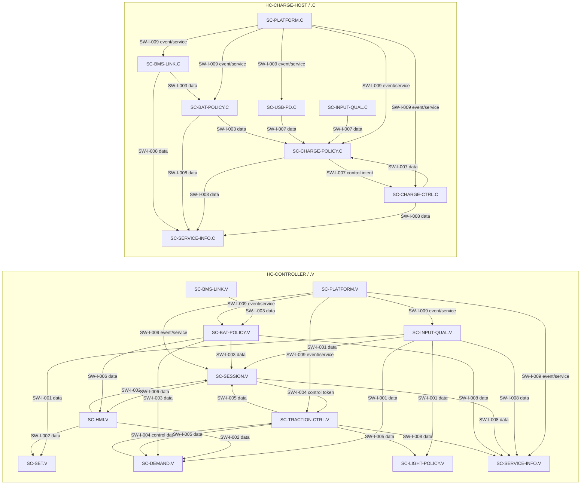

# DD-003 — Static software architecture views

**Released 1.1 — 2026-09-14; DD-003-R1.1.** These controlled views include Hall-position/FOC composition and make the released [ARCH-003 component and host allocation](../Architecture/ARCH-003_Software_Architecture.md) and the unit catalogues in [DD-001](DD-001_Software_Unit_Design.md) and [DD-002](DD-002_Energy_Charging_Unit_Design.md) easier to inspect.

## Scope and notation

`SC-*` identifies a component *type*. `U-*` identifies a project unit owned by exactly one component type. A `contains` edge is static composition only; it does not mean that a unit is an independently deployable process. `.V` and `.C` identify independent vehicle and charger *instances* of a shared component type. A solid labelled edge is a local interface direction and semantic kind; it is neither a physical signal path nor proof of a physical state. Supplied `SC-BMS` and `SC-VD18MT` remain opaque and deliberately have no project-unit decomposition.

The detailed behaviour, qualification, reset, retention and physical-acceptance limits remain authoritative in DD-001, DD-002 and ARCH-003. In particular, a charge-enable intent, a requested zero, a command, or an output observation is not proof of physical charging, protection or output.

## Static component-to-unit composition

### Vehicle-control domain

### Hall evidence and traction interpretation

The solid path is an allocated information path, not a pinout or control law. Static state may support sector at rest after map/alignment qualification; it does not prove speed/standstill. The dashed speed path requires pole-pair and loaded-wheel calibration evidence and is not selected here.

`U-INPUT-*`, `U-TRACTION-ACCEPT` and `U-PLATFORM-*` refine approved ASW allocations. `U-TRACTION-POSITION` and `U-TRACTION-CONTROL` are approved Hall interpretation and selected-FOC-control refinements; MCD-001 owns the concrete current/PWM law. They do not select final acquisition circuitry, host resources, retention integrity, diagnostics or physical output behaviour.

### Energy, charging and service domain

`U-USB-PD-SOURCE-PUBLISH` and `U-CHARGE-CTRL-INTENT-ADAPT` refine approved ASW allocations. `SC-CHARGE-POLICY.C` alone owns detached charging-session state; `SC-BAT-POLICY.V` alone owns `reached10%`. Neither fact creates shared state between hosts.

## Deployment and instance boundaries

This view separates static type composition above from the local realization instances below. Each host has its own reset context and state; repeated type names do not imply a live connection, state transfer or restoration between hosts.

```mermaid
flowchart LR
    subgraph HV[HC-CONTROLLER — vehicle host]
        direction TB
        VV[Vehicle instances]
        V1[SC-SET.V]
        V2[SC-SESSION.V]
        V3[SC-DEMAND.V]
        V4[SC-HMI.V]
        V5[SC-LIGHT-POLICY.V]
        V6[SC-INPUT-QUAL.V]
        V7[SC-TRACTION-CTRL.V]
        V8[SC-BMS-LINK.V]
        V9[SC-BAT-POLICY.V]
        V10[SC-SERVICE-INFO.V]
        V11[SC-PLATFORM.V]
    end
    subgraph HC[HC-CHARGE-HOST — detached mobile adapter]
        direction TB
        CV[Charger instances]
        C1[SC-BMS-LINK.C]
        C2[SC-BAT-POLICY.C]
        C3[SC-CHARGE-POLICY.C]
        C4[SC-SERVICE-INFO.C]
        C5[SC-INPUT-QUAL.C]
        C6[SC-CHARGE-CTRL.C]
        C7[SC-USB-PD.C]
        C8[SC-PLATFORM.C]
    end
    HV ~~~ HC
```

No edge crosses the two host boundaries: the detached charger has no requirement for the vehicle controller, VD18MT or a network connection. `SC-BMS` remains supplied opaque firmware on `HC-BMS`; `SC-VD18MT` remains supplied opaque firmware in the VD18MT assembly within `HC-RIDER`. Neither receives a `U-*` node in these views.

## Static local-interface view

The interface names and endpoint scopes below are the released `SW-I-*` contracts from ARCH-003. Flow labels distinguish **data** publications, **control** token/data, and **event/service** interactions. They do not introduce timing, protocol, electrical or physical semantics.

`SW-I-008` is representative in the drawing: ARCH-003 defines it from all local producers to `SC-SERVICE-INFO`; the omitted producer edges are not a change in endpoint scope. `SW-I-009` likewise applies to all local components; selected edges keep the view legible. The full interface table, including `SW-I-006` light inputs/intent and `SW-I-007` endpoint detail, remains in [ARCH-003](../Architecture/ARCH-003_Software_Architecture.md#typed-software-interactions).

## Cross-view use

Read this document with [DD-001](DD-001_Software_Unit_Design.md) for vehicle-policy unit semantics, [DD-002](DD-002_Energy_Charging_Unit_Design.md) for energy/charging/service semantics, and [DD-004](DD-004_Dynamic_Software_Architecture_Views.md) for documented interaction and state examples. The released ARCH-003 deployment diagram is the source allocation view; this document restates it at unit and instance resolution for detailed-design review only.
