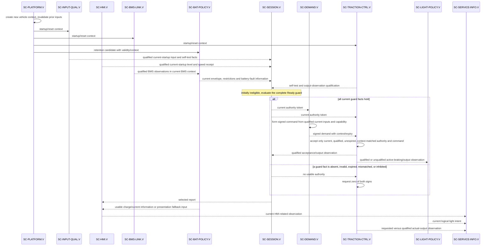
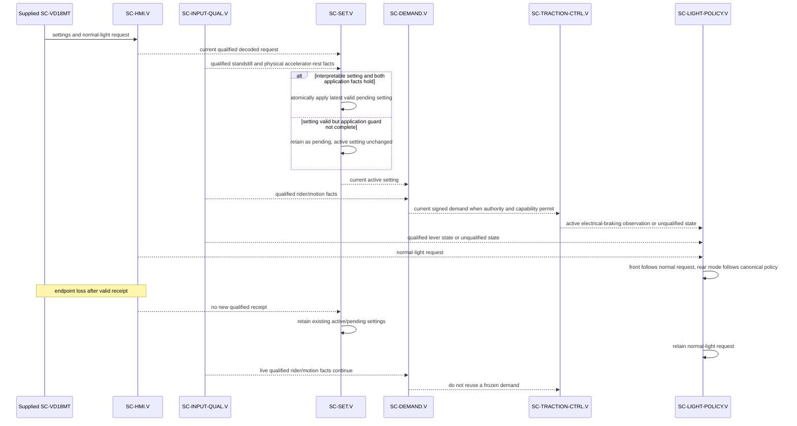
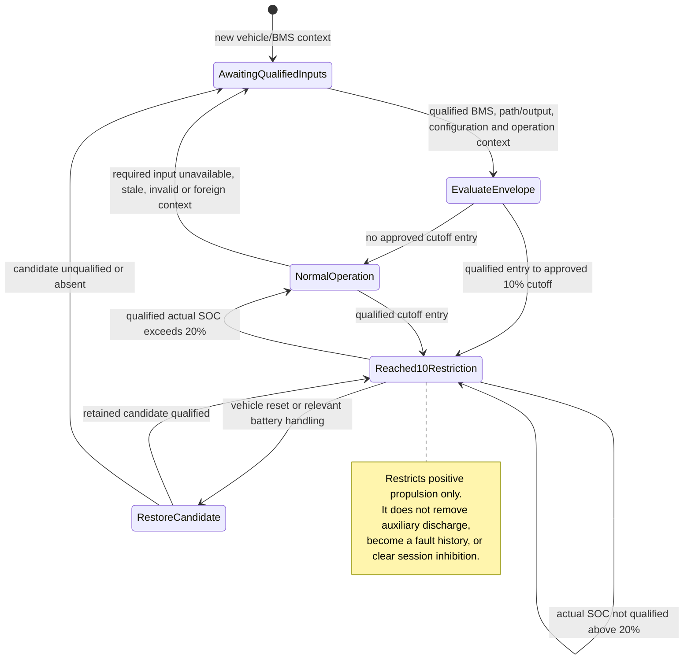
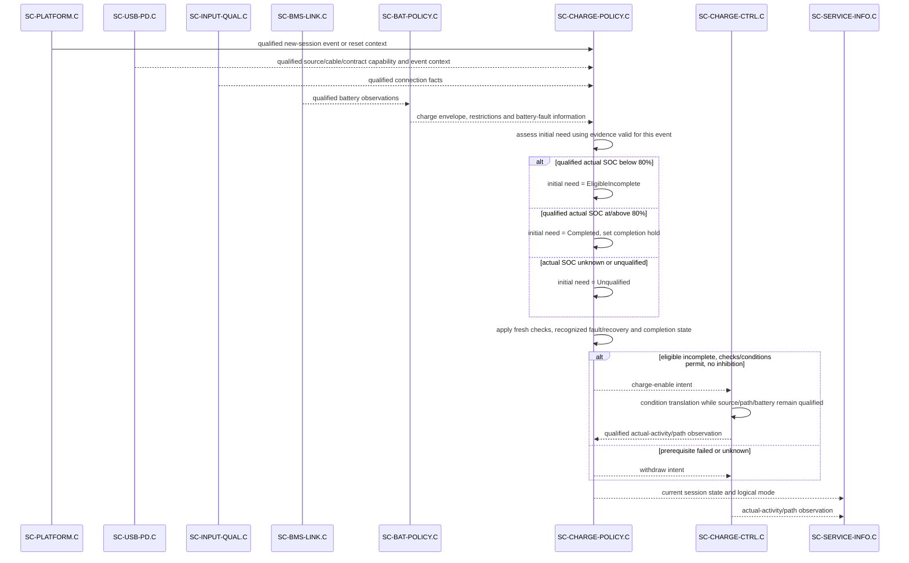
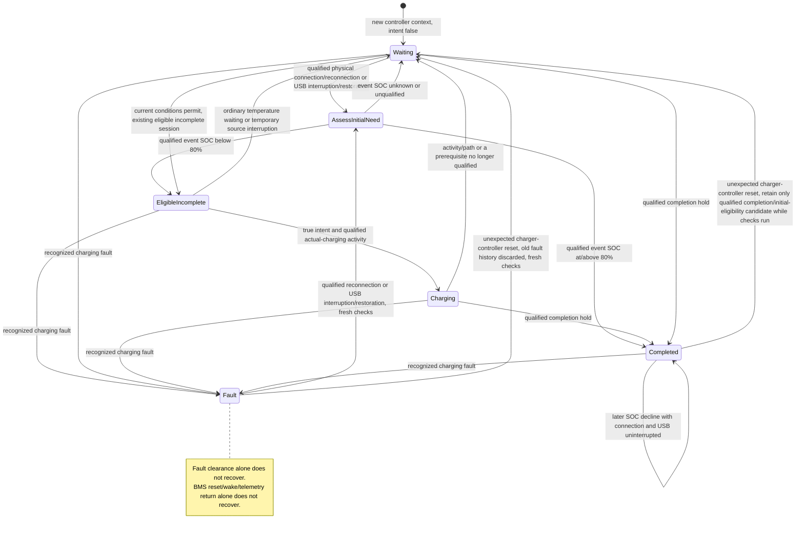

# DD-004 — Dynamic software architecture views

**Released 1.0 — 2026-09-13; DD-004-R1.0.** These views supplement the canonical unit designs in [DD-001](DD-001_Software_Unit_Design.md) and [DD-002](DD-002_Energy_Charging_Unit_Design.md), and the static component, deployment and interface views in [DD-003](DD-003_Static_Software_Architecture_Views.md).  They do not introduce components, state, timing, algorithms, APIs, physical behavior, or verification evidence.  A sequence is one documented interaction example, not an exhaustive state model.

## Scope and reading rules

Every received or published record retains value, qualification/freshness and producer/reset context.  In these diagrams, `qualified` means the consumer may use the stated fact under its canonical contract; it never means a physical condition is proved.  An intent, command, acknowledgement, zero request, or logical light/status mode is software intent.  `actual-output` and `actual-activity/path` are qualified observations; their physical truth, response and protection remain system acceptance work.

The diagrams cover all 14 ARCH-003 project component roles.  `.V` and `.C` are independent instances: they do not share runtime state, reset context, retention, or a live vehicle-to-charger connection.  Supplied BMS and VD18MT firmware are shown only as external participants where their boundary helps explain the interaction.

## Vehicle startup, Ready and command acceptance

This is an example of the successful path after a fresh vehicle context.  The full Ready guard remains [REQ-SYS-STA-001](../Requirements/System_Requirements/Power_Startup_and_Faults.md#req-sys-sta-001): simultaneous standstill and physical accelerator rest, current-startup accelerator/brake and VD18MT setting qualification, trustworthy actual SOC, required temperature information, passing required self-tests, no current-session inhibition and applicable permissives.  Before that guard and separate traction acceptance, neither torque sign is authorized.

`SC-TRACTION-CTRL.V` requesting zero does not prove zero physical torque or protection.  `SC-SERVICE-INFO.V` only assembles producer-tagged current observations and cannot grant authority or clear inhibition.

## Settings application, HMI loss and lighting feedback

The following interaction separates current VD18MT receipt from retained settings and current rider/traction evidence.  Loss after a valid receipt retains valid active/pending settings and the normal-light request; it neither freezes torque nor creates authority.  Missing current-startup receipt still blocks Ready.

The rear logical mode can be Full for an actuated lever, active electrical braking, or either unqualified fact; it is otherwise Dim for normal request On and Off for Off.  This is logical intent, not lamp output or visible-light evidence.

## Battery capability, reset and retained operating restriction

This state view is intentionally limited to `SC-BAT-POLICY.V` ownership of the retained `reached10%` propulsion restriction.  It is not a BMS state model and does not retain battery-fault history.  `SC-BMS-LINK` requalifies observations after host startup, recognized BMS reset, or required-source qualification loss; a BMS wake/short interruption alone does not by itself clear a justified unexpired record.

`SC-BMS-LINK.V` publishes accepted observations only; rejected frames do not refresh them.  `SC-BAT-POLICY.V` keeps charge and discharge envelopes distinct, withholds a dependent permission when a required contribution is unavailable, and reports normal restrictions separately from recognized battery faults.  A newly available envelope cannot authorize torque, clear `SC-SESSION.V` inhibition, or bypass charging-session state.

## Detached charging: event ordering, intent and actual activity

This sequence shows the canonical serialization for a qualified physical connection/reconnection or qualified USB interruption/restoration: new-session identity first, then observation qualification/fresh checks, fault/recovery, completion, and finally intent/indication.  An enable intent or control acceptance is not evidence of physical transfer; Charging requires true intent and qualified actual-charging activity.

`SC-USB-PD.C` and `SC-CHARGE-CTRL.C` hold no charging-session, completion, or fault history.  Their reset makes their outputs unavailable until requalified and is not itself a new session or recovery.  `SC-SERVICE-INFO.C` has no control return path.

## Detached charging-session states and reset distinctions

The state diagram captures `SC-CHARGE-POLICY.C` session ownership.  The status mapping is Fault first, then Waiting for pending checks/state qualification, then Completed for qualified completion hold, then Charging only with true intent and qualified active-charging evidence; otherwise Waiting.  It omits source-profile, numerical, electrical, timing, and physical-indicator design.

An ordinary source interruption retains an eligible incomplete session and can resume automatically when conditions permit.  By contrast, qualified USB interruption/restoration is a new-session event: it supersedes restored state and reassesses initial need.  Unexpected charger-controller reset discards fault history/previous fault indication, forces intent false and shows Waiting during fresh checks; it may restore only a qualified completion/initial-eligibility candidate.  A service-readout reset affects neither this state nor vehicle state.

## Traceability and limits

The vehicle views elaborate `SW-I-001` through `SW-I-006` and `SW-I-008/009`; the charging views elaborate `SW-I-003`, `SW-I-007` through `SW-I-009`.  They retain the ownership and constraints of [ARCH-003](../Architecture/ARCH-003_Software_Architecture.md), especially its [startup sequence](../Architecture/ARCH-003_Software_Architecture.md#startup-and-critical-sequences), [retention rules](../Architecture/ARCH-003_Software_Architecture.md#retained-restriction-and-reset-state), and [typed interactions](../Architecture/ARCH-003_Software_Architecture.md#typed-software-interactions).

The source is intentionally underdefined on event-detection mechanism, ordering across simultaneously arriving external observations, timing bounds, physical activity/path evidence, self-test scope, retained-state integrity, and diagnostic coverage.  These views use only the documented serialized order within `SC-CHARGE-POLICY.C`; they do not resolve the remaining external ordering or qualification gates.
