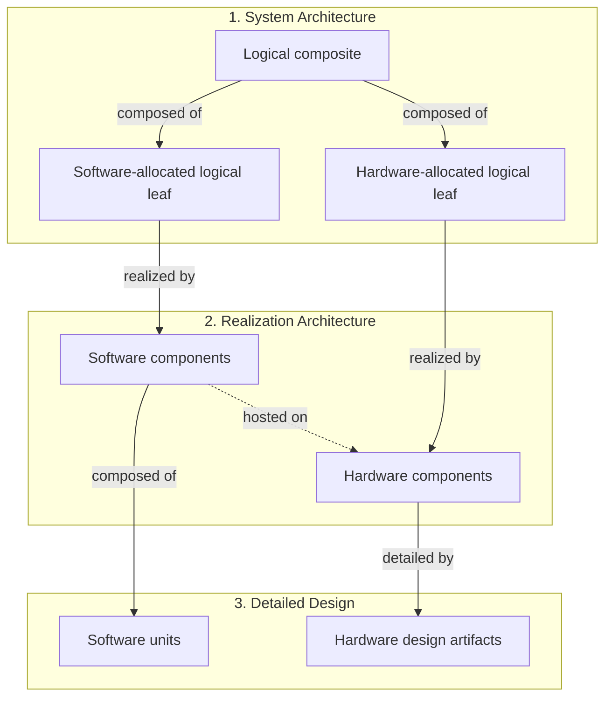
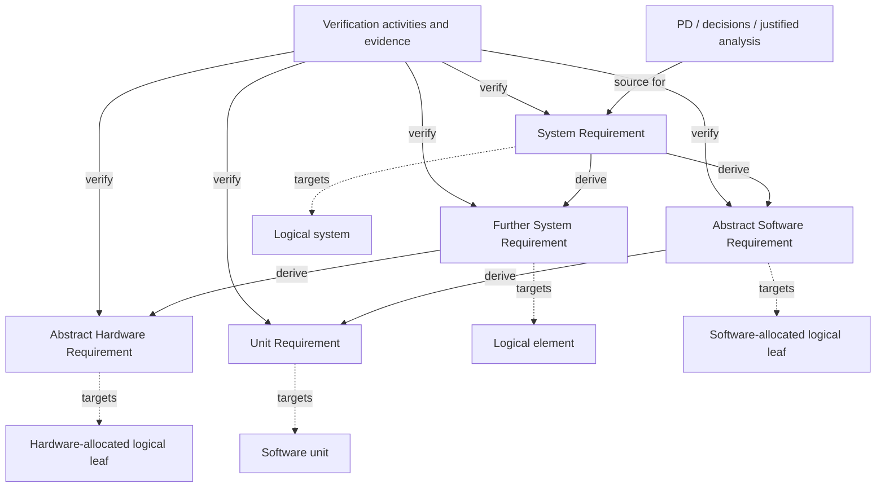

# REQ-001 — Requirements

**Working successor to released REQ-001-R2.0 — 2026-09-14.** The current Draft catalogue is maintained by its canonical records and does not assert a maintained aggregate count. R2.0 remains the historical release; later Draft traction-interconnection/runtime refinements are unreleased. Full allocation, physical verification and technical acceptance remain open. [Release history](README.md#release-and-history).

Sources: [PD-001](../../README.md), [item definition](ID-001_Item_Definition.md), [decisions/open issues](DEC-001_Decisions_and_Open_Issues.md), released [architecture](../Architecture/SystemArchitecture/ARCH-001_System_Architecture.md#release-identity) and [safety goals](../Safety/HARA-001_Hazard_Analysis.md#release-record). [BAT-001](../Battery/BAT-001_Selected_Pack_and_BMS.md) is the canonical selected battery/BMS record. Source/release snapshots remain in Git.

## Requirement types and architecture model

The owner selected this project model on 2026-09-09. Requirement type records abstraction and realization allocation; functional, performance, interface and environmental classifications are separate attributes. A requirement remains verifiable at its stated level even when called abstract.

| Type | Responsible target | Permitted requirement derivation |
|---|---|---|
| **System Requirement** | Logical system or logical element; realization may remain open | May derive further System Requirements, Abstract Software Requirements or Abstract Hardware Requirements |
| **Abstract Software Requirement** | Logical leaf whose responsibility is allocated entirely to software | Software allocation of a System Requirement; may derive Unit Requirements |
| **Abstract Hardware Requirement** | Logical leaf whose responsibility is allocated entirely to hardware | Hardware allocation of a System Requirement; traced to hardware design and verification |
| **Unit Requirement** | One software unit in detailed design | Derived only from Abstract Software Requirements; additional design/interface rationale is recorded as a source |

Abstract Software and Abstract Hardware Requirements remain **system-level requirements**. Allocation is an explicit architecture decision, not inferred from words such as control, sensor or mechanical, from an ID prefix, or from historical implementation. An unchanged System Requirement may be reclassified after allocation, preserving its ID and existing parent/source chain; this requires neither a duplicate child nor an artificial parent. Derive a new child only for a distinct obligation. Unit Requirements can have multiple Abstract Software parents.

Architecture has three layers:

1. **System Architecture:** interconnected logical elements, recursively composed of logical elements. Composite elements may contain both hardware- and software-allocated leaves.
2. **Realization Architecture:** interacting software and hardware components. Each allocated logical leaf is realized by one or more components of its selected kind; components may realize several logical responsibilities. Software components identify their hardware hosts.
3. **Detailed Design:** software components decomposed into units. Each unit has one owning software component. Hardware also has detailed design and verification, maintained with its Hardware Architecture; it does not acquire software Unit Requirements.

Hardware includes electrical, electronic, mechanical, thermal and electromechanical realization. Supplied/retained components retain interface, integration and acceptance obligations without requiring invented internal units. Software component responsibilities, interfaces and timing/resource contracts remain explicit even where requirement derivation goes directly from Abstract Software to Unit Requirements.

The diagrams define relationship kinds, not a selected scooter implementation. Hardware detail in layer 3 remains managed with the Hardware Architecture. Document interfaces at every applicable layer: endpoints, direction, exchanged information/energy/material, conditions and governing requirements. Interface requirements target a responsible element or common integrating parent; endpoint obligations are derived where needed.

### Current logical targets

These identifiers retain the responsibility scopes from [ID §2.1](ID-001_Item_Definition.md#21-vehicle-item-and-functional-development-system). The approved requirement targets and allocation bindings are registered in [ARCH-001](../Architecture/SystemArchitecture/ARCH-001_System_Architecture.md); the component architecture is separately released as ARCH-001/002/003-R1.0; full allocation B and implementation acceptance remain open. These assignments do not change the item boundary.

| Target | Scope and current assignment |
|---|---|
| `LE-VEH` | Complete modified vehicle and its defined handling interfaces; default scope for `REQ-VEH-*`; explicit cluster/row targets override it |
| `LE-EPCS` | Vehicle EPCS functional development system, including energy storage/supervision and installed regeneration; default scope for `REQ-SYS-*`; explicit cluster/row targets override it |

Vehicle and EPCS are overlapping scope views, not an asserted parent/child pair: the same pack remains in vehicle-project scope across installed operation, removal/refitting and detached storage. Architecture development must establish applicable configuration and containment relations explicitly. Cross-cutting obligations may remain at their responsible root or common parent.

## Traceability concept

Requirement derivation is an acyclic graph, independent of architectural composition. Maintain navigable traceability in both directions by stable IDs: forward references link to canonical records; reverse references can be found by searching that ID across the documentation without maintaining duplicate backlink tables. Many children may contribute to a parent and a child may have multiple parents.

| Relationship | Meaning / required record |
|---|---|
| **Source** | Each active requirement identifies its PD obligation, owner decision, fixed interface or justified analysis, retaining source conditions and status |
| **Derived from** | A child identifies its requirement parent(s) and contribution to their obligations; directly sourced top-level System Requirements need no requirement parent |
| **Targets** | Exactly one responsible logical element per System/Abstract requirement, or one detailed-design unit per Unit Requirement; other affected elements are dependencies |
| **Realized by / composed of / hosted on** | Explicit architecture mappings with stable element identities and applicable configurations; none substitutes for requirement derivation |
| **Satisfied by** | Design/component/unit artifacts identify the requirements they are intended to satisfy, with the relevant rationale and coverage; a link alone is no proof |
| **Verified by** | Planned verification identifies requirements and acceptance; executed evidence identifies their revision, configuration, method, results and anomalies |

Arrow labels show direction. Any System Requirement can derive either allocation type; reclassifying an unchanged record preserves its existing trace chain. Record architecture-, interface- and hazard-derived rationale alongside the parent/source chain. Do not invent a requirement parent merely to fill a hierarchy.

Parents remain mandatory after decomposition. Record how children and their interfaces cover the complete parent obligation, including budgets and interactions. Verify the parent at its responsible level using direct evidence or a justified composition argument; passing child tests alone does not establish parent satisfaction. Missing decomposition, realization or acceptance remains assigned open work.

The existing **Sources** column records provenance and related requirements; a cited requirement is **not automatically a derivation parent**. The initial structural migration inferred no requirement parents or realization decisions. Revision 1.6 records the reviewed requirement allocation bindings in ARCH-001; the four unchanged level and four speed-selection rules are allocated to software and mechanical steering/braking independence to retained hardware. New INT/CTL rows record explicit partial contributions; no software command alone proves its physical parent. [REQ-SYS-STO-001](System_Requirements/Environment_and_Storage.md#req-sys-sto-001) contributes fitted-battery storage energy to [REQ-VEH-ENV-003](System_Requirements/Environment_and_Storage.md#req-veh-env-003). For further children, use the same explicit parent field/column; record design/verification links when those artifacts exist. File metadata supplies shared Type and Target defaults, with any future row exception explicit. Canonical cluster metadata and explicit row targets identify current responsibility, including the approved current requirement allocations. Deferred/Withdrawn rows retain their historical scope only.

Functional contribution trace is a separate relation: [FC-002](../Architecture/FC-002_Function_Trace.md) maps every record to functions or cross-cutting constraints without changing its responsible target. The 12 FSC rows explicitly derive from SG-001-R1.0 goal IDs; existing supporting requirement citations are not additional parents unless named in the Derived from field. A functional-safety or broader-safety role does not change the System Requirement type.

Use one canonical requirement record and one Markdown file per coherent cluster under its type folder. Keep stable per-record anchors when relocating records, update inbound links and the cluster index, and retain status/source/verification qualifications. Unresolved allocation is not closure. PD process obligations, assumptions and exclusions keep their [upstream disposition](REQ-001_Requirements.md#pd-obligation-disposition) without artificial hardware/software descendants.

This is project tailoring; method references are [NASA logical decomposition](https://www.nasa.gov/reference/4-3-logical-decomposition/) and [OMG requirement/allocation relationships](https://www.omg.org/sysml/sysmlv1/).

## Reading and verification rules

The 171 R1.6 active records remain approved, including their Type/Target and explicitly stated allocation bindings. REQ-001-R1.8 additionally approves the nine HSI and retained-mechanics refinements, including their text and planned acceptance. The 12 FSC records remain explicitly **Draft**; their text, planned acceptance and further allocation are outside this release. The ten reclassified records retain their obligations and identities. Approval of these requirements does not establish full architecture B or implementation acceptance. Future changes require controlled revision and applicable owner approval. Upstream obligations and source qualifications remain controlling. `SYS` IDs identify EPCS scope; `VEH` IDs identify complete-vehicle scope. These prefixes identify scope, not stakeholder/system abstraction or hardware/software architecture. PD-001 supplies stakeholder objectives and project constraints; each stable requirement row records its obligation, planned verification, source and unresolved dependencies.

Deferred and Withdrawn rows retain historical IDs/provenance only and impose no current obligation; Withdrawn means superseded by a later owner decision.

**No vehicle verification has been executed for this catalogue.** Methods: `I` inspection, `A` analysis, `T-SYS` system/vehicle test, `T-FI` fault-injection test, `T-SW` software component/interface test. Allocated software also uses component-interface tests against its parent contracts; no such tests have been executed here. Historical tested VD18MT code and terminal-resistance measurements support only their stated interface evidence, not vehicle acceptance. Numerical acceptance values must be derived before verification: standstill/rest/range definitions, torque/speed/SOC/temperature references and uncertainty, available envelopes, curves/gradients, recognition coverage, response bounds and restart observations. An unresolved value is not an assumed tolerance or passed result.

The following shared coverage applies where relevant; row cases add distinguishing observations. These are approved planned verification criteria, not executed evidence, additional rider actions or a selected test/sensing implementation.

| Key | Shared planned coverage |
| --- | --- |
| S — startup | Repeat normal start and unexpected restart, stationary and moving. Withhold each prerequisite alone while others hold; verify no Ready and zero both-sign torque. Establish all together; verify eligibility only under remaining permissives. Distinguish initial unqualified information from recognized fault. Late qualification after fault recognition cannot clear session inhibition. |
| F — fault response/recovery | Exercise each defined detectable fault at startup and during positive, negative and zero demand in applicable levels. Measure recognition/withdrawal against derived finite bounds, even if reporting is masked/unavailable. Restore the condition without restart; valid inputs, standstill, pedal/brake release, level changes, VD18MT return, cleared operating restrictions and repeated passing checks must not release retained torque inhibition. Restart normally/unexpectedly with repaired, persistent, new and overlapping faults: discard old history, run fresh checks/qualification and apply Ready guards or newly recognized inhibition. Independently verify mechanical braking and permitted auxiliaries. |
| H — reporting | Observe transmitted VD18MT error-field byte 5 and separately record selected-unit visible presentation; hexadecimal assignment does not prove literal displayed text. Exercise recognition with no demand, communication absent then restored, ordered/overlapping faults and the defined priorities/ties. Selected session-retained reports survive physical clearance and nonrestart events; restarts select from newly recognized faults. Torque reaction and brake-light release are independent of which code is visible. No simultaneous display of all faults is assumed. |
| L — lighting | Exercise normal on/off, before first valid light command, subsequent communication loss/return and command changes during brake indication. Cover powered pre-Ready, stationary/moving, each/both levers, active electrical braking, invalid brake information, overlapping triggers and Level 0/unavailable regeneration. Only qualified both-released information and qualified absence of active electrical braking permit return to current normal dim/off, even while fault torque/report remain retained. Front follows normal command. Verify brightness, electrical suitability, protection limits, activation/release bounds and front/rear transition timing difference. |
| B — boundaries | Cross each relevant SOC/speed boundary in both directions, including exactly at it, repeated crossings, startup already beyond it and held/changed pedal demand. Distinguish low-SOC recovery, speed recovery, settings guards and remaining overlapping limits. Use qualified references, derived margins and controlled representative conditions. |
| E — torque/envelope | Compare requests and motor-produced wheel torque at equivalent speed, SOC, temperature and overriding limits, across applicable levels. Separate static profile, time response, permitted capability and actual output; measure derived tolerances. Required physical/protection response must not be mistaken for optional comfort shaping. |

## Common interpretation and upstream scope

- Accelerator travel is 0% at physical rest and 100% at full application. Physical rest differs from the provisional 35% virtual neutral for Levels 1–5.
- Positive wheel torque points forward; negative torque points oppositely. Travel direction is separate: forward torque may retard rollback. Slope, mechanical braking and passive drag affect motion independently of commanded torque. Zero command does not promise zero passive drag, generated voltage or physical energy.
- Requested/pending VD18MT settings differ from active settings. Standstill/rest guards concern startup and setting changes, not continued propulsion after Ready. No stationary holding torque does not prohibit deliberate launch.
- Available regenerative capability, accelerator demand and actual torque are distinct. Normal restriction recovery does not freeze actual torque, request braking, release fault inhibition or bypass post-stop powered-forward-travel qualification.
- Abrupt withdrawal is **required** at accepted VD18MT speed cutoffs and the unconditional 40 km/h ceiling. It is **permitted, not mandated**, for shutdown, specified SOC transitions and common faults; finite response/protection limits still apply. No claim of instantaneous physical response follows. The rider uses independent mechanical brakes to control gravity-driven overspeed.
- All stated battery thresholds are actual SOC. Displayed charge instead maps the normal 20–80% window to 0–100%; clamping/unknown-data fallback cannot determine control eligibility.
- Every error-code reporting obligation applies when VD18MT communication is available and that report is selected under the applicable priority rules. Recognized faults still cause their physical response when reporting is unavailable or masked.
- A riding restart discards past-failure history and applies fresh Ready qualification. This selects behavior, not a memory implementation.
- The PD obligation disposition below retains upstream obligations and identifies their active elaboration and remaining derivation; PD source status and conditions remain controlling.

## Requirement clusters

The current working inventory includes the Draft interconnection/runtime refinement chain `REQ-SYS-HSI-009`, `REQ-SYS-TRQHW-002`, `REQ-SYS-INP-002`, `REQ-SYS-TRQIO-001`, `REQ-SYS-TRQEX-001`, `REQ-SYS-PHASE-IF-001`, `REQ-SYS-SUPPLY-IF-001`, `REQ-SYS-PLT-002`, `REQ-SYS-PLT-CAL-001` and their named Unit children. They refine released parent contracts and do not alter their bodies. The current working architecture allocates separate analog acquisition, signal-interface, Hall-position, phase, supply and platform-calibration owners; its status remains Draft pending the stated verification and acceptance gates. Historical R2.0 remains the unchanged 228-record snapshot (211 Approved, 12 Draft, 3 Deferred, 2 Withdrawn); R1.9 remains 223 records (206 Approved, 12 Draft, 3 Deferred, 2 Withdrawn); the historical R1.8 197-record release also remains unchanged. The 11 approved safety goals remain canonical in SG-001-R1.0 and are counted separately. Detailed-design approval does not close electrical, physical, timing, resource, retention, protection, diagnostic or verification gates.

| Type | Folder | Records |
|---|---|---:|
| System Requirement | [System_Requirements](System_Requirements) | 177 |
| Abstract Software Requirement | [Abstract_Software_Requirements](Abstract_Software_Requirements) | 28 |
| Abstract Hardware Requirement | [Abstract_Hardware_Requirements](Abstract_Hardware_Requirements) | 6 |
| Unit Requirement | [Unit_Requirements](Unit_Requirements) | 28 |

| System Requirement cluster | IDs / scope | Records |
|---|---|---:|
| [Vehicle qualification](System_Requirements/Vehicle_Qualification.md) | `REQ-VEH-MAS-*`, `REQ-VEH-PERF-*`, `REQ-VEH-RNG-*`, `REQ-VEH-MEC-*` | 8 |
| [Battery handling](System_Requirements/Battery_Handling.md) | `REQ-VEH-BAT-*`, `REQ-SYS-BAT-*` | 6 |
| [Battery SOC and continued auxiliary operation](System_Requirements/Battery_SOC.md) | `REQ-SYS-SOC-*`, `REQ-VEH-PWR-*` | 11 |
| [Power, startup and fault handling](System_Requirements/Power_Startup_and_Faults.md) | `REQ-SYS-PWR-*`, `REQ-SYS-STA-*`, `REQ-SYS-FLT-*`, `REQ-SYS-TMP-*` | 24 |
| [Assist levels, torque, regeneration and speed limits](System_Requirements/Rider_Control.md) | `REQ-VEH-LVL-*` (Withdrawn), `REQ-SYS-TRQ-*`, `REQ-SYS-REG-*`, `REQ-SYS-SPD-001/003/006/007/009`, `REQ-VEH-WLK-*` | 28 |
| [Brake interface and priority](System_Requirements/Brake_Interface_and_Priority.md) | `REQ-SYS-BRK-*` | 12 |
| [HMI indications and lighting](System_Requirements/HMI_and_Lighting.md) | `REQ-VEH-HMI-*`, `REQ-VEH-AUX-*`, `REQ-VEH-LGT-*` | 30 |
| [Environment and storage](System_Requirements/Environment_and_Storage.md) | `REQ-VEH-ENV-*`, `REQ-SYS-STO-*` | 5 |
| [Built battery and supplied BMS](System_Requirements/Battery_Integration.md) | `REQ-SYS-BAT-002`, `REQ-SYS-BMS-*` | 10 |
| [Energy and protection](System_Requirements/Energy_and_Protection.md) | `REQ-SYS-ENE-*` | 4 |
| [Interface qualification](System_Requirements/Interface_Qualification.md) | `REQ-SYS-INT-*` | 4 |
| [System hardware/software interface](System_Requirements/System_Hardware_Software_Interface.md) | Approved in R1.8 `REQ-SYS-HSI-001`–`008`; Draft `REQ-SYS-HSI-009` traction interconnection | 9 |
| [Service and durability](System_Requirements/Service_and_Durability.md) | `REQ-VEH-DUR-*`, `REQ-VEH-SVC-*`, `REQ-SYS-SVC-*` | 4 |
| [Riding safety functions](System_Requirements/Riding_Safety_Functions.md) | Draft `REQ-SYS-FSC-001`, `REQ-VEH-FSC-002/003/004` | 4 |
| [Energy safety functions](System_Requirements/Energy_Safety_Functions.md) | Draft `REQ-SYS-FSC-005/006/007/008` | 4 |
| [Lifecycle safety functions](System_Requirements/Lifecycle_Safety_Functions.md) | Draft `REQ-VEH-FSC-009/010/011/012` | 4 |

| Allocation cluster | Type / scope | Records |
|---|---|---:|
| [Settings and control policy](Abstract_Software_Requirements/Settings_and_Control_Policy.md) | Abstract Software; four level and four speed-selection rules plus four partial command/information/reporting refinements | 12 |
| [Retained mechanical control](Abstract_Hardware_Requirements/Retained_Mechanical_Control.md) | Abstract Hardware; approved steering/mechanical-braking independence plus R1.8-approved physical-integration refinement | 3 |
| [Fixed cell bank](Abstract_Hardware_Requirements/Cell_Bank.md) | Abstract Hardware; fixed 14S5P composition | 1 |
| [Traction-control hardware](Abstract_Hardware_Requirements/Traction_Control_Hardware.md) | Abstract Hardware; three low-side current channels, local DC-link observation and independent fault shutdown allocation | 2 |
| [BMS information](Abstract_Software_Requirements/BMS_Information.md) | Abstract Software; selected-unit UART read-data qualification and acceptance contract | 1 |
| [Battery capability policy](Abstract_Software_Requirements/Battery_Capability_Policy.md) | Abstract Software; battery envelopes, operation-specific restrictions and fault information | 1 |
| [Lighting policy](Abstract_Software_Requirements/Lighting_Policy.md) | Abstract Software; current-session normal request and front/rear logical mode arbitration | 1 |
| [Service information](Abstract_Software_Requirements/Service_Information.md) | Abstract Software; current diagnostic, qualification and identity information with producer/reset context | 1 |
| [Detailed-design interface allocations](Abstract_Software_Requirements/Detailed_Design_Interface_Allocations.md) | Approved allocations plus Draft regular-DMA/Hall, platform-binding and fast-traction runtime refinements | 9 |
| [Control Unit Requirements](Unit_Requirements/Control_Unit_Requirements.md) | Approved Unit Requirements plus Draft regular-DMA/Hall, platform-binding and fast-traction runtime refinements | 15 |
| [Battery Unit Requirements](Unit_Requirements/Battery_Unit_Requirements.md) | Approved Unit Requirements; BMS, battery policy and service units | 7 |

## PD obligation disposition

Traceability review originated against released **PD-001-R1.1** on 2026-09-09 and is cross-checked against **PD-001 Draft1.2** on 2026-09-11. The earlier short upstream list omitted explicit dispositions for several constraints, interfaces and process duties. This table assigns all 317 defined PD records, retaining their IDs through the fixed-pack/temperature revision: 141 objective/use/performance/constraint/exclusion/mission/life records, 17 interfaces, 46 state/scenario/misuse records, and 113 assumptions/derived values/open issues. These are record counts, not a count of mandatory product requirements; retired constraints and provisional inputs retain their status. Obligatory prose and unnumbered tables are covered by the cited PD sections. The 2026-09-11 inventory/range expansion found all 317 IDs covered, with no missing or nonexistent disposition ID; requirements are a separate catalogue (171 active, 5 inactive). This establishes routing completeness; requirement approval follows the owner release, while executed compliance remains unproven.

**E** = elaborated in the named approved requirements, for the stated aspect only. **U** = retained explicitly as an upstream requirement, constraint, permission or qualified input; its complete PD wording/conditions remain controlling. **D** = remaining requirements, acceptance criteria or evidence assigned to the named downstream activity/issue and milestone. E does not mean the parent is fully satisfied or verified, and D does not suspend a current obligation. All active elaborations cited below are approved in this release, subject to their recorded qualifications. Deferred and Withdrawn records provide no active coverage. The source-document Draft statuses do not become released statuses through this disposition.

Dominik remains the default owner. Existing PD issue gates control dependent commitments; the reviewed routing, elaborations and milestones are approved with their existing open dependencies. This traceability review adds no product behavior, sensing/control realization or verification result.

**Draft editorial successor note, 2026-09-14:** the EVM and WeAct wording in the single `Custom development and OEM boundary` ledger row below reflects current working PD Draft references and links the Draft integration records. It is outside the released REQ-001-R2.0 snapshot: no Approved requirement record, status, count, parent chain or historical release claim is changed by this note.

| Topic | PD source | Requirement disposition | Remaining work / milestone |
|---|---|---|---|
| Use and scope | IU-001–002, IU-004, IU-007, IU-009, IU-014; CON-028–029, CON-031; EXC-001–006, EXC-015–016, EXC-026–028; PD §§1,4–5,6.1 | U: one-off private-property vehicle, rider/context and excluded functions; retain IU-002's assumption status. | Scope constraints apply throughout design and use; derive site/operating acceptance before powered tests (OI-010/052/060). |
| Custom development and OEM boundary | OBJ-002; CON-002, CON-011, CON-041–042; EXC-021–022; PD §§5.4–5.5,16 | U: built 14S5P 35E pack, selected SP14S004P14S50A/UART, owner-selected unmodified DRV8300DRGE-EVM traction-board baseline and owner-selected WeAct STM32H723VGT6 vehicle host; develop their vehicle adapter/protection integration and software while excluding OEM compatibility. E: [battery integration](System_Requirements/Battery_Integration.md), [cell-bank allocation](Abstract_Hardware_Requirements/Cell_Bank.md), [traction EVM fit](../Architecture/DRV8300DRGE-EVM/DRV8300DRGE-EVM_Integration_and_Requirements_Fit.md), [allocated traction HSI](../Architecture/DRV8300DRGE-EVM/DRV8300DRGE-EVM_WeAct_STM32H723VGT6_Traction_HSI.md) and [UART software](Abstract_Software_Requirements/BMS_Information.md) elaborate the working selections and integration obligations. | D: system requirements/architecture under OI-040–046, before the corresponding implementation commitments. |
| Retained mechanics and independent braking | OBJ-004; CON-003–004, CON-008, CON-020; PERF-006; EXC-017–018, EXC-024, EXC-030; IF-EPCS-009; PD §§4.5,5.5,10.1 | E: [REQ-VEH-BRK-001](Abstract_Hardware_Requirements/Retained_Mechanical_Control.md#req-veh-brk-001), [REQ-SYS-BRK-002](System_Requirements/Brake_Interface_and_Priority.md#req-sys-brk-002)–003 cover brake independence/additivity. U: steering, grip/travel, clearance, wheel, bell, kickstand and donor preservation remain mandatory. E: [REQ-VEH-MEC-001](Abstract_Hardware_Requirements/Retained_Mechanical_Control.md#req-veh-mec-001) and [REQ-VEH-MEC-002](System_Requirements/Vehicle_Qualification.md#req-veh-mec-002) elaborate steering independence and preserved mechanical/handling functions. | D: retained-part/interface acceptance and mechanical validation (OI-010–012/052), before high-speed tests; fundamental redesign requires scope approval. |
| Motor integration | OBJ-006; CON-005; EXC-019–020; IF-EPCS-001; PD §§10.2,11.3,12 | U: installed motor/axle integration and compatibility; reported ratings remain characterization inputs. [Hall position](Abstract_Software_Requirements/Detailed_Design_Interface_Allocations.md#req-sys-trqpos-001), [FOC control](Abstract_Software_Requirements/Detailed_Design_Interface_Allocations.md#req-sys-trqctl-001), [traction hardware](Abstract_Hardware_Requirements/Traction_Control_Hardware.md#req-sys-trqhw-001) and [MCD-001](../Motor/MCD-001_Hall_Sensored_FOC_Technical_Design.md) allocate the selected realization without approving physical capability. | D: OI-011/013–025/043/048; resolve pinout, phase/Hall/NTC characteristics, wheel reference, thermal/torque envelope, generated-energy effects and 40-km/h voltage headroom before dependent sizing/powered tests. |
| HMI selection and protocol reuse | OBJ-007–008; CON-006, CON-012–013; EXC-023; IF-EPCS-006; PD §§10.3–10.4,11.4 | E: [REQ-SYS-LVL-001](Abstract_Software_Requirements/Settings_and_Control_Policy.md#req-sys-lvl-001)–004, [REQ-SYS-SPD-002/004/005/008](Abstract_Software_Requirements/Settings_and_Control_Policy.md#speed-selection-and-application) and [REQ-SYS-SPD-001/003/006/007/009](System_Requirements/Rider_Control.md#vd18mt-speed-settings-and-walk-assistance-exclusion), [REQ-SYS-FLT-001](System_Requirements/Power_Startup_and_Faults.md#req-sys-flt-001)–002, active [REQ-VEH-HMI-001](System_Requirements/HMI_and_Lighting.md#req-veh-hmi-001)–020, [REQ-VEH-WLK-001](System_Requirements/Rider_Control.md#req-veh-wlk-001) and lighting rows. U: selected unit and proven protocol reuse; no required Ready/pending indication or cross-boot restoration. | D: OI-026–032 / WS-OI-008–009; selected-unit compatibility, current/charge encoding, validity and timing before HMI interface/integration verification. |
| Accelerator interface | CON-007; IF-EPCS-007; PD §§10.5,11.5 | E: [REQ-SYS-STA-001](System_Requirements/Power_Startup_and_Faults.md#req-sys-sta-001)–003, [REQ-SYS-TRQ-001](System_Requirements/Rider_Control.md#req-sys-trq-001)–010, [REQ-SYS-FLT-003](System_Requirements/Power_Startup_and_Faults.md#req-sys-flt-003). U: selected Hall handle, supply/reference/signal and return behavior. | D: OI-033–036 / WS-OI-002–003; electrical/mechanical/environmental characterization before sensing/profile acceptance. |
| Fixed shared brake interface | CON-010; IF-EPCS-002–003; PD §§10.6,11.6 | E: active [REQ-SYS-BRK-001](System_Requirements/Brake_Interface_and_Priority.md#req-sys-brk-001)–012, [REQ-SYS-FLT-004](System_Requirements/Power_Startup_and_Faults.md#req-sys-flt-004), [REQ-VEH-HMI-005](System_Requirements/HMI_and_Lighting.md#req-veh-hmi-005) and [REQ-VEH-LGT-008](System_Requirements/HMI_and_Lighting.md#req-veh-lgt-008). U: fixed coded Y/network, left/front and right/rear association; intrinsic aliases/shared dependencies. | D: OI-037 / WS-OI-012; derive sensing, tolerances and diagnostic coverage before interface qualification. Deferred [REQ-SYS-BRK-009](System_Requirements/Brake_Interface_and_Priority.md#req-sys-brk-009)–011 do not establish coverage. |
| Lighting | CON-009; IU-011; IF-EPCS-004–005; PD §§10.7,11.7 | E: [REQ-VEH-LGT-001](System_Requirements/HMI_and_Lighting.md#req-veh-lgt-001)–008, [REQ-VEH-AUX-001](System_Requirements/HMI_and_Lighting.md#req-veh-aux-001). U: retained lighting suitability; daylight/darkness remains an assumed operating context. | D: OI-038–039 / WS-OI-016; electrical/dimming compatibility, visibility/environment and response acceptance before lighting integration verification. |
| Predictable rider control | OBJ-003; IU-010; PD §§2,6.5,9 | E: [REQ-SYS-STA-001](System_Requirements/Power_Startup_and_Faults.md#req-sys-sta-001)–007, [REQ-SYS-TRQ-001](System_Requirements/Rider_Control.md#req-sys-trq-001)–010, active [REQ-SYS-BRK-001](System_Requirements/Brake_Interface_and_Priority.md#req-sys-brk-001)–012, [REQ-SYS-REG-001](System_Requirements/Rider_Control.md#req-sys-reg-001)–011, [REQ-SYS-SPD-002/004/005/008](Abstract_Software_Requirements/Settings_and_Control_Policy.md#speed-selection-and-application) and [REQ-SYS-SPD-001/003/006/007/009](System_Requirements/Rider_Control.md#vd18mt-speed-settings-and-walk-assistance-exclusion) and [REQ-SYS-FLT-001](System_Requirements/Power_Startup_and_Faults.md#req-sys-flt-001)–011. | U: predictable behavior throughout the validated domain. D: remaining response bounds, permissives, fault coverage and safety refinement under WS-OI-001–003/005–007/010/013/015/017–019 before corresponding functional/safety requirements baseline. |
| Power state transitions | VS-002–004, VS-009; PD §§9,11.4 | E: [REQ-SYS-PWR-001](System_Requirements/Power_Startup_and_Faults.md#req-sys-pwr-001)–003 and [REQ-SYS-STA-001](System_Requirements/Power_Startup_and_Faults.md#req-sys-sta-001)–007 define power-button control, moving shutdown, zero pre-Ready torque and fresh startup. | U: no commanded propulsion while off; shutdown is not service isolation. D: WS-OI-007–008 / OI-029/045; completion, residual/generated energy and power-lock/supply behavior before power-interface/safety acceptance. |
| External connectivity independence | CON-016–017; EXC-007, EXC-025; PD §§13,17 | U: steering/braking and essential propulsion/fault handling cannot depend on phone/cloud/wireless/internet; unrelated connectivity is excluded before core completion. | D: check independence during architecture and failure-response review (OI-044/049), before architecture baseline. Approved [REQ-SYS-ENE-004](System_Requirements/Energy_and_Protection.md#req-sys-ene-004) makes the local-independence acceptance explicit. |
| Mass, payload and packaging | IU-005–006; CON-034, CON-055; PD §6.2, DV-012 | U: total/vehicle/payload limits and full fitted/carried equipment accounting, counting any carried equipment once. E: [REQ-VEH-MAS-001](System_Requirements/Vehicle_Qualification.md#req-veh-mas-001) elaborates the mass/payload envelope and weighing acceptance. | D: DEC-MAS-001 permits the PD DV-012 assumed mass budget for current requirements/architecture planning. Verify complete configured mass and uncertainty before final mass acceptance / mass-dependent physical tests under OI-012/040/053/062; no separate stripped/non-pack measurement prerequisite or payload reduction. Other fit/integration gates remain. |
| Mission and range qualification | OBJ-001; IU-003; CON-001, CON-035–036; RJ-001, RQ-001; EXC-033; PD §§6.3–6.6,12 | U: complete mission and new-battery range conditions, provisional trace/sensitivities, SOC window/auxiliaries and no initial regeneration credit. Fixed-profile in-window regeneration may count in qualification. E: [REQ-VEH-RNG-001](System_Requirements/Vehicle_Qualification.md#req-veh-rng-001) elaborates the 70 km range outcome and acceptance basis in active Level 5 under DEC-RNG-001. | D: DEC-RNG-002 fixes the nominal RQ-001 riding sequence in Level 5; reproducible-trace tolerances, energy accounting and test acceptance under OI-053/058–059/061/063 / WS-OI-013/017, before dependent simulation/capacity baseline. RJ-001 energy/power remains separate; riding behavior rows alone do not prove range. |
| Flat speed and acceleration | PERF-001–002; CON-038; EXC-011; PD §6.5 | E: [REQ-SYS-SPD-002/004/005/008](Abstract_Software_Requirements/Settings_and_Control_Policy.md#speed-selection-and-application) and [REQ-SYS-SPD-001/003/006/007/009](System_Requirements/Rider_Control.md#vd18mt-speed-settings-and-walk-assistance-exclusion) govern cutoffs/recovery. U: loaded speed achievement, accepted just-below-40 tolerance and average 0–20 acceleration under full reference conditions. E: [REQ-VEH-PERF-001](System_Requirements/Vehicle_Qualification.md#req-veh-perf-001)–002 elaborate acceleration and sustained-speed acceptance in active Level 5 under DEC-PERF-001. | D: OI-018/052/054 / WS-OI-013/015; derive/validate the Level 5 test setup, reference-condition tolerances, measurement uncertainty and performance acceptance before the performance requirements baseline; retained-mechanical suitability gates high-speed tests. Speed limiting and torque mapping alone do not satisfy speed/acceleration performance. |
| Hill launch, climb and descent | PERF-003–005; CON-037; PD §6.5 | E: [REQ-SYS-TRQ-010](System_Requirements/Rider_Control.md#req-sys-trq-010), [REQ-SYS-REG-003](System_Requirements/Rider_Control.md#req-sys-reg-003)–004/009–011 and [REQ-VEH-BRK-001](Abstract_Hardware_Requirements/Retained_Mechanical_Control.md#req-veh-brk-001) address relevant behavior. U: launch, sustained ascent and mechanically controlled descent with unavailable regeneration. E: [REQ-VEH-PERF-003](System_Requirements/Vehicle_Qualification.md#req-veh-perf-003)–005 elaborate distinct acceptance cases, with climbing/launch in active Level 5 under DEC-PERF-001. | D: OI-018/025/048/052/054 / WS-OI-006/013/017; Level 5 climbing/launch setup, launch/rollback acceptance, hill SOC points versus restricted entry, sustained capability and descent/brake-duty verification before performance baseline/powered hill tests. |
| Environment and adverse-weather allowance | OBJ-012; PERF-007–008; IU-008, IU-012–013, IU-017; CON-039–040, CON-053; EXC-008–010, EXC-034; PD §§8.1–8.4 | E: [REQ-SYS-TMP-001](System_Requirements/Power_Startup_and_Faults.md#req-sys-tmp-001)–002 and fault/startup rows govern recognized temperature faults. U: full riding/storage domain, in-limit reductions, controllability and visible incompatibilities. E: [REQ-VEH-ENV-001–003](System_Requirements/Environment_and_Storage.md#riding-and-outdoor-storage) elaborate ambient/surface capability and both mandatory 168 h storage configurations (DEC-ENV-001) with DEC-STO-002 normal-full entry for the fitted pack; 20 mm snow remains provisional. | D: OI-025/036/038–039/052/055–057; derive traction/obstacle, ingress, salt, solar, shock/vibration, ESD/EMC and exposure acceptance before dependent environmental qualification/use. |
| SOC, regeneration and battery presentation | OBJ-014; CON-048–050; EXC-032; PD §6.6 | E: [REQ-SYS-SOC-001](System_Requirements/Battery_SOC.md#req-sys-soc-001)–009, [REQ-SYS-REG-001](System_Requirements/Rider_Control.md#req-sys-reg-001)–011, [REQ-VEH-HMI-002](System_Requirements/HMI_and_Lighting.md#req-veh-hmi-002)–003/009–014 and [REQ-VEH-PWR-001](System_Requirements/Battery_SOC.md#req-veh-pwr-001)–002. U: complete vehicle SOC policy, including normal-full/RQ-001 entry at no more than 80%, the 90% regenerative ceiling, balancing compatibility, range accounting and separate all-load protection. [REQ-SYS-STO-001](System_Requirements/Environment_and_Storage.md#req-sys-sto-001) contributes fitted-battery storage energy/protection from DEC-STO-002 normal-full 80% entry; [REQ-SYS-STO-002](System_Requirements/Environment_and_Storage.md#req-sys-sto-002) adds the owner-confirmed 672 h detached duty, dry indoors at 15–30 °C, with the same normal-full entry. Higher/lower entry outside qualified normal full is excluded from both duration qualifications. | D: OI-041/048/053/061–063 / WS-OI-005/017–019; estimator, regenerative charge acceptance, margins and energy/protection continuity before BMS/control/capacity baselines. |
| Normal battery handling and retention | IU-018; CON-045; IF-EPCS-008; PD §§5.1,6.7,9,11.8 | E: [REQ-VEH-BAT-001](System_Requirements/Battery_Handling.md#req-veh-bat-001)–002 and [REQ-SYS-BAT-001](System_Requirements/Battery_Handling.md#req-sys-bat-001). U: mechanical access, normal user handling, retention, mounts/routing/heat transfer and environmental integration. E: [REQ-VEH-BAT-003–004](System_Requirements/Battery_Handling.md#req-veh-bat-003) elaborate normal access without workshop disassembly and retention of the seated/locked pack; [REQ-SYS-BAT-003](System_Requirements/Battery_Handling.md#req-sys-bat-003) adds accessible-interface protection through handling and exposed-bay states. | D: OI-012/045–046/062 / WS-OI-007/011; touch/exposed-energy, connector/lock and abnormal-handling acceptance before dependent interface/integration acceptance or enclosure changes; cell selection and initial fit are settled. |
| Electrical/thermal safety and compatibility | OBJ-005; CON-018–019, CON-021; PD §§3.3,5.5,8.3,11,16 | E: riding inhibition/auxiliary behavior in [REQ-SYS-FLT-001](System_Requirements/Power_Startup_and_Faults.md#req-sys-flt-001)–011, [REQ-SYS-TMP-001](System_Requirements/Power_Startup_and_Faults.md#req-sys-tmp-001)–002 and [REQ-VEH-AUX-001](System_Requirements/HMI_and_Lighting.md#req-veh-aux-001). U: broader battery/distribution, short-circuit, overheating, insulation and mixed-voltage hazards; reported limits are not proof. | D: OI-027–030/040–046/049; hazard/safety concept and compatible protection/distribution/interfaces before dependent architecture/design/energization. Approved [REQ-SYS-ENE-001–003](System_Requirements/Energy_and_Protection.md#energy-and-protection-requirements) add all-load and residual/generated-energy obligations; the fault envelope and protective responses still require derivation. |
| Maintenance, diagnostics and life | OBJ-009; IU-019–020; CON-027; DUR-001; EXC-012; PD §§6.6–6.7,9,11.8 | E: [REQ-SYS-STA-001](System_Requirements/Power_Startup_and_Faults.md#req-sys-sta-001)–007 and [REQ-SYS-FLT-005](System_Requirements/Power_Startup_and_Faults.md#req-sys-flt-005)–011 cover fresh startup/no persistent fault history. U: inspection/service, competent-maintainer assumption and 50,000 km/5-year first-reached life target. | D: OI-045–047/049–050; service/isolation and diagnostic procedures/interfaces, maintenance/replacement criteria and durability acceptance before service/verification planning and use. Approved [service/life requirements](System_Requirements/Service_and_Durability.md#service-acceptance-contract) define configuration-specific return checks and life/replacement accounting; [SVCIF-001](Abstract_Software_Requirements/Service_Information.md#req-sys-svcif-001) partially allocates diagnostic presentation. DEC-LIFE-001 fixes commissioning origin and permitted replacement; transport, physical access, limits and coverage remain open. |
| Evidence-based vehicle release | OBJ-010; CON-024–026, CON-047; PD §§5.5,18 | U: staged powered development, donor/electrical/vehicle verification, no critical unresolved safety anomaly in commuter use, and identifiable as-built configuration. | D: integration/verification/anomaly/release work, including OI-010/052/060; enforce stage gates before energization/high-speed tests and vehicle-use release. PD release is not vehicle release. |
| Process, traceability and change control | OBJ-011; CON-014–015, CON-022–023, CON-046; EXC-013–014; PD §§1,3,14–16,18–20 | U: proportionate traceability, configuration, change impact/re-verification, accurate source/status distinctions and no compliance/ASIL claim. | Apply throughout each workstream/baseline; unresolved issues retain owner, evidence, affected decision and closure milestone. Historical release limitations remain WS-OI-014. |
| Resources and test-site suitability | IU-021; CON-054; PD §5.6 | U: confirmed access and permitted purchases/no fixed deadline; equipment availability/ratings and additional facilities are not assumed verified. | D: OI-009/060; establish task readiness before use and record expenditure before commitment. |
| External actors and interfaces | IF-EXT-001–004, IF-EXT-006–007; PD §§5,11.1 | U: rider, surface, surroundings, weather, parking and service interactions; ID-001 §2.2 traces every interface. | D: compatibility and acceptance in the relevant motor/mechanical, environmental, HMI and service rows above; interfaces stay within the defined item/project boundaries. |
| States, scenarios and misuse | Vehicle states/scenarios and foreseeable misuse retained in PD §§7,9 | E: startup/power/handling/riding/fault records in the [clusters](REQ-001_Requirements.md#requirement-clusters). U: service, detached-storage and complete vehicle scenario/misuse consideration; ID-001 §6 records lifecycle coverage. Context does not promise full function during misuse. | D: hazard analysis and response/protection/verification derivation under OI-045/048–049/062–063 and related WS issues before corresponding safety/design baselines. |
| Historical constraints | CON-032–033; PD §13 | Historical only: retired by the PD; no active requirement is restored. | Keep IDs/provenance. Private-property scope and retained-part suitability remain covered above. |
| Assumptions, derived values and open issues | ASM-001–037, DV-001–013, OI-001–063; PD §§12,14–16 | Retain each source's status, including closed/retired entries. Provisional values and worked examples are not new mandatory product targets; obligations to qualify inputs and respect gates remain upstream. DEC-ENV-001 confirms ASM-031 fitted/removed configuration coverage; DEC-STO-002 fixes normal-full entry. Quantitative acceptance and ASM-030 snow depth retain their qualifications. | D: use each OI's existing required evidence and closure gate; confirm/restrict/reject assumptions before dependent commitments. Model-specific duties are assigned in mission, mass, motor, energy and storage rows. |

The release review found traceability omissions, addressed by these explicit dispositions; it found no PD obligation in the reviewed scope left without elaboration, upstream retention or assigned derivation. This closes the coverage check only. Approved elaborations above do not close the associated engineering or verification issues.

## Remaining derivation

The linked open items own unresolved parameters, detection/self-test coverage, interfaces, protection/auxiliary boundaries, recognition-order resolution and qualification evidence. DEC-FLT-010 defines deterministic ties; DEC-TMP-003 resolves discharge-only cell temperatures; DEC-LGT-002/FLT-011 settle unqualified-state lighting and lost actual-output information. The released definition includes battery configuration, qualification/event/UART contracts, host-loss protection, reset domains and [qualification evidence/feasibility calculations](System_Requirements/Vehicle_Qualification.md#qualification-evidence-rules); numerical bounds and physical verification remain at their recorded gates. The independent VD18MT reference defines device encoding; BAT-001 owns selected battery/BMS data. Vehicle policy remains in these project records.

## Controlled parameters and acceptance gates

Full allocation, numerical contracts, protection mechanisms, component/host acceptance and vehicle verification remain open. Each calibration or acceptance artifact shall identify its governing requirement IDs, source, configuration, units/reference, bound/tolerance, uncertainty, method, status and controlling issue. A proposed value is not an effective configuration or verification result.

| Group / trace | Required definition and derivation | Latest controlling gate |
|---|---|---|
| Motion and rider input: WS-OI-001/002/012/015 | Loaded 16-inch-wheel reference, standstill/direction/rest thresholds, four-state brake envelope, uncertainty and input age. Preserve the fixed passive interface; derive sensing separately | Input/control requirements acceptance; required characterization before sensing/profile and speed qualification |
| Torque/profile: WS-OI-003/006 | Use the approved normalized-shape/linearity acceptance and separate static endpoints from dynamic response and operating caps. Define calibrated curves, regenerative gradients, positive resumption, common taper onset with level-specific shapes and physical tolerances; 35% neutral remains provisional | Functional requirements/profile acceptance and validation gate before dependent release |
| End-to-end timing: WS-OI-007/010/015/016 | Bound recognition, qualification, transport, policy execution and physical output/indication response. Use the speed-error/rise/delay bound and worst-case contributing stages; distinguish required abrupt cutoffs from permitted abrupt withdrawal | Corresponding functional/protection/interface baseline; no assumed historical parser timeout or formal FTTI |
| SOC/energy/temperature: WS-OI-005/017–019, OI-041/061/063 | Qualified references, uncertainty and finite residual transfer; prove 80/90% ceilings and 20/10% behavior against actual SOC. Use BAT-001 configuration-derivation constraints and DEC-TMP-003 temperature applicability; derive integrated margins/thermal coverage, severe low-SOC torque/speed caps and post-cutoff/storage budgets | Battery/BMS/regenerative-control integration acceptance and storage qualification; fixed cell selection is settled; low-SOC caps remain validation selected |
| HMI/lighting: WS-OI-008/009/016 | Actual electrical identity, update/rounding/current validity, selected-code visibility and tie resolution; rear dim/full compatibility, DEC-LGT-002 startup/unknown-state output and visibility/response | HMI/lighting integration acceptance; no new pending/regen-availability indication |
| Service: OI-041/045/047/049/050 | Task inventory and power/isolation conditions, current diagnostic schema/transport, effective configuration correspondence, permitted changes, loading/update bounds and configuration-specific return acceptance | Service/interface and architecture acceptance; SVCIF-001 allocates presentation only, not diagnostic coverage or physical access |
| Performance/range: OI-052–054/059 | Exact trace, mass/grade/wind/temperature/SOC tolerances, just-below-40 sustained band/duration, hill-launch response/rollback and mechanical-descent effort/fade | Performance requirements baseline and dependent simulation/capacity gates; qualified mechanics before high-speed/hill tests |
| Environment/storage/life: OI-050/055/056/062/063 | Snow/traction/contamination and mechanical/EMC exposure severity, duty cycles, contact/retention loads, fitted/detached normal-full entry tolerance, charge budget and post-storage acceptance; life duty, wear/replacement and maintenance criteria | Corresponding environmental/life requirements and enclosure/storage/service gates. Owner kept 20 mm snow provisional |

Required physical inputs are not fabricated from reported component ratings. Explicit mass planning assumptions under DEC-MAS-001 are permitted until their stated acceptance gate; they are not measured evidence. The [feasibility ledger](System_Requirements/Vehicle_Qualification.md#coupled-feasibility-ledger-planning-evidence) identifies the measurements/models still needed. The 19 open workstream issues retain parameter, analysis, design/test/use, historical-evidence and allocation-review work; their count is not a measure of requirements-release completeness. Any later evidence contradicting an assumption or obligation requires impact review and controlled refinement before the affected commitment.
