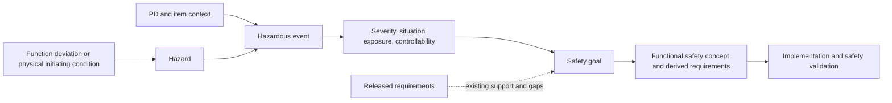

# HARA-001 — Hazard analysis and risk assessment

**Draft vehicle baseline — 2026-09-16.** The row-level source analysis is preserved for the installed vehicle and supplied pack, including individually scoped energy, handling and protection events.
| Attribute | Value |
|---|---|
| Revision / status | **Draft vehicle successor — 2026-09-16.** Source safety records retain HARA-001-R1.0 provenance; this vehicle-scoped working baseline remains under project control. |
| Item | Modified BMW X2City vehicle and its one supplied removable pack during fitted riding, regeneration, handling, storage and service; external adapter operation is outside this item. |
| Input snapshot | `ac43704a3b814143734ee614a1d8c7a50d398c6d`: released REQ-001-R1.6; supporting PD1.2, ID1.1, DEC1.5, ARCH0.2 and BAT0.1 retain their separate Draft statuses |
| Outputs | 11 hazards, 34 vehicle-applicable hazardous events with individual qualitative risk rationale and [11 vehicle safety goals](SG-001_Safety_Goals.md) |
| Authority | Dominik reviewed the hazard analysis and safety goals and instructed release on 2026-09-12. [Release scope and authority](#release-record) apply; PD CON-014/015 retain the tailored process and no formal ASIL/compliance claim. |

## Method and scope

This is the project's **tailored concept-phase analysis**, not a completed ISO 26262 conformity assessment. ISO 26262-3:2018 addresses the concept phase and hazards arising from E/E malfunctions; hazards such as fire or electrical exposure enter its scope when caused by those malfunctions. Nominal performance and purely mechanical/chemical origins require the broader assessment mandated by PD §3.3. [ISO Part 3](https://www.iso.org/standard/68385.html)

Part 12 provides motorcycle adaptations. Its existence does not establish applicability or a controllability classification for this standing scooter. No passenger-car or motorcycle ASIL table is applied to it by analogy. The publicly available sources below support the method; access to the complete applicable standard and an agreed conformity/tailoring basis would be needed for a formal assessment. [ISO Part 12](https://www.iso.org/es/contents/data/standard/06/96/69605.html)

For each function, consider absence, unintended presence, wrong sign/magnitude, early/late/intermittent output and failure to stop. Combine the resulting item-level hazard with an operating situation and exposed persons. Assess injury severity, exposure to that situation and the persons' opportunity to avoid harm, then derive a goal. NHTSA's published concept-phase application illustrates this chain; its vehicle classifications and safety goals are not transferred here. [NHTSA, DOT HS 812 575, §§5–6](https://www.nhtsa.gov/sites/nhtsa.gov/files/documents/13501_812575_electricpowersteeringreport.pdf#page=54)

**Risk convention:** the event rows give qualitative severity (**S**), situation exposure (**E**) and controllability (**C**) with reasons. They are engineering judgments, not ISO S/E/C classes, failure probabilities or an ASIL/QM assignment. No event is dismissed as acceptable because a fault is believed rare. Intended daily riding establishes repeated exposure; storage establishes sustained exposure. Frequency of particular traffic, weather and misuse conditions is not measured. No numeric risk score or residual-risk acceptance is inferred.

Every retained event requires goal treatment. A grave outcome is retained where the stated collision, fire or exposure mechanism supports it; severity is not automatically reduced for low vehicle speed, private ownership or the absence of passengers. The analysis does not credit proposed E/E protections, passing startup checks, the BMS label, an error display, or the owner's expectation of rare shutdown as proven mitigation. Retained mechanical brakes are part of the item: their existence is recognized, but their effectiveness against a malfunction and rider transition time remain unverified. No human action is credited during unattended storage or to stop a developing indoor thermal event.

**Descriptor legend:** “Potentially fatal” retains a plausible lethal collision, fall, fire or exposure mechanism in that row; “serious” covers substantial nonfatal injury, while “contact burns” identifies a local injury whose extent needs exposure limits. “Repeated/recurrent” means the situation occurs in normal trip/charge duties; “sustained” covers unattended storage; “foreseeable/unknown frequency” makes no numerical exposure assertion. “Little response time”, “unproven” and “no dependable interception” describe specific limitations on the exposed person avoiding harm; they are not ordered risk classes or claims that every occurrence causes harm.

**Scope labels:** `EE` identifies malfunction of an E/E function; `B` identifies broader product safety, nominal-behavior interaction or physical misuse; `EE+B` explicitly retains both causal routes. An input/communication fault is a cause, and an error code is an observation; neither is itself a vehicle-level hazard. Events sharing an outcome are grouped only where the situation, harm and risk rationale remain applicable. Goal grouping does not discard a constituent event.

## Analysis basis

The source [PD](../../README.md), [item definition](../Requirements/ID-001_Item_Definition.md), [requirements catalogue](../Requirements/REQ-001_Requirements.md), [decisions](../Requirements/DEC-001_Decisions_and_Open_Issues.md) and [battery reference](../Battery/BAT-001_Selected_Pack_and_BMS.md) control detailed limits. This summary defines the combinations used below, without replacing their qualifications.

| Basis | Included conditions / evidence boundary |
|---|---|
| Riding | One adult and luggage; up to 130 kg total reference mass; positive assistance limited to 40 km/h or the lower active limit. Straight travel, turns, evasive movement, stops, deliberate launch and rollback; downhill/external motion can exceed the assist cutoff. All Levels 0–5 are considered even though performance qualification uses Level 5. |
| Surface and climate | Dry/wet/light-snow paved operation at −10…+40°C; winter grip, obstacles and transitions remain to be qualified. The reference 14% climb/descent is included. Ice, excessive grades, overload and damaged tyres remain foreseeable cases outside guaranteed performance. |
| Energy | Installed or removed 14S5P Samsung 35E bank and supplied JBD BMS/UART. Actual-SOC operating policies are not cell-voltage protection limits; displayed charge is not an energy/isolation reference. Cell temperatures, individual group limits, current sharing and measurement uncertainty remain controlling. |
| Transitions | Every normal/unexpected startup; shutdown while moving; speed/SOC/temperature restrictions; separate vehicle-controller and supplied-BMS reset domains; connected but unseated/unlocked pack; regenerative energy is constrained by the fitted pack charge-acceptance envelope. |
| Storage / service | Fitted outdoor storage 168 h at −15…+40°C or exposed empty bay; detached dry indoor storage 672 h at 15…30°C. Battery duration qualification starts at normal full 80% actual SOC. Off, isolated, test-energized and externally rotated-wheel service states are distinct. |
| A-HARA-001 — provisional context | Include routine darkness and nearby pedestrians/vehicles without assured segregation. Private-property permission is not separation evidence. No separate factual confirmation was supplied. The reviewed release retains this broad analysis envelope; HA-OI-001 tracks context confirmation. |
| A-HARA-003 — conservative assessment | Credit neither guaranteed helmet/protective clothing nor exceptional rider skill. Include bystanders with no ability to predict the scooter's malfunction. No separate factual confirmation was supplied. The reviewed release retains this no-credit assumption; equipment or skill would require an explicit, justified assessment before being credited. |

Release accepts A-HARA-001/002/003 as conservative analysis assumptions, not verified facts about actual use. A later answer narrowing use changes exposure assumptions only after impact review; it does not remove foreseeable misuse automatically. These assumptions add analysis cases, not new approved operating permissions. No hazardous riding, thermal or fault-injection experiment is authorized by this document.

## Hazard register

Hazards describe potential sources of harm at the item/person interface; the event register supplies the necessary situation and initiating behavior.

| ID | Hazard | Harm mechanism |
|---|---|---|
| HZ-001 | Unintended or excessive forward propulsion / motor-assisted speed | Unwanted motion, collision or rider ejection |
| HZ-002 | Unintended reverse propulsion, excessive wheel-retarding torque or wheel restraint | Wheel slip/lock, destabilization, fall or trapping during handling |
| HZ-003 | Missing, interrupted or abruptly changing propulsive support | Loss of balance, rollback or collision while the rider expects drive |
| HZ-004 | Missing or changing expected electrical deceleration | Increased stopping distance or downhill speed, collision or fall |
| HZ-005 | Loss of steering, structural support or tyre-road control | Uncontrolled trajectory or rider fall |
| HZ-006 | Insufficient, asymmetric or seized mechanical braking | Inability to stop/control descent, wheel lock or fall |
| HZ-007 | Inadequate or misleading vehicle visibility / safety-relevant information | Others fail to perceive the scooter/braking, or the rider continues into danger |
| HZ-008 | Uncontrolled electrochemical/electrical energy or battery-material release | Fire, venting, smoke/toxic exposure, leaking electrolyte or energetic rupture causing injury |
| HZ-009 | Excessive accessible surface temperature | Contact burns during riding, handling or service |
| HZ-010 | Hazardous accessible electrical / stored / generated energy | Electric contact injury, arcing, burns or involuntary movement |
| HZ-011 | Detached, falling or moving parts / accessible mechanical motion | Impact, crush, pinch or entanglement injury to handler, rider or bystander |

## Hazardous events and qualitative risk

`R` denotes rider, `P` nearby person, `H` handler/maintainer and `O` building occupant. **All rows are released analysis records and still require goal treatment**; C describes available response and its limitation, not a successful safeguard. Requirement citations identify existing intent or a relevant constraint, not verification or a retrospective safety derivation parent. Each goal's supporting requirements and remaining work are in [SG-001](SG-001_Safety_Goals.md).

| Event / scope / hazard | Initiating behavior and operating situation; exposed persons | S / E / C rationale | Goal(s) / source trace |
|---|---|---|---|
| HE-001 · EE · [HZ-001](#hz-001), [HZ-002](#hz-002) | Torque appears before Ready during startup, rolling restart or incomplete input/settings qualification; R/P at departure or still moving. | S: serious fall, potentially fatal collision when moving. E: starts every trip; rolling restart coincides with riding, not a separately discounted exposure. C: surprise movement leaves little response time. | [SG-001](SG-001_Safety_Goals.md#sg-001), [SG-002](SG-001_Safety_Goals.md#sg-002); VS-003/004, FM-001, OS-008; [REQ-SYS-STA-001](../Requirements/System_Requirements/Power_Startup_and_Faults.md#req-sys-sta-001), [REQ-SYS-STA-002](../Requirements/System_Requirements/Power_Startup_and_Faults.md#req-sys-sta-002), [REQ-SYS-STA-006](../Requirements/System_Requirements/Power_Startup_and_Faults.md#req-sys-sta-006), [REQ-SYS-INT-004](../Requirements/System_Requirements/Interface_Qualification.md#req-sys-int-004) |
| HE-002 · EE+B · [HZ-001](#hz-001), [HZ-011](#hz-011) | Propulsion during hand pushing, lifting, refitting or diagnostic wheel work: failed inhibition, unintended walk command, or inadvertent valid pedal actuation while enabled; H/P. | S: impact, crush or serious fall. E: handling at trip/handling/service transitions. C: handler may lack riding stance or lever access; no carrying detector is credited. | [SG-001](SG-001_Safety_Goals.md#sg-001), [SG-011](SG-001_Safety_Goals.md#sg-011); VS-010/011, OS-007, FM-003/018; [REQ-SYS-BAT-001](../Requirements/System_Requirements/Battery_Handling.md#req-sys-bat-001), [REQ-VEH-WLK-001](../Requirements/System_Requirements/Rider_Control.md#req-veh-wlk-001), [REQ-SYS-PWR-003](../Requirements/System_Requirements/Power_Startup_and_Faults.md#req-sys-pwr-003) |
| HE-003 · EE · [HZ-001](#hz-001) | Excess positive torque, continued torque after release, or negative demand translated positive, while R turns, approaches a person/obstacle or brakes. | S: potentially fatal collision/fall. E: repeated riding maneuvers. C: close clearance and unexpected acceleration can defeat timely braking. | [SG-001](SG-001_Safety_Goals.md#sg-001); OS-001/006/008, FM-002/023; [REQ-SYS-TRQ-001](../Requirements/System_Requirements/Rider_Control.md#req-sys-trq-001), [REQ-SYS-CTL-002](../Requirements/Abstract_Software_Requirements/Settings_and_Control_Policy.md#req-sys-ctl-002), [REQ-SYS-INT-004](../Requirements/System_Requirements/Interface_Qualification.md#req-sys-int-004) |
| HE-004 · EE · [HZ-001](#hz-001), [HZ-006](#hz-006) | Lever actuation fails to inhibit propulsion: decoder fault, shared path failure or valid-code alias; R applies one/both mechanical brakes while the pedal requests drive. | S: serious/fatal collision if propulsion increases stopping distance. E: braking with displaced pedal is an explicit normal scenario. C: independent mechanics exist, but brake authority against worst credible drive is unproven. | [SG-001](SG-001_Safety_Goals.md#sg-001), [SG-006](SG-001_Safety_Goals.md#sg-006); OS-006/008, FM-002/007; [REQ-SYS-BRK-001](../Requirements/System_Requirements/Brake_Interface_and_Priority.md#req-sys-brk-001), [REQ-SYS-BRK-007](../Requirements/System_Requirements/Brake_Interface_and_Priority.md#req-sys-brk-007), [REQ-SYS-BRK-008](../Requirements/System_Requirements/Brake_Interface_and_Priority.md#req-sys-brk-008), [REQ-SYS-FLT-004](../Requirements/System_Requirements/Power_Startup_and_Faults.md#req-sys-flt-004) |
| HE-005 · EE · [HZ-001](#hz-001), [HZ-002](#hz-002) | Level/limit changes at a false standstill or wrong neutral/rest, or pending/active settings mix while R is moving; fixed pedal position gains a different magnitude/sign. | S: serious/fatal loss of balance or collision. E: settings can be requested during riding. C: change is unexpected; displayed pending value does not establish the active policy. | [SG-001](SG-001_Safety_Goals.md#sg-001), [SG-002](SG-001_Safety_Goals.md#sg-002); OS-001/008; [REQ-SYS-LVL-002](../Requirements/Abstract_Software_Requirements/Settings_and_Control_Policy.md#req-sys-lvl-002), [REQ-SYS-LVL-003](../Requirements/Abstract_Software_Requirements/Settings_and_Control_Policy.md#req-sys-lvl-003), [REQ-SYS-SPD-004](../Requirements/Abstract_Software_Requirements/Settings_and_Control_Policy.md#req-sys-spd-004), [REQ-SYS-INT-001](../Requirements/System_Requirements/Interface_Qualification.md#req-sys-int-001) |
| HE-006 · EE · [HZ-001](#hz-001) | Under-reported speed, faulty normalization, delayed cutoff or failed output permits motor drive above the active/40 km/h limit; R/P on a straight, curve or descent. | S: potentially fatal high-energy collision. E: near-limit travel is intended. C: rider may lack accurate display or stopping distance; the nominal wheel size is not calibration proof. | [SG-001](SG-001_Safety_Goals.md#sg-001); OS-001/002, FM-023; [REQ-SYS-SPD-002](../Requirements/Abstract_Software_Requirements/Settings_and_Control_Policy.md#req-sys-spd-002), [REQ-SYS-SPD-003](../Requirements/System_Requirements/Rider_Control.md#req-sys-spd-003), [REQ-SYS-SPD-009](../Requirements/System_Requirements/Rider_Control.md#req-sys-spd-009), [REQ-SYS-INT-004](../Requirements/System_Requirements/Interface_Qualification.md#req-sys-int-004) |
| HE-007 · EE+B · [HZ-001](#hz-001), [HZ-003](#hz-003) | Hazardous drive step on release of both levers, speed-cap recrossing or SOC recovery: wrong ramp, oscillation or allowed direct Level 5 resumption with a held pedal; R in a turn/close maneuver. | S: serious/fatal fall or collision. E: repeated stop/start and threshold transitions. C: lever release is intentional but resulting torque step may exceed balance/grip capability. | [SG-001](SG-001_Safety_Goals.md#sg-001), [SG-003](SG-001_Safety_Goals.md#sg-003); OS-001/006, FM-002; [REQ-SYS-BRK-004](../Requirements/System_Requirements/Brake_Interface_and_Priority.md#req-sys-brk-004), [REQ-SYS-BRK-005](../Requirements/System_Requirements/Brake_Interface_and_Priority.md#req-sys-brk-005), [REQ-SYS-SPD-007](../Requirements/System_Requirements/Rider_Control.md#req-sys-spd-007), [REQ-SYS-SOC-008](../Requirements/System_Requirements/Battery_SOC.md#req-sys-soc-008) |
| HE-008 · EE+B · [HZ-002](#hz-002) | Wrong-sign/excessive negative torque, unintended lever-requested regeneration or combined mechanical/regen demand exceeds grip during forward travel, especially wet/snow turns; R. | S: serious/fatal fall or collision. E: braking is recurrent; adverse surfaces are intended seasonally. C: a rear-wheel slip and fast torque step may precede corrective rider action. | [SG-002](SG-001_Safety_Goals.md#sg-002), [SG-006](SG-001_Safety_Goals.md#sg-006); OS-001/003/006, FM-008/020/023; [REQ-SYS-BRK-002](../Requirements/System_Requirements/Brake_Interface_and_Priority.md#req-sys-brk-002), [REQ-SYS-BRK-003](../Requirements/System_Requirements/Brake_Interface_and_Priority.md#req-sys-brk-003), [REQ-SYS-REG-003](../Requirements/System_Requirements/Rider_Control.md#req-sys-reg-003), [REQ-VEH-ENV-002](../Requirements/System_Requirements/Environment_and_Storage.md#req-veh-env-002) |
| HE-009 · EE · [HZ-002](#hz-002) | Regeneration increases on clearing a restriction while R continuously holds the pedal in its regenerative range; unexpected stronger slowing in a turn or near following traffic. | S: serious/fatal fall or collision. E: charge/thermal/speed capability changes during braking. C: no new rider command announces the step. | [SG-002](SG-001_Safety_Goals.md#sg-002); OS-001/002/003; [REQ-SYS-REG-005](../Requirements/System_Requirements/Rider_Control.md#req-sys-reg-005), [REQ-SYS-REG-006](../Requirements/System_Requirements/Rider_Control.md#req-sys-reg-006), [REQ-SYS-REG-007](../Requirements/System_Requirements/Rider_Control.md#req-sys-reg-007) |
| HE-010 · EE · [HZ-002](#hz-002), [HZ-011](#hz-011) | Taper/standstill/direction logic applies braking or stationary holding during slow forward/backward parking, or allows regeneration before actual powered forward travel after a stop; R/H. | S: serious fall or trapping injury. E: parking and repeated stops each trip. C: the person is deliberately pushing and may not expect resistance/release. | [SG-002](SG-001_Safety_Goals.md#sg-002), [SG-011](SG-001_Safety_Goals.md#sg-011); OS-007, FM-003; [REQ-SYS-REG-004](../Requirements/System_Requirements/Rider_Control.md#req-sys-reg-004), [REQ-SYS-REG-009](../Requirements/System_Requirements/Rider_Control.md#req-sys-reg-009), [REQ-SYS-REG-010](../Requirements/System_Requirements/Rider_Control.md#req-sys-reg-010), [REQ-SYS-REG-011](../Requirements/System_Requirements/Rider_Control.md#req-sys-reg-011) |
| HE-011 · EE+B · [HZ-003](#hz-003) | Loss or reduction of positive torque from failure, false fault, brownout, accepted shutdown or low-SOC cutoff during uphill launch/rollback or maneuver across a shared access; R/P. | S: serious fall or potentially fatal collision with other moving traffic. E: launches/hills are intended; exact shared-access exposure is provisional. C: mechanical brakes can oppose rolling but do not restore expected acceleration; transition capability is unproven. | [SG-003](SG-001_Safety_Goals.md#sg-003), [SG-006](SG-001_Safety_Goals.md#sg-006); OS-001/002/008, VS-008/009; [REQ-SYS-PWR-003](../Requirements/System_Requirements/Power_Startup_and_Faults.md#req-sys-pwr-003), [REQ-SYS-SOC-001](../Requirements/System_Requirements/Battery_SOC.md#req-sys-soc-001), [REQ-SYS-SOC-003](../Requirements/System_Requirements/Battery_SOC.md#req-sys-soc-003), [REQ-SYS-TRQ-010](../Requirements/System_Requirements/Rider_Control.md#req-sys-trq-010), [REQ-VEH-PERF-004](../Requirements/System_Requirements/Vehicle_Qualification.md#req-veh-perf-004) |
| HE-012 · EE · [HZ-004](#hz-004) | Regeneration fails or stops despite valid eligible negative demand while R approaches a stop or descends; includes false fault, output failure or restart. | S: serious/fatal collision from lost deceleration. E: braking and hills recur in the duty. C: mechanical braking is available in principle; recognition/reaction time and remaining distance are unproven. | [SG-004](SG-001_Safety_Goals.md#sg-004), [SG-006](SG-001_Safety_Goals.md#sg-006); OS-001/002/008; [REQ-SYS-REG-002](../Requirements/System_Requirements/Rider_Control.md#req-sys-reg-002), [REQ-VEH-PERF-005](../Requirements/System_Requirements/Vehicle_Qualification.md#req-veh-perf-005), [REQ-SYS-FLT-005](../Requirements/System_Requirements/Power_Startup_and_Faults.md#req-sys-flt-005) |
| HE-013 · B · [HZ-004](#hz-004) | Required/allowed regeneration withdrawal at active speed cutoff, 90% SOC, charge-temperature restriction or moving shutdown while R descends; no dedicated availability indication. | S: serious/fatal collision from downhill acceleration or increased stopping distance. E: normal downhill operation, including the specified 90% case; fault rarity is irrelevant. C: transition to sufficient mechanical braking without advance warning has not been shown. | [SG-004](SG-001_Safety_Goals.md#sg-004), [SG-006](SG-001_Safety_Goals.md#sg-006); OS-002/003, VS-009, FM-013; [REQ-SYS-SPD-003](../Requirements/System_Requirements/Rider_Control.md#req-sys-spd-003), [REQ-SYS-REG-001](../Requirements/System_Requirements/Rider_Control.md#req-sys-reg-001), [REQ-SYS-BMS-008](../Requirements/System_Requirements/Battery_Integration.md#req-sys-bms-008), [REQ-VEH-HMI-001](../Requirements/System_Requirements/HMI_and_Lighting.md#req-veh-hmi-001), [REQ-VEH-PERF-005](../Requirements/System_Requirements/Vehicle_Qualification.md#req-veh-perf-005) |
| HE-014 · EE+B · [HZ-002](#hz-002), [HZ-008](#hz-008) | Inverter fault, externally spun wheel or BMS charge-path opening creates braking/drag and/or uncontrolled generated energy during descent, towing or off-state handling; R/H/P. | S: serious/fatal fall or fire injury. E: descent is normal; towing/wheel spinning is foreseeable. C: zero command and power-button action do not guarantee removal of the physical source. | [SG-002](SG-001_Safety_Goals.md#sg-002), [SG-008](SG-001_Safety_Goals.md#sg-008), [SG-010](SG-001_Safety_Goals.md#sg-010); OS-002/007/008, FM-014; [REQ-SYS-ENE-003](../Requirements/System_Requirements/Energy_and_Protection.md#req-sys-ene-003), [REQ-SYS-BMS-005](../Requirements/System_Requirements/Battery_Integration.md#req-sys-bms-005), [REQ-SYS-BMS-009](../Requirements/System_Requirements/Battery_Integration.md#req-sys-bms-009) |
| HE-015 · EE+B · [HZ-005](#hz-005), [HZ-011](#hz-011) | Wiring, mounts, motor reaction or electrical fault obstructs steering/wheel movement, or retained frame/folding/axle/tyre parts fail during riding; R/P. | S: potentially fatal abrupt fall/collision. E: loaded riding throughout life, turns and bumps. C: sudden structural/steering loss offers little reliable recovery. | [SG-005](SG-001_Safety_Goals.md#sg-005), [SG-011](SG-001_Safety_Goals.md#sg-011); OS-001/003, FM-008/009/011/018/019; [REQ-VEH-MEC-001](../Requirements/Abstract_Hardware_Requirements/Retained_Mechanical_Control.md#req-veh-mec-001), [REQ-VEH-MEC-002](../Requirements/System_Requirements/Vehicle_Qualification.md#req-veh-mec-002), [REQ-VEH-DUR-001](../Requirements/System_Requirements/Service_and_Durability.md#req-veh-dur-001) |
| HE-016 · B · [HZ-006](#hz-006) | Mechanical brakes fade, seize, are maladjusted, contaminated or damaged, or integration impairs one axle; R makes an emergency stop/descent with regeneration absent. | S: potentially fatal collision/fall. E: stop/descent duty is normal; wear accumulates with use. C: no guaranteed stopping substitute remains; one surviving brake is not credited without evidence. | [SG-006](SG-001_Safety_Goals.md#sg-006); OS-002/003/006, FM-006/011/013; [REQ-VEH-BRK-001](../Requirements/Abstract_Hardware_Requirements/Retained_Mechanical_Control.md#req-veh-brk-001), [REQ-VEH-PERF-005](../Requirements/System_Requirements/Vehicle_Qualification.md#req-veh-perf-005), [REQ-VEH-SVC-001](../Requirements/System_Requirements/Service_and_Durability.md#req-veh-svc-001) |
| HE-017 · EE+B · [HZ-007](#hz-007) | Front/rear normal lighting is lost, dimmed incorrectly or inadequate during dark/wet riding; R/P cannot perceive vehicle, obstacles or path in time. | S: potentially fatal collision/fall. E: darkness/wet use retained provisionally as routine context. C: the rider/other person may see the danger too late; ambient lighting is not assured. | [SG-007](SG-001_Safety_Goals.md#sg-007); OS-001/003, FM-023; [REQ-VEH-LGT-001](../Requirements/System_Requirements/HMI_and_Lighting.md#req-veh-lgt-001), [REQ-VEH-LGT-002](../Requirements/System_Requirements/HMI_and_Lighting.md#req-veh-lgt-002), [REQ-VEH-AUX-001](../Requirements/System_Requirements/HMI_and_Lighting.md#req-veh-aux-001) |
| HE-018 · EE+B · [HZ-007](#hz-007) | Brake light fails, remains falsely bright, or normal/full modes are indistinguishable during actual mechanical/electrical braking, including return from unknown startup states; following P/R. | S: serious/fatal rear collision or evasive fall. E: braking repeats; another follower is provisional context. C: misleading or absent signal reduces response opportunity; always-bright fallback is not proof of useful deceleration signaling. | [SG-007](SG-001_Safety_Goals.md#sg-007); OS-001/006/008; [REQ-VEH-LGT-004](../Requirements/System_Requirements/HMI_and_Lighting.md#req-veh-lgt-004), [REQ-VEH-LGT-006](../Requirements/System_Requirements/HMI_and_Lighting.md#req-veh-lgt-006), [REQ-VEH-LGT-008](../Requirements/System_Requirements/HMI_and_Lighting.md#req-veh-lgt-008), [REQ-VEH-LGT-009](../Requirements/System_Requirements/HMI_and_Lighting.md#req-veh-lgt-009) |
| HE-019 · EE+B · [HZ-007](#hz-007) | Misleading/unavailable speed, charge, active-level or fault information causes R to enter an unsuitable situation or continue using a damaged pack. Include accepted wheel-setting display error, pending settings and link loss. | S: serious/fatal collision or battery injury through the subsequent event. E: HMI use during normal riding/handling. C: a displayed fallback, one selected code or absent HMI cannot establish safe state; no added indication is assumed. | [SG-007](SG-001_Safety_Goals.md#sg-007); OS-008, FM-007/012/016/023; [REQ-VEH-HMI-001](../Requirements/System_Requirements/HMI_and_Lighting.md#req-veh-hmi-001), [REQ-VEH-HMI-012](../Requirements/System_Requirements/HMI_and_Lighting.md#req-veh-hmi-012), [REQ-VEH-HMI-020](../Requirements/System_Requirements/HMI_and_Lighting.md#req-veh-hmi-020), [REQ-SYS-FLT-002](../Requirements/System_Requirements/Power_Startup_and_Faults.md#req-sys-flt-002), [REQ-SYS-SPD-009](../Requirements/System_Requirements/Rider_Control.md#req-sys-spd-009) |
| HE-020 · EE+B · [HZ-008](#hz-008) | Excess discharge/current or local interconnect heating from control/protection failure, inappropriate configuration or sustained near-stall loading while riding; R/P. | S: severe/fatal burns, smoke exposure or fire-induced crash. E: discharge throughout riding; hills/near-stall are explicit cases. C: development can be hidden; shutdown may not interrupt the failing energy path. | [SG-008](SG-001_Safety_Goals.md#sg-008); OS-002/008, FM-015/016; [REQ-SYS-BMS-001](../Requirements/System_Requirements/Battery_Integration.md#req-sys-bms-001), [REQ-SYS-BMS-002](../Requirements/System_Requirements/Battery_Integration.md#req-sys-bms-002), [REQ-SYS-ENE-002](../Requirements/System_Requirements/Energy_and_Protection.md#req-sys-ene-002) |
| HE-021 · EE+B · [HZ-008](#hz-008) | Regenerative charge violates group-voltage/current/temperature acceptance or continues after charge-path rejection during downhill riding; R/P. | S: severe/fatal battery fire or associated crash. E: negative demand during normal descent, including cold or high-SOC conditions. C: rider cannot infer internal group limits; cell damage may precede visible warning. | [SG-008](SG-001_Safety_Goals.md#sg-008); OS-002/003, FM-022/025; [REQ-SYS-BMS-001](../Requirements/System_Requirements/Battery_Integration.md#req-sys-bms-001), [REQ-SYS-BMS-008](../Requirements/System_Requirements/Battery_Integration.md#req-sys-bms-008), [REQ-SYS-REG-001](../Requirements/System_Requirements/Rider_Control.md#req-sys-reg-001), [REQ-SYS-ENE-003](../Requirements/System_Requirements/Energy_and_Protection.md#req-sys-ene-003) |
| HE-027 · EE+B · [HZ-008](#hz-008) | Residual loads, self-discharge, failed protection or erroneous storage assumptions over-discharge an unattended fitted/removed pack; unsafe later recharge/use follows; O/H/R. | S: serious/fatal fire in the subsequent charge/use event. E: mandatory long storage; depleted entry beyond qualification is foreseeable. C: harm may be latent; recharging or displayed SOC alone does not establish suitability. | [SG-008](SG-001_Safety_Goals.md#sg-008); OS-004/005, VS-012, FM-026; [REQ-SYS-ENE-001](../Requirements/System_Requirements/Energy_and_Protection.md#req-sys-ene-001), [REQ-SYS-STO-001](../Requirements/System_Requirements/Environment_and_Storage.md#req-sys-sto-001), [REQ-SYS-STO-002](../Requirements/System_Requirements/Environment_and_Storage.md#req-sys-sto-002), [REQ-SYS-BMS-006](../Requirements/System_Requirements/Battery_Integration.md#req-sys-bms-006) |
| HE-028 · EE+B · [HZ-008](#hz-008), [HZ-010](#hz-010) | Moisture, salt, freeze/thaw, condensation or contamination causes insulation loss, corrosion or shorts in fitted pack/exposed bay, including cold-to-warm transfer; H/R/P. | S: contact burns or potentially fatal fire/crash. E: prescribed outdoor storage/wet use; excessive immersion remains misuse. C: concealed ingress/corrosion is not necessarily observable before energization. | [SG-008](SG-001_Safety_Goals.md#sg-008), [SG-010](SG-001_Safety_Goals.md#sg-010); OS-003/004/005, FM-010/024; [REQ-VEH-ENV-003](../Requirements/System_Requirements/Environment_and_Storage.md#req-veh-env-003), [REQ-SYS-BAT-003](../Requirements/System_Requirements/Battery_Handling.md#req-sys-bat-003), [REQ-SYS-ENE-002](../Requirements/System_Requirements/Energy_and_Protection.md#req-sys-ene-002) |
| HE-029 · B · [HZ-008](#hz-008), [HZ-011](#hz-011) | Dropping, impact, crash, crush or insecure battery retention damages cells/connections, leaks electrolyte or releases the pack while riding/handling; R/H/P. | S: crush injury, serious/fatal fall, chemical contact injury or later battery fire. E: removal/refit is routine; crashes/drops are foreseeable without a frequency claim. C: hidden damage may remain after successful operation; inspection capability is unproven. | [SG-008](SG-001_Safety_Goals.md#sg-008), [SG-011](SG-001_Safety_Goals.md#sg-011); OS-005/007, FM-009/011/018/019/024; [REQ-VEH-BAT-004](../Requirements/System_Requirements/Battery_Handling.md#req-veh-bat-004), [REQ-VEH-MEC-002](../Requirements/System_Requirements/Vehicle_Qualification.md#req-veh-mec-002), [REQ-VEH-SVC-001](../Requirements/System_Requirements/Service_and_Durability.md#req-veh-svc-001) |
| HE-030 · EE+B · [HZ-009](#hz-009) | Motor, power electronics, wiring or pack surface becomes too hot during riding/regeneration, solar exposure or subsequent handling; R/H/P. | S: contact burns, potentially serious for sustained contact. E: riding/regeneration duty and normal pack removal; solar outdoor storage. C: a grasp/contact can occur before heat is recognized. | [SG-009](SG-001_Safety_Goals.md#sg-009); OS-002/004/005, FM-015; [REQ-SYS-ENE-002](../Requirements/System_Requirements/Energy_and_Protection.md#req-sys-ene-002), [REQ-SYS-BAT-003](../Requirements/System_Requirements/Battery_Handling.md#req-sys-bat-003), [REQ-VEH-SVC-001](../Requirements/System_Requirements/Service_and_Durability.md#req-veh-svc-001) |
| HE-031 · EE+B · [HZ-010](#hz-010) | Accessible energized contacts, partly mated connectors, residual capacitors or wheel-generated voltage during prescribed connection-before-seating, removal or isolated-service assumption; H. | S: serious arc/contact burns or secondary fall; shock severity depends on wetness and actual exposure, not nominal voltage alone. E: every removal/refit and relevant service. C: little warning before contact; Off/dark display is insufficient evidence. | [SG-010](SG-001_Safety_Goals.md#sg-010); VS-001/009/010/011, OS-005/007, FM-014/017/024; [REQ-SYS-BAT-003](../Requirements/System_Requirements/Battery_Handling.md#req-sys-bat-003), [REQ-SYS-ENE-003](../Requirements/System_Requirements/Energy_and_Protection.md#req-sys-ene-003), [REQ-SYS-SVC-001](../Requirements/System_Requirements/Service_and_Durability.md#req-sys-svc-001) |
| HE-032 · B · [HZ-011](#hz-011) | Pack/tray/lock/folding or service access pinches, drops a heavy part or exposes moving wheel parts during prescribed handling or controlled testing; H/P. | S: hand/foot crush, entanglement or serious fall. E: repeated handling and occasional maintenance. C: restricted grip/access can prevent withdrawal; no guard/interlock is presumed. | [SG-011](SG-001_Safety_Goals.md#sg-011); VS-010/011, OS-005/007, FM-003/018; [REQ-VEH-BAT-003](../Requirements/System_Requirements/Battery_Handling.md#req-veh-bat-003), [REQ-VEH-BAT-004](../Requirements/System_Requirements/Battery_Handling.md#req-veh-bat-004), [REQ-VEH-SVC-001](../Requirements/System_Requirements/Service_and_Durability.md#req-veh-svc-001) |
| HE-033 · EE+B · [HZ-001](#hz-001), [HZ-002](#hz-002), [HZ-008](#hz-008) | Incorrect repair, replacement, calibration, firmware, wiring or BMS settings survives service/restart and causes hazardous torque or energy transfer in subsequent riding/charge; R/H/O. | S: serious/fatal collision or fire via the named outputs. E: maintenance during the required life; uncontrolled modifications are foreseeable. C: a user cannot detect every latent configuration error or fault from debugger inspection alone. | [SG-001](SG-001_Safety_Goals.md#sg-001), [SG-002](SG-001_Safety_Goals.md#sg-002), [SG-008](SG-001_Safety_Goals.md#sg-008); VS-001/010, FM-007/011/012/016/017/018; [REQ-SYS-SVC-002](../Requirements/System_Requirements/Service_and_Durability.md#req-sys-svc-002), [REQ-SYS-BMS-002](../Requirements/System_Requirements/Battery_Integration.md#req-sys-bms-002), [REQ-SYS-STA-006](../Requirements/System_Requirements/Power_Startup_and_Faults.md#req-sys-sta-006), [REQ-SYS-SVC-001](../Requirements/System_Requirements/Service_and_Durability.md#req-sys-svc-001) |
| HE-034 · B · [HZ-003](#hz-003), [HZ-004](#hz-004), [HZ-005](#hz-005), [HZ-006](#hz-006) | Nominal torque/braking is inadequate for unexpected ice, deep snow, excessive grade/speed, overload, passenger or trailer; R/P lose control, including during unsupported public-road use. | S: potentially fatal fall/collision. E: foreseeable misuse/out-of-domain encounters; frequency unknown. C: grip/braking deficit can defeat even prompt action; exclusions do not prove prevention. | [SG-003](SG-001_Safety_Goals.md#sg-003), [SG-004](SG-001_Safety_Goals.md#sg-004), [SG-005](SG-001_Safety_Goals.md#sg-005), [SG-006](SG-001_Safety_Goals.md#sg-006); FM-008/009/013/019/020/021/023; [REQ-VEH-MAS-001](../Requirements/System_Requirements/Vehicle_Qualification.md#req-veh-mas-001), [REQ-VEH-ENV-002](../Requirements/System_Requirements/Environment_and_Storage.md#req-veh-env-002), [REQ-VEH-BRK-001](../Requirements/Abstract_Hardware_Requirements/Retained_Mechanical_Control.md#req-veh-brk-001) |
| HE-035 · EE · [HZ-001](#hz-001), [HZ-002](#hz-002), [HZ-003](#hz-003), [HZ-004](#hz-004), [HZ-007](#hz-007) | Common supply/ground, electromagnetic disturbance, shared sensor/reference or execution failure corrupts multiple control/indication functions together during riding; R/P. | S: potentially fatal combined loss of control/visibility. E: energized riding with environmental exposure. C: no independence is inferred from different software blocks or error codes; simultaneous effects reduce response options. | [SG-001](SG-001_Safety_Goals.md#sg-001), [SG-002](SG-001_Safety_Goals.md#sg-002), [SG-003](SG-001_Safety_Goals.md#sg-003), [SG-004](SG-001_Safety_Goals.md#sg-004), [SG-007](SG-001_Safety_Goals.md#sg-007); OS-003/008, FM-016; [REQ-SYS-INT-001](../Requirements/System_Requirements/Interface_Qualification.md#req-sys-int-001), [REQ-SYS-INT-004](../Requirements/System_Requirements/Interface_Qualification.md#req-sys-int-004), [REQ-SYS-ENE-004](../Requirements/System_Requirements/Energy_and_Protection.md#req-sys-ene-004), [REQ-VEH-AUX-001](../Requirements/System_Requirements/HMI_and_Lighting.md#req-veh-aux-001) |
| HE-036 · EE+B · [HZ-008](#hz-008), [HZ-010](#hz-010) | Required protection is unavailable while controller/UART/vehicle power is absent, or total power removal removes a necessary protection function although hazardous energy remains; O/H/P in parked/charge/service states. | S: serious contact injury or potentially fatal fire. E: off and unattended states occupy long intervals. C: no rider/host intervention is available; commanded zero cannot make this state safe. | [SG-008](SG-001_Safety_Goals.md#sg-008), [SG-010](SG-001_Safety_Goals.md#sg-010); OS-004/005/008, VS-001/002/007/012; [REQ-SYS-BMS-009](../Requirements/System_Requirements/Battery_Integration.md#req-sys-bms-009), [REQ-SYS-ENE-002](../Requirements/System_Requirements/Energy_and_Protection.md#req-sys-ene-002), [REQ-SYS-ENE-003](../Requirements/System_Requirements/Energy_and_Protection.md#req-sys-ene-003) |
| HE-037 · B · [HZ-003](#hz-003), [HZ-004](#hz-004), [HZ-011](#hz-011) | Scooter rolls forward/backward after a stop on a slope or during parking because no stationary holding/automatic rollback braking is provided; R/H/P. | S: serious fall/crush or collision if it enters an adjacent path. E: hill stops and manual parking are intended. C: timely mechanical holding is needed; unattended stability and access to levers remain unverified. | [SG-003](SG-001_Safety_Goals.md#sg-003), [SG-004](SG-001_Safety_Goals.md#sg-004), [SG-011](SG-001_Safety_Goals.md#sg-011); OS-002/007, VS-002/004, FM-003; [REQ-SYS-REG-004](../Requirements/System_Requirements/Rider_Control.md#req-sys-reg-004), [REQ-SYS-REG-009](../Requirements/System_Requirements/Rider_Control.md#req-sys-reg-009), [REQ-VEH-BRK-001](../Requirements/Abstract_Hardware_Requirements/Retained_Mechanical_Control.md#req-veh-brk-001) |
| HE-038 · EE+B · [HZ-008](#hz-008) | Latent cell defect, retained crash damage or internal pack fault develops into fire/venting while the pack is fitted on a moving scooter or parked near people; R/P. | S: potentially fatal burn/smoke injury or fire-induced crash. E: fitted riding and 168 h outdoor storage. C: rapid onset near the rider and limited internal observability prevent dependable avoidance; unlike this includes balance/escape from the moving vehicle. | [SG-008](SG-001_Safety_Goals.md#sg-008); OS-001/004, FM-011/012/024; [REQ-SYS-BMS-009](../Requirements/System_Requirements/Battery_Integration.md#req-sys-bms-009), [REQ-VEH-ENV-003](../Requirements/System_Requirements/Environment_and_Storage.md#req-veh-env-003), [REQ-VEH-SVC-001](../Requirements/System_Requirements/Service_and_Durability.md#req-veh-svc-001) |
| HE-039 · EE · [HZ-002](#hz-002) | Valid forward demand instead produces reverse-direction torque during launch or existing rollback; R/H/P near a slope or parking obstacle. | S: serious fall/crush or collision if reverse motion enters an adjacent path. E: deliberate launch, including rollback, is an intended operation. C: the torque reinforces motion the rider intends to oppose; unexpected direction and short clearance limit recovery. | [SG-002](SG-001_Safety_Goals.md#sg-002); OS-001/002/007/008, VS-004/005; [REQ-SYS-TRQ-010](../Requirements/System_Requirements/Rider_Control.md#req-sys-trq-010), [REQ-SYS-CTL-002](../Requirements/Abstract_Software_Requirements/Settings_and_Control_Policy.md#req-sys-ctl-002), [REQ-SYS-INT-004](../Requirements/System_Requirements/Interface_Qualification.md#req-sys-int-004) |

## Coverage and trace check

The table routes every PD scenario/state, including cases outside guaranteed functionality. Multi-event entries identify different consequences, not independent random faults. Causes such as stuck-plausible accelerator/speed/temperature data, corrupted calibration, failed switching and common-reference faults are included even when current diagnostics cannot observe them. Detailed component fault analysis and diagnostic coverage belong to the safety concept.

| Input coverage | Hazardous events |
|---|---|
| OS-001 | [HE-001](#he-001), [HE-003](#he-003), [HE-005](#he-005), [HE-006](#he-006), [HE-007](#he-007), [HE-008](#he-008), [HE-009](#he-009), [HE-011](#he-011), [HE-012](#he-012), [HE-015](#he-015), [HE-017](#he-017), [HE-018](#he-018), [HE-038](#he-038), [HE-039](#he-039) |
| OS-002 | [HE-006](#he-006), [HE-009](#he-009), [HE-011](#he-011), [HE-012](#he-012), [HE-013](#he-013), [HE-014](#he-014), [HE-016](#he-016), [HE-020](#he-020), [HE-021](#he-021), [HE-030](#he-030), [HE-037](#he-037), [HE-039](#he-039) |
| OS-003 | [HE-008](#he-008), [HE-009](#he-009), [HE-013](#he-013), [HE-015](#he-015), [HE-016](#he-016), [HE-017](#he-017), [HE-021](#he-021), [HE-028](#he-028), [HE-035](#he-035) |
| OS-004 | [HE-027](#he-027), [HE-028](#he-028), [HE-030](#he-030), [HE-036](#he-036), [HE-038](#he-038) |
| OS-005 | [HE-027](#he-027), [HE-028](#he-028), [HE-029](#he-029), [HE-030](#he-030), [HE-031](#he-031), [HE-032](#he-032), [HE-036](#he-036) |
| OS-006 | [HE-003](#he-003), [HE-004](#he-004), [HE-007](#he-007), [HE-008](#he-008), [HE-016](#he-016), [HE-018](#he-018) |
| OS-007 | [HE-002](#he-002), [HE-010](#he-010), [HE-014](#he-014), [HE-029](#he-029), [HE-031](#he-031), [HE-032](#he-032), [HE-037](#he-037), [HE-039](#he-039) |
| OS-008 | [HE-001](#he-001), [HE-003](#he-003), [HE-004](#he-004), [HE-005](#he-005), [HE-011](#he-011), [HE-012](#he-012), [HE-014](#he-014), [HE-018](#he-018), [HE-019](#he-019), [HE-020](#he-020), [HE-035](#he-035), [HE-036](#he-036), [HE-039](#he-039) |
| FM-001, FM-002, FM-003 | [HE-001](#he-001); [HE-003](#he-003), [HE-004](#he-004), [HE-007](#he-007); [HE-002](#he-002), [HE-010](#he-010), [HE-032](#he-032), [HE-037](#he-037), respectively |
| FM-004, FM-005 | |
| FM-006, FM-007, FM-008 | [HE-016](#he-016); [HE-004](#he-004), [HE-019](#he-019), [HE-033](#he-033); [HE-008](#he-008), [HE-015](#he-015), [HE-034](#he-034), respectively |
| FM-009, FM-010, FM-011 | [HE-015](#he-015), [HE-029](#he-029), [HE-034](#he-034); [HE-028](#he-028); [HE-015](#he-015), [HE-016](#he-016), [HE-029](#he-029), [HE-033](#he-033), [HE-038](#he-038), respectively |
| FM-012, FM-013, FM-014 | [HE-019](#he-019), [HE-033](#he-033), [HE-038](#he-038); [HE-013](#he-013), [HE-016](#he-016), [HE-034](#he-034); [HE-014](#he-014), [HE-031](#he-031), respectively |
| FM-015, FM-016, FM-017 | [HE-020](#he-020), [HE-030](#he-030); [HE-019](#he-019), [HE-020](#he-020), [HE-033](#he-033), [HE-035](#he-035); [HE-031](#he-031), [HE-033](#he-033), respectively |
| FM-018, FM-019, FM-020 | [HE-002](#he-002), [HE-015](#he-015), [HE-029](#he-029), [HE-032](#he-032), [HE-033](#he-033); [HE-015](#he-015), [HE-029](#he-029), [HE-034](#he-034); [HE-008](#he-008), [HE-034](#he-034), respectively |
| FM-021, FM-022, FM-023 | [HE-034](#he-034); [HE-021](#he-021), [HE-003](#he-003), [HE-006](#he-006), [HE-008](#he-008), [HE-017](#he-017), [HE-019](#he-019), [HE-034](#he-034), respectively |
| FM-024, FM-025, FM-026 | [HE-028](#he-028), [HE-029](#he-029), [HE-031](#he-031), [HE-038](#he-038); [HE-021](#he-021), [HE-027](#he-027), respectively |
| VS-001 — Service-isolated | [HE-031](#he-031), [HE-033](#he-033), [HE-036](#he-036) |
| VS-002 — Parked/off | [HE-027](#he-027), [HE-028](#he-028), [HE-036](#he-036), [HE-037](#he-037), [HE-038](#he-038) |
| VS-003 — Startup/initialization | [HE-001](#he-001), [HE-005](#he-005), [HE-018](#he-018), [HE-033](#he-033) |
| VS-004 — Ready | [HE-001](#he-001), [HE-003](#he-003), [HE-005](#he-005), [HE-037](#he-037), [HE-039](#he-039) |
| VS-005 — Propelling | [HE-003](#he-003), [HE-006](#he-006), [HE-007](#he-007), [HE-011](#he-011), [HE-015](#he-015), [HE-017](#he-017), [HE-020](#he-020), [HE-034](#he-034), [HE-035](#he-035), [HE-038](#he-038), [HE-039](#he-039) |
| VS-006 — Coasting/braking | [HE-004](#he-004), [HE-008](#he-008), [HE-009](#he-009), [HE-010](#he-010), [HE-012](#he-012), [HE-013](#he-013), [HE-014](#he-014), [HE-016](#he-016), [HE-018](#he-018), [HE-021](#he-021) |
| VS-008 — Fault/performance-limited | [HE-007](#he-007), [HE-011](#he-011), [HE-012](#he-012), [HE-013](#he-013), [HE-019](#he-019), [HE-036](#he-036) |
| VS-009 — Shutdown | [HE-011](#he-011), [HE-013](#he-013), [HE-014](#he-014), [HE-031](#he-031) |
| VS-010 — Diagnostic/development | [HE-002](#he-002), [HE-031](#he-031), [HE-032](#he-032), [HE-033](#he-033) |
| VS-011 — Battery removal/refitting | [HE-002](#he-002), [HE-028](#he-028), [HE-029](#he-029), [HE-030](#he-030), [HE-031](#he-031), [HE-032](#he-032) |
| VS-012 — Removed storage/awaiting charge | [HE-027](#he-027), [HE-030](#he-030), [HE-036](#he-036) |
| IF-EXT-001, IF-EXT-002, IF-EXT-003 — rider, surface, other people | [HE-001](#he-001)–019, [HE-034](#he-034), [HE-037](#he-037) |
| IF-EXT-004, IF-EXT-007 — environment/exposed bay | [HE-008](#he-008), [HE-015](#he-015)–017, [HE-027](#he-027)–031, [HE-035](#he-035), [HE-038](#he-038) |
| IF-EXT-006 — maintainer/tools | [HE-002](#he-002), [HE-029](#he-029)–033, [HE-036](#he-036) |

### Function-deviation coverage

Absence, unwanted presence, incorrect magnitude/sign, mistiming/intermittency and persistence were considered at the externally observable function boundary. The rows identify the resulting events; a sensor, message or self-test failure is traced through its downstream consequence rather than treated as a separate injury.

| Function group | Deviation coverage / event disposition |
|---|---|
| Power, startup, authority and recovery | Missing/late qualification, spurious enable, retained command and failed withdrawal: [HE-001](#he-001), [HE-002](#he-002), [HE-011](#he-011), [HE-033](#he-033), [HE-035](#he-035), [HE-036](#he-036) |
| Positive torque and speed/level selection | Missing, excess, wrong sign, early/late setting and repeated resumption/cutoff: [HE-003](#he-003), [HE-005](#he-005), [HE-006](#he-006), [HE-007](#he-007), [HE-011](#he-011), [HE-039](#he-039) |
| Negative torque, direction and taper | Missing/excess, wrong time/direction, persistence at rest and recovery errors: [HE-008](#he-008), [HE-009](#he-009), [HE-010](#he-010), [HE-012](#he-012), [HE-013](#he-013), [HE-014](#he-014), [HE-039](#he-039) |
| Mechanical steering, braking, support and retention | Loss, interference, seizure/asymmetry and inadequate strength/grip over life: [HE-004](#he-004), [HE-015](#he-015), [HE-016](#he-016), [HE-029](#he-029), [HE-032](#he-032), [HE-034](#he-034), [HE-037](#he-037) |
| Inputs, communications and actual-output observation | Absent, stale, false-plausible, mis-scaled or inconsistent data: [HE-001](#he-001), [HE-003](#he-003), [HE-004](#he-004), [HE-005](#he-005), [HE-006](#he-006), [HE-009](#he-009), [HE-019](#he-019), [HE-020](#he-020), [HE-021](#he-021), [HE-035](#he-035) |
| Lighting and rider/charging information | Absent, wrong, delayed or persistent output: [HE-017](#he-017), [HE-018](#he-018), [HE-019](#he-019); misleading charging status contributes to through unsafe continued use, not a new charge permission |
| Energy limits, charge transfer and protection | Missing/excess/forbidden transfer, failed interruption and inappropriate restart: [HE-014](#he-014), [HE-020](#he-020), [HE-021](#he-021), [HE-027](#he-027), [HE-036](#he-036) |
| Environment, storage and accessible interfaces | Lost containment/insulation, hidden deterioration and residual/generated sources: [HE-027](#he-027), [HE-028](#he-028), [HE-029](#he-029), [HE-030](#he-030), [HE-031](#he-031), [HE-036](#he-036), [HE-038](#he-038) |
| Handling, service and configuration | Unwanted motion/energy, unsuitable return to service and inaccessible/incorrect indications: [HE-002](#he-002), [HE-010](#he-010), [HE-029](#he-029), [HE-030](#he-030), [HE-031](#he-031), [HE-032](#he-032), [HE-033](#he-033), [HE-037](#he-037) |

The [20-cluster disposition](SG-001_Safety_Goals.md#requirement-cluster-disposition) covers the entire released requirements scope. Pure range/charging-time shortfall, unattractive display formatting and ordinary waiting do not independently create a hazard: their consequences enter HE-011, HE-013, HE-019, HE-023, HE-027 when loss of motion, unsuitable user action or unsafe energy is plausible. Protected waiting or an unavailable optional interaction is not automatically a fault. Mere property damage without personal harm is outside this injury-risk assessment, while fire propagation to people remains included.

## Open analysis and downstream work

These records distinguish retained context assumptions, completed document review and open engineering evidence. Release does not close the controlling PD/WS issues or introduce an automatic product-behavior change. Responsible engineer: project engineering; approval/usage decisions: project owner.

| ID / status | Required resolution / affected events | Closure gate and existing trace |
|---|---|---|
| HA-OI-001 · OPEN — factual context confirmation | The release accepts retaining A-HARA-001/002/003 as conservative analysis assumptions; actual-use confirmation remains open. No restricted route/location or protective-equipment credit is established. Record factual answers and assess impact before narrowing the envelope or crediting a safeguard. | Before relying on narrower exposure or context-dependent protection in the safety concept; [HE-011](#he-011), [HE-017](#he-017), [HE-018](#he-018), [HE-019](#he-019), [HE-034](#he-034) and severity/control assumptions throughout |
| HA-OI-002 · concept evidence open | Derive controllability envelopes and response budgets for both-sign speed/fault withdrawal, direct Level 5 negative response and positive resumption, rollback/manual parking, and regen absence/recovery without a dedicated warning. Include load, grip, turn, downhill, repeated crossings, output-failure torque and rider reaction. | Before accepting corresponding safety concept or dependent riding test; [HE-003](#he-003)–016/034/037; OI-048/049/052, WS-OI-003/005/006/013/015 |
| HA-OI-003 · concept evidence open | Establish credible single, latent and dependent failures, diagnostic limitations and actual safe-output authority. Include stuck-plausible inputs, shared brake aliases, correlated references, power-stage faults, corrupted configuration, producer resets and physical rather than merely commanded output. | Before safety allocation/design acceptance; [HE-001](#he-001)–014/020–025/033/035/036; OI-037/045/049, WS-OI-001/002/007/010/012/018/019 |
| HA-OI-004 · concept evidence open | Derive physical energy protection, cell/group/thermal coverage, compatible BMS configuration, current/voltage uncertainty, residual/generated energy, interface isolation/accessibility and reset-cycling limits. Include cell/internal short and common protection failures; source requirements are not proof. | Before affected integration/energization qualification; [HE-014](#he-014), [HE-020](#he-020)–031/033/036/038; OI-040–046/049/057/061–063 |
| HA-OI-005 · concept evidence open | Qualify donor structure/steering/brakes, tyre grip, retained pack/lock, accessible heat/mechanics, lighting, environment, maintenance and post-damage/replacement suitability over the required duty/life. Define the unsupported-use response and inspectability limits. | Before dependent system/vehicle validation; [HE-004](#he-004), [HE-008](#he-008), [HE-011](#he-011)–019/028–034/037/038; OI-025/038/039/047/050/052/055/056/062/063 |
| HA-OI-006 · CLOSED — owner review/release | Dominik confirmed review and instructed release of the hazard analysis and safety goals on 2026-09-12. HARA-001-R1.0 / SG-001-R1.0 approve the documented coverage, qualitative risk judgments and goal statements with their assumptions and open evidence gates. | Document-review gate closed. Functional safety concept and OI-049 / WS-OI-020(B) remain open; a later incompatibility requires explicit PD/requirement change control, not an unapproved ramp, warning, brake channel or interlock. |

**Completion boundary:** the current documented item, lifecycle, scenario, function-deviation and requirement-cluster scope has an identified event/goal disposition. The owner has approved the tailored analysis and qualitative risk judgments with explicit conservative assumptions. Formal ISO/ASIL classification, residual-risk acceptance, functional safety concept, quantitative response limits, diagnostic coverage and physical validation are not claimed complete. New architecture, measurements, failures or changed use must trigger an impact review of affected events/goals. Agent reviews support this document review; they are not independent functional-safety confirmation measures.

**Document verification, 2026-09-11:** bounded source-fidelity and integration reviews completed; their corrections are incorporated. Mechanical checks reconcile all 11 hazards, 39 events, 11 goals and 68 bidirectional event/goal relations; every referenced requirement/anchor exists, all 20 clusters and 12 VS / 8 OS / 26 FM / 8 IF-EXT records are covered. Markdown tables and local links pass. Released requirement and supporting input files remain unchanged from the cited commit. No vehicle or fault-injection test was performed.

## Release record

**HARA-001-R1.0 and SG-001-R1.0 — released 2026-09-12 by Dominik, project owner.** Authority: “I have reviewed the hazard analysis and safety goals. Prepare and conduct the release.”

**Scope:** this analysis and [SG-001](SG-001_Safety_Goals.md), including 11 hazards, 39 hazardous events, qualitative risk rationale, 11 approved top-level safety goals, traceability and stated acceptance/derivation boundaries. The current documented scope has an event/goal disposition; this is not a claim of exhaustive hazard discovery. The safety goals form their own controlled System Requirement baseline. REQ-001-R1.6 retains its separate 176-record scope (171 approved, 3 Deferred, 2 Withdrawn); its requirements and the supporting input snapshots are unchanged. Future safety-derived requirements and allocation need a controlled revision, not retrospective derivation claims for existing supporting rows.

**Retained qualifications:** A-HARA-001/002/003 remain conservative assumptions, not confirmed usage facts. HA-OI-001 remains open for context confirmation and HA-OI-002–005 for engineering evidence; HA-OI-006 closes document review only. Candidate safe outcomes and timing/coverage derivation work are not an approved functional safety concept. This release establishes no formal ASIL/compliance claim, residual-risk acceptance, completed physical verification or vehicle release. PD1.2, ID1.1, DEC1.5, ARCH0.2 and BAT0.1 retain their distinct Draft statuses at input commit `ac43704a3b814143734ee614a1d8c7a50d398c6d`.

**Release verification:** checked status consistency, stable IDs and preservation of all hazard/event/goal technical rows against the reviewed Draft; reconciled 68 event/goal relations, 20 requirement clusters, all 12 VS / 8 OS / 26 FM / 8 IF-EXT records, source references, local links and Markdown tables. Only approval, assumption/issue disposition and release/navigation metadata change. No runtime, vehicle or fault-injection test is represented as executed.

**Git snapshot:** the commit titled `Release hazard analysis and safety goals HARA-001-R1.0 and SG-001-R1.0` contains this release. Resolve its hash with `git log --all --format=%H --fixed-strings --grep="Release hazard analysis and safety goals HARA-001-R1.0 and SG-001-R1.0"`. Retrieve that commit for the released documents; later working-tree changes are not the release. Git provides the archive; no duplicate release copies or generated manifests are retained.
