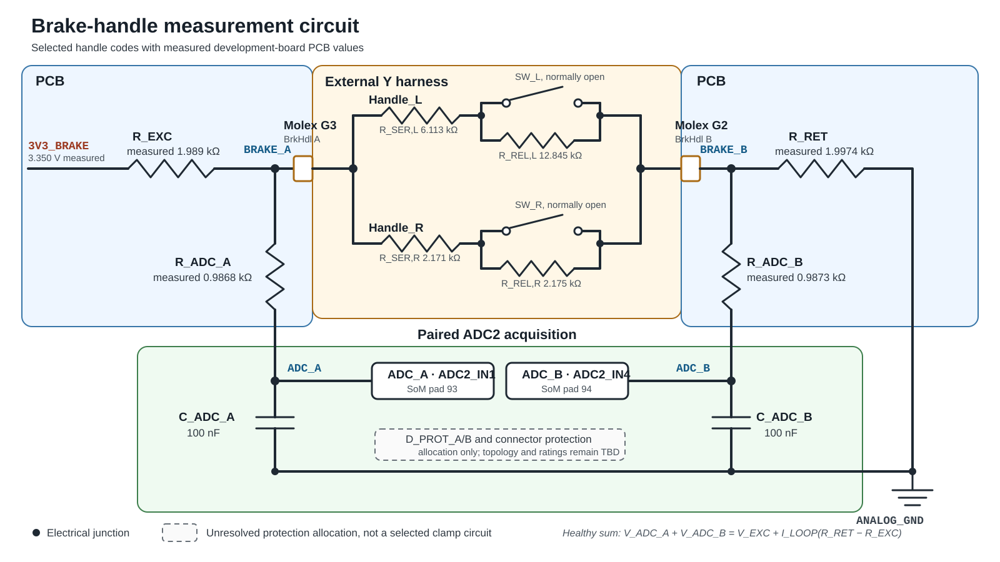

# Brake-handle input

[Application index](README.md) · [SoM ADC pin map](../som/fet1061-s.md#complete-100-pad-pinout) · [Application verification](verification.md)

**Status:** selected passive handle networks, a populated PCB measurement path, and implemented ADC2 acquisition plus `BrkHdlInterface` decoding. RAM-target bring-up has confirmed the unpressed state and continuous 5 ms acquisition on one development assembly. The other physical states, injected faults, production thresholds, external-fault protection, and the system safety argument remain open. The exact switch contact specification, fitted resistor BOM, and vehicle fault envelope are blocking inputs.

The state-encoding and nominal measurement network contains only switches, resistors, capacitors, and optional protection diodes. It needs no op-amp, comparator, current source, or handle-side electronics; the MCU uses two ADC inputs. This does **not** yet prove that a passive protection network can survive every required vehicle-harness fault. Production protection must be selected after that electrical fault envelope is defined.

## Design summary

Each handle is converted into a polarity-independent two-terminal network containing a permanent series resistor followed by the parallel combination of the normally-open switch and a release-state resistor.

Closing a switch adds conductance rather than shorting the loop. Since parallel conductances add, the four handle states become distinct. The PCB applies a near-symmetric source/return bias across the loop and measures both conductor voltages, giving additional common-mode diagnostics.

### ADC acquisition overview

The initial brake-only acquisition uses ADC2 as follows. These settings are implemented and remain the operating point that hardware qualification must reproduce.

| Property | Implemented configuration |
|---|---|
| Channels | `ADC_A`: `ADC2_IN1`, SoM pad 93; `ADC_B`: `ADC2_IN4`, SoM pad 94 |
| Resolution and reference | 12-bit single-ended conversion (`MODE = 0b10`); `REFSEL = 0b00`, using `VREFH = VDDA_ADC_3P3` and `VREFL = VSSA_ADC` |
| ADC clock | IPG clock (`ADICLK = 0b00`) divided by 8 (`ADIV = 0b11`): 150 MHz / 8 = `fADCK = 18.75 MHz` |
| Power/speed mode | Normal power and normal speed: `ADLPC = 0`, `ADHSC = 0` |
| Sample time | Long sample, 24 ADC clocks: `ADLSMP = 1`, `ADSTS = 0b11` |
| Averaging | 32 conversions per reported channel result: `AVGE = 1`, averaging count 32 (`AVGS = 0b11`) |
| Trigger/readout | Software-triggered, one-shot (`ADTRG = 0`, `ADCO = 0`) through channel group 0; bounded polling |
| Pair order and rate | `ADC_A` followed immediately by `ADC_B`, once per 5 ms supervised task release |
| Runtime bound | Approximately 85.3 µs per averaged channel and 170.7 µs per pair; hard pair deadline 300 µs |
| Disabled features | Continuous conversion, hardware trigger, compare, DMA, ADC interrupt (`AIEN = 0`), overwrite (`OVWREN = 0`), and asynchronous ADC clock output (`ADACKEN = 0`); user offset correction is reset to zero (`OFS = 0`) |

At 18.75 MHz, the selected 50-clock conversion sequence needs approximately 2.67 µs per raw conversion. The 32-sample average improves noise and matches the conditions used for the preliminary NXP total-unadjusted-error allowance while consuming less than 4% of the 5 ms task period. The complete normative boundary is defined in [ADC hardware-software interface](#adc-hardware-software-interface).

The RT1060 data sheet permits 4–30 MHz ADC operation for 12-bit normal-power/normal-speed mode. The selected 18.75 MHz operating point therefore needs neither high-speed mode nor operation near the limit.

## Refined requirements

| ID | Proposed requirement | Verification intent |
|---|---|---|
| `BRK-F-01` | In a fault-free circuit, distinguish `released`, `left pressed`, `right pressed`, and `both pressed`. | Exercise all four combinations across tolerance and temperature. |
| `BRK-F-02` | Preserve the existing two-wire trunk and passive Y connection. Handle networks must be polarity independent. | Reverse either handle branch and repeat the state test. |
| `BRK-D-01` | Detect a hard open in either trunk conductor and loss of either complete handle branch, independent of the remaining handle's state. | Open each conductor before and after the Y junction. |
| `BRK-D-02` | Detect a hard short between the two brake conductors. | Short the connector and each branch in turn. |
| `BRK-D-03` | Detect each conductor shorted to local ground or the local 3.3 V excitation rail, provided the fault remains within the qualified protection envelope. | Inject each fault through a current-limited fixture. |
| `BRK-D-04` | Treat every sample outside a validated state window, stale acquisition, and excessive paired-channel disagreement as an immediate invalid input. Record all events; latch a service fault only after a validated persistence/repetition criterion. | Sweep resistance continuously and inject intermittent connections and contact bounce. |
| `BRK-S-01` | A valid pressed code or any invalid/stale input must remove propulsion permission. Only a valid pressed code may establish brake-handle actuation and identity; a fault leaves both unknown. | Fault-injection test at every application operating state. |
| `BRK-S-02` | Do not grant propulsion permission until the input has completed startup plausibility checks. | Boot with each state and each hard fault applied. |
| `BRK-S-03` | The vehicle hazard analysis must validate that immediate propulsion inhibition is safe in every relevant vehicle state and select whether an input fault additionally commands active/regenerative braking, passive coast, or another reaction. The decoder must not silently equate `fault` with a physical handle press. | Verify the selected reaction for each vehicle operating state. |
| `BRK-T-01` | Initial design target: remove propulsion permission on the first credible pressed or invalid sample and confirm a valid pressed identity within 10 ms. Re-enabling propulsion may be debounced for at least 20 ms. | Measure end-to-end timing with the production scheduler and filters. |
| `BRK-A-01` | Acquire one complete, back-to-back `ADC_A`/`ADC_B` pair in every 5 ms supervised task release and complete the pair within 300 µs. | Timestamp channel triggers and pair completion under worst-case interrupt load. |
| `BRK-A-02` | Before scheduler start, disable the digital keeper/pull on both pads and successfully calibrate ADC2 with the operating clock, sample-time, reference, power, and averaging settings. A calibration failure must leave the brake input invalid. | Inspect IOMUX/ADC registers, inject calibration failure, and remeasure the unloaded pad voltages. |
| `BRK-A-03` | Never expose a partial, timed-out, saturated, or stale pair as a valid brake state. The first such result must publish `fault`/`unknown` and remove propulsion permission. | Inject conversion timeout, saturation, missing channels, and stale sequence/timestamp values. |
| `BRK-A-04` | Keep ADC2 configuration and conversion ownership in one MCU acquisition component. No brake, throttle, or other consumer may independently reconfigure or trigger ADC2. | Review ownership and analyze the combined schedule for every ADC2 consumer. |
| `BRK-E-01` | The final design must define allowable cable resistance, insulation resistance, switch contact resistance, the switch's minimum applicable voltage/current load, EMC transients, and shorts to every adjacent vehicle supply. | Derive limits from the switch, harness, and vehicle electrical specifications. |
| `BRK-V-01` | Production state windows must include component tolerance, temperature drift, ADC error, reference mismatch, leakage, cable/contact resistance, and aging with explicit guard bands. | Worst-case calculation, Monte Carlo analysis, and hardware characterization. |

`BRK-D-01` through `BRK-D-03` deliberately describe hard opens and shorts. An arbitrary partial resistance can equal another valid two-terminal code; the [architectural limits](#architectural-limits) explain why unrestricted “detect any damaged cable” is not achievable with this passive two-wire interface.

## Handle modification

### Electrical topology

Modify both handles according to this topology. The normally-open contact is part of the finite-resistance coded network and must not directly bridge the two harness wires.

```text
TERMINAL_A o---- R_SER ----+---- SW_NO ----+----o TERMINAL_B
                           |               |
                           +---- R_REL ----+

SW_NO open:    R_HANDLE = R_SER + R_REL
SW_NO closed:  R_HANDLE = R_SER
```

`R_SER` gives the pressed handle its finite code resistance. `R_REL` provides end-of-line continuity while the switch is released. An open `R_SER` removes the branch; an open `R_REL` removes the released branch but still permits the pressed path; and resistor shorts move the result toward an apparent press or hard-short signature. Continuity of the switch-only bypass path requires the proof test described below.

### Selected resistance values and unresolved component qualification

Both handles use the same topology—one permanent series resistor in each branch and one resistor in parallel with each switch—so the physical modifications are topologically symmetric. Their resistance values deliberately differ to encode handle identity:

| Location | `R_SER` | `R_REL` | Released branch | Pressed branch |
|---|---:|---:|---:|---:|
| `Handle_L` | 6.113 kΩ | 12.845 kΩ | 18.958 kΩ | 6.113 kΩ |
| `Handle_R` | 2.171 kΩ | 2.175 kΩ | 4.346 kΩ | 2.171 kΩ |

The populated development board measures `R_EXC = 1.989 kΩ` and `R_RET = 1.9974 kΩ`. These readings characterize one assembly; the fitted nominal values and tolerances still need to be taken from the released BOM. There is no remaining common scale factor. Changing a handle resistance or `R_RET` changes the ideal normalized code `K`; changing either PCB bias resistor changes loop current, node voltages, ADC-error sensitivity, and the complete error budget. Any such change requires recalculation.

Using the measured PCB return resistor and the measured assembled-Y resistances gives development-point `K` codes of `0.5638`, `0.7864`, `1.0259`, and `1.2468`. The successive separations are approximately `0.2226`, `0.2395`, and `0.2209`.

The preliminary sensitivity calculation below assumes hypothetical independent ±0.1% limits around the selected handle values and measured PCB resistor values. This does not establish the as-built tolerances. Parts in separate handles cannot be assumed to track as a matched network, so production limits must use the actual BOM and independent temperature drift. Do not substitute values or exchange left/right networks without recalculating the code and component FMEA.

The stated values are exact nominal/effective targets, not by themselves a resistor BOM. If an effective value is assembled from multiple components, every added component, joint, and intermediate node becomes an independent tolerance and failure-mode term; production calculations and the FMEA must use the actual network rather than only its nominal equivalent.

With the measured 3.350 V excitation and development-board resistances, total loop current is approximately 0.445–0.599 mA across the four valid states. The individual switch voltage/current operating points are not production-qualified without the exact switch data sheet and validation for low-level/dry-circuit service.

### Mechanical implementation

- Rewire the contact path with `R_SER` in series and fit `R_REL` across the switch only. Verify with an ohmmeter that neither pressed handle can directly short its connector pins.
- Place both resistors inside the handle, electrically beyond as much of the branch cable and connector as practical. Resistors placed on the PCB cannot supervise the external branch cable.
- Minimize and mechanically secure joints in the switch-only bypass path. That path is latent while released: an open contact, lead, trace, or new solder joint leaves `R_REL` reporting a plausible released branch but prevents the press from being observed.
- Provide strain relief, insulation, moisture protection, and mechanically secured solder joints suitable for handlebar vibration.
- Permanently mark the left and right modified handles; exchanging them swaps the reported identity but still removes propulsion permission when either is pressed.
- Treat the modified pair as a coded sensor loop. It is no longer a conventional zero-ohm dry-contact input and must not also feed equipment that expects one.
- Measure and record each completed handle's released and pressed resistance before installing the Y harness.

## Two-wire system topology

The Y harness connects the two coded handle networks in parallel between `BRAKE_A` and `BRAKE_B`. The networks are resistor-only and therefore do not depend on connector polarity. `BRAKE_A` and `BRAKE_B` acquire their names only at the PCB measurement circuit. The complete connection is shown in the circuit overview below.

## PCB measurement circuit

### Measurement topology

[](assets/brake-measurement-circuit.svg)

*Figure 1 — Electrical overview from the PCB excitation rail, through Molex contacts G3/G2 and both parallel handle networks, to the paired ADC2 inputs and analog return.*

The fault-free measurement loop is `3V3_BRAKE → R_EXC → BRAKE_A → coded Y harness → BRAKE_B → R_RET → ANALOG_GND`. Each ADC input observes its corresponding brake conductor through a separate approximately 1 kΩ isolation resistor and 100 nF filter capacitor.

The dashed protection allocations in Figure 1 deliberately do not prescribe a clamp topology. Add low-leakage external clamps at `ADC_A` and `ADC_B` and connector-side ESD/overvoltage protection after the vehicle fault-voltage envelope is defined. Do not rely on the MCU's internal protection structures for harness faults.

| PCB component/function | Development value or allocation | Purpose |
|---|---|---|
| `3V3_BRAKE` | 3.350 V measured on the development board; production range open | Brake-loop excitation. Its relationship to the SoM ADC reference belongs in the production error budget. |
| `R_EXC` | 1.989 kΩ measured on the development board; fitted nominal/tolerance open | Excitation-side bias and fault-current limitation. |
| `R_RET` | 1.9974 kΩ measured on the development board; fitted nominal/tolerance open | Return-side bias; its value enters the normalized state code. |
| `R_ADC_A`, `R_ADC_B` | 0.9868 kΩ / 0.9873 kΩ measured respectively; fitted nominal/tolerance open | Isolate the ADC sampling/filter capacitors and limit clamp current. |
| `C_ADC_A`, `C_ADC_B` | 100 nF, X7R, placed at the SoM pins | Matched low-pass filtering; nominal settling is well below the proposed 5 ms sample interval. |
| `D_PROT_A`, `D_PROT_B` | Low-leakage external clamps; exact network pending electrical-environment definition | Keep ADC inputs within their qualified range during ESD and bounded cable faults. |
| `ADC_A` | SoM pad 93, `GPIO_AD_B1_12`, `ADC2_IN1` | Established connection sampling the excited harness conductor. |
| `ADC_B` | SoM pad 94, `GPIO_AD_B1_15`, `ADC2_IN4` | Established connection sampling the return harness conductor. |

### Development-board characterization

The assembled Y harness was measured at its two-pin connector before connection to the PCB:

| Handle state | Measured `R_BUS` |
|---|---:|
| Neither pressed | 3.543 kΩ |
| Left pressed | 2.540 kΩ |
| Right pressed | 1.947 kΩ |
| Both pressed | 1.602 kΩ |

With neither handle pressed, the development board measured `ADC_A = 2.476 V` at SoM pad 93 and `ADC_B = 0.875 V` at pad 94. The passive prediction from the measured `3V3_BRAKE`, PCB resistors, and 3.543 kΩ harness is `ADC_A = 2.465 V` and `ADC_B = 0.889 V`, deviations of approximately +11 mV and −14 mV. The observed sum is 3.351 V and the observed `K` is 0.5465, compared with a passive prediction of 3.354 V and 0.5638.

These pad readings were taken before an ADC implementation had disabled the reset-state digital keepers. They are useful bring-up evidence, but they must not become state thresholds. Repeat all four voltage measurements after applying the specified IOMUX configuration and ADC calibration; investigate any remaining systematic offset before deriving windows.

The measured `R_ADC × C_ADC` terms are approximately 98.7 µs on both channels. That local time constant is well below the 5 ms acquisition interval, but the complete settling path also includes the loop impedance and future protection components and must be validated dynamically.

The ADC input pins must remain between `VSS` and `VDDA_ADC_3P3`. Because the SoM does not export its ADC reference, the production voltage-sum window must include the measured or bounded relationship between `3V3_BRAKE` and `VREFH`. NXP's data sheet makes allowable analog-source resistance dependent on the ADC sample-time and power-mode settings; the 100 nF capacitors do not remove the need to verify settling.

With the measured development values, total loop current is approximately 0.445 mA released and 0.599 mA with both handles pressed. The [component-qualification decision](#selected-resistance-values-and-unresolved-component-qualification) must be closed against the switch's complete minimum-load specification and the protection design, not by checking current alone.

## State calculation

For a fault-free series loop:

```text
I_LOOP = V_EXC / (R_EXC + R_BUS + R_RET)
V_A    = V_EXC - I_LOOP × R_EXC
V_B    = I_LOOP × R_RET

R_BUS  = R_RET × (V_A - V_B) / V_B
K      = V_B / (V_A - V_B) = R_RET / R_BUS
```

`K` is useful because excitation voltage and ADC reference gain cancel to first order when the two channels are sampled close together. Classification can avoid division by comparing `V_B` with fixed multiples of `V_A - V_B`.

Using `V_EXC = 3.350 V`, measured `R_EXC = 1.989 kΩ`, measured `R_RET = 1.9974 kΩ`, and the four measured assembled-Y resistances gives the following development-point predictions.

| Handle state | `R_BUS` | `V_A` | `V_B` | `V_A - V_B` | `K` | Illustrative 12-bit codes `A / B` |
|---|---:|---:|---:|---:|---:|---:|
| Neither pressed | 3.543 kΩ | 2.465 V | 0.889 V | 1.576 V | 0.5638 | 3013 / 1086 |
| Left pressed | 2.540 kΩ | 2.329 V | 1.025 V | 1.304 V | 0.7864 | 2847 / 1253 |
| Right pressed | 1.947 kΩ | 2.227 V | 1.128 V | 1.099 V | 1.0259 | 2722 / 1379 |
| Both pressed | 1.602 kΩ | 2.158 V | 1.197 V | 0.960 V | 1.2468 | 2638 / 1464 |

The ADC codes assume an ADC reference exactly equal to the measured 3.350 V excitation and are shown only for orientation. The actual SoM reference was not measured separately. Use paired raw values and validated dimensionless windows in firmware.

```text
increasing total conductance / decreasing R_BUS  ─────────────────────────────────>

branch-loss codes               released     left     branch-loss     right     both
K = 0.105 / 0.327 / 0.460         0.564       0.786       0.920         1.026     1.247

hard wire short: V_A ≈ V_B, so the differential approaches zero and K is not used
```

The bring-up firmware currently uses `0.54–0.59`, `0.75–0.82`, `0.99–1.06`, and `1.21–1.28`. These are **not production thresholds**. Their purpose is to exercise the implemented decoder while demonstrating that guard bands exist; replace them with limits derived from worst-case analysis and measured production-intent hardware.

A preliminary sensitivity enumeration centered on the selected handle values and measured PCB resistor values, using hypothetical independent ±0.1% limits followed by an independent ±4.28 LSB error on each 12-bit ADC result, gives these illustrative `K` ranges:

| State | Resistor corners only | Resistor plus ADC-error corners |
|---|---:|---:|
| Neither pressed | 0.5638–0.5661 | 0.5591–0.5709 |
| Left pressed | 0.7848–0.7879 | 0.7779–0.7949 |
| Right pressed | 1.0233–1.0274 | 1.0137–1.0373 |
| Both pressed | 1.2443–1.2493 | 1.2317–1.2621 |
| Closest complete branch-open fault: left branch open, right pressed | 0.9182–0.9219 | 0.9098–0.9304 |

The ADC term uses NXP's maximum total-unadjusted-error figure under its stated calibrated/32-sample-averaged conditions. The closest preliminary complete-branch-open-to-valid separation is approximately 0.083 in `K`. This is a sensitivity exercise, not a production error budget: the DMM readings are not nominal BOM definitions, and the calculation omits cable/contact resistance, protection leakage, reference/excitation mismatch during sequential samples, actual temperature limits and tracking, noise, aging, and dynamic settling. Component shorts and arbitrary resistive damage can also alias valid codes.

The measured released `R_BUS = 3.543 kΩ` is slightly above the approximately 3.539 kΩ maximum produced by the hypothetical ±0.1% selected-resistor case. Its measured-development-point `K = 0.563759` is correspondingly just below the calculated `0.563825` resistor-only lower bound, although both round to `0.5638` in the tables. The sensitivity ranges therefore do not cover the measured harness and must not be reused as acceptance limits; cable/contact resistance, actual BOM values, and measurement uncertainty need explicit allowance.

## Expected fault signatures

| Injected condition | Nominal observation | Required interpretation |
|---|---|---|
| Trunk open / connector disconnected | `V_A ≈ V_EXC`, `V_B ≈ 0 V` | Fault; remove propulsion permission and report identity unknown. |
| One handle branch open | Surviving branch is 2.171, 4.346, 6.113, or 18.958 kΩ; development-point `K` is 0.920, 0.460, 0.327, or 0.105 respectively | Every value is outside the valid windows: fault; remove propulsion permission and report identity unknown. |
| Short between `BRAKE_A` and `BRAKE_B` | `V_A ≈ V_B`; the measured bias values predict approximately 1.679 V at 3.350 V excitation | Fault; remove propulsion permission and report identity unknown. |
| `BRAKE_A` short to local ground | Both measured nodes move abnormally low; voltage sum collapses | Fault; protection must limit current. |
| `BRAKE_B` short to local ground | `V_B ≈ 0 V`, while `V_A + V_B` is below the excitation invariant | Fault; protection must limit current. |
| `BRAKE_A` short to local 3.3 V | `V_A ≈ V_EXC`, while the voltage sum is too high | Fault; protection must prevent rail backfeed. |
| `BRAKE_B` short to local 3.3 V | Both measured nodes move abnormally high | Fault; protection must prevent rail backfeed. |
| Intermittent/high-resistance connection | Samples cross a guard band or disagree in many—but not all—cases | Remove propulsion permission immediately while invalid; record every event and latch only by qualified persistence/repetition criteria. |
| `R_SER` open | Complete handle branch is lost | Branch-loss fault; remove propulsion permission and report identity unknown. |
| `R_REL` open | Released branch is lost; pressing the handle restores its finite `R_SER` path | Fault while released; pressed operation remains detectable. |
| `R_REL` short | Handle is permanently reduced to `R_SER` | Apparent persistent valid press; propulsion remains disabled, but this fault is not separately identified. |
| `R_SER` short | Released code becomes invalid or can resemble a press; pressing creates the hard-short signature | Fault or apparent valid press; propulsion remains disabled in either case. |
| Switch-only bypass path open | Released code remains valid through `R_REL`; pressing causes no code change | Latent undetected fault that can hide actuation; requires proof testing or an independent sensing path. |

The selected right-handle values create one intentional fail-safe alias worth recording explicitly: `R_SER = 2.171 kΩ` and `R_REL = 2.175 kΩ` differ by only 4 Ω. If the right `R_SER` shorts while the switch is released, the branch becomes 2.175 kΩ and produces development-point `K ≈ 1.0237` with the left handle released or `K ≈ 1.2451` with it pressed. Those values are indistinguishable from a valid right press (`1.0259`) or both pressed (`1.2468`) once normal tolerance and ADC error are included. Propulsion is therefore inhibited as required, but this component fault cannot be reported separately from physical brake actuation.

For unequal bias resistors, the exact healthy-loop relation is `V_A + V_B = V_EXC + I_LOOP × (R_RET - R_EXC)`. The measured development values therefore predict a sum of approximately 3.354–3.355 V rather than exactly 3.350 V. A validated sum window still adds information that a single ADC measurement cannot provide and detects several conductor-to-rail faults even when differential resistance alone looks plausible.

## ADC hardware-software interface

This section defines the boundary between the populated analog circuit, the RT1061 ADC2 peripheral-access implementation, and the brake decoder. It is normative for the initial brake-only implementation; numerical state windows remain provisional until the production error budget and hardware characterization are complete.

### Hardware-facing channel contract

| Logical signal | MCU route | Required pad state | Software value |
|---|---|---|---|
| `ADC_A` | SoM pad 93, `GPIO_AD_B1_12`, `GPIO1_IO28`, hardwired `ADC2_IN1`, IOMUX pad index 70 | ALT5 GPIO, `SION = 0`, GPIO input; keeper/pull, hysteresis, open-drain, and output drive disabled | `adc_a_raw`, unsigned 12-bit code `0..4095` |
| `ADC_B` | SoM pad 94, `GPIO_AD_B1_15`, `GPIO1_IO31`, hardwired `ADC2_IN4`, IOMUX pad index 73 | ALT5 GPIO, `SION = 0`, GPIO input; keeper/pull, hysteresis, open-drain, and output drive disabled | `adc_b_raw`, unsigned 12-bit code `0..4095` |

The analog connection is hardwired; ALT5 does not select an ADC function. It keeps the pad under GPIO control while the corresponding GPIO direction is forced to input. In particular, `PKE` must be cleared because both SoM pads reset as digital inputs with keepers.

### Initialization contract

1. Complete and stabilize the MCU clock tree before touching ADC2. Enable `CCM_CCGR4.CG1` for IOMUXC, `CCM_CCGR4.CG2` for IOMUXC_GPR, `CCM_CCGR1.CG4` for ADC2, and `CCM_CCGR1.CG13` for GPIO1 in run/wait operation. Do not depend on another feature such as the board LED having enabled GPIO1 first.
2. Apply the pad states in the channel table before using either voltage for diagnostics. Confirm `GPIO1_GDIR[28] = 0` and `GPIO1_GDIR[31] = 0`.
3. Configure ADC2 with the exact operating settings from the [ADC acquisition overview](#adc-acquisition-overview). First reject an ADC instance inherited from a RAM image with `ADC_GC.CAL` still active without writing another ADC register. Otherwise, set every channel group to `ADCH = 31` and `AIEN = 0`, clear user offset correction with `ADC_OFS = 0`, and disable compare, DMA, continuous conversion, overwrite, ADC interrupts, and hardware triggering.
4. Select channel group 0 software triggering and apply the final clock, reference, resolution, power/speed, long-sample, and 32-sample-average settings before calibration.
5. Run one bounded ADC auto-calibration per reset after the rails are stable. First clear a stale failure by writing one to the write-one-to-clear `ADC_GS.CALF` bit, then set `ADC_GC.CAL`. Poll `CAL` with a bounded timeout and reject `CALF`; calibration succeeds only after `CAL` clears, `CALF` remains clear, channel-group-0 completion is observed, and result 0 is read to clear completion. Do not write ADC configuration registers or enter a stop mode while calibration is active.
6. A calibration timeout or failure must not block indefinitely. Initialization shall report the brake acquisition as unavailable; the software-visible state remains `fault`/`unknown` and propulsion permission remains false. If the bounded poll expires while `CAL` remains active, make no further ADC register access during that boot; recovery is reset-only.
7. Do not learn a released code during startup. A handle may already be pressed or the harness may already be faulty, so only prevalidated fixed windows may classify the first pair.

Recalibration is required after reset or after changing the ADC clock, reference, sample time, averaging, or power/speed mode. It is not a periodic runtime operation.

### Acquisition transaction and timing contract

The acquisition component shall execute this transaction near the start of every supervised `tsk_1_5ms` release:

```text
trigger ADC2 group 0, channel 1 (ADC_A)
    -> wait with interrupts enabled for COCO0
    -> read result 0
trigger ADC2 group 0, channel 4 (ADC_B)
    -> wait with interrupts enabled for COCO0
    -> read result 0
publish one complete A/B pair, sequence, timestamp, and status
```

Only group 0 initiates a software-triggered conversion. Register accesses may use short critical sections, but the approximately 171 µs polling interval must not be enclosed in a critical section that masks scheduler interrupts. A complete pair must finish within 300 µs of the first trigger. Failure of either channel, expiration of that deadline, or a superseding task release invalidates the complete pair; software must not combine one new channel with one previous channel.

The 32 raw conversions for `ADC_A` precede the 32 raw conversions for `ADC_B`, so the centers of the two averaging windows are approximately 85 µs apart. A physical switch transition can consequently produce a mixed pair. Apply the normal sum, difference, and unique-window checks: many mixed pairs will become fail-safe faults, but a transition occurring late in an averaging window could still alias a valid code. Dynamic-transition testing must characterize those cases and confirm the end-to-end inhibition timing; the decoder must never force a guard-band result to the nearest state.

### Software-visible result contract

| Item | Contract |
|---|---|
| Pair status | Exactly one of `complete` or an explicit acquisition error such as `not_initialized`, `calibration_failed`, `timeout`, or `stale`. |
| Raw values | `adc_a_raw` and `adc_b_raw` are published only together after both 32-sample conversions complete. Keep them available for diagnostics even when electrical classification subsequently fails. |
| Sequence | Monotonically changes for every newly completed pair. A repeated sequence cannot be treated as fresh data. |
| Timestamp | Monotonic completion time of the pair, not merely the scheduler release time. A consumer must reject a pair older than 10 ms; a missed current-cycle acquisition is rejected immediately rather than waiting for that age limit. |
| Electrical classification | Exactly one of `released`, `left`, `right`, `both`, or `fault`. Saturation, invalid sum/difference, no unique code window, or guard-band membership produces `fault`. |
| Safety outputs | `fault` implies identity `unknown` and `propulsion_permit = false`. Any valid pressed result also sets `propulsion_permit = false`. Only a validated, debounced released history may permit propulsion. |

The decoder should use integer difference, sum, and cross multiplication rather than floating-point division. It must consume a coherent pair and apply validity checks before the `K` windows. Acquisition status and electrical classification are separate: an ADC transaction can complete successfully while the measured circuit is electrically invalid.

### Firmware implementation mapping

- The generic RT1061 peripheral layer owns the register-level ADC implementation in `src/drv/adc`.
- `src/mcu/brkhdlinput` owns ADC2 configuration, calibration, pad state, GPIO1/GPIO6 selection, paired conversion, timeout, sequence, and completion timestamp. No feature component directly reconfigures ADC2.
- The software component is `BrkHdlInterface`; its single debugger-visible instance is named `BRKHDL`. Its mutually exclusive state is `Unpressed`, `A_Pressed`, `B_Pressed`, `AB_Pressed`, or `Error`. Handle A is the selected left-handle resistance signature and handle B is the selected right-handle signature; these names are independent of conductor labels `ADC_A` and `ADC_B`.
- `tsk_1_5ms` runs the component once per release. A pressed or invalid result removes propulsion permission on the first sample. Permission returns only after five consecutive valid unpressed samples, spanning at least 20 ms at the 5 ms rate.
- Consumers receive an immutable snapshot qualified for their current scheduler release. A missed producer release, acquisition error, repeated/out-of-order pair, stale timestamp, rail/sum/difference failure, or guard-band code yields `Error` with propulsion permission false.

### Shared ADC2 ownership

ADC2 configuration and trigger state are peripheral-wide. A single MCU analog-acquisition component must therefore own the ADC2 instance and publish samples to feature-level consumers. Brake and throttle modules must not each create an independently configurable ADC2 object.

The adjacent [throttle proposal](throttle-input.md) assigns `ADC2_IN2` and `ADC2_IN3` at 16,000 sample pairs/s, corresponding to a 62.5 µs pair period. One brake channel with the proposed 32-sample hardware average already takes approximately 85.3 µs, so this brake-only sequence cannot coexist unchanged with that throttle schedule. Before enabling both functions, define one combined acquisition schedule—likely a raw multichannel scan with software accumulation/filtering—and repeat the ADC error and timing analysis. Until then, the configuration in this document is exclusive to the brake acquisition.

## Firmware classification behavior

1. Sample `ADC_A` and `ADC_B` back-to-back, initially every 5 ms or faster.
2. Reject rail saturation, `V_A ≤ V_B`, an invalid `V_A + V_B`, and a differential too close to zero before calculating a state code.
3. Compute or cross-multiply the normalized code `K` and accept only one validated state window. Guard-band values are faults, not nearest-state results.
4. For a valid left, right, or both code, publish the corresponding pressed state and remove propulsion permission immediately. Identity may be confirmed over two consecutive samples only if that does not delay propulsion inhibition.
5. For an invalid or stale input, publish `fault`, set identity to `unknown`, and remove propulsion permission immediately. Do not fabricate a physical brake-handle state; a separate system-safety policy decides whether the vehicle actively brakes, coasts, or takes another action.
6. Re-enable propulsion permission only after a stable released code for the validated debounce interval and only if no qualified diagnostic blocks recovery.
7. Record isolated invalid samples. Latch a service fault only after validated persistence/repetition criteria that tolerate RC settling and contact bounce; there is no generally impossible logical transition because both handles can change within one sample interval.
8. Expose a mutually exclusive decoded state (`released`, `left`, `right`, `both`, or `fault`) separately from `propulsion_permit` and any downstream active-braking command.

Thresholds should be generated from component limits rather than scattered magic ADC counts. Store them as dimensionless ratio bounds or cross-multiplication constants so excitation/reference variation does not silently move the state windows.

```text
ADC_A + ADC_B
      |
      v
electrical validity + code windows
      |
      +-- valid released ------> identity: released ---> permission after debounce
      |
      +-- valid pressed -------> identity: L/R/both ---> propulsion permission OFF
      |
      +-- invalid or stale ----> identity: unknown ----> propulsion permission OFF
                                      |
                                      +---------------> system hazard-response policy
```

## Architectural limits

This passive design materially improves diagnostics, but a two-terminal resistor network exposes only one equivalent impedance at any instant. Different physical conditions that produce the same impedance are electrically indistinguishable.

In particular:

- Any open in the switch-only bypass path—including the normally-open contact, its leads, the interrupted trace, or either new solder joint—cannot be distinguished from an unpressed handle. The end-of-line path proves branch continuity through `R_REL`, not that the bypass will close on demand.
- An arbitrary partial series resistance can move a genuinely pressed code toward a less-pressed valid code. An arbitrary leakage resistance can move it toward a more-pressed code. Guard bands and persistent-fault monitoring detect many such events but cannot prove coverage of every possible resistance.
- A simultaneous/common fault in the Y junction or two-wire trunk affects both handles. The two handle indications are coded states, not independent safety channels.
- The two ADC channels still share the MCU, ADC2, reference, software, and much of the passive excitation path.
- Modifying a certified brake handle may invalidate its environmental, warranty, or regulatory status.

Therefore, if the system safety goal requires detection of every single fault that could hide brake actuation, the passive two-wire Y architecture is insufficient. The preferred architectural changes are separate conductors per handle, a normally-closed or changeover contact per handle, a second independent sensing principle, or qualified active handle electronics. The proposed circuit is acceptable only after the system safety analysis explicitly accepts its residual faults and defines another means of controlling them, such as periodic proof testing or an independent braking/torque-inhibit path.

## Protection and layout requirements

- Keep the two ADC filter networks symmetric and place their capacitors and clamps close to the SoM pads.
- Route `BRAKE_A` and `BRAKE_B` together, away from PWM, motor, and switching-regulator nodes. Provide a defined analog return rather than sharing high-current ground paths.
- Use connector-side ESD protection with leakage characterized across temperature; leakage is part of the state-code error budget.
- The approximately 2 kΩ bias resistors are **not** by themselves a qualified protection solution for a sustained short to `BAT+`, 12 V, or another high-energy rail. Define the maximum fault voltage, source impedance, duration, and required survival before selecting resistor strings, PTC/fusible elements, TVS/clamps, and ratings.
- Ensure protection current cannot back-power the carrier 3.3 V rail or an unpowered SoM.
- Verify resistor pulse/voltage ratings, not only steady-state dissipation.
- Include accessible test points for `BRAKE_A`, `BRAKE_B`, `ADC_A`, and `ADC_B` without adding a path that bypasses harness supervision.

## Verification plan

### Current firmware bring-up evidence

On 2026-08-28, the final RAM-debug build was exercised through the Atmel-ICE with neither handle pressed. Two snapshots separated by 5 seconds remained `Unpressed`, with sequence advancing from 403 to 1404 and acquisition/electrical error counters remaining zero. The observed values were `ADC_A = 3085–3086`, `ADC_B = 1111`, `K = 0.5625–0.5628`, and `ADC_A + ADC_B = 4196–4197` raw codes. ADC2 remained configured as `CFG = 0x0000C378`, `GC = 0x00000020`, `GS.CALF = 0`, and `OFS = 0`; the released-state confirmation reached five samples and propulsion permission was true.

The debug-profile 5 ms task required a 512-word stack after the ADC path was added. A breakpoint at the deepest classification path observed approximately 1,140 bytes used and 892 bytes remaining above the four-word guard. This is bring-up evidence, not a production worst-case stack proof. Physical actuation and fault injection were deliberately not performed in this unpressed-only run and remain required below.

Before accepting production thresholds:

1. Measure at least the four valid states, trunk open, each individual branch open, line-to-line short, and each line-to-qualified rail fault.
2. Substitute every handle resistor open and short one at a time and confirm the documented FMEA classification on released and pressed handles, including the right-`R_SER` fail-safe alias.
3. Open the switch contact, each bypass lead/trace segment, and each new solder joint in turn. Confirm that these faults remain latent while released, then validate the selected proof-test or independent mitigation.
4. Sweep added series resistance and parallel leakage to identify all alias regions; record them as residual faults rather than claiming universal cable-damage coverage.
5. Test switch bounce, slow actuation, connector fretting, intermittent opens, and hot-plugging while logging both raw ADC channels.
6. Characterize minimum/maximum component tolerances and ADC readings across supply and temperature, including clamp leakage and cable/contact resistance.
7. Validate ADC calibration, acquisition time, channel-to-channel settling, filter response, and scheduler latency under worst-case CPU/interrupt load.
8. Verify propulsion permission is removed at every safety-relevant output before startup classification and during a fault. Separately validate that propulsion inhibition and the hazard-analysis-selected active-brake/coast reaction are safe in every relevant vehicle state.
9. Repeat EMC, ESD, transient, moisture, vibration, and harness tests on production-intent assemblies.

The selected resistance targets and first development-harness measurements for manufacturing-test development are:

| Test object/state | Selected/calculated target | Development measurement |
|---|---:|---:|
| `Handle_L`, released | 18.958 kΩ | Not recorded separately |
| `Handle_L`, pressed | 6.113 kΩ | Not recorded separately |
| `Handle_R`, released | 4.346 kΩ | Not recorded separately |
| `Handle_R`, pressed | 2.171 kΩ | Not recorded separately |
| Assembled Y, neither pressed | 3.5355 kΩ | 3.543 kΩ |
| Assembled Y, left pressed | 2.5401 kΩ | 2.540 kΩ |
| Assembled Y, right pressed | 1.9479 kΩ | 1.947 kΩ |
| Assembled Y, both pressed | 1.6020 kΩ | 1.602 kΩ |

These are not acceptance windows. Derive pass/fail limits from the actual BOM, constituent-network corners, harness/contact resistance, temperature, and tester uncertainty. Test both positions of each individual handle, preserve left/right serial-number traceability, and exercise all four ADC states after assembling the Y harness; a released-only resistance test cannot prove that the switch bypass and resistor identities are correct.

## References and related documents

- [NXP i.MX RT1060 industrial data sheet](https://www.nxp.com/docs/en/nxp/data-sheets/IMXRT1060IEC.pdf) — ADC input range, source-resistance/sample-time relationship, calibration, and accuracy.
- [NXP MCUXpresso ADC driver interface](https://github.com/nxp-mcuxpresso/mcuxsdk-core/blob/main/drivers/adc_12b1msps_sar/fsl_adc.h) and [implementation](https://github.com/nxp-mcuxpresso/mcuxsdk-core/blob/main/drivers/adc_12b1msps_sar/fsl_adc.c) — configuration fields, channel-group behavior, averaging, and calibration sequence.
- [NXP RT1060 ADC polling example](https://github.com/nxp-mcuxpresso/legacy-mcux-sdk-examples/blob/main/evkmimxrt1060/driver_examples/adc/polling/adc_polling.c) and [ADC pin-mux example](https://github.com/nxp-mcuxpresso/legacy-mcux-sdk-examples/blob/main/evkmimxrt1060/driver_examples/adc/polling/pin_mux.c) — software-triggered acquisition and disabling the input keeper.
- Exact brake-handle switch data sheet — **open input**; minimum applicable voltage/current load and contact material are required before accepting the selected resistance/current design.
- Vehicle harness electrical-fault envelope — **open input**; adjacent-rail voltage, source impedance, duration, and required survival are required before selecting protection.
- [Throttle input](throttle-input.md) — adjacent ADC2 allocation and the existing analog-input documentation pattern.
- [Power domains and isolation](power-domains-and-isolation.md) — vehicle supply and ground-domain constraints.
- [Application verification](verification.md) — system-level release evidence.
