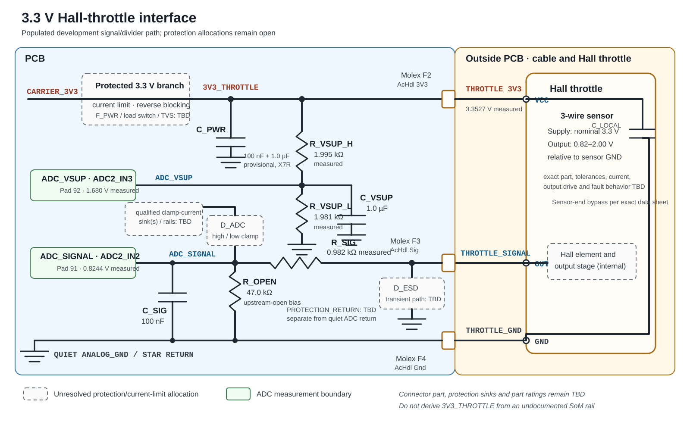

# Throttle analog input

[Application index](README.md) · [SoM pin map](../som/fet1061-s.md#complete-100-pad-pinout) · [Application verification](verification.md)

**Status:** hardware preparation, shared ADC2 acquisition, and the initial `AcHdlInterface` (`ACHDL`) decoder are implemented. RAM-target bring-up has confirmed continuous 5 ms acquisition and the mechanically released `0%` state on one development assembly. Full travel, temperature drift, dynamic behavior, injected faults, production thresholds, protection, and the system safety argument remain open.

## Revised concept

The throttle is a three-wire Hall sensor powered from a protected carrier-generated 3.3 V rail. Its signal is specified as 0.82–2.00 V. That signal is already inside the RT1061 ADC input range and therefore must not be divided by two as in the former 5 V concept.

The two ADC channels have intentionally different networks:

- `ADC2_IN2` measures the throttle signal at approximately unity DC gain through a series resistor, an RC filter, and an open-wire pull-down.
- `ADC2_IN3` measures one half of the protected `3V3_THROTTLE` rail. This keeps supply sensing away from the ADC upper rail and supports supply plausibility checks.

The SoM does not export a general-purpose 3.3 V supply. `3V3_THROTTLE` must therefore be generated on the carrier and must not be taken from `VDD_COIN_3V3`, debugger `Vref`, an ADC pin, or an undocumented SoM rail.

`3V3_THROTTLE` is the PCB rail name; the same conductor is labelled `THROTTLE_3V3` on the external harness side of Molex contact `F2`.

### Electrical overview

[](assets/throttle-input-circuit.svg)

*Figure 1 — Populated development signal/divider path and external harness. Dashed protection blocks are required allocations, not selected production circuits.*

The three throttle conductors are assigned on the 48-contact Molex connector as follows. The `AcHdl` names are the external-connector labels; the `THROTTLE_*` names are the corresponding electrical-net names used in this document.

| Molex contact | Connector assignment | Electrical net |
|:---:|---|---|
| `F2` | `AcHdl 3V3` | `THROTTLE_3V3` |
| `F3` | `AcHdl Sig` | `THROTTLE_SIGNAL` |
| `F4` | `AcHdl Gnd` | `THROTTLE_GND` |

## Electrical network

### External Hall sensor and harness

| Connection | Proposed contract |
|---|---|
| `THROTTLE_3V3` | Nominal 3.3 V sensor supply from the protected carrier branch. The exact allowable sensor-supply range and current remain input data. |
| `THROTTLE_SIGNAL` | Hall output specified as 0.82–2.00 V relative to `THROTTLE_GND`. Confirm which endpoint represents released/full actuation and obtain tolerance, temperature, output-impedance, load, and power-state behavior from the exact sensor data sheet. |
| `THROTTLE_GND` | Dedicated low-impedance sensor return routed to the quiet analog-ground/star point. Do not add an arbitrary series resistance that shifts the sensor reference. |

Provide sensor-end decoupling if required by the sensor manufacturer and cable analysis. PCB-side capacitors do not replace local decoupling at the far end of a long harness.

### Protected 3.3 V supply

Create `3V3_THROTTLE` from a carrier-generated regulated 3.3 V source through a dedicated protection/current-limiting branch. The final circuit must:

- supply the sensor's worst-case operating and startup current without violating its minimum voltage;
- contain a cable short without collapsing the MCU or other safety-relevant 3.3 V domains;
- prevent reverse current and back-powering when either the controller or sensor is unpowered;
- tolerate the defined automotive transient, ESD, misconnection, and adjacent-wire fault envelope; and
- provide PCB-side high-frequency and bulk decoupling, provisionally 100 nF plus 1.0 µF X7R.

`F_PWR`, the regulator/load switch, reverse-current protection, and transient suppressor in Figure 1 are functional allocations. Their topology and ratings cannot be selected until sensor current, inrush, harness impedance, powered-off behavior, and fault voltages are known. Keep high-energy protection current out of the quiet ADC return.

### Throttle-signal channel

The proposed `THROTTLE_SIGNAL` path is:

```text
sensor OUT ── connector ── protection ── R_SIG 1.00 kΩ ──┬── ADC2_IN2
                                                        ├── R_OPEN 47.0 kΩ ── ANALOG_GND
                                                        ├── C_SIG 100 nF ──── ANALOG_GND
                                                        └── ADC clamp allocation
```

`R_OPEN` is placed at the ADC node, after `R_SIG`. It therefore biases an open external signal conductor or an open `R_SIG` toward ground. With `C_SIG = 100 nF`, the nominal open-circuit discharge time constant is `47 kΩ × 100 nF = 4.7 ms`. An open `R_OPEN` itself defeats that diagnostic, and an open trace between the bias node and MCU can still leave the ADC pin uncontrolled; those failures require component FMEA, layout control, proof testing, or architectural redundancy.

For an actively driven low-impedance sensor, `R_SIG` and `R_OPEN` give a nominal DC gain of `47 / (47 + 1) = 0.9792`. The 0.82–2.00 V sensor span therefore becomes approximately 0.803–1.958 V at the ADC pin and loads the sensor by approximately 17–42 µA. With an illustrative 3.300 V ADC reference, this corresponds to approximately 996–2,430 counts at 12 bits. Those counts are orientation values, not acceptance thresholds; production limits must include the actual ADC reference, sensor output impedance/tolerances, filter/protection leakage, ground offset, harness resistance, and ADC error.

The driven Thevenin resistance is approximately `1 kΩ || 47 kΩ = 0.979 kΩ`, giving an RC pole of approximately 1.63 kHz when sensor output resistance is negligible. The RT1061 data sheet makes allowable analog source resistance dependent on ADC sample time and power mode. Validate acquisition settling with the selected ADC configuration and the fitted capacitor rather than assuming the capacitor removes that requirement.

The selected nominal `R_SIG = 1.00 kΩ` (`0.982 kΩ` measured on the development assembly) is an acquisition value, not a complete harness-protection design. For example, if a sustained 58.8 V signal-wire fault belongs to the eventual throttle fault envelope and the ADC node were clamped near 3.6 V, this resistor alone would carry about 55 mA and dissipate about 3 W. That is unacceptable for an ordinary 1 kΩ resistor and low-power clamp. The final design will likely need split/higher fault impedance, active overvoltage protection, or another qualified topology while still meeting ADC settling.

Figure 1 therefore separates connector-side ESD/transient suppression from the low-leakage ADC high/low clamp and shows their returns as unresolved protection allocations. Select them only after defining maximum fault voltage, source impedance, duration, pulse repetition, clamp-current sink, powered-off behavior, leakage across temperature, and required survival. The MCU's internal clamps are not the protection design.

### Sensor-supply monitor

Retain the existing 2.00 kΩ / 2.00 kΩ divider only on the supply-sense channel:

```text
protected 3V3_THROTTLE ── 2.00 kΩ ──┬── ADC2_IN3
                                    ├── 2.00 kΩ ── ANALOG_GND
                                    └── 1.0 µF ─── ANALOG_GND
```

Nominal behavior is:

- DC gain: 0.5;
- 3.3 V supply: approximately 1.65 V at the ADC pin;
- Thevenin resistance: 1.0 kΩ; and
- RC pole: approximately 159 Hz.

The divider consumes approximately 0.825 mA continuously and adds 1.0 µF to branch startup/inrush. Sense `3V3_THROTTLE` after its PCB protection/current-limit stage. This verifies differential droop or overvoltage relative to the ADC reference, but a common collapse of the carrier 3.3 V rail and ADC reference can remain near half-scale until brownout/reset. It also cannot prove continuity of the supply conductor after the PCB tap. A remote supply-wire open is expected to make the unpowered sensor signal invalid, but that behavior must be verified on the exact sensor rather than assumed.

The signal and supply filters have different nominal poles, approximately 1.63 kHz and 159 Hz. Startup qualification, supply-transient coherence checks, fault-response timing, and recovery debounce must account for that difference rather than treating unequal transient samples as an immediate sensor fault without analysis.

## Development-assembly static measurements

The following values were reported on 2026-08-28 after hardware preparation:

| Quantity | Measurement point | Measured value |
|---|---|---:|
| `R_SIG` | Populated signal path | 0.982 kΩ |
| `R_VSUP_H` | Supply-monitor upper resistor | 1.995 kΩ |
| `R_VSUP_L` | Supply-monitor lower resistor | 1.981 kΩ |
| `THROTTLE_3V3` | Molex `F2` | 3.3527 V |
| `ADC_VSUP` | SoM pad 92 | 1.680 V |
| `ADC_SIGNAL` | SoM pad 91 | 0.8244 V |

`R_OPEN` was not included in the reported resistance measurements; its fitted value must still be checked before relying on the calculations or open-wire discharge timing that assume 47.0 kΩ. If the resistor measurements were made in circuit, confirm that parallel paths did not influence them before using the values in an error budget.

The measured divider resistors give a DC ratio of `1.981 / (1.995 + 1.981) = 0.49824`. Applied to the measured 3.3527 V supply, the passive prediction for `ADC_VSUP` is 1.6704 V. The observed 1.680 V is 9.6 mV, or approximately 0.57%, above that prediction. The values are mutually plausible for initial bring-up, but repeat them with common, documented ground points and instrument uncertainty and investigate any persistent offset before defining diagnostic limits.

Assuming the fitted `R_OPEN` is 47.0 kΩ, negligible Hall-output impedance, and no significant protection leakage, the measured `R_SIG` gives a signal gain of `47 / (47 + 0.982) = 0.97953`. The 0.8244 V pad reading then implies approximately 0.842 V at the connector-side Hall output and lies inside the stated 0.82–2.00 V sensor range. The handle position during this reading was not recorded, so this observation must not yet be labelled released or actuated.

These are development-point DMM readings, not ADC codes or acceptance thresholds. Record the exact handle position, sensor part, supply and ground measurement locations, DMM uncertainty, temperature, IOMUX state, and ADC reference when repeating them. Capture calibrated raw ADC pairs before deriving software windows.

## Channel allocation and acquisition

| Function | ADC route | SoM pad | Implemented acquisition |
|---|---|---:|---|
| Hall-throttle signal | `ADC2_IN2` | 91 | Once per 5 ms supervised release in a shared ADC2 sequence, immediately paired with supply sense |
| Protected 3.3 V supply sense | `ADC2_IN3` | 92 | Once per 5 ms supervised release, immediately adjacent to the signal sample |

The implementation produces one coherent signal/supply pair per 5 ms supervised release. Any additional software filtering or faster sampling remains open until derived from throttle response, noise, diagnostic timing, and the combined ADC2 budget; do not preserve the former 16,000-pair/s proposal by assumption.

`src/mcu/analoginput` is the sole ADC2 owner. It configures and calibrates ADC2 once, then executes the fixed order `ADC2_IN1` (brake A), `IN4` (brake B), `IN2` (accelerator signal), and `IN3` (accelerator supply). One shared success sequence is published to both feature pairs only after all four conversions complete. A timeout is fail-atomic: both pairs become invalid and the sequence does not advance. The existing 300 µs brake-pair bound is retained and the complete frame has a 600 µs acquisition bound.

ADC2 retains the brake configuration: 12-bit single-ended conversion, 18.75 MHz ADC clock, long 24-clock sample time, and 32-result hardware averaging. The two throttle averaging windows are approximately 85 µs apart. This and the unequal external RC poles must be included in transient/coherence qualification.

The paired supply measurement is useful for supply plausibility and for calculations that cancel the ADC reference. Do not call the Hall output ratiometric or scale the command by supply voltage unless the exact sensor data sheet and hardware characterization show that its 0.82–2.00 V transfer function scales with its actual supply.

## Implemented software component

The application component is `AcHdlInterface`; its single debugger-visible instance is named `ACHDL`. It publishes exactly one of `Released`, `Active`, or `Error`, together with a `PositionPermille` value from 0 to 1000. `PositionValid` distinguishes a qualified 0% command from the fail-safe numeric zero published with `Error`.

The initial implementation:

- starts in `Error` and requires five consecutive valid released samples, nominally spanning 20 ms at the 5 ms task rate, before publishing a valid `Released`/0‰ result;
- rejects an active signal before that released history;
- immediately disarms on an acquisition or electrical error and again requires released requalification;
- validates acquisition status, shared sequence, completion timestamp, current-release freshness, signal range, and supply-sense range;
- retains raw signal/supply, their diagnostic raw-code ratio, timestamps, qualification state, and saturating error/state counters; and
- uses a fixed provisional mapping rather than learning a maximum from ordinary operation.

The currently compiled bring-up limits are:

| Item | Raw 12-bit code behavior |
|---|---|
| Supply-sense valid range | `1900..=2200` |
| Signal electrical range | `900..=2600` |
| Released classification | valid supply and signal `900..=1075` |
| Active classification | released history qualified and signal `1076..=2600` |
| Position mapping | 0‰ at and below code 1075; linear to 1000‰ at code 2433; 1000‰ through the valid high-side band |

These constants are development instrumentation, not production acceptance limits. Code 2433 is a provisional estimate from the stated 2.00 V endpoint, fitted 0.982 kΩ path, and an approximately 3.298 V ADC-reference estimate obtained by combining the earlier 1.680 V DMM reading with the later raw supply-sense observation. That estimate assumes the DMM value remained representative; the two observations were not simultaneous, and the handle has not yet been measured at full travel. The released target reading is only 28 counts below the current released/active boundary. Do not connect `PositionPermille` to a propulsion command until the endpoint calibration, tolerance analysis, dynamic checks, and system safety mechanisms are complete.

The command mapping uses the signal code directly. `RawSupply` is independently validated but does not normalize the position because the exact Hall sensor has not been proven ratiometric. `RawSignalToSupplySenseRatioX10000` is explicitly the ratio of the two ADC codes; because the supply-sense network divides the rail by approximately two, it is not the physical Hall-output-to-supply ratio.

### Current RAM-target evidence

On 2026-08-28, the RAM-debug image was loaded through the Atmel-ICE while the handle was mechanically at 0%. Two snapshots separated by 3.120 s remained `Released`, `PositionValid = true`, `ReleaseQualified = true`, and `PositionPermille = 0`. The shared sequence advanced from 21,346 to 21,970: 624 frames, exactly 200 Hz over the snapshot timestamps. `RawSignal` remained 1047; `RawSupply` was 2086–2087; and `RawSignalToSupplySenseRatioX10000` was 5017–5019. Acquisition, electrical, and qualification-reject counters remained zero.

Those initial snapshots kept `BRKHDL` `Unpressed`, with brake raw codes 3083–3084 and 1111 and zero acquisition/electrical errors. ADC2 remained `CFG = 0x0000C378`, `GC = 0x00000020`, `GS.CALF = 0`, and `OFS = 0`. IOMUX pads 70–73 were all ALT5 with pad-control registers zero, GPR26 selected GPIO1, and GPIO1 pins 28–31 were inputs. Program-flow supervision remained `Running`, its inverse-protected state was consistent, the observed cycle count was 22,701, and the stored diagnostic fault was `None`.

After correcting the provisional full-scale estimate to code 2433, the exact final RAM binary was rebuilt, validated, and reloaded. A further pair of snapshots separated by 20.860 s of target time again remained qualified `Released` at 0‰. The shared sequence advanced from 2,184 to 6,356: 4,172 frames, exactly 200 Hz. `RawSignal` remained 1047, `RawSupply` was 2085–2086, `RawSignalToSupplySenseRatioX10000` was 5019–5022, and all three accelerator error counters remained zero. `BRKHDL` remained `Unpressed` with `ADC_A = 3082–3083`, `ADC_B = 1110`, and zero brake acquisition/electrical errors. Program-flow supervision again remained `Running` with consistent inverse protection and `None` as its stored diagnostic fault; a subsequent raw check observed cycle count 8,478.

Across the bring-up and exact-final snapshots, the accelerator frame completed 600–603 µs after the scheduled-release timestamp; the brake pair completed after 421–422 µs. These values include scheduler start offset and debug-build overhead and are not an acquisition WCET. They do show that the complete frame is produced well within the 5 ms release period. No handle actuation, full-scale calibration, harness fault, temperature sweep, or external waveform capture was performed.

## Required software behavior

Before the input can control propulsion, the completed decoder shall additionally:

- apply validated rate-of-change and signal/supply-coherence checks;
- replace the provisional electrical windows and code-2433 endpoint with limits derived from released/full-travel characterization, tolerance analysis, and an explicit propulsion-disabled calibration process;
- define and verify the top-end margin, temperature behavior, calibration storage/integrity, and recovery policy;
- connect no positive command to an output unless the accelerator result, brake permission, program flow, communication state, and downstream safety policy are all valid; and
- prove that every invalid result removes any previously authorized positive command before it can leave a safety-relevant communication path.

The nominal 0.82–2.00 V span is not itself a production acceptance window. Guard bands must separate the valid mechanical range from open/short signatures while still covering sensor, supply, ADC, ground, component, cable, temperature, and aging tolerances.

## Fault interpretation and limitations

| Observed condition | Expected interpretation |
|---|---|
| Signal near 0 V | Invalid. Consistent with signal-wire open through `R_OPEN`, short to ground, missing sensor supply, or some sensor faults; these causes are not distinguishable by voltage alone. |
| Signal near `3V3_THROTTLE` | Invalid. Consistent with signal-to-supply short or a high-output fault. |
| Supply-sense outside its qualified range | Invalid local sensor supply; do not accept the throttle signal. |
| Signal inside a guard band or outside every valid window | Invalid; never force it to the nearest valid command. |
| Signal and supply individually plausible but incoherent, stale, or changing impossibly fast | Invalid acquisition or electrical behavior. |

This single Hall channel cannot distinguish a genuine in-range throttle command from every in-range wire leakage, short to another analog voltage, or internal sensor fault. The PCB-side supply monitor cannot independently detect an open beyond its tap, and supply/ground opens depend on the exact sensor's powered-fault behavior. ADC2, its reference, the MCU, software, connector, and ground path remain common causes.

If the system safety goal requires detection of every single fault that could create or preserve positive torque, use a dual independent/complementary throttle sensor and ADC path, an independent torque-inhibit mechanism, or another architecture justified by the vehicle hazard analysis. Passive plausibility checks around one signal do not provide that diagnostic coverage.

## Hardware verification

Before schematic or software thresholds are released:

1. Record the exact Hall-sensor part number and its 3.3 V supply range/current, output transfer/tolerance, output impedance/load, bandwidth, startup/shutdown, reverse-power, and fault behavior.
2. Verify Molex contacts `F2`/`F3`/`F4` against the schematic and mating-face convention, then record the exact connector part, wire colors, return domain, shielding, and maximum adjacent-wire fault voltages.
3. Validate the protected supply during startup, normal operation, sensor/harness short, controller-off/sensor-driven, reverse connection, brownout, and all defined transients.
4. Measure signal and supply ADC codes at released, full travel, intermediate positions, and mechanical over-travel across supply and temperature.
5. Verify divider tolerance, pull-down loading, RC response, ADC acquisition settling, channel-to-channel memory, noise, protection leakage, ground offset, and cable resistance on production-intent hardware.
6. Inject signal/supply/ground opens and shorts, channel cross-shorts, partial resistance/leakage, intermittent connections, ADC saturation, stale data, and timing loss.
7. Confirm every invalid condition prevents a positive torque command at all safety-relevant outputs and that recovery cannot create an unintended step in torque.
8. Prove the combined brake/throttle ADC2 schedule and software execution under worst-case interrupt and scheduler load.

Before ADC use, configure SoM pads 91/92 as analog inputs with their digital keepers, pulls, hysteresis, open-drain behavior, and output drive disabled. Calibration and all ADC2 configuration remain the responsibility of the single shared acquisition owner.

Keep the sensor return and both ADC filter returns away from battery, ESC, LED, UART, and other high-current or switching return paths.

## Related documents

- [Brake-handle input](brake-input.md)
- [Power domains and isolation](power-domains-and-isolation.md)
- [Clocking](clocking.md)
- [Verification](verification.md)
- [NXP i.MX RT1060 industrial data sheet](https://www.nxp.com/docs/en/nxp/data-sheets/IMXRT1060IEC.pdf)
