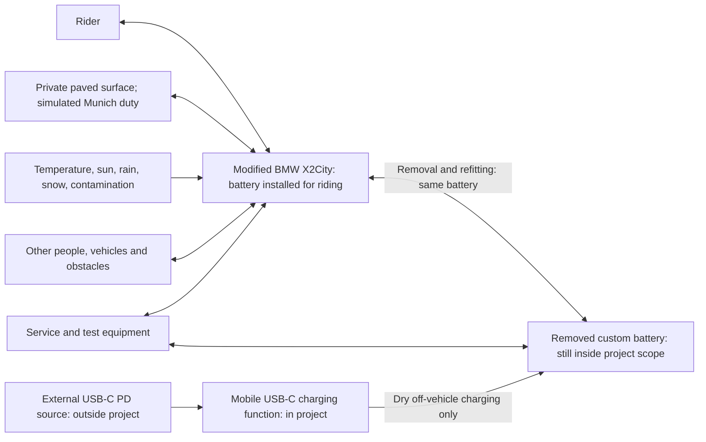

# PD-001 — Project Definition

## Electrical Re-Engineering of a BMW X2City Scooter

> [!IMPORTANT]
> This document defines **what the project is building**, its intended use, scope, boundaries, constraints, assumptions, and unresolved issues. It is an input to later hazard analysis, requirements engineering, system architecture, detailed design, and verification. It does **not** prescribe the final electrical or software architecture.

---

## Document metadata

| Field | Value |
|---|---|
| Document ID | **PD-001** |
| Title | **Project Definition — Electrical Re-Engineering of a BMW X2City Scooter** |
| Revision | **1.0** |
| Revision date | **2026-09-05** |
| Status | **Released — approved project-definition baseline** |
| Approval status | **Approved by Dominik, project owner and content reviewer, on 2026-09-05** |
| Project owner | **Dominik** |
| Release ID | **PD-001-R1.0** |
| Reviewed input | **PD-001 Revision 0.7**, successfully content-reviewed and accepted by the project owner |
| Release basis | Owner instruction to issue the accepted content as the official release; administrative promotion only |
| Release scope | Concept development, vehicle-level hazard analysis, requirements engineering, and targeted feasibility characterization |
| Product | One-off personal electric scooter for private-property use with a commuter duty profile |
| Development focus | Custom battery pack, inverter, USB-C mobile charger, embedded software, and vehicle supervision where needed |
| Process framework | Lightweight ISO 26262-inspired discipline to improve quality, safety, and functionality; process learning is secondary |
| Compliance position | ISO 26262 is used as a source of discipline, not as a compliance or certification target |
| Intended repository role | Standalone project landing page and authoritative scope reference |
| Configuration control | Release configuration: **PD-001-R1.0**. The repository-controlled copy is authoritative after check-in; no repository commit or tag is claimed by this prepared release |
| Supersedes | **PD-001 Revision 0.7**; the reviewed source is retained unchanged, and this release is standalone |
| Source review | Owner decisions consolidated on 2026-09-05; additional Munich speed-context sources and USB-IF charging information reviewed on 2026-09-05; older references retained with their provenance; see Section 20 |

### Approval record

| Role | Name | Status | Date |
|---|---|---|---|
| Project owner / content reviewer / approver | Dominik | **Successfully content-reviewed Revision 0.7, accepted its content, and authorized its official release as this baseline** | **2026-09-05** |
| Independent reviewer, if available | — | No independent review recorded; optional and not a condition of this release | — |

The approval is based on the project owner's explicit written acceptance and release instruction. It is not an inferred approval, an independent-review claim, or a claim of completed component or vehicle validation. Revision 1.0 preserves the reviewed technical content; only document-control, review-disposition, and release-status information has changed. The disposition of remaining assumptions and open issues is recorded in Section 18.

### Normative language

- **Shall** indicates a mandatory project constraint or agreed project objective.
- **Should** indicates a preferred approach that may be changed with recorded justification.
- **May** indicates an allowed option.
- Detailed technical requirements derived from this document will be maintained separately.

---

## Information-status convention

Every material statement in this document is assigned one of the following statuses.

| Status | Meaning |
|---|---|
| **CONFIRMED** | Verified by physical inspection, direct project knowledge, measurement, or a previously successful implementation. |
| **DESIGN DECISION** | A baselined project choice. It may be changed only through deliberate change control. |
| **REPORTED SPECIFICATION** | A component value supplied with the component or otherwise reported, but not yet independently verified for this project. |
| **ASSUMPTION** | A provisional basis used to continue work. It requires confirmation, restriction, or rejection. |
| **DERIVED VALUE** | A calculation or engineering consequence derived from other stated inputs. |
| **OPEN ISSUE** | Information or a decision that is not yet resolved. |

> [!NOTE]
> A selected component can be **CONFIRMED** while one or more of its ratings remain a **REPORTED SPECIFICATION** or **OPEN ISSUE**. Owner-provided decisions are identified as project inputs; they are not represented as independently measured performance. A **DERIVED VALUE** based on assumptions inherits their uncertainty. Research-informed modelling assumptions are not measured Munich traffic statistics.

---

## Contents

1. [Purpose](#1-purpose)
2. [Project objectives](#2-project-objectives)
3. [Engineering-process position](#3-engineering-process-position)
4. [Item definition](#4-item-definition)
5. [System and project boundaries](#5-system-and-project-boundaries)
6. [Intended use](#6-intended-use)
7. [Operational scenarios and reasonably foreseeable misuse](#7-operational-scenarios-and-reasonably-foreseeable-misuse)
8. [Operating environment](#8-operating-environment)
9. [Vehicle operating states](#9-vehicle-operating-states)
10. [Existing component selections and project inputs](#10-existing-component-selections-and-project-inputs)
11. [External and boundary interfaces](#11-external-and-boundary-interfaces)
12. [Derived values and preliminary consistency checks](#12-derived-values-and-preliminary-consistency-checks)
13. [Project constraints](#13-project-constraints)
14. [Assumptions](#14-assumptions)
15. [Unresolved issues](#15-unresolved-issues)
16. [Decisions deliberately deferred](#16-decisions-deliberately-deferred)
17. [Explicitly excluded functionality and activities](#17-explicitly-excluded-functionality-and-activities)
18. [Project-definition review and release](#18-project-definition-review-and-release)
19. [Change history](#19-change-history)
20. [Sources and evidence](#20-sources-and-evidence)

---

## 1. Purpose

The project shall develop a functioning, maintainable electric scooter for **use solely on private property**, using a BMW X2City mechanical donor platform. A morning-and-evening work commute provides the reference duty profile for sizing and validation. **Munich inner-city travel and Olympiaberg are simulation references, not intended public-road operating locations.**

The primary educational content is electrical engineering: development of the traction battery pack, motor inverter, mobile USB-C charger, embedded software, and vehicle supervisory control where necessary. An off-the-shelf battery-management system (BMS) is permitted. The project shall produce usable hardware and verification evidence rather than only a study or laboratory demonstrator.

ISO 26262 is used as a source of proportionate engineering discipline because of its contribution to quality, safety, and functionality. Learning the process is a secondary educational outcome. Compliance, certification, an ASIL claim, jurisdiction selection, and public-road approval are not project objectives.

The fixed starting elements are the retained BMW X2City mechanical platform and brakes, the installed replacement direct-drive rear hub motor, the selected high-voltage VD18MT HMI, the selected Hall-effect accelerator, the retained brake-lever contacts and lights, and an existing verified VD18MT protocol test implementation. The original user-removable battery capability shall be retained with the new custom pack. All intended charging takes place with that battery removed from the vehicle, in dry conditions.

This document answers: **What are we building, for whom, for what use, and within which limits?** It does not select circuit topologies, control algorithms, controller allocation, safety mechanisms, or detailed test procedures.

**Status:** The purpose, scope, and operating restriction above are **DESIGN DECISIONS**. Physical starting components and the prior protocol implementation are **CONFIRMED** project inputs.

---

## 2. Project objectives

### OBJ-001 — Functional commuter vehicle

**Status: DESIGN DECISION**

The vehicle shall support a reference duty of **20 km in the morning and 20 km in the evening, five days per week**, at **+20 °C ambient** under the dry reference conditions. Charging is available at both endpoints, with **8 h available at work**. Actual riding and testing remain private-property-only.

The **new, beginning-of-life battery** shall support **at least 70 km on level paved ground at +20 °C and 130 kg total mass**, without intermediate charging, within the permitted **20–80% actual battery state-of-charge (SOC) window**. No further user-available range reserve is required after 70 km, but the protected lower 20% of actual charge shall remain. An exhausted usable range is not an electrically empty battery.

The completed scooter shall accommodate **at least 100 kg payload** within **130 kg total mass**, leaving a **maximum 30 kg ready-to-ride vehicle mass**. The installed battery and all fitted equipment count as vehicle mass; rider, clothing, luggage and separately carried equipment count as payload, with no double counting. The hilly reference mission RJ-001 and flat-ground range qualification RQ-001 are separate duties. Battery mass, energy feasibility and motor suitability remain to be demonstrated.

### OBJ-002 — Electrical-engineering focus

**Status: DESIGN DECISION**

Custom development of the following is part of the educational scope: the **battery pack**, **motor inverter**, **USB-C mobile charger**, and **embedded software**. A **supervisory controller shall be developed if a separate controller is needed**; the necessity and allocation are downstream decisions. Vehicle-supervision functions remain in scope regardless of the hardware allocation. The BMS may be an off-the-shelf unit.

Supporting work includes electrical architecture, sensing, protection, power distribution, low-voltage supplies, HMI and accelerator integration, diagnostics, wiring, thermal design, electromagnetic compatibility, and verification. Commercial cells, semiconductors, connectors, and other constituent components are permitted. Selecting a complete replacement battery, inverter, or charger instead of developing the scoped assembly requires an explicit scope change; component reuse within those assemblies is not prohibited.

Mechanical work remains supporting work: inspection, retention of steering and braking, mounting, packaging, cable routing, torque reaction, thermal interfaces, and verification of the modified vehicle. New performance and environmental targets do not imply that the retained mechanical parts are already suitable.

### OBJ-003 — Controlled and predictable propulsion

**Status: DESIGN DECISION**

The completed scooter shall provide predictable rider-commanded propulsion throughout its defined operating domain.

Unintended sustained propulsion, uncontrolled acceleration, and unexpected torque following startup, reset, fault recovery, or reconnection are unacceptable vehicle behaviours and shall be addressed in downstream safety and requirements activities.

### OBJ-004 — Preserve independent mechanical control

**Status: DESIGN DECISION**

The retained steering and front and rear mechanical brakes shall remain usable independently of the newly developed electrical propulsion system.

Electrical integration shall not obstruct:

- steering travel;
- handlebar control;
- brake-lever travel;
- mechanical brake actuation;
- wheel rotation;
- use of the bell;
- use of the kickstand.

### OBJ-005 — Safe electrical-energy handling

**Status: DESIGN DECISION**

The battery, charging system, power distribution, wiring, and connected components shall be developed and verified against credible electrical, thermal, environmental, and misuse hazards.

This objective includes hazards that are not limited to functional-safety malfunctions, such as short circuits, overheating, battery damage, connector faults, and inappropriate charging.

### OBJ-006 — Integrate the installed hub motor

**Status: DESIGN DECISION**

The installed rear-wheel direct-drive hub motor shall be characterized and integrated with a compatible controller, battery system, sensing, protection, and control implementation.

The motor is a fixed baseline component unless characterization shows that it cannot satisfy the required operating, safety, mechanical, and thermal envelope.

### OBJ-007 — Integrate the selected rider interfaces

**Status: DESIGN DECISION**

The scooter shall use:

- the selected high-voltage VD18MT HMI;
- the selected three-wire Hall-effect accelerator handle;
- the two retained normally open brake-lever contacts;
- the retained front and rear lights.

Their interfaces shall be characterized sufficiently for safe integration.

### OBJ-008 — Reuse verified HMI protocol knowledge

**Status: DESIGN DECISION**

A VD18MT UART test implementation created before this project successfully verified the exact protocol messages and relevant runtime behaviour required for communication with the display.

That implementation and its evidence shall be treated as an existing project asset. The current project shall reuse and preserve this knowledge rather than repeat protocol discovery.

### OBJ-009 — Reliability, maintainability, and diagnosability

**Status: DESIGN DECISION**

The finished scooter shall be suitable for repeated use rather than a single demonstration ride. Its electrical system shall be inspectable, maintainable, and diagnosable using documented interfaces, configuration data, and test procedures.

### OBJ-010 — Evidence-based release

**Status: DESIGN DECISION**

Regular commuter use shall begin only after:

- the donor platform has been inspected;
- the electrical system has been verified;
- the vehicle has completed staged integration testing;
- important failure responses have been evaluated;
- no critical safety anomaly remains open;
- the as-built configuration is identified;
- operation remains within the private-property-only scope and the released environmental and performance envelope.

### OBJ-011 — Useful engineering evidence

**Status: DESIGN DECISION**

Important decisions shall remain reconstructable through proportionate traceability between objectives, assumptions, hazards, requirements, design choices, implementation versions, tests, anomalies, and release decisions. The reason for using ISO 26262-inspired practices is primarily better quality, safety, and functionality. Learning the process is secondary; documentation volume is not a success metric.

### OBJ-012 — Defined performance and environmental capability

**Status: DESIGN DECISION**

At **130 kg total mass**, on dry, level paved ground at **+20 °C ambient** and a normal full charge (**80% actual SOC**, not 100%), the vehicle shall achieve **40 km/h maximum operating speed** and **at least 0.5 m/s² average acceleration from 0 to 20 km/h**.

At **+20 °C in dry conditions**, it shall sustain **at least 10 km/h on a 14% ascent for at least 100 m**, start from rest on that grade, and support a **20 km/h reference descent on a 14% grade for at least 100 m**. Hill launch and sustained climbing are distinct acceptance situations; instantaneous attainment of 10 km/h from rest is not required.

Riding shall be supported across the **−15 °C to +40 °C ambient** envelope on paved surfaces, including wet surfaces and light snow. **Reduced acceleration, power and speed are acceptable in cold, wet or snowy conditions**, subject to the realizable and validated operating limits. Full reference performance, the reference hill duty and 70 km range are not required under those adverse conditions. Outdoor parking/storage shall tolerate **at least one unattended week** under the specified sun, rain, snow and temperature exposure.

### OBJ-013 — Portable, off-vehicle USB-C charging

**Status: DESIGN DECISION**

The project shall develop a mobile charger accepting USB-C Power Delivery input **up to 140 W**, when the external source, cable and battery conditions permit. Compatible **lower-power USB-C sources shall also be usable**, including a smaller adapter at home. The external source remains outside project development scope.

The battery shall remain user-removable, preserving the BMW X2City removal/refitting capability. **All normal charging shall occur with the battery removed**, in dry conditions; a dry but cold outdoor cabinet is an intended charging-location case. No warm indoor location is assumed to be universally available.

There is **no maximum charging-time requirement**, no mandatory full recharge within the 8 h work opportunity, and no requirement for an arbitrary lower-power home adapter to replenish daily consumption. Charging duration is a derived result of energy to be replenished, negotiated input power, losses, battery limits and temperature. Operation outside permissible cell charging conditions is not authorized; the cold-charge response is a downstream requirement.

### OBJ-014 — Battery-life operating window

**Status: DESIGN DECISION**

The system shall preserve **at least 20% actual battery SOC** and shall not charge above **80% actual battery SOC** in intended operation. The purpose is to preserve battery life; no quantified lifetime improvement or particular chemistry is claimed.

The 70 km range shall be obtained from energy available **inside this window**, after applicable allowance for SOC uncertainty, end-of-ride loads and other necessary margins. Neither charging above 80% nor consuming the protected lower 20% may be used to satisfy the range target. Any optional regenerative charging is subject to the same upper bound. Estimation, balancing, protection allocation and precise thresholds remain downstream decisions.

---

## 3. Engineering-process position

### 3.1 Use of ISO 26262

**Status: DESIGN DECISION**

ISO 26262 shall be used as a source of engineering discipline to improve quality, safety, and functionality. Process education is secondary. The project will tailor and simplify its practices for this one-off vehicle without pursuing compliance.

The following concepts are considered useful:

- explicit item definition;
- operational-situation analysis;
- hazard analysis;
- safety goals;
- functional and technical requirements;
- clear interfaces and assumptions;
- requirement-to-test traceability;
- configuration management;
- change-impact assessment;
- staged verification;
- anomaly management;
- a reasoned release argument.

### 3.2 Compliance position

**Status: DESIGN DECISION**

The project does not target:

- formal ISO 26262 compliance;
- external ISO 26262 certification;
- a formal Automotive Safety Integrity Level claim;
- series-production development evidence.

ISO 26262 terminology may be used where it improves precision, but the project shall not represent itself as ISO 26262 compliant.

### 3.3 Broader safety scope

**Status: DESIGN DECISION**

The project safety scope shall cover the complete vehicle and is not limited to electronic control malfunctions.

It shall include, as applicable:

- electrical hazards;
- battery and charging hazards;
- thermal hazards;
- unintended propulsion;
- unintended braking or drag;
- mechanical integration;
- steering and braking preservation;
- environmental exposure;
- wiring and connector integrity;
- maintenance and operational misuse.

---

## 4. Item definition

### 4.1 Item name

**Modified BMW X2City personal electric scooter**

### 4.2 Item purpose

**Status: DESIGN DECISION**

The item shall transport one adult rider and personal luggage on private property using rider-controlled electric propulsion, manual steering, and front and rear mechanical braking. Its reference mission simulates Munich-style commuting as defined in Section 6.

### 4.3 Item composition

The safety item is the **complete modified scooter**, consisting of:

1. the retained BMW X2City mechanical carrier platform;
2. the retained front and rear mechanical brakes;
3. the retained front and rear lights;
4. the retained electrical contacts in both brake levers;
5. the installed rear-wheel electric hub motor;
6. the selected VD18MT HMI;
7. the selected Hall-effect accelerator handle;
8. the user-removable custom battery pack, inverter, embedded software, and supporting EPCS functions still to be developed, with an off-the-shelf BMS permitted;
9. all mounting, wiring, connectors, enclosures, protection, software, and calibration required for the completed vehicle.

### 4.4 Primary development system

**Status: DESIGN DECISION**

The primary development system is designated the:

> **Electrical Propulsion and Control System (EPCS)**

The EPCS covers the following functions; custom-development commitments and permitted purchased content are defined in Section 5.4:

- traction-energy storage;
- battery supervision;
- charging;
- high-current power distribution;
- motor control;
- low-voltage electrical supply;
- rider-demand acquisition;
- brake-switch acquisition;
- vehicle supervision;
- HMI communication and integration;
- lighting supply and control;
- diagnostics;
- wiring and connectors;
- embedded software and calibration.

The complete scooter remains the item for hazard analysis and vehicle-level validation because safety depends on interactions between the EPCS, rider, retained mechanical platform, road, and environment.

### 4.5 Retained donor platform

**Status: CONFIRMED**

The donor platform retains:

- frame and deck;
- steering column and handlebar;
- fork and steering mechanism;
- front wheel;
- rear wheel structure containing the newly installed hub motor;
- front mechanical brake;
- rear mechanical brake;
- both brake levers;
- one normally open electrical contact in each brake lever;
- front light;
- rear light;
- kickstand;
- mechanical bell.

These parts are not being newly designed as primary project content. They remain inside the item boundary and shall be inspected, characterized where necessary, and included in safety and verification activities.

### 4.6 Removed original components

**Status: CONFIRMED**

The following original BMW X2City components have been removed:

- original traction battery;
- original motor controller;
- original display;
- original throttle pedal;
- original electric motor;
- other removed active propulsion electronics associated with the original configuration.

Compatibility with, or recreation of, the removed BMW electronics is not required.

---

## 5. System and project boundaries

### 5.1 Vehicle item and project boundary

The **vehicle item** is the complete modified scooter in its riding configuration, including its installed removable battery, hardware, software, calibration, wiring and retained components. The **project boundary is broader**: it includes the same battery when removed, the mobile charging equipment, removal/refitting interfaces and associated engineering and verification.

This is a **functional context**, not a circuit architecture. The two battery configurations represent the **same physical pack**, not two batteries. Charging while installed is excluded from intended functionality. The necessary charging functions must work with the removed battery without dependence on powered vehicle electronics. Their allocation between the removable pack and mobile charger, and their connector implementation, remain downstream design matters.

The vehicle-side docking interface, pack retention, safe handling, exposed contacts, off-vehicle charging and refitting are inside the safety scope. Neither a mains-to-USB-C adapter nor another upstream USB-C source is developed by this project.

### 5.2 Inside the vehicle item

| Area | Included content | Status |
|---|---|---|
| Mechanical carrier | Frame, deck, steering, wheels, bearings, kickstand, bell | CONFIRMED |
| Mechanical braking | Front and rear mechanical brake systems and levers | CONFIRMED |
| Brake sensing and lighting | Two normally open brake contacts; front and rear lights | CONFIRMED |
| Traction actuator | Installed rear direct-drive hub motor | CONFIRMED |
| Rider demand and HMI | Selected Hall accelerator and high-voltage VD18MT | DESIGN DECISION |
| Energy storage | User-removable custom battery pack, 20–80% actual SOC operating window; an off-the-shelf BMS is permitted | DESIGN DECISION |
| Motor control | Custom three-phase inverter and its embedded control | DESIGN DECISION |
| Vehicle supervision | Required functions in scope; a separate controller is conditional | DESIGN DECISION / OPEN ISSUE |
| Electrical distribution | Protection, switching, wiring, connectors, and low-voltage supply | DESIGN DECISION; implementation OPEN ISSUE |
| Battery installation interface | Safe removal/refitting, retention and propulsion-energy connection; charging takes place only after removal | DESIGN DECISION; detailed interfaces OPEN ISSUE |
| Mechanical integration | Mounts, enclosures, cable supports, and thermal interfaces | DESIGN DECISION; implementation OPEN ISSUE |

### 5.3 External entities

The rider, private-property infrastructure, surrounding people and vehicles, weather, USB-C source, upstream electrical installation, and workshop/diagnostic tools are external to the vehicle. The USB-C source and upstream installation are also **outside project development scope**. Selecting a suitable purchased cable and checking compatibility are integration work; cable manufacture is not a learning objective.

Public-road infrastructure is represented only as simulation context. Jurisdiction selection, public-road approval, registration, and insurance investigation are removed from the project work packages. This exclusion is a scope statement, not a claim that private-property operation removes all responsibilities toward people or property.

### 5.4 Custom development and permitted purchased content

| Area | Project commitment | Status |
|---|---|---|
| Battery pack | Develop a user-removable pack, its enclosure, interconnection, thermal/protection integration and 20–80% SOC functionality around selected commercial cells; preserve removal/refitting access | DESIGN DECISION |
| BMS | Off-the-shelf permitted; selection, interface, protection compatibility, and validation remain in scope | DESIGN DECISION |
| Inverter | Develop the motor power-conversion assembly and associated control implementation | DESIGN DECISION |
| Supervisory controller | Develop a separate controller only if justified by the later architecture; develop the necessary supervisory functions either way | DESIGN DECISION |
| Mobile charger | Develop dry, off-vehicle USB-C charging up to 140 W and compatible lower-power operation; no charging-time target | DESIGN DECISION |
| Embedded software | Develop and integrate the required control, communications, diagnostics, and charging software; reuse existing verified HMI protocol work | DESIGN DECISION |
| Selected motor, display, and accelerator | Characterize and integrate; do not redesign their internal product functions | DESIGN DECISION |
| Remaining electronics | Select or develop according to requirements and resources; no additional make-or-buy commitment is implied | OPEN ISSUE |
| USB-C PD source | External supplied equipment, not developed by the project | DESIGN DECISION |

### 5.5 Supporting engineering

In-scope supporting work includes donor inspection, electrical interface characterization, wiring, diagnostics, thermal and EMC assessment, enclosures and mounts, safety analysis, staged verification, configuration/change control, and release evidence. Folding and handling capability are inherited from the donor; no separate folding optimization target is introduced. User-removable battery operation and the 30 kg ready-to-ride mass budget are explicit constraints.

A larger battery, higher speed, and outdoor winter use may challenge retained components and packaging. Inspection and suitability verification remain mandatory even though fundamental frame, steering, wheel, and brake redesign are not baseline learning objectives. A finding that requires fundamental redesign shall be resolved by an explicit scope decision, not concealed by assuming the donor is suitable.

### 5.6 Project resources and delivery constraints

| Resource or constraint | Baseline | Status |
|---|---|---|
| Measurement tools | Access to a **four-channel oscilloscope** and **multimeter** | ASSUMPTION supplied by project owner; specific ratings not yet recorded |
| Assembly tools | **Soldering iron and basic tools** | ASSUMPTION supplied by project owner |
| Additional equipment | Buying missing components and tools is permitted | DESIGN DECISION |
| Test access | Controlled private-property testing is available without an owner-imposed access limitation | CONFIRMED owner-provided input; physical suitability for each test still to be checked |
| Project schedule | **No fixed project time frame or completion deadline** | DESIGN DECISION |
| Financial limit | No numerical budget or unlimited-spending commitment has been provided | OPEN ISSUE: record expenditure decisions before commitments |
| Fabrication and specialized testing | May be obtained as needed; existing access is not assumed for unspecified equipment | ASSUMPTION / OPEN ISSUE |

The listed tools do not constitute evidence that every battery, inverter, environmental or full-vehicle test can already be performed. Equipment ratings, suitable probes, fixtures and any required additional capabilities shall be checked before the corresponding work. This is a resource-planning obligation, not an architecture choice.

---

## 6. Intended use

### 6.1 Actual use and reference mission

**Status: DESIGN DECISION**

Actual use is **solely on private property**. The reference mission is a simulated work commute: departure from home in the morning, a workday parking interval, return home in the evening, and overnight parking. The expressions “Munich inner city” and “Olympiaberg” specify environmental and duty-cycle characteristics only. No public-road or public-park riding is required to demonstrate project success.

| ID | Intended-use statement | Status |
|---|---|---|
| IU-001 | One adult rider; no passenger | DESIGN DECISION |
| IU-002 | The primary rider, owner, and maintainer are the project owner | ASSUMPTION |
| IU-003 | Repeat a 20 km outward journey and a 20 km return journey, five days each week | DESIGN DECISION |
| IU-004 | Public-road use is excluded | DESIGN DECISION |
| IU-005 | Provide at least **100 kg payload**, including rider, clothing, luggage and separately carried charger/equipment, within the total-mass limit | DESIGN DECISION |
| IU-006 | Limit total mass to **130 kg**, including the modified scooter and everything it carries; this is not a rider-only payload limit | DESIGN DECISION |
| IU-007 | One-off personal vehicle; no commercial sale, rental, or fleet use | DESIGN DECISION |
| IU-008 | Paved surfaces, including wet pavement and light snow within the defined domain | DESIGN DECISION |
| IU-009 | Munich inner-city travel is the simulation reference, not the actual operating location | DESIGN DECISION |
| IU-010 | Repeated starts, manoeuvring, cruising, braking, stops and reference hill duties at +20 °C in dry conditions; adverse-weather derating is permitted | DESIGN DECISION |
| IU-011 | Daylight and darkness are included in the reference mission | ASSUMPTION consistent with winter commuting |
| IU-012 | Outdoor exposure to sun, rain, and snow is required | DESIGN DECISION |
| IU-013 | Flooding, immersion, and pressure washing are not intended use | DESIGN DECISION |
| IU-014 | Racing, jumping, stunts, and unpaved off-road riding are excluded | DESIGN DECISION |

### 6.2 Project mass limit, minimum payload and donor reference

The project maximum total mass is **130 kg** and the minimum usable payload is **100 kg**. Together they impose:

$$
m_{\text{vehicle,max}}=130-100=\boxed{30\ \text{kg}}.
$$

| Quantity | Definition | Status |
|---|---|---|
| Project maximum total mass | **130 kg**, for load-dependent sizing and qualification | DESIGN DECISION |
| Minimum available payload | **100 kg**, including rider, clothing, luggage and separately carried equipment | DESIGN DECISION |
| Maximum ready-to-ride vehicle mass | **30 kg**, including installed battery, motor, all fitted electronics and required riding equipment | DERIVED VALUE |
| Mobile charger and external adapter when carried | Count once: as fitted vehicle equipment or within the carried payload, as applicable | DESIGN DECISION |
| Modified vehicle mass | Actual measured mass, tracked by a preliminary mass budget before construction | OPEN ISSUE |
| Actual available payload | 130 kg minus actual ready-to-ride mass; shall be **at least 100 kg** | DERIVED VALUE / DESIGN DECISION |
| Original donor permitted total mass | 150 kg, historical donor rating; not the active project limit | REPORTED SPECIFICATION [S1][S1] |
| Original complete scooter mass | 21 kg; not a measurement of the modified scooter or stripped carrier | REPORTED SPECIFICATION [S2][S2] |

The original manufacturer values do not allocate a known battery mass allowance: the stripped carrier, replacement motor, new electronics and required removable pack must be budgeted using their actual masses. A pack that achieves range only by reducing payload below 100 kg does not meet the definition. The lower total mass does not prove suitability at 40 km/h or on the reference hill. Donor and component limits still require inspection and verification.

### 6.3 Reference journey — RJ-001

| Parameter | Baseline | Status |
|---|---|---|
| Purpose | Morning home-to-work journey and evening return | DESIGN DECISION |
| One-way distance | **20 km**, including its reference hill sections | DESIGN DECISION |
| Daily distance | **2 × 20 km = 40 km** | DESIGN DECISION / DERIVED VALUE |
| Frequency | **5 days per week** | DESIGN DECISION |
| Weekly distance | **200 km**, ten one-way journeys | DERIVED VALUE |
| Reference environment | **+20 °C ambient, dry paved surface** | DESIGN DECISION |
| Qualification mass | **130 kg total** | DESIGN DECISION |
| Work charging opportunity | **8 h**, with battery removed; actual accepted power depends on source and battery conditions | DESIGN DECISION |
| Home charging opportunity | Available; no specified dwell time; a compatible lower-power USB-C adapter is allowed | DESIGN DECISION |
| Simulated setting | Munich inner-city stop/start travel, including an Olympiaberg-inspired grade | DESIGN DECISION |
| Full-stop frequency | **2 intermediate full stops/km**; Section 6.4 derives this provisional estimate | DERIVED VALUE from ASSUMPTIONS |
| Stop dwell | **30 s** per intermediate stop | ASSUMPTION |
| Speed between stops | **30 km/h nominal level-section cruise target**, with 20 and 40 km/h sensitivity cases; Section 6.4.1 | ASSUMPTION informed by municipal context |
| Vehicle maximum speed | **40 km/h**; not the journey average | DESIGN DECISION |
| Grade duty | At least 100 m at +14%, sustained climb ≥10 km/h, uphill launch; at least 100 m at −14%, reference descent 20 km/h | DESIGN DECISION |
| Grade-event frequency | One ascent/descent pair per 20 km leg | ASSUMPTION accepted as the initial release basis |
| Detailed route trace | A reproducible synthetic trace, not an actual public-road route; precise event positions and partial slowdowns follow in requirements/simulation | ASSUMPTION / OPEN ISSUE for implementation |

A full stop returns to zero speed before restarting. The 40 intermediate stops per 20 km exclude initial departure and final arrival. Any stop used for the hill-start scenario is included in the intermediate-stop count, not silently added to it. Hill lengths **replace**, rather than extend, the 20 km course distance. The sustained uphill test and standstill launch are assessed separately so that a nonzero speed is not required at the instant of starting.

The reference mission is **not a guaranteed 20 km winter journey at full performance**. Cold, wet and snow operation have the derating allowances in Sections 6.5 and 8. The five-day reference mission remains the intended use. Charging opportunities do not imply a full recharge after every leg or guaranteed replenishment with every possible lower-power source; the actual source-use scenario will be reported with the energy model.

### 6.4 Derivation of the Munich stop-frequency estimate

**Evidence:** Munich's municipal traffic-management report states that intersection spacing is often below 300 m and describes how traffic, crossing demands, and public-transport priority disrupt coordinated signals. The current city explanation confirms that signal coordination depends on direction and timing. These sources support a dense, interrupted urban model but do **not** provide a measured full-stop rate for this route. [S3][S3] [S4][S4]

**Modelling assumptions:** use a representative 300 m spacing between relevant controlled crossing opportunities, a 0.50 probability of a full stop at each opportunity, and one additional full stop per 3 km for yielding, turns, or other interruptions. These values are engineering assumptions; 300 m is not asserted to be a surveyed route average and 0.50 is not a measured red-light probability.

$$
n_\text{stop} = \frac{1}{0.300\ \text{km}}\times0.50+\frac{1}{3\ \text{km}} = 2.0\ \text{stops/km}.
$$

This gives an equivalent mean spacing of **500 m between full stops**, with the following consequences:

| Duty | Baseline at 2 stops/km | Sensitivity at 1–4 stops/km |
|---|---:|---:|
| 20 km one-way journey | 40 stops | 20–80 stops |
| 40 km day | 80 stops | 40–160 stops |
| 200 km week | 400 stops | 200–800 stops |
| 70 km flat-ground range duty, RQ-001 | 140 stops | 70–280 stops |

The baseline represents a plausible mixed inner-city stop pattern rather than worst-case congestion. Signal coordination, route choice, departure timing, travel speed, and intermediate slowdowns can change the result. The detailed simulation shall use the sensitivity cases until a route-specific trace replaces these assumptions. No green-wave benefit at 40 km/h is assumed.

### 6.4.1 Reference between-stop speed estimate

**Evidence boundary:** the City of Munich describes extensive 30 km/h-or-lower street sections; its traffic-safety interview identifies this as end-of-2022 context. The city also describes cycle-signal progression typically based on 20 km/h. Neither source measures this scooter's speed or the particular simulated 20 km route, and a road-network percentage is not a distance-weighted route share. [S10][S10] [S11][S11]

**Engineering interpretation:** use **30 km/h** as the nominal target on unobstructed, level between-stop sections of an urban scooter cycle. This is a research-informed **ASSUMPTION**, not an asserted Munich average or an additional vehicle speed cap. A universal 40 km/h cruise would overstate the assumed free-flow opportunity; using the cycle-signal speed as the scooter's compulsory cruise would instead impose an unselected low-speed requirement. Evaluate **20 km/h** interrupted/slower and **40 km/h** freer-flow sensitivity cases. Actual operation remains private-property-only; these references do not reintroduce public-road approval work.

For a reproducible first model, use the following explicit assumptions:

| Trace input | Initial model value | Status |
|---|---|---|
| Level-section cruise target | 30 km/h | ASSUMPTION |
| Level acceleration ramp | Constant 0.5 m/s² for the synthetic trace | ASSUMPTION; the product requirement is only the average from 0 to 20 km/h |
| Routine deceleration ramp | 1.0 m/s² | ASSUMPTION; not an emergency-braking requirement |
| Intermediate stops | 2/km, 30 s each | Retained ASSUMPTIONS |
| Initial and final speeds | Zero | ASSUMPTION for simulation |
| Event spacing | Initially uniform, with actual start/end events counted explicitly; hill events substitute within RJ-001 | ASSUMPTION |
| Regenerative energy credit | None for initial capacity sizing | Existing scope position; regeneration remains undecided |

At 30 km/h, the assumed acceleration and deceleration distances are approximately **69.4 m and 34.7 m**, respectively. Both fit within the approximately 500 m stop spacing. With 40 intermediate stops and 41 start-to-stop segments in a **20 km level equivalent**, the model gives about **68.5 minutes elapsed** and **17.5 km/h overall average**, including dwell. Applying the same level model to 70 km gives about **239.4 minutes**. These are **DERIVED VALUES**, not a travel-time requirement, observed traffic statistics or a validated energy consumption. RJ-001 hill sections change its timing; RQ-001 remains level throughout.

Exact partial-slowdown placement and control-compatible ramps shall be recorded with the downstream simulation baseline. Changes in the trace shall receive a range/sizing impact assessment rather than silently weakening the 70 km objective. Using 30 km/h for RQ-001 does not promise 70 km at continuous 40 km/h.

### 6.5 Gradient and performance requirements

**Common reference:** 130 kg total mass, +20 °C ambient and dry pavement. For flat-ground maximum-speed and acceleration qualification, the battery begins at the **normal upper charge limit of 80% actual SOC**, subject to any conservative control tolerance. Full charge never means authorization to charge to 100% actual SOC.

| ID | Project-level requirement | Status |
|---|---|---|
| PERF-001 | Achieve a **40 km/h maximum operating speed** on level ground under the common reference and full normal charge | DESIGN DECISION |
| PERF-002 | Achieve **average acceleration ≥0.5 m/s² from 0 to 20 km/h** on level ground under the same conditions; equivalent elapsed time ≤11.11 s | DESIGN DECISION / DERIVED VALUE |
| PERF-003 | Sustain **at least 10 km/h** up a **14% grade for at least 100 m** at the common reference | DESIGN DECISION |
| PERF-004 | Start from rest on a **14% uphill grade** at the common reference; launch response and rollback tolerance to be derived | DESIGN DECISION / OPEN ISSUE for detailed acceptance |
| PERF-005 | Support controlled descent at **20 km/h reference speed**, down a **14% grade for at least 100 m**, including at the upper permitted charge condition | DESIGN DECISION |
| PERF-006 | Preserve front and rear mechanical braking independently of electrical operation; regenerative braking remains unselected | DESIGN DECISION |
| PERF-007 | Permit reduced acceleration, power and speed during cold operation according to validated realization limits | DESIGN DECISION |
| PERF-008 | Permit reduced performance in wet or snowy conditions; full ±14% hill performance is required only at +20 °C in dry conditions | DESIGN DECISION |

Gradient is rise divided by horizontal distance, not degrees. The 14%/100 m condition is an owner-defined requirement inspired by Olympiaberg, not a surveyed path. Initial calculations interpret 100 m as travelled slope length, giving approximately 13.9 m elevation change.

The average acceleration requirement is $\bar a=(v_1-v_0)/(t_1-t_0)$; it neither requires a constant instantaneous acceleration nor extends the 0.5 m/s² minimum above 20 km/h. A standstill launch is separate from the sustained-speed test. Hill performance shall be checked at the SOC conditions encountered in RJ-001; exact qualification points and tolerances remain downstream, always inside the 20–80% window.

The permitted adverse-weather reductions do not waive controllability, independent braking, appropriate warnings or component protection. The achievable cold and low-grip envelope shall be documented rather than asserted without evidence. No full-reference hill, speed or range guarantee is made at −15 °C, on snow or on wet pavement.

### 6.6 Range, reserve, and energy sizing

The **range-qualification profile RQ-001** is separate from the hilly reference commute RJ-001.

| Parameter | Qualification condition | Status |
|---|---|---|
| Minimum distance | **At least 70 km on one normal charge** | DESIGN DECISION |
| Surface and gradient | **Level paved ground**, nominally 0%; no hill events | DESIGN DECISION |
| Ambient temperature | **+20 °C** | DESIGN DECISION |
| Total vehicle and carried mass | **130 kg** | DESIGN DECISION |
| Battery age | **New / beginning of life** | DESIGN DECISION |
| Charge window | **Actual SOC shall remain at least 20% and shall not exceed 80%** | DESIGN DECISION |
| Starting charge | Normal full charge, **no more than 80% actual SOC** | DESIGN DECISION |
| Finishing charge | Usable propulsion range may be exhausted after 70 km; **at least 20% actual SOC remains protected** | DESIGN DECISION |
| Additional user-available reserve | **None required beyond 70 km** | DESIGN DECISION |
| Intermediate charging | None | DESIGN DECISION |
| Stop and speed model | 2 full stops/km, 30 s dwell and 30 km/h nominal between-stop target; sensitivity cases per Section 6.4.1 | ASSUMPTIONS accepted as the initial release basis |
| Surface condition and wind | Dry pavement and negligible wind | ASSUMPTION for qualification |
| Initial battery temperature | Thermally stabilized near +20 °C | ASSUMPTION; exact tolerance downstream |
| Auxiliary loads | Normal riding functions operating, including HMI, controls and lights; exact loads and display settings recorded in the test | ASSUMPTION for qualification |
| Regeneration | No credit assumed in preliminary sizing | Existing project position; final function undecided |

#### Meaning of full, empty and protected charge

The 20% and 80% limits refer to the **battery's actual SOC**, not a relabelled HMI percentage. “No charge left after 70 km” means **no remaining user-available propulsion charge inside the permitted window**, not 0% actual battery SOC. “Fully charged” means the normal upper endpoint at or below 80% actual SOC. HMI representation and SOC-estimation implementation are downstream decisions.

The maximum nominal **charge-capacity window is 60 percentage points**. Delivered energy is not automatically exactly 60% of a nameplate Wh value because battery voltage varies over discharge. Capacity selection shall use cell/pack energy within the actual 20–80% interval and allowance for uncertainty and losses. An off-the-shelf BMS must support this operating policy; it shall not be presumed to manage SOC limits merely because it provides voltage protection.

SOC-estimation uncertainty, shutdown consumption, safety-related loads, storage self-consumption and any needed balancing shall be addressed without consuming the protected lower 20% or charging above 80%. Practical operating thresholds may therefore be more conservative. **Necessary engineering allowances shall not reduce the demonstrated 70 km range.** No particular cell chemistry, SOC algorithm, heating arrangement or protection topology is selected here.

The one-week storage condition must be coordinated with the charge policy. A pack reaching the range endpoint near 20% cannot be assumed to have unlimited unattended-storage endurance. The allowable storage starting SOC, residual consumption and resulting conservative margins shall be derived and recorded; this is a qualification issue, not an implicit exception to the 20% floor or a requirement for an additional rider-usable range reserve.

#### Scope of the range guarantee

Charging opportunities after each 20 km leg do not reduce the 70 km requirement. The requirement applies to **a new battery, level ground and +20 °C** under RQ-001. It does not guarantee 70 km in cold weather, on hills, in snow, with an aged battery or at continuous 40 km/h. No numerical cycle-life or end-of-life range guarantee has been selected.

RJ-001 retains its hills at +20 °C and dry conditions. Other environmental operation may be derated. Pack design shall check energy and power for these separate duties without assuming they have the same Wh/km consumption as RQ-001. The protected SOC margins have the owner-stated purpose of preserving battery life; no quantified benefit is claimed.

Under identical consumption conditions, the 70 km qualification gives arithmetic remaining-range margins of 50 km after 20 km and 30 km after 40 km. These are not actual SOC percentages, extra reserves beyond 70 km or proof of the same margins on the hilly mission. See DV-011 for the distinction between charge capacity, usable energy and charging time.

### 6.7 Charging, parking, and handling

| ID | Intended-use statement | Status |
|---|---|---|
| IU-015 | Charging opportunities exist at both endpoints; **the battery shall be removed before any intended charging** | CONFIRMED opportunity / DESIGN DECISION |
| IU-016 | Use the project mobile charger with up to 140 W USB-C PD input and supported lower-power sources | DESIGN DECISION |
| IU-017 | Outdoor parking/storage shall support **at least one unattended week** with sun, rain and snow exposure under the specified environmental conditions | DESIGN DECISION |
| IU-018 | Preserve donor handling functions and **normal user removal/refitting of the battery**; a permanently installed replacement battery does not meet scope | DESIGN DECISION |
| IU-019 | Inspect before use and after abnormal events; inspection after unattended storage remains allowed | DESIGN DECISION |
| IU-020 | A technically competent owner or maintainer carries out maintenance | ASSUMPTION |
| IU-021 | Controlled private-property test access is available without an owner-imposed restriction | CONFIRMED owner-provided input |
| IU-022 | Normal workday charging opportunity: **8 h** | DESIGN DECISION |
| IU-023 | No required full-charge time; home dwell time is not prescribed | DESIGN DECISION |
| IU-024 | A smaller, compatible lower-power USB-C adapter may be used at home to favour portable equipment | DESIGN DECISION |
| IU-025 | Charging is always dry; the worst intended location includes a **dry but possibly cold outdoor cabinet** | DESIGN DECISION |

The mobile charger must operate with the removed battery without relying on an installed pack or powered vehicle controller. Source negotiation and battery limits determine actual charging power. The external source and the cabinet itself are supplied facilities, not additional products to be developed by the project.

Cold charging may be delayed, reduced or inhibited where required by verified cell/BMS/charger limits. Dry shelter is not a guarantee of a warm battery. The response and any thermal provisions are derived later; neither charging below permissible cell limits nor a heating implementation is assumed. There is no maximum wait-to-charge requirement.

The 8 h work opportunity does **not** require a complete recharge, and compatibility with a lower-power home source does not guarantee an energy-neutral daily schedule for every adapter. Energy replenishment and charge duration shall be reported as derived operating information once capacity, source profiles and temperature behaviour are known. Purchasing additional compatible sources or increasing dwell is an operating choice, not an implicit 140 W source requirement at both sites.

---

## 7. Operational scenarios and reasonably foreseeable misuse

Normal duty, faults, and misuse shall be distinguished. A scenario's inclusion does not require full functionality during misuse; it requires consideration of its risk and acceptable response.

### 7.1 Normal or exceptional operating situations

| ID | Situation | Classification |
|---|---|---|
| OS-001 | Repeated morning/evening urban-style stops, partial slowdowns, and restarts | Normal duty |
| OS-002 | +20 °C, dry reference hill: launch and ≥10 km/h sustained 14% ascent; 20 km/h 14% descent, including at the 80% upper charge boundary | Intended performance duty |
| OS-003 | Cold-soaked startup, wet/light-snow riding and transitions to a dry charging location; reduced performance allowed | Intended environmental duty |
| OS-004 | At least one unattended week of outdoor parking/storage in sun, rain and snow; freezing, thawing and condensation | Intended parking/storage duty |
| OS-005 | Battery removal, dry off-vehicle charging, lower-power USB-C input, interrupted supply, cold charge inhibition and later refitting | Foreseeable normal charging/handling conditions |
| OS-006 | Braking while the accelerator is still applied | Foreseeable rider action |
| OS-007 | Pushing or handling a switched-off scooter | Normal handling; wheel rotation still matters for a direct-drive motor |
| OS-008 | Loss of power, a disconnected brake contact, sensor failure, or a communication failure | Fault condition, not automatically rider misuse |

### 7.2 Foreseeable misuse and out-of-domain operation

| ID | Scenario | Reason for inclusion |
|---|---|---|
| FM-001 | Accelerator applied during startup or reactivation | Accidental or habitual control operation |
| FM-002 | Continuing propulsion demand while attempting to brake | Rider-control conflict |
| FM-003 | Carrying or handling the scooter while propulsion is enabled | Accidental accelerator operation |
| FM-004 | Attempting charging with the battery still installed, or attempting riding with an improvised charging connection | Outside intended removed-battery charging use |
| FM-005 | Incompatible USB-C accessories, damaged cables, improvised adapters, or incorrect battery-side connections | Credible charging or service error |
| FM-006 | Continued use with a degraded or maladjusted mechanical brake | Reduced braking capability |
| FM-007 | Continuing after a known brake-switch or other safety-related fault | Lost electrical input despite apparently working mechanics |
| FM-008 | Worn, damaged, underinflated, or seasonally unsuitable tyres | Reduced handling and traction |
| FM-009 | Exceeding 130 kg total mass or ignoring battery/charger mass; allocating less than 100 kg payload is a design nonconformance rather than rider misuse | Overload / mass-budget risk |
| FM-010 | Flooding, immersion, pressure washing, or other exposure beyond the defined environment | Water ingress beyond the intended domain |
| FM-011 | Riding after a crash or impact without inspection | Latent structural or electrical damage |
| FM-012 | Ignoring a fault indication or abnormal battery condition | Continued hazardous use |
| FM-013 | Grades or downhill durations beyond the reference envelope | Excessive braking, voltage, or thermal demand |
| FM-014 | Towing or externally spinning the driven wheel | Unexpected generated voltage or wheel forces |
| FM-015 | Prolonged near-stall operation beyond the reference hill duty | Excessive thermal stress |
| FM-016 | Unreviewed changes to firmware, limits, wiring, or calibration | Invalidated engineering evidence |
| FM-017 | Connector mis-mating or reverse polarity during service | Mixed-voltage interface exposure |
| FM-018 | Riding in a partly assembled condition | Missing retention, covers, or protection |
| FM-019 | Passenger riding, trailers, jumps, or stunts | Outside intended structure and handling use |
| FM-020 | Unpaved off-road terrain, deep snow, ice, or winter exposure beyond the validated domain | Not covered by the light-snow requirement |
| FM-021 | Riding on public roads or public paths | Outside the private-property-only scope |
| FM-022 | Charging a removed battery outside verified charging-temperature limits, despite dry shelter, or charging before assessing cold soak | Dry conditions and riding temperature do not establish charging permission |
| FM-023 | Using 40 km/h where snow, grip, visibility, or proximity to others does not permit controlled riding | The maximum speed is not an all-condition operating recommendation |
| FM-024 | Refitting a wet, damaged, incorrectly latched or incorrectly connected battery; leaving accessible contacts contaminated while the pack is removed | Removal/refitting introduces mechanical and electrical interface hazards |
| FM-025 | Attempting to bypass the 20–80% SOC policy to extend range or charge at a higher actual SOC | Outside the normal battery operating window |
| FM-026 | Leaving a nearly depleted usable-range battery unattended beyond its defined storage conditions | Protected SOC and storage-consumption risk |

---

## 8. Operating environment

### 8.1 Surface and use environment

| Attribute | Project definition | Status |
|---|---|---|
| Actual location | Private property only | DESIGN DECISION |
| Simulation context | Munich inner city and an Olympiaberg-inspired grade | DESIGN DECISION |
| Surface | Paved, dry/wet or lightly snow-covered | DESIGN DECISION |
| Reference journey | **+20 °C, dry pavement** | DESIGN DECISION |
| Light snow | A couple of centimetres; initial numerical interpretation **20 mm loose snow without underlying ice** | DESIGN DECISION qualitative / ASSUMPTION numerical |
| Reference grades | ±14% for ≥100 m, ≥10 km/h ascent and 20 km/h descent, uphill launch; **+20 °C and dry only** | DESIGN DECISION |
| Cold, wet and snow performance | Reduced acceleration, power and speed accepted; actual safe limits derived from realization and validation | DESIGN DECISION / OPEN ISSUE for limits |
| Obstacles and surface defects | Ordinary pavement irregularities; exact obstacle and pothole limits to be derived | OPEN ISSUE |
| Visibility | Day, twilight and darkness | ASSUMPTION consistent with commuting |
| Other people/vehicles | Possible interactions on the private site | ASSUMPTION |
| Off-road/deep snow/ice | Not intended; unexpected ice remains a foreseeable hazard | DESIGN DECISION |

There is no requirement to combine the full reference hill capability with wet or snow-covered surfaces, or with −15 °C cold start. Acceptable derating shall not compromise steering, mechanical braking or controlled vehicle behaviour. Quantitative tyre/grip limits, safe cold capability and warning conditions remain downstream; no specific minimum winter journey distance is imposed by the +20 °C reference mission.

### 8.2 Ambient, parking and weather exposure

| Attribute | Project definition | Status |
|---|---|---|
| Riding ambient | **−15 °C to +40 °C**; selected VD18MT retained | DESIGN DECISION |
| Cold-start performance | Reduced acceleration, power and speed allowed according to validated system limits | DESIGN DECISION |
| Parking/storage ambient | **−15 °C to +40 °C**, under the specified vehicle conditions | DESIGN DECISION |
| Unattended outdoor duration | **At least one week (168 h)** | DESIGN DECISION / DERIVED VALUE |
| Weather exposure | Sun, rain and snow, including workday, overnight and week-long exposure | DESIGN DECISION |
| Parking configurations | Vehicle with battery fitted and with battery removed; detached pack is handled/stored under its defined pack conditions | ASSUMPTION for verification coverage |
| Solar heating | Assess local component temperatures above ambient | DESIGN DECISION |
| Moisture | Rain, wheel spray, snowmelt, condensation, freezing and thawing | DESIGN DECISION |
| Contamination | Dust/grit and winter contamination; salt severity still to be set | DESIGN DECISION / OPEN ISSUE for severity |
| Residual stored energy | Account for pack and vehicle off-state consumption, SOC uncertainty and self-discharge during the storage duty | DESIGN DECISION; allowances OPEN ISSUE |
| Inspection after storage | Normal pre-ride checks allowed; no routine attendance during the specified week | DESIGN DECISION |
| Immersion/pressure washing | Not intended | DESIGN DECISION |

The VD18MT published operating range is −15 °C to +40 °C and its published storage range is −20 °C to +50 °C. The vehicle riding limit was chosen to retain that HMI; the HMI storage figures do not extend the complete vehicle's approved domain. [S5][S5]

The one-week duration and parking ambient envelope are now fixed. Exact exposure profiles, rain/snow severity, thermal cycling, solar/local temperatures, contamination and initial storage SOC remain qualification details. The storage requirement and 20% actual-SOC floor must both be met under a defined starting condition; indefinite storage at the range endpoint is not assumed.

Complete-vehicle cold, moisture and solar-load suitability must still be verified. The donor's narrower original environment is not proof of the expanded capability. In particular, preserved tyres, brakes, steering, battery-removal hardware and seals require assessment. [S2][S2]

### 8.3 Mechanical and electromagnetic environment

Road-induced vibration, handling shocks, motor torque reaction, steering-induced harness flexing, and electrical switching near sensor wiring shall be considered. Rider-accessible interfaces require consideration of electrostatic discharge and environmental contamination. Quantitative shock, vibration, ingress, solar-load, and electromagnetic-compatibility tests are downstream requirements, not selected test standards in this definition.

### 8.4 Charging and service environment

| Attribute | Project definition | Status |
|---|---|---|
| Battery configuration | **Removed from scooter for all normal charging** | DESIGN DECISION |
| Charging enclosure/environment | Dry; may be a **cold outdoor cabinet** with no assumed heating | DESIGN DECISION |
| USB-C source | External; 140 W-capable sources may be used and compatible lower-power home adapters shall be supported | DESIGN DECISION |
| Maximum USB-C input | **140 W**, subject to source/cable and battery conditions | DESIGN DECISION |
| Work charging availability | **8 h** | DESIGN DECISION |
| Charge-time requirement | **None**; actual time reported as a design result | DESIGN DECISION |
| Charging-temperature limits | Derive from selected cells, BMS and charger; not equal to the riding ambient range by assumption | OPEN ISSUE |
| Cold-charge response | Safe reduction, delay or inhibition allowed; exact behaviour and any thermal provisions determined downstream | DESIGN DECISION for allowance / OPEN ISSUE for implementation |
| Condensation | Include cold-to-warm transfer and wet battery exterior handling before charging | DESIGN DECISION |
| Workshop equipment | Four-channel oscilloscope, multimeter, soldering iron and basic tools assumed accessible; additional tools may be bought | ASSUMPTION / DESIGN DECISION |
| Test facilities | Controlled private-property access available; specific site suitability and equipment ratings checked before use | CONFIRMED input / downstream verification |

The dry charging requirement does not remove exposure of the scooter's empty battery bay to outdoor parking conditions. Contact protection, removal/refitting access and battery sealing must be addressed without selecting a connector or enclosure design here.

---

## 9. Vehicle operating states

These states describe **externally meaningful vehicle and removable-battery conditions**, not a prescribed controller state machine. The detached battery may be charging while the vehicle is independently parked without its battery. Parallel conditions shall not be forced into a single software state list.

| State ID | Operating state | Project-level meaning | Propulsion expectation | Status |
|---|---|---|---|---|
| VS-001 | Service-isolated | Propulsion energy source physically isolated or removed; stored/generated energy still considered | No propulsion | DESIGN DECISION |
| VS-002 | Parked / off | Vehicle outdoors, battery fitted or removed, including one-week unattended weather exposure | No commanded propulsion | DESIGN DECISION |
| VS-003 | Startup / initialization | Preparing for use after deliberate activation, including battery refitting or cold soak | No propulsion until readiness conditions are satisfied | DESIGN DECISION |
| VS-004 | Ready | Vehicle can accept deliberate rider demand under applicable limits | Torque only in response to valid demand and permissive conditions | DESIGN DECISION |
| VS-005 | Propelling | Reference or derated riding inside the SOC and environmental envelope | Controlled positive torque within the validated limits | DESIGN DECISION |
| VS-006 | Coasting / braking | Includes 20 km/h reference 14% descent at +20 °C dry; upper actual SOC may be 80% | Mechanical brakes remain available; regeneration undecided and subject to SOC ceiling | DESIGN DECISION |
| VS-007 | Removed-battery charging | Battery outside vehicle, connected to project mobile charger in dry conditions; source/temperature may limit charging | Vehicle cannot rely on this removed battery for riding | DESIGN DECISION |
| VS-008 | Fault or performance-limited operation | Fault-related or expected cold/low-grip/SOC-related reduction; reasons distinguished in requirements | Controlled derating/inhibition as required; no uncontrolled propulsion | DESIGN DECISION / OPEN ISSUE for response |
| VS-009 | Shutdown | Transition out of active use, including end of usable range | No new propulsion request; account for residual energy demand | DESIGN DECISION |
| VS-010 | Diagnostic / development | Deliberate test/calibration/service activity | Energization or wheel rotation explicitly controlled in test context | DESIGN DECISION |
| VS-011 | Battery removal / refitting | Normal user handling between installed and removed pack configurations | No commanded propulsion during the handling operation | DESIGN DECISION |
| VS-012 | Removed battery awaiting charge / storage | Detached pack idle, cold-soaked or waiting for permissible charging conditions | No vehicle propulsion from the detached pack | DESIGN DECISION |

Additional scenarios include pushing, carrying, wheel-off-ground testing, tip-over, connector contamination, cold-to-warm condensation, source interruption and attaching a charger while charging conditions are not met. Detailed thresholds, transition logic, safeguards and software allocation are deferred.

---

## 10. Existing component selections and project inputs

### 10.1 Mechanical donor platform

| Component | Current project position | Status |
|---|---|---|
| BMW X2City frame and deck | Retained as the primary carrier structure | CONFIRMED |
| Steering column, handlebar, and fork | Retained | CONFIRMED |
| Front wheel and running gear | Retained | CONFIRMED |
| Rear wheel | Retained as the carrier for the installed replacement hub motor | CONFIRMED |
| Front mechanical brake | Retained | CONFIRMED |
| Rear mechanical brake | Retained | CONFIRMED |
| Brake levers | Retained | CONFIRMED |
| Front light | Retained for integration into the new electrical system | CONFIRMED |
| Rear light | Retained for integration into the new electrical system | CONFIRMED |
| Kickstand | Retained | CONFIRMED |
| Mechanical bell | Retained | CONFIRMED |
| Original maximum total mass | 150 kg donor reference; **not** the active project limit | REPORTED SPECIFICATION [S1][S1] |
| Project maximum total mass | **130 kg**, including the complete modified scooter and everything it carries | DESIGN DECISION |
| Required payload / vehicle mass | At least **100 kg payload**, at most **30 kg ready-to-ride vehicle mass** | DESIGN DECISION / DERIVED VALUE |
| User-removable battery capability | Retain original normal removal/refitting capability with the custom pack; inspect actual docking/retention hardware | DESIGN DECISION / OPEN ISSUE for interface characterization |

### 10.2 Installed rear hub motor

| Parameter | Project record | Status |
|---|---|---|
| Installation | Built into the rear wheel | CONFIRMED |
| Motor type | Brushless, gearless direct-drive hub motor | CONFIRMED |
| Phase system | Three-phase motor connection | CONFIRMED |
| Rotor-position sensing | Three Honeywell Hall sensors | REPORTED SPECIFICATION |
| Temperature sensing | NTC temperature sensor | REPORTED SPECIFICATION |
| Main motor connection | Three motor phase conductors | CONFIRMED |
| Sensor connection | Six-pin Hall-sensor and temperature connector | CONFIRMED |
| Voltage | 70 V | REPORTED SPECIFICATION |
| Current | 20 A | REPORTED SPECIFICATION |
| Power | 1,000 W | REPORTED SPECIFICATION |
| Speed constant | 9.5 rpm/V, apparently at or near no load | REPORTED SPECIFICATION |
| Quoted torque | 25–38 N·m | REPORTED SPECIFICATION |
| Pole information | Documentation states “42 poles” in a manner that may mean 42 poles or 42 pole-pairs | OPEN ISSUE |
| Manufacturer and exact model | Not yet recorded | OPEN ISSUE |
| Continuous and peak rating definitions | Not yet established | OPEN ISSUE |

The reported ratings shall be treated as preliminary sizing inputs until their definitions and applicability are verified.

### 10.3 Selected HMI

| Parameter | Project record | Status |
|---|---|---|
| Component | VD18MT | DESIGN DECISION |
| Product variant | High-voltage version | DESIGN DECISION |
| Communication | UART | CONFIRMED |
| UART voltage class | 5 V | CONFIRMED |
| Physical connection | Five-pin connector | CONFIRMED |
| Connector pinout | Verified; see [Section 11.4](#114-vd18mt-hmi-interface) | CONFIRMED |
| Protocol messages | Previously verified by a successful test implementation | CONFIRMED |
| Relevant protocol behaviour | Previously verified by a successful test implementation | CONFIRMED |
| Protocol reverse engineering | Not required within this project | DESIGN DECISION |
| Permissible continuous supply range | Not yet baselined for the selected physical unit | OPEN ISSUE |
| Active and off-state current | Not yet measured | OPEN ISSUE |
| Power-lock electrical behaviour | Function known; detailed characteristics not yet measured | OPEN ISSUE |
| Published operating temperature | −15 °C to +40 °C | REPORTED SPECIFICATION [S5][S5] |
| Published storage temperature | −20 °C to +50 °C | REPORTED SPECIFICATION [S5][S5] |
| Required vehicle cold operation | **−15 °C**, aligned with the published HMI operating minimum; selected unit retained | DESIGN DECISION |

### 10.4 Existing VD18MT test implementation

**Status: CONFIRMED**

Before this project, a dedicated test implementation was created and used successfully with the VD18MT.

The existing implementation verifies, for the applicable display configuration:

- UART communication parameters;
- message framing;
- messages transmitted by the display;
- messages expected by the display;
- message contents;
- relevant sequencing and timing;
- display reactions to vehicle data;
- display-generated requests;
- relevant startup and runtime behaviour.

The following artefacts shall be brought under project configuration control where available:

- source code;
- protocol definitions;
- message tables;
- communication traces;
- test scripts;
- test results;
- notes on observed behaviour;
- identification of the display unit or firmware used for the test.

The final scooter implementation shall be verified against this established reference. Repeating basic protocol discovery is outside the project scope unless evidence shows that the selected physical display is incompatible with the reference.

### 10.5 Selected accelerator

| Parameter | Project record | Status |
|---|---|---|
| Component type | Hand-operated Hall-effect accelerator handle | DESIGN DECISION |
| Connection | Three-pin connector | CONFIRMED |
| Voltage compatibility | Specified as 3.3 V tolerant | REPORTED SPECIFICATION |
| Signal behaviour | Analogue ratiometric Hall-sensor output | REPORTED SPECIFICATION |
| Logical connections | Supply, ground, and signal are expected | ASSUMPTION |
| Physical pinout | Not yet verified | OPEN ISSUE |
| Idle output range | Not yet measured | OPEN ISSUE |
| Full-demand output range | Not yet measured | OPEN ISSUE |
| Mechanical return behaviour | Not yet verified | OPEN ISSUE |
| Environmental rating | Not yet established | OPEN ISSUE |

### 10.6 Retained brake switches

| Parameter | Project record | Status |
|---|---|---|
| Quantity | Two, one in each brake lever | CONFIRMED |
| Contact type | Normally open | CONFIRMED |
| Mechanical association | One contact associated with each retained brake lever | CONFIRMED |
| Exact left/right-to-front/rear mapping | To be verified | OPEN ISSUE |
| Pinout and connector type | To be documented | OPEN ISSUE |
| Switching point, bounce, resistance, and rating | To be characterized | OPEN ISSUE |

A normally open contact alone does not distinguish an unapplied brake from a broken wire or open connector. The diagnostic and functional treatment of this limitation is deferred to downstream safety and architecture work.

### 10.7 Retained lights

| Parameter | Front light | Rear light | Status |
|---|---|---|---|
| Physical presence | Retained | Retained | CONFIRMED |
| Electrical serviceability | To be verified | To be verified | OPEN ISSUE |
| Rated voltage | Unknown | Unknown | OPEN ISSUE |
| Current consumption | Unknown | Unknown | OPEN ISSUE |
| Polarity and grounding | Unknown | Unknown | OPEN ISSUE |
| Connector and pinout | To be documented | To be documented | OPEN ISSUE |
| Lighting functions | To be confirmed | To be confirmed | OPEN ISSUE |

---

## 11. External and boundary interfaces

### 11.1 Item-level external interfaces

| Interface ID | External entity | Interface description | Status |
|---|---|---|---|
| IF-EXT-001 | Rider | Standing support, steering, accelerator operation, brake operation, HMI interaction, bell operation, vehicle handling | CONFIRMED / DESIGN DECISION |
| IF-EXT-002 | Private paved surface | Tyre-road forces, shocks, ±14% grades, rolling resistance, wet and light-snow traction | DESIGN DECISION / DERIVED VALUE |
| IF-EXT-003 | Private-site surroundings | Interactions with people, vehicles, obstacles, and site operating arrangements; urban traffic represented in simulation | ASSUMPTION / DESIGN DECISION |
| IF-EXT-004 | Ambient environment | **−15 °C to +40 °C riding**, rain, snow, humidity, contamination, solar heating, and outdoor parking | DESIGN DECISION |
| IF-EXT-005 | Project mobile charger | Interfaces to the **removed battery only**; dry USB-C PD charging up to 140 W, with compatible lower-power operation | DESIGN DECISION; detailed pack-side connection OPEN ISSUE |
| IF-EXT-006 | Service equipment | Programming, diagnostics, measurement, calibration, and electrical isolation | OPEN ISSUE |
| IF-EXT-007 | Outdoor parking environment | At least 168 h unattended with sunlight, rain, snow and −15 °C to +40 °C ambient; battery bay exposed when pack removed | DESIGN DECISION |
| IF-EXT-008 | External USB-C PD source | Outside the project; provides negotiated power to the project mobile charger through a suitable USB-C cable | DESIGN DECISION |

### 11.2 EPCS-to-retained-platform interfaces

The following interfaces connect new electrical development to retained or provided elements inside the vehicle item. Some of those elements, including the motor and HMI, also belong to the EPCS functional system; this table describes the development responsibility boundary, not their exclusion from the functional system.

| Interface ID | Retained or provided element | Interface type |
|---|---|---|
| IF-EPCS-001 | Rear hub motor | Three-phase power, Hall signals, temperature signal, mechanical torque, motor-generated voltage |
| IF-EPCS-002 | Front brake-lever contact | Normally open electrical contact |
| IF-EPCS-003 | Rear brake-lever contact | Normally open electrical contact |
| IF-EPCS-004 | Front light | Electrical power and any switching function |
| IF-EPCS-005 | Rear light | Electrical power and any switching function |
| IF-EPCS-006 | VD18MT HMI | Battery supply, ground, switched power-lock line, and 5 V UART |
| IF-EPCS-007 | Accelerator handle | Sensor supply, reference ground, and ratiometric analogue signal |
| IF-EPCS-008 | Mechanical carrier | Component mounting, **battery removal/refitting and retention**, cable routing, heat transfer, vibration, environmental protection |
| IF-EPCS-009 | Mechanical brakes and steering | Preservation of clearance, travel, access, and electrical independence |

### 11.3 Rear hub-motor electrical interface

#### Phase interface

| Conductor group | Definition | Status |
|---|---|---|
| Three power conductors | Three motor phase connections | CONFIRMED |
| Phase identity and order | Not yet mapped | OPEN ISSUE |
| Connector type | Not yet documented | OPEN ISSUE |
| Conductor current and insulation capability | Not yet verified | OPEN ISSUE |
| Phase resistance and inductance | Not yet measured | OPEN ISSUE |
| Phase-to-housing insulation | Not yet verified | OPEN ISSUE |

#### Hall and temperature interface

| Interface property | Project definition | Status |
|---|---|---|
| Physical connector | Six pins | CONFIRMED |
| Hall channels | Three rotor-position Hall signals | REPORTED SPECIFICATION |
| Hall sensor manufacturer | Honeywell | REPORTED SPECIFICATION |
| Hall supply and return | Expected but pin assignment unknown | ASSUMPTION |
| Hall output type and voltage | Unknown | OPEN ISSUE |
| NTC connection | Present within the six-pin interface | REPORTED SPECIFICATION |
| NTC resistance curve | Unknown | OPEN ISSUE |
| NTC return topology | Unknown; a shared sensor return is possible but unverified | OPEN ISSUE |
| Complete pinout | Unknown | OPEN ISSUE |

#### Mechanical and environmental motor interface

| Interface property | Project definition | Status |
|---|---|---|
| Drive coupling | Direct drive; no gearbox | CONFIRMED |
| Torque reaction | Through the rear axle and its retention in the donor platform | DERIVED VALUE |
| Rear brake coexistence | Rear mechanical brake is retained | CONFIRMED |
| Cable exit and strain relief | To be inspected and verified | OPEN ISSUE |
| Wheel circumference | To be measured under representative load | OPEN ISSUE |
| Environmental sealing | Not yet established | OPEN ISSUE |

### 11.4 VD18MT HMI interface

The HMI connector combines battery-voltage-class conductors and 5 V UART conductors.

| Pin | Wire colour | Verified function | Direction from display perspective | Interface class | Status |
|---:|---|---|---|---|---|
| 1 | Black | Ground | Common reference / return | Supply and communication reference | CONFIRMED |
| 2 | Green | Display RX | Into display | 5 V UART | CONFIRMED |
| 3 | Yellow | Battery positive `P+` | Into display | Battery-voltage supply | CONFIRMED |
| 4 | White | Display TX | Out of display | 5 V UART | CONFIRMED |
| 5 | Red | Power lock / switched `P+` | Associated with display power-control function | Switched battery-voltage interface | CONFIRMED |

The TX and RX names are defined from the display perspective:

- pin 2 receives UART data sent by the vehicle;
- pin 4 transmits UART data to the vehicle.

The protocol itself is not an open interface issue. Exact messages and relevant behaviour have already been established by the prior test implementation.

The following electrical characteristics remain open:

- permissible continuous voltage range at pin 3;
- display active and off-state current;
- pin-5 on-state voltage and voltage drop;
- pin-5 current capability and leakage;
- pin-5 switching behaviour;
- UART electrical thresholds and unpowered behaviour;
- exact connector family and sealing conditions.

The use of pin 5 within the final vehicle power architecture is deliberately deferred.

### 11.5 Accelerator interface

| Pin function | Definition | Status |
|---|---|---|
| Sensor supply | Nominally associated with the accelerator’s 3.3 V compatibility | REPORTED SPECIFICATION / OPEN ISSUE |
| Sensor ground | Reference for the Hall sensor output | ASSUMPTION |
| Position signal | Analogue ratiometric accelerator output | REPORTED SPECIFICATION |
| Physical pin order | Not yet verified | OPEN ISSUE |

The intended normalized signal concept is:

$$
r_\mathrm{ACC} = \frac{V_\mathrm{SIG}}{V_\mathrm{SUP}}
$$

This relation is a **DERIVED VALUE** from the reported ratiometric behaviour. The final acquisition method, thresholds, plausibility checks, filtering, and torque mapping are downstream design decisions.

### 11.6 Brake-switch interfaces

Each brake-lever contact shall be treated as a separate external input to the EPCS.

| Interface property | Definition | Status |
|---|---|---|
| Electrical contact | Normally open | CONFIRMED |
| Number of channels | Two physically separate lever contacts | CONFIRMED |
| Contact closure point relative to mechanical braking | Not yet measured | OPEN ISSUE |
| Contact resistance and bounce | Not yet measured | OPEN ISSUE |
| Voltage and current rating | Not yet established | OPEN ISSUE |
| Open-wire diagnostics | Not provided inherently by the known contact arrangement | DERIVED VALUE |
| Final functional allocation | To be determined during safety concept and architecture | OPEN ISSUE |

### 11.7 Lighting interfaces

The retained lights are treated as legacy electrical loads until characterized.

The following shall be established separately for the front and rear light:

- rated and permissible voltage;
- current consumption;
- polarity;
- grounding arrangement;
- connector and pinout;
- light functions;
- internal electronics, if any;
- behaviour under undervoltage and overvoltage;
- environmental condition.

### 11.8 Charging, battery removal and service interfaces

| Interface | Project-level definition | Status |
|---|---|---|
| External source | Purchased USB-C PD source; source design and upstream mains conversion excluded | DESIGN DECISION |
| Charger input | Up to **140 W USB-C PD input**, where negotiated and permitted | DESIGN DECISION |
| High-power reference point | **28 V × 5 A = 140 W**, USB PD Extended Power Range | REPORTED SPECIFICATION / DERIVED VALUE [S6][S6] [S7][S7] |
| Cable | Compatible with negotiated voltage/current and EPR where used; purchased integration item | DESIGN DECISION [S8][S8] |
| Lower-power sources | Shall support compatible lower-power adapters; supported voltage/current profiles and minimum functional input defined downstream | DESIGN DECISION / OPEN ISSUE |
| Battery-side charging | **Removed pack**, dry environment, 80% actual SOC upper bound, cell-compatible charging | DESIGN DECISION |
| Vehicle-to-pack interface | Normal removal/refitting, secure retention and electrical connection, no need to recreate removed BMW electronic protocols | DESIGN DECISION |
| Exposed bay/pack contacts | Handling, contamination, moisture and unintended connection considered in both configurations | DESIGN DECISION; safeguards downstream |
| Functional allocation | Charging shall work without powered vehicle electronics; detailed pack/mobile-charger split remains open | DESIGN DECISION / OPEN ISSUE |
| Service | Controlled maintenance, firmware identification, measurements and diagnostic access | DESIGN DECISION; implementation OPEN ISSUE |

The power limit applies at the **USB-C input**, not as guaranteed net battery power. Delivered charge depends on negotiated power, conversion efficiency, auxiliary loads, temperature and battery limits. The 28 V input point does not select traction-battery voltage. [S6][S6]

Preserving battery removability does not require electrical interchangeability with the removed OEM battery or charger. It does require normal user removal/refitting rather than workshop disassembly. Existing mechanical interfaces shall be characterized before changing access or retention. Charger topology, connector choice, isolation and SOC/control allocation remain deferred.

---

## 12. Derived values and preliminary consistency checks

This section contains calculations from reported motor data, adopted mission values, and explicitly labelled modelling assumptions. They are feasibility and consistency checks, not selected component sizes or demonstrated vehicle capability.

### DV-001 — Approximate no-load speed at 70 V

Using the reported speed constant:

$$
n_0 \approx K_v \cdot V
$$

$$
n_0 \approx 9.5\ \frac{\mathrm{rpm}}{\mathrm{V}} \cdot 70\ \mathrm{V}
      \approx 665\ \mathrm{rpm}
$$

**Status: DERIVED VALUE**

This is a no-load or near-no-load estimate. Actual loaded speed will be lower and depends on battery voltage, controller operation, motor parameters, losses, and vehicle load.

### DV-002 — Vehicle-speed relationship

For loaded wheel circumference $C_\mathrm{wheel}$ in metres:

$$
v \approx n \cdot C_\mathrm{wheel}\cdot\frac{60}{1000}
$$

At 665 rpm:

$$
v \approx 39.9 \cdot C_\mathrm{wheel}\ \mathrm{km/h}
$$

**Status: DERIVED VALUE**

The actual loaded wheel circumference is an open measurement. The 40 km/h target is a separate project decision; this calculation does not demonstrate that it is achievable under load.

### DV-003 — Idealized torque constant

Using the common ideal conversion:

$$
K_t \approx \frac{60}{2\pi K_v}
$$

$$
K_t \approx 1.0\ \frac{\mathrm{N\,m}}{\mathrm{A}}
$$

**Status: DERIVED VALUE**

BLDC conventions differ for line current, phase current, peak current, RMS current, and back-EMF definition. This estimate is for plausibility checking only.

### DV-004 — Reported voltage-current product

$$
70\ \mathrm{V} \cdot 20\ \mathrm{A} = 1.4\ \mathrm{kW}
$$

**Status: DERIVED VALUE**

The result cannot be directly compared with the reported 1,000 W rating until it is known whether the 20 A value is battery current or phase current and whether either value is continuous or peak.

### DV-005 — Torque, speed, and power consistency

For $P = T\omega$, a mechanical output of 1,000 W corresponds approximately to:

- 25 N·m at 382 rpm;
- 38 N·m at 251 rpm;
- 14.4 N·m at 665 rpm.

**Status: DERIVED VALUE**

The reported torque, power, and speed values can be individually plausible if they refer to different operating points or duty cycles. They shall not be assumed to occur simultaneously.

### DV-006 — Pole-count interpretation

- 42 magnetic poles would equal 21 pole-pairs.
- 42 pole-pairs would equal 84 magnetic poles.

**Status: DERIVED VALUE**

At 665 rpm, the corresponding electrical frequency would be approximately:

- 233 Hz for 21 pole-pairs;
- 466 Hz for 42 pole-pairs.

The ambiguity materially affects speed estimation and controller configuration and therefore remains an open issue.

### DV-007 — Direct-drive motor consequences

Because the motor is gearless and directly coupled to the rear wheel:

- motor speed is directly related to vehicle speed through wheel circumference;
- the motor can generate voltage whenever the rear wheel is rotated;
- electrical faults can potentially create braking torque or drag as well as loss of propulsion;
- axle retention must react motor torque;
- regenerative braking is physically possible but is not yet a selected function.

**Status: DERIVED VALUE**

---

### DV-008 — Mission distance and reserve margins

At the stated use rate, **2 × 20 × 5 = 200 km/week**. The 70 km qualification distance equals 3.5 × 20 km legs or 1.75 × 40 km daily distances **arithmetically**. Under the same level-ground, +20 °C conditions and unchanged consumption, the distance margin after 40 km is **30 km**. These ratios do not prove 3.5 hilly RJ-001 legs on one charge; that mission has a different energy profile. No additional user-available reserve beyond 70 km or numerical service life is implied. The protected 20% actual SOC floor is mandatory and is not part of the travel allowance.

**Status: DERIVED VALUE**

### DV-009 — Reference grade load

For grade 0.14, the slope angle is $\theta=\arctan(0.14)\approx7.97^\circ$. With 100 m travelled along the slope, elevation change is approximately **13.9 m**.

At the adopted **130 kg** total mass, using $g=9.81\ \mathrm{m/s^2}$:

$$
F_\text{grade}=mg\sin\theta\approx176.8\ \mathrm{N}.
$$

Thus wheel torque to balance gravity alone is approximately **176.8 × wheel rolling radius in metres, in N·m**. For an illustrative, unverified **0.20 m rolling radius**, this is **35.4 N·m**, before rolling resistance, acceleration, or any design margin.

The gravity-only value is below the motor's **reported 38 N·m upper figure**, leaving approximately **2.6 N·m** in this illustrative comparison. This removes the earlier gravity-only numerical exceedance, but **does not close motor suitability**: the reported 25–38 N·m range has no verified continuous/peak or operating-point definition, the effective wheel radius is unmeasured, and hill starts need additional force. Traction, thermal capability over at least 100 m, battery condition, and inverter capability must also be assessed. The 0.5 m/s² requirement is an average from 0 to 20 km/h on level ground; no identical hill-start acceleration is implied.

Potential-energy gain for this ascent is approximately **4.91 Wh**. At the minimum sustained **10 km/h**, the gravity-only wheel power is approximately **491 W**, and 100 m takes **36 s** at steady speed. At **20 km/h downhill**, gravity supplies approximately **982 W** over an **18 s** steady-speed descent. Resistance, drivetrain losses, launch transients and braking allocation are additional considerations; these are not inverter or brake ratings. No regenerated energy is credited. This dry, +20 °C grade duty applies to RJ-001, **not** to level-ground RQ-001.

**Status: DERIVED VALUE; 0.20 m radius is an illustrative ASSUMPTION, not a wheel measurement. The 130 kg limit is a DESIGN DECISION, not proof of motor performance.**

### DV-010 — Speed, acceleration and repeated stops

For average acceleration from 0 to 20 km/h:

$$
\bar a=\frac{20/3.6}{t}\geq0.5\ \mathrm{m/s^2}
\quad\Rightarrow\quad t\leq\boxed{11.11\ \mathrm{s}}.
$$

At 130 kg, this corresponds to **at least 65 N time-average net accelerating force**, excluding resistance forces. It does not require a constant force or acceleration waveform. With the **illustrative constant 0.5 m/s² trace**, the 0–20 km/h distance is 30.9 m; that distance is not an independent requirement.

At 40 km/h, translational kinetic energy is approximately **8.02 kJ = 2.23 Wh**; it is four times the value at 20 km/h, the original vehicle speed reported by BMW. This is a braking-energy comparison, not a stopping-distance prediction or approval. [S9][S9]

At the nominal model cruise of **30 km/h**, translational kinetic energy is about **1.25 Wh per full acceleration**. Two full restarts per kilometre correspond to approximately **2.51 Wh/km mechanically** in this simplified repeated-stop comparison; at 40 km/h they correspond to **4.46 Wh/km**. Boundary starts/stops, rotating inertia, rolling and aerodynamic resistance, auxiliaries, losses, partial slowdowns and any validated regeneration must be handled by the full model. These are not total vehicle Wh/km figures.

**Status: DERIVED VALUES from explicit inputs; no battery or inverter sizing is selected.**

### DV-011 — Range sizing within the SOC window and charging time

Let $e_\text{RQ}$ be **battery-side energy consumption in Wh/km** for the qualified new-battery RQ-001 duty, including normal auxiliaries. Then:

$$
E_\text{journey}\geq70e_\text{RQ},\qquad
E_\text{available within 20–80\%}\geq E_\text{journey}+E_\text{necessary allowances}.
$$

The upper and lower SOC limits give a **maximum 0.60 fraction of full charge capacity**, before conservative operating margins. If $Q_\text{full}$ is full charge capacity in Ah, an idealized energy expression is:

$$
E_{20\rightarrow80}=Q_\text{full}\int_{0.20}^{0.80}V(z)\,\mathrm{d}z\quad[\mathrm{Wh}],
$$

where $z$ is fractional actual SOC and $V(z)$ is the appropriate discharge voltage under the relevant conditions. This integral, measured pack data or a suitable cell model is preferable to treating SOC percentage as an exact energy fraction.

Only under an **approximately constant-voltage preliminary model**, without further allowances:

$$
E_\text{full}\gtrsim\frac{70e_\text{RQ}}{0.60}\approx1.667\,E_\text{journey}.
$$

Thus the charge-window policy increases the required full-capacity inventory relative to using an entire pack capacity for the same journey. It does **not** mean a selected pack size or an exact Wh multiplier for every chemistry. Remaining range must not be obtained by consuming the protected lower 20%.

For replenished battery energy $E$ and accepted USB-C power $P_\text{USB}\leq140$ W, the ideal lower bound is $t\geq E/P_\text{USB}$. Real charging may be slower due to conversion losses, auxiliaries, taper, limited source power or cold-charge waiting. A **1 kWh illustrative replenishment** takes at least **7.14 h at 140 W**, or **15.38 h at an illustrative 65 W**, before losses. Neither 1 kWh nor 65 W is a selected pack or mandatory source profile.

The **8 h work opportunity** can supply at most **1.12 kWh at the USB input** if 140 W is accepted continuously throughout; less reaches the cells. This is not a guarantee that the pack is full or that an entire day's energy is replenished. There is **no fixed charging-time or workday-full-recharge acceptance requirement**, and no guarantee of daily replenishment from an arbitrary lower-power home adapter. Work/home energy balances shall be reported for the actual source and temperature cases rather than changing the 70 km range target.

**Status: DERIVED VALUES; electrical capacity, pack voltage, cell type and charger topology remain unselected.**

### DV-012 — Payload and vehicle mass budget

$$
m_\text{vehicle,max}=130\ \mathrm{kg}-100\ \mathrm{kg}=\boxed{30\ \mathrm{kg}}.
$$

The installed removable battery is included in that 30 kg. Its mass allowance is **30 kg minus the actual rest-of-vehicle mass**, not 30 kg minus the old complete-scooter mass. A portable charger counts only once, in fitted vehicle mass or carried payload according to its actual configuration.

The combination of **70 km within a 60-percentage-point maximum SOC window**, **at least 100 kg payload**, an existing carrier and installed motor creates a coupled **energy/packaging/mass feasibility issue**. Meeting one by violating another is not an acceptable silent trade-off. A failure to meet all requires a controlled project decision.

**Status: DERIVED VALUE and identified feasibility issue, not evidence that a suitable pack already fits.**

### DV-013 — Synthetic urban level-cycle timing

For distance $D$, $N$ intermediate stops, $N+1$ equal start-to-stop sections, cruise $v$, constant assumed acceleration $a$, deceleration magnitude $b$, and dwell $t_d$, when cruise is reached in each section:

$$
T=\frac{D}{v}+(N+1)\frac{v}{2}\left(\frac1a+\frac1b\right)+Nt_d.
$$

With $v=30/3.6$ m/s, $a=0.5$ m/s², $b=1.0$ m/s² and $t_d=30$ s:

| Level equivalent | Intermediate stops | Elapsed model time | Average including stops |
|---|---:|---:|---:|
| 20 km | 40 | 68.54 min | 17.51 km/h |
| 70 km, RQ-001 | 140 | 239.38 min | 17.55 km/h |

These calculations include departure and arrival ramps and exclude dwell at the final destination. They are approximate engineering scenarios, not measured Munich journey times. The actual RJ-001 hill substitution, nonuniform stops and partial slowdowns modify the trace. They do not impose a commute-time requirement.

**Status: DERIVED VALUES based on the ASSUMPTIONS in Section 6.4.1.**

---

## 13. Project constraints

### Product and scope constraints

| ID | Constraint |
|---|---|
| CON-001 | The result shall be a functioning physical scooter suitable for the defined commute, not only a study or laboratory demonstrator. |
| CON-002 | The project shall remain primarily an electrical-engineering and embedded-systems development. |
| CON-003 | The BMW X2City donor platform is the fixed mechanical carrier for the baseline vehicle. |
| CON-004 | The retained frame, steering, wheels, mechanical brakes, kickstand, and bell shall not be fundamentally redesigned unless a controlled scope change is approved. |
| CON-005 | The installed rear hub motor is the baseline traction motor unless characterization demonstrates that it is unsuitable. |
| CON-006 | The high-voltage VD18MT is the baseline HMI. |
| CON-007 | The selected three-wire Hall-effect accelerator handle is the baseline rider-demand device. |
| CON-008 | The front and rear mechanical brakes shall remain available independently of the EPCS and electrical power. |
| CON-009 | The front and rear lights shall be retained if characterization shows that they can be integrated safely and adequately. |
| CON-010 | Both brake-lever contacts shall remain available as separate electrical interfaces. |
| CON-011 | Compatibility with removed BMW electronics, firmware, or proprietary communications is not required. |
| CON-012 | The existing verified VD18MT protocol implementation shall be reused as the protocol baseline. |
| CON-013 | Basic VD18MT protocol reverse engineering shall not be repeated unless incompatibility evidence is found. |

### Safety and quality constraints

| ID | Constraint |
|---|---|
| CON-014 | ISO 26262 shall be used for proportionate engineering discipline, not as a compliance target. |
| CON-015 | The project shall not claim ISO 26262 compliance or an ASIL. |
| CON-016 | Steering and mechanical braking shall not depend on a phone, cloud service, wireless link, or internet connection. |
| CON-017 | Essential propulsion control and fault handling shall not depend on a phone, cloud service, wireless link, or internet connection. |
| CON-018 | The EPCS shall be designed using verified component limits or conservative documented assumptions. |
| CON-019 | Battery, controller, HMI, motor, wiring, connectors, and protection shall be compatible with the complete operating-voltage and current envelope, not nominal values alone. |
| CON-020 | Electrical integration shall not restrict steering movement, brake-lever movement, rider grip, bell use, or normal wheel and brake operation. |
| CON-021 | Interfaces containing different voltage classes shall be identified and protected against incorrect connection. |
| CON-022 | Important hardware, software, calibration, interface, and test artefacts shall be configuration-controlled. |
| CON-023 | Changes affecting safety-relevant behaviour shall receive an impact assessment and applicable re-verification. |
| CON-024 | Powered development shall proceed in stages from inspection and low-energy bench work to controlled vehicle testing. |
| CON-025 | Regular commuter use shall not begin with an unresolved critical safety anomaly. |
| CON-026 | The as-built vehicle configuration shall be uniquely identifiable at release. |
| CON-027 | The scooter shall be maintained and inspected according to documented procedures. |

### Operating-scope constraints

| ID | Constraint |
|---|---|
| CON-028 | The scooter is intended for one rider only. |
| CON-029 | Passenger transport, towing, stunt use, racing, and off-road use are outside the baseline operating domain. |
| CON-030 | All intended charging shall take place with the user-removable battery **removed from the vehicle**, in dry conditions. Installed-battery charging is excluded. |
| CON-031 | Actual vehicle operation and powered riding tests shall be private-property-only. Public-road use is excluded. |
| CON-032 | Retired in Revision 0.5: jurisdiction-driven vehicle definition is no longer within scope. |
| CON-033 | Retired in Revision 0.5: public-road approval transfer is not a project work package. Retained-component technical suitability remains subject to verification. |

---

### Mission and development commitments

All constraints below are **DESIGN DECISIONS** except where an assumption or downstream open condition is explicitly referenced.

| ID | Constraint |
|---|---|
| CON-034 | Total mass shall not exceed **130 kg**, and available payload shall be **at least 100 kg**. Consequently ready-to-ride vehicle mass shall not exceed **30 kg**, including the installed battery. |
| CON-035 | Support RJ-001 at +20 °C in dry conditions and demonstrate **≥70 km RQ-001**, level ground, +20 °C, 130 kg, **new battery**, within **20–80% actual SOC**, without intermediate charging or additional user-available reserve. |
| CON-036 | Use the provisional 2 stops/km, 30 s dwell and **30 km/h nominal level cruise** model for initial sizing, retaining its assumption status and slower/faster sensitivity cases. |
| CON-037 | At +20 °C in dry conditions and 130 kg, include **≥10 km/h sustained ascent at +14% for ≥100 m**, uphill start from rest, and **20 km/h reference descent at −14% for ≥100 m**. |
| CON-038 | Achieve **40 km/h** and **≥0.5 m/s² average acceleration from 0 to 20 km/h** on dry level ground at +20 °C, 130 kg and normal full charge at **no more than 80% actual SOC**. |
| CON-039 | Support the −15 °C to +40 °C riding envelope and light-snow/wet use with permissible performance reductions; tolerate **at least one unattended week outdoors** in the specified sun, rain, snow and ambient conditions. |
| CON-040 | A selected component's inadequate published rating shall remain a visible incompatibility until resolved; it shall not silently reduce an agreed vehicle target. |
| CON-041 | The battery pack, inverter, mobile USB-C charger, and embedded software shall be developed by the project. |
| CON-042 | An off-the-shelf BMS is permitted. A separate supervisory controller shall be developed only if required by the later architecture. |
| CON-043 | Develop up to **140 W USB-C PD input charging for the removed battery**, subject to source/cable and battery capability; support compatible lower-power sources, including at home. External source development is excluded. |
| CON-044 | Dry off-vehicle charging may occur in a cold cabinet; permissible cell/BMS/charger temperatures govern actual charging. Cold-charge delay, reduction or inhibition may be required; no heating architecture is prescribed. |
| CON-045 | Preserve donor battery removal/refitting capability for normal user charging and handling. Folding is not an optimization objective; the 30 kg vehicle limit and pack access remain mandatory. |
| CON-046 | The reason for ISO 26262-inspired discipline is primarily quality, safety, and functionality; process education is secondary. |
| CON-047 | Core functions, component suitability, and verification remain in scope despite exclusion of public-road approval work. |
| CON-048 | Intended battery operation shall preserve **at least 20% actual SOC** and shall not charge above **80% actual SOC**, including any optional regenerative charge. |
| CON-049 | Empty usable range and full normal charge refer to the operating window, not actual 0% and 100% SOC. Range qualification shall not consume the protected margin. |
| CON-050 | SOC uncertainty, post-ride loads and storage needs shall be addressed conservatively without reducing the required 70 km travel or violating the protected window. |
| CON-051 | Preserve battery user-removability; charging with the removed pack shall not depend on powered vehicle electronics. Exact pack/charger allocation remains downstream. |
| CON-052 | **8 h at work** is an available charging opportunity, not a charge deadline. There shall be **no maximum charge-time requirement**, mandatory workday full recharge or prescribed home charging duration; an arbitrary lower-power source does not carry a daily-replenishment guarantee. |
| CON-053 | Full reference hill duty applies only at +20 °C and dry conditions. Cold, wet and snow performance may be reduced, but safe control and verified component limits remain mandatory. |
| CON-054 | No fixed project completion deadline is set; additional tools and components may be purchased. The recorded initial equipment access is not proof of adequacy for all tests. |
| CON-055 | Required battery mass/volume and removable integration shall fit the complete 30 kg vehicle budget while preserving ≥100 kg payload; feasibility conflicts require a controlled decision. |

---

## 14. Assumptions

Assumptions are provisional, not confirmed component capability or approved reductions in user objectives. Each shall be confirmed, restricted, or rejected before the design commitment that relies on it.

| ID | Assumption and disposition |
|---|---|
| ASM-001 | The donor frame and structural joints are undamaged. Suitability at **130 kg** and the new 40 km/h duty remains to be assessed. |
| ASM-002 | Retained steering is serviceable; cold/weather suitability is unverified. |
| ASM-003 | Retained wheels, tyres, bearings, and attachments are serviceable; speed and light-snow suitability require evidence. |
| ASM-004 | The mechanical brakes may be retained after validating repeated stops, the dry +20 °C 14%/20 km/h descent, and safe reduced wet/winter operation. Original suitability is not proof at 40 km/h. |
| ASM-005 | Mechanical brakes and steering function when the new electrical equipment is unpowered. |
| ASM-006 | The installed hub motor and axle attachment can be retained after torque-reaction and grade-duty assessment. |
| ASM-007 | Reported 70 V, 20 A, 1,000 W, 9.5 rpm/V, and 25–38 N·m data are suitable only as preliminary characterization inputs. |
| ASM-008 | The motor Hall sensors provide usable position signals. |
| ASM-009 | The NTC is accessible through the six-pin sensor connector. |
| ASM-010 | The motor can be controlled by the project-developed inverter after characterization; required hill performance is not assumed proven. |
| ASM-011 | The high-voltage VD18MT can match the eventual battery voltage. The operating-temperature mismatch is closed by the −15 °C riding-minimum decision, not by assuming operation below the rating. |
| ASM-012 | The selected display is compatible with the prior verified protocol implementation. |
| ASM-013 | The existing protocol implementation and available supporting evidence can be preserved. |
| ASM-014 | The accelerator supports a suitable 3.3 V-class supply and monotonic ratiometric output; verify its actual supply limits. |
| ASM-015 | The accelerator has an effective mechanical return. |
| ASM-016 | The retained lights can be safely supplied and remain useful under the required operating conditions. |
| ASM-017 | A removable battery meeting ≥70 km within 20–80% actual SOC can fit the available volume and **≤30 kg complete-vehicle budget**, preserving ≥100 kg payload. This is a feasibility assumption requiring early evidence. |
| ASM-018 | Commercial constituent components can be used within the agreed custom development scope. Complete substitution of the custom pack/inverter/charger requires a scope change. |
| ASM-019 | Access to a four-channel oscilloscope, multimeter, soldering iron and basic tools is assumed by the owner. Additional tools/components may be bought; actual ratings and missing capabilities checked before use. |
| ASM-020 | **CLOSED by decision:** charging is always dry and off-vehicle. Warm indoor charging is not assumed; a dry but cold outdoor cabinet is included. |
| ASM-021 | **CLOSED for access by owner confirmation:** controlled private-property testing is available without an access limitation; each planned test still needs suitable physical conditions and resources. |
| ASM-022 | Personal use only; no commercial sale, rental, or fleet operation. |
| ASM-023 | Routine owner inspection and maintenance are acceptable. |
| ASM-024 | Retired: public-road commuting is excluded by the confirmed private-property scope decision. |
| ASM-025 | Superseded: rain, light snow, and outdoor parking are now explicit objectives; immersion and pressure washing remain excluded. |
| ASM-026 | Initial stop model: 300 m controlled-event spacing, 0.50 stopping probability, and 1/3 additional stops per kilometre. |
| ASM-027 | Initial stop dwell: 30 s; sensitivity cases use 1–4 full stops/km. |
| ASM-028 | One ascent/descent pair per 20 km leg and 100 m interpreted as travelled slope length remain provisional. Required ascent ≥10 km/h, descent 20 km/h and dry +20 °C conditions are now decisions. |
| ASM-029 | RQ-001 provisional details: dry surface, negligible wind, battery initially near +20 °C, normal riding auxiliaries/lights, 2 stops/km and 30 s dwell. **New battery, 130 kg, +20 °C ambient, level ground, ≥70 km, actual SOC 20–80% and no additional usable reserve are decisions.** |
| ASM-030 | Initial interpretation of “a couple of centimetres”: 20 mm loose snow, without an underlying ice layer. Exact acceptance limits remain open. |
| ASM-031 | **Temperature and duration CLOSED by decision:** parking/storage includes ≥168 h unattended outdoors at −15 °C to +40 °C with sun/rain/snow. Installed/removed-battery coverage, storage starting SOC and quantitative exposure profiles remain qualification assumptions/details. |
| ASM-032 | Actual USB-C source profiles remain to be identified. Work opportunity is **8 h**; lower-power home sources are allowed; no full-charge-time target or automatic replenishment guarantee for every source is assumed. |
| ASM-033 | The referenced donor specification applies to the physical donor variant; record its type plate and resolve discrepancies. It does not replace the lower **130 kg project limit**, and a lower verified donor/component limit would require impact assessment. |
| ASM-034 | Initial nominal level-section target is **30 km/h**, with 20 and 40 km/h sensitivity cases. This is a research-informed model, not a measured route average or a change to the 40 km/h vehicle maximum. |
| ASM-035 | Synthetic cycle ramps initially use constant 0.5 m/s² acceleration and 1.0 m/s² deceleration; uniform stop spacing, zero initial/final speed. The acceleration product requirement applies only as the 0–20 km/h average. |
| ASM-036 | The existing battery bay/removal access can accommodate a sufficiently capable replacement pack and reliable user-operated retention; exact mechanical compatibility is unverified. |
| ASM-037 | No numerical budget is fixed in this definition. Expenditure decisions will be recorded before commitments; permission to purchase tools is not an unlimited budget. |

---

## 15. Unresolved issues

### 15.1 Project-definition and operating-domain issue dispositions

Existing identifiers are preserved. A closed scope question can still have explicitly identified downstream verification work.

| ID | Topic | Revision 1.0 disposition | Remaining action / gate |
|---|---|---|---|
| OI-001 | Jurisdiction and public-road approval | **CLOSED — removed from scope.** Actual use is private-property-only. | None for road approval; retain the operating restriction |
| OI-002 | Design load and payload | **CLOSED — 130 kg total, ≥100 kg payload, ≤30 kg ready-to-ride vehicle.** | Verify mass budget, installed-pack fit and load-dependent performance |
| OI-003 | Reference commute | **DEFINED — 2 × 20 km, 5 days/week, +20 °C dry; 8 h work charging.** Initial 2 stops/km, 30 s and 30 km/h model supplied. | Review modelling assumptions and baseline trace before sizing freeze |
| OI-004 | Gradient | **DEFINED — ±14%/≥100 m, ascent ≥10 km/h, downhill 20 km/h, uphill launch, dry +20 °C.** | Event density remains provisional; exact launch criterion and test SOC points follow in requirements |
| OI-005 | Range and reserve | **DEFINED — new battery, ≥70 km, level ground, +20 °C, 130 kg, 20–80% actual SOC, no extra usable reserve.** | Derive actual interval energy, SOC/operating allowances and qualification tolerances |
| OI-006 | Performance | **DEFINED — 40 km/h; average ≥0.5 m/s² from 0–20 km/h at +20 °C dry/level, 130 kg and normal full charge ≤80% actual SOC.** | Detail tolerances; verify maximum-speed, acceleration and component capability |
| OI-007 | Environment | **DEFINED — −15 °C to +40 °C; reduced cold/wet/snow performance accepted; ≥one week outdoor unattended storage.** | Derive reduced envelope and environmental/storage qualification details; no full reference hill in adverse weather |
| OI-008 | Portability and battery handling | **DEFINED — donor handling retained and battery user-removability mandatory; charging always after removal.** | Characterize battery bay, retention, contacts and safe removal/refitting interfaces |
| OI-009 | Resources | **PARTLY CLOSED — listed tools assumed accessible; buying missing tools allowed; no project deadline; private test access confirmed.** | Numerical budget/expenditure policy and task-specific equipment/fabrication capability remain to be recorded, or accepted as bounded assumptions |

Protocol discovery is not reopened. Physical display identification and electrical characterization are distinct from its already verified protocol.

### 15.2 Donor-platform and mechanical-interface issues

| ID | Open issue | Required outcome | Target activity |
|---|---|---|---|
| OI-010 | Donor-platform condition and expanded duty | Record condition and assess suitability for **130 kg**, 40 km/h, steep descent, and winter/outdoor exposure | Initial inspection before concept commitment; full validation before release |
| OI-011 | Rear hub-motor attachment | Verify axle retention, torque reaction for hill duty, alignment, cable exit, and brake compatibility | Before powered high-torque testing |
| OI-012 | Packaging, mass and payload | Fit an RQ-001-capable **removable** pack operating within 20–80% actual SOC into a **≤30 kg vehicle**, retaining ≥100 kg payload and the 130 kg total limit | Early energy/mass/packaging feasibility, before cell and enclosure commitment |
| OI-013 | Loaded wheel circumference | Measure for speed and distance conversion | Characterization |

### 15.3 Motor issues

| ID | Open issue | Required outcome | Target activity |
|---|---|---|---|
| OI-014 | Motor manufacturer and model | Establish traceable identification where practicable | Characterization |
| OI-015 | Meaning of 70 V rating | Determine nominal, rated, test, or maximum voltage meaning | Characterization |
| OI-016 | Meaning of 20 A rating | Determine DC-bus versus phase current and continuous versus peak duty | Characterization |
| OI-017 | Meaning of 1,000 W rating | Determine input/output and continuous/peak definition | Characterization |
| OI-018 | Torque rating and reference hill feasibility | Verify ≥10 km/h sustained ascent and launch at 14%/≥100 m, 130 kg, +20 °C dry. Illustrative gravity-only loads are 35.4 N·m at 0.20 m radius and 491 W at 10 km/h; margins/actual ratings unverified | Before inverter/pack sizing commitment |
| OI-019 | Pole count | Resolve 42 total poles versus 42 pole-pairs | Characterization |
| OI-020 | Phase mapping | Identify phase order and rotation direction | Characterization |
| OI-021 | Hall and NTC pinout | Determine all six sensor-connector pins | Characterization |
| OI-022 | Hall electrical characteristics | Determine supply, output type, levels, and sequence | Characterization |
| OI-023 | NTC characteristics | Determine topology, resistance curve, location, and useful temperature limits | Characterization |
| OI-024 | Electrical motor parameters | Measure phase resistance, inductance, insulation, and verify speed constant | Characterization |
| OI-025 | Motor thermal envelope | Establish reference hill at +20 °C dry, repeated-stop capability and safe derating elsewhere; do not require unchanged hill output across the entire ambient range | Requirements and validation |

### 15.4 HMI issues

The VD18MT protocol message set and relevant behaviour are **not** open issues.

| ID | Open issue | Required outcome | Target activity |
|---|---|---|---|
| OI-026 | VD18MT exact hardware and firmware identification | Record selected unit and correlate it with the prior test implementation | Configuration control |
| OI-027 | VD18MT supply range | Establish permissible continuous voltage and brownout behaviour for the selected unit | Electrical characterization |
| OI-028 | VD18MT current consumption | Measure active and off-state input current | Electrical characterization |
| OI-029 | Power-lock electrical characteristics | Establish pin-5 voltage, current capability, leakage, timing, and abnormal behaviour | Electrical characterization |
| OI-030 | UART electrical characteristics | Establish exact high/low levels, thresholds, and unpowered behaviour | Electrical characterization |
| OI-031 | HMI connector family and sealing | Identify mating connector, retention, and environmental requirements | Interface characterization |
| OI-032 | Required HMI function set | Define which available messages, indications, and rider requests the vehicle will use | Functional requirements |

### 15.5 Accelerator, brake-switch, and lighting issues

| ID | Open issue | Required outcome | Target activity |
|---|---|---|---|
| OI-033 | Accelerator pinout and supply range | Verify supply, ground, and signal pins and permissible voltage | Characterization |
| OI-034 | Accelerator signal range | Measure idle, active, and full-demand ratios over relevant conditions | Characterization |
| OI-035 | Accelerator mechanical behaviour | Verify travel, return spring, hysteresis, and mounting ergonomics | Characterization |
| OI-036 | Accelerator environmental suitability | Establish water, vibration, temperature, and connector capability | Characterization |
| OI-037 | Brake-switch mapping and characteristics | Verify front/rear association, switching point, bounce, resistance, and rating | Characterization |
| OI-038 | Front-light characteristics | Determine voltage, current, polarity, functions, connector, and condition | Characterization |
| OI-039 | Rear-light characteristics | Determine voltage, current, polarity, functions, connector, and condition | Characterization |

### 15.6 Remaining system selections

| ID | Open issue | Required outcome | Target activity |
|---|---|---|---|
| OI-040 | Custom removable battery | Select cells and define ≥70 km RQ-001 energy **within actual SOC 20–80%**, RJ-001 power and safe cold duties; preserve removability within **30 kg vehicle / 100 kg payload** limits | Requirements and system design |
| OI-041 | BMS and SOC compatibility | Off-the-shelf allowed; verify monitoring/protection, SOC policy, balancing without normal charging above 80%, low-temperature and charger/inverter compatibility | Requirements and system design |
| OI-042 | Custom off-vehicle USB-C charger | Define 140 W EPR and compatible lower-power profiles, removed-pack charging, dry/cold limits and safe input-loss behaviour; no time-to-charge target | Requirements and system design |
| OI-043 | Custom inverter | Develop an inverter compatible with the verified motor, battery, speed, hill-start, and environment requirements | System design |
| OI-044 | Vehicle supervisory control | Define required functions and determine whether a separate custom supervisory controller is needed | Functional concept and architecture |
| OI-045 | Low-voltage supply and power distribution | Define voltage rails, protection, switching, and service isolation | System architecture |
| OI-046 | Wiring and connector strategy | Define conductor sizes, routing, connectors, sealing, strain relief, and identification | System architecture |
| OI-047 | Diagnostic and service interface | Define data access, fault memory, logging, programming, and calibration approach | System architecture |
| OI-048 | Regenerative braking | Decide whether it is included, and if so define its operating role and limits | Hazard analysis and functional concept |
| OI-049 | Vehicle-level fault responses | Define safe states, degraded modes, rider warnings, and recovery conditions | Hazard analysis and safety concept |
| OI-050 | Verification and durability targets | Define service-life/durability targets and tests using 200 km/week as the reference usage, not an assumed lifetime | Verification planning |

---

### 15.7 Compatibility and qualification issue dispositions

| ID | Issue | Required resolution | Latest closure gate |
|---|---|---|---|
| OI-051 | HMI cold-temperature mismatch | **CLOSED BY DESIGN DECISION in Revision 0.6:** adopt **−15 °C minimum riding ambient** and retain the selected VD18MT. This closes the published-limit mismatch, not vehicle-level environmental verification | No further scope decision; verify the adopted envelope before cold-use release |
| OI-052 | Retained mechanical system at 40 km/h | Establish braking, tyres, bearings, steering, frame, and attachment suitability; original speed capability is insufficient evidence | Before high-speed riding tests |
| OI-053 | 70 km range qualification | **Age, SOC and reserve CLOSED:** new battery, actual SOC 20–80%, no additional usable reserve. Level +20 °C/130 kg unchanged. Baseline 30 km/h/2-stop model supplied; resolve tolerances, auxiliary data, precise trace, SOC/energy allowances and battery thermal preparation | Before capacity freeze |
| OI-054 | Performance-condition matrix | **Key choices CLOSED:** 0–20 km/h average acceleration; ≥10 km/h ascent; 20 km/h descent; dry +20 °C reference; cold/wet/snow reductions permitted. Derive detailed launch, test SOC, tolerances and actual derated limits | Before performance requirements baseline |
| OI-055 | Light-snow and winter envelope | 20 mm loose snow/no underlying ice remains provisional. Full dry hill targets not required in snow/wet; derive safe reduced capabilities, snow/ice boundaries and salt severity | Environmental requirements and validation |
| OI-056 | Outdoor storage qualification | **Duration fixed at ≥168 h unattended**, specified −15 °C to +40 °C sun/rain/snow. Derive exposure profiles, local solar temperatures, battery-fitted/removed configurations and initial SOC/self-consumption allowances | Before enclosure and environmental qualification freeze |
| OI-057 | Dry cold off-vehicle charging | Charging only with removed pack in dry conditions, including cold cabinet. Derive cell charging limits and safe reduction/wait/inhibit behaviour; no guaranteed warm location, heating topology or maximum waiting time | Before battery/charger design freeze |
| OI-058 | Charging duration and energy-balance reporting | **Charge-time requirement removed by decision.** 8 h work opportunity; compatible lower-power home input allowed. Calculate charge time and the five-day mission energy balance for documented source/temperature assumptions; do not promise full workday recharge or replenishment with every adapter | Operating information after energy and charger models |
| OI-059 | Reference cycle completion | Review synthetic 30 km/h cruise, 2 stops/km, 30 s dwell, ramp assumptions and one hill pair/leg; baseline reproducible RJ-001 and separate level RQ-001 traces | Before energy/performance simulation baseline |
| OI-060 | Custom-development resources | Listed tools and unrestricted private-site access recorded; no deadline; purchases allowed. Record budget decisions and identify suitable additional probes, fixtures, fabrication/test resources without assuming unlimited spending | Bounded assumption at first review; task readiness before use |
| OI-061 | Protected SOC-window implementation evidence | Define actual-SOC reference, estimation uncertainty, conservative operating margins and any optional regenerative upper-limit behaviour; do not count actual 0–20% or 80–100% as usable | Before BMS/charging/control requirements freeze |
| OI-062 | Removable battery physical interface | Identify retained bay, docking/retention, handling, weather/contact exposure, cycles and mass; preserve routine removal/refitting without requiring OEM electronic compatibility | Before cell layout/enclosure commitment |
| OI-063 | Range endpoint versus one-week storage | Set a valid storage starting condition and reserve for residual loads/self-discharge/uncertainty while preserving actual ≥20% SOC. Keep ≥70 km within the resulting usable window; do not assume indefinite storage at the range endpoint | Before energy-capacity and storage qualification freeze |

Remaining characterization and architecture issues need not all be closed to start hazard analysis. Each shall have an owner, required closure evidence, affected design decision, and latest closure milestone in the project register. The project owner is the default responsible person until otherwise assigned.

---

## 16. Decisions deliberately deferred

The user-visible mission, protected 20–80% SOC window, minimum payload, removable-battery/off-vehicle charging boundary, custom-development scope and USB-C input capability are now defined. The following implementation matters remain deferred to downstream activities using hazards, requirements, characterization, and verified component limits. In particular, developing an inverter and charger does not preselect their topologies or force a separate supervisory controller.

### Functional and safety concept

- detailed interpretation of accelerator demand;
- brake-switch functional allocation;
- startup permissives;
- fault and degraded-mode behaviour;
- re-enable and restart conditions;
- safe-state definitions;
- response to HMI loss;
- response to Hall, NTC, accelerator, or brake-switch faults;
- regenerative-braking role;
- warning and diagnostic strategy.

### Electrical and electronic architecture

- battery nominal voltage and series configuration;
- cell chemistry and pack construction;
- BMS topology;
- custom inverter topology and motor-control method;
- separate or combined vehicle and motor controller;
- main switching, pre-charge, and discharge arrangements;
- low-voltage rails;
- power-lock interface implementation;
- HMI supply and wake/shutdown implementation;
- UART level conversion or isolation;
- grounding and reference strategy;
- fuse and protection-device ratings;
- custom charger topology, exact lower-power profiles and allocation between mobile charger and removed pack; off-vehicle-only charging is already decided;
- communication buses beyond the existing VD18MT UART;
- service-disconnect implementation;
- sensor filtering and input protection.

### Software architecture and control

- software component allocation;
- vehicle state-machine implementation;
- motor-control algorithm;
- torque arbitration;
- speed limitation;
- accelerator mapping and filtering;
- communication timeouts;
- diagnostics and fault memory;
- logging;
- calibration storage and actual-SOC estimation/uncertainty treatment;
- bootloader and update strategy.

### Detailed mechanical integration

- removable battery enclosure geometry, retention, contact protection and detailed removal/refitting interfaces;
- controller location;
- heat-sink arrangement;
- cable routing;
- connector mounting;
- torque-arm design;
- HMI and accelerator mounting details;
- ingress-protection implementation;
- battery thermal conditioning or other provisions, if justified by cold-use requirements.

Deferral does not imply that these topics are optional. It means they shall be addressed in the phase where adequate inputs and safety rationale exist.

---

## 17. Explicitly excluded functionality and activities

### 17.1 Excluded product functionality

| ID | Exclusion |
|---|---|
| EXC-001 | Passenger transport |
| EXC-002 | Trailer towing |
| EXC-003 | Racing, stunt riding, jumping, or competition use |
| EXC-004 | Purpose-built off-road operation |
| EXC-005 | Autonomous driving |
| EXC-006 | Remote propulsion control |
| EXC-007 | Essential dependence on a mobile phone, wireless link, cloud service, or internet connection |
| EXC-008 | Operation in flooding, immersion, or deep standing water |
| EXC-009 | Pressure-washer exposure as a normal cleaning method |
| EXC-010 | Operation outside the defined/validated load, temperature, gradient, speed, and environmental envelope; light-snow use remains in scope |
| EXC-011 | Maximizing speed or power beyond the specified 40 km/h and reference performance requirements |
| EXC-012 | Maintenance-free lifetime operation |
| EXC-026 | Public-road or public-path operation |
| EXC-027 | Unpaved off-road riding, deep snow, or deliberate ice riding |
| EXC-031 | Normal charging while the traction battery remains installed on the scooter |
| EXC-032 | Normal charging above 80% actual SOC or consuming the protected lower 20% to meet range |
| EXC-033 | A 70 km guarantee with an aged battery or outside RQ-001 reference conditions |
| EXC-034 | Full reference acceleration/speed/hill performance under cold, wet or snowy conditions |
| EXC-035 | A maximum charging-time, mandatory workday full recharge or energy-neutral daily schedule with arbitrary USB-C adapters |
| EXC-036 | Rain/snow exposure of the charging process; dry charging remains mandatory |

### 17.2 Excluded baseline development activities

| ID | Exclusion |
|---|---|
| EXC-013 | Formal ISO 26262 compliance or certification |
| EXC-014 | Formal ASIL classification or claim |
| EXC-015 | Series-production industrialization |
| EXC-016 | Commercial sale, rental, or fleet operation |
| EXC-017 | Fundamental redesign of the BMW X2City frame or steering geometry |
| EXC-018 | Development of new mechanical brake mechanisms |
| EXC-019 | Design and manufacture of a new electric motor |
| EXC-020 | Electromagnetic redesign or rewinding of the installed hub motor |
| EXC-021 | Recreation of removed BMW electronics, firmware, or proprietary protocols |
| EXC-022 | Electrical/protocol interchangeability with the removed OEM battery, motor, controller, display or pedal. **This does not exclude preservation of the battery removal/refitting function and required mechanical access.** |
| EXC-023 | Repeating basic VD18MT UART protocol reverse engineering already completed by the prior test implementation |
| EXC-024 | Treating regenerative braking as the sole or primary mechanical stopping method |
| EXC-025 | Designing unrelated consumer connectivity features before the core vehicle is functional and verified |
| EXC-028 | Jurisdiction selection, public-road approval, registration, and insurance work packages |
| EXC-029 | Development of the external USB-C PD source or its mains-input power supply |
| EXC-030 | Redesigning folding or portability as a standalone learning objective |

Regenerative braking is **deferred, not mandatory and not excluded**; range sizing shall not silently rely on it. A separate supervisory controller is **conditional**, not mandatory. Cell chemistry, thermal conditioning and detailed allocation between the mobile charger and removable pack remain unresolved. User-removability, dry off-vehicle charging and the 20–80% actual SOC window are already fixed, not options awaiting architecture selection.

A future revision may add excluded functionality only through explicit scope change and impact assessment.

---

## 18. Project-definition review and release

### 18.1 Review outcome and release decision

**Status: CONFIRMED owner approval / DESIGN DECISION to release**

On **2026-09-05**, **Dominik**, project owner, confirmed that the content review of **PD-001 Revision 0.7** had been completed successfully, accepted its content, and instructed preparation of the official release. **Revision 1.0** is the first approved release of that content. No technical-content changes were requested as a condition of this release.

> **Release decision:** PD-001 Revision 1.0 is **reviewed and approved for concept development, vehicle-level hazard analysis, requirements engineering, and targeted feasibility characterization, with controlled open issues**.

The approved definition includes the private-property restriction; 130 kg total mass and at least 100 kg payload; the dry +20 °C reference journey; new-battery 70 km level range within actual SOC 20–80%; average 0–20 km/h acceleration; 40 km/h qualification; at least 10 km/h reference ascent and 20 km/h descent; cold/wet/snow derating; at least one week of unattended outdoor storage; removable battery and dry off-vehicle USB-C charging; an 8 h work opportunity with no charge-time target; and the recorded custom-development scope and resources. Their detailed statements in the technical sections are unchanged from the reviewed revision.

| Release-control field | Record |
|---|---|
| Release identifier | **PD-001-R1.0** |
| Content-reviewed input | **PD-001 Revision 0.7** |
| Reviewed source file | `PD-001_Project_Definition_Rev0.7.md` |
| Reviewed source SHA-256 | `817c956b6d0b18556af06cb85dcf0a6ef4f4abfcc8283bb0393969b7572912d4` |
| Released document | `PD-001_Project_Definition_Rev1.0.md` |
| Content reviewer and approver | **Dominik — project owner** |
| Review acceptance and release date | **2026-09-05** |
| Review outcome | Successful content review; content accepted; official release authorized |
| Preparation changes | Administrative revision, approval record, review dispositions, historical status, and release identification only |
| Repository commit / tag | Not assigned by this release package; identify the committed release when checking it into the project repository |
| Independent review | No independent review recorded; not required for this release |

The reviewed source file is retained unchanged. This release does not create a retrospective test report, evidence attachment, signature, repository commit, or independent approval that has not been provided.

### 18.2 Recorded review dispositions

Acceptance of this document accepts its **ASSUMPTIONS as provisional development inputs**, not as measured facts or demonstrated component capability. **REPORTED SPECIFICATIONS** and **DERIVED VALUES** retain their existing evidence status. The open-issue register remains active, with its existing identifiers and closure gates.

| Review area | Disposition at release | Controlled follow-through |
|---|---|---|
| Reference-cycle and qualification assumptions | **Accepted as the initial modelling basis:** 30 km/h nominal level cruise, 2 stops/km, 30 s dwell, grade-event density, the 20 mm loose-snow interpretation, and the remaining stated qualification assumptions. Synthetic ramps do not extend the mandatory acceleration requirement beyond its agreed 0–20 km/h average. | Refine and baseline reproducible RJ-001 and RQ-001 traces before the relevant simulation/sizing commitments; retain the assumptions and gates in Sections 14–15. |
| Battery SOC, range, mass and removability | **Accepted requirements; unresolved feasibility explicitly retained.** Actual SOC and usable riding capacity are distinct. No battery size, mass, package fit or storage-endpoint capability is deemed demonstrated by this approval. | OI-012, OI-040, OI-053, OI-061, OI-062 and OI-063 retain their energy, packaging, SOC and storage closure gates. |
| Donor condition and motor installation | **Controlled assessment plan accepted.** Completion of an initial inspection or mass/packaging assessment is not claimed by this release. | The project owner retains OI-010, OI-011, OI-012 and OI-052. Assess before the identified concept commitments and relevant powered/high-speed tests. |
| Motor, retained mechanics and environmental capability | **Accepted as development risks, not accepted operating hazards.** Hill capability, 40 km/h mechanical suitability, cold derating and outdoor/removal-interface performance remain subject to evidence. | Resolve through the assigned characterization, requirements and validation activities and the gates in Section 15, including OI-018, OI-025, OI-036, OI-052 and OI-054–OI-057. |
| Existing HMI protocol asset | Prior successful implementation remains a **CONFIRMED project input**. A concrete source-code reference, archived evidence location or display identification is not invented or claimed to have been supplied. | The project owner shall preserve and identify available assets under Section 10.4 and correlate the selected display under OI-026 before relying on them for final integration. Protocol discovery is not reopened. |
| Remaining technical open issues | **Accepted for downstream resolution.** Approval neither closes them nor permits a dependent commitment without the evidence required at its stated gate. | Section 15 remains the issue register. Dominik is the default responsible person until another owner is explicitly assigned. |
| Resources and expenditure | **Accepted bounded position:** the listed access assumptions, permitted purchases, no fixed deadline and private-site access remain as stated. No numerical total budget or unlimited spending is assumed. | Retain ASM-019, ASM-037, OI-009 and OI-060; record expenditure decisions before commitments and establish task-specific equipment suitability before use. |
| Project-definition review and approval | **Complete for this document release**, based on the project owner's explicit content acceptance and release instruction. | Check in the identifiable release files and record the actual repository commit/tag. No new technical-content correction was requested. |

Items retained for downstream work are **not pending approval of the Project Definition**. They remain substantive obligations before the affected design commitment, integration, qualification or operating release. A finding that invalidates an approved objective or fixed selection shall trigger a controlled component or scope decision, rather than an undocumented relaxation of the baseline.

### 18.3 Handover authority and limitations

This release permits use of the approved definition as input to:

- concept development, vehicle-level hazard analysis and safety-goal development;
- requirements engineering and functional-concept work;
- targeted component characterization and feasibility assessment;
- subsequent architecture, design and verification planning, subject to the applicable evidence and decision gates.

It does **not** establish ISO 26262 conformity, an ASIL, independent verification, component suitability, completed safety analysis, completed vehicle validation, or readiness for commuter use. It does **not** by itself authorize unvalidated riding, charging, energization or hazardous testing. Those activities require their applicable readiness checks and later release evidence.

Public-road approval, fully measured motor data, a selected cell configuration, charger/inverter topology, software allocation and final fault responses are not prerequisites to this definition handover. They are excluded or downstream work as stated elsewhere in this document.

### 18.4 Configuration and subsequent changes

The versioned release document and repository `README.md` contain identical content. Revision 0.7 remains the unchanged content-reviewed input. The companion release record identifies the released files by SHA-256; it is a configuration record, not a digital signature.

Changes to approved scope, objectives, fixed selections, limits, interfaces or modelling assumptions shall be recorded and assessed for their effect on downstream work. Subsequent changes shall receive a new controlled revision and the applicable project-owner approval; they shall not silently alter this release. Closing an open issue does not permit changing an agreed objective without that change assessment.

---

## 19. Change history

| Revision | Date | Status | Summary of change |
|---:|---|---|---|
| 0.1 | — | Superseded | Established the educational commuter-scooter objective and lightweight ISO 26262 discipline. |
| 0.2 | — | Superseded | Fixed the stripped BMW X2City donor and electrical-engineering focus; identified retained mechanics, brakes, lights, and brake contacts. |
| 0.3 | — | Superseded | Added the installed direct-drive hub motor, reported ratings, Hall sensors, NTC, and physical interfaces. |
| 0.4 | 2026-09-04 | Superseded | Consolidated the standalone definition with the high-voltage VD18MT, verified pinout and protocol implementation, Hall accelerator, information statuses, boundaries, assumptions, issues, exclusions, and architecture deferral. |
| 0.5 | 2026-09-05 | Superseded | Restricted actual use to private property and removed jurisdiction/road-approval work. Adopted 150 kg donor total mass. Defined the 2 × 20 km, five-day mission, ≥70 km range, 40 km/h, ≥0.5 m/s², and ±14%/≥100 m grade with hill start. Added a sourced, assumption-based 2 stops/km Munich model. Defined −20 °C to +40 °C riding, light snow, outdoor weather parking, USB-C PD input up to 140 W, external source exclusion, and custom pack/inverter/charger/software scope with optional off-the-shelf BMS and conditional separate supervisor. Updated issue dispositions, compatibility concerns, completion gates, and reference sources. |
| 0.6 | 2026-09-05 | Superseded | Adopted **−15 °C minimum riding ambient** to retain the selected high-voltage VD18MT; closed the previous HMI operating-limit mismatch by scope decision. Reduced the project maximum total mass from **150 kg to 130 kg**, retaining the original donor rating only as source information. Fixed the **≥70 km single-charge qualification to level paved ground at +20 °C and 130 kg**, separately from the unchanged 14% hill/commute duty. Updated payload, grade-force/torque, ascent energy, acceleration and stop-energy calculations, range/charging energy definitions, constraints, assumptions, issue dispositions, and completion criteria. Retained motor feasibility verification and remaining range-test details; no architecture selected. |
| 0.7 | 2026-09-05 | Content-reviewed and accepted; superseded by Release 1.0 | Set ≥100 kg payload and derived ≤30 kg vehicle mass. Qualified ≥70 km for a new battery within actual SOC 20–80%, with no additional usable reserve. Added a sourced, explicitly assumed 30 km/h urban cruise model and timing/sensitivity derivations. Defined 0–20 km/h average acceleration, dry +20 °C/80% SOC flat-performance conditions, ≥10 km/h uphill and 20 km/h downhill reference speeds. Allowed cold/wet/snow derating; fixed ≥one-week unattended storage. Preserved user-removable battery capability and required all charging off-vehicle in dry conditions, including cold cabinets. Recorded 8 h work charging, lower-power home sources, no charge-time target or guaranteed daily replenishment with arbitrary sources. Recorded tools, purchasing allowance, no deadline and private-site access. Updated boundaries, operating states, derived mass/energy/power checks, issues and first-review gates; no architecture or unperformed approval introduced. |
| **1.0** | **2026-09-05** | **Released — approved project-definition baseline** | First official release after successful project-owner content review and acceptance of Revision 0.7. Administrative promotion only: recorded approval and release scope, accepted provisional modelling/resource assumptions, retained controlled downstream issues and evidence gates, identified the reviewed input, and updated document status and history. No technical objectives, numerical requirements, component selections, architecture decisions, assumptions, or issue-resolution obligations were changed; no unperformed verification is claimed. |

The revision history describes changes; the active sections of this document contain the complete current definition.

---

## 20. Sources and evidence

### 20.1 Project-provided evidence

**Owner-provided project inputs** establish the component selections, installed/retained condition, verified HMI pinout, prior successful HMI protocol implementation, and the mission/scope decisions in this document. Their classification does not imply that new performance objectives have already been demonstrated. Source-code references, photographs, measurements, and test records shall be added to configuration control where available; none is invented here.

### 20.2 External references

References S1–S9 retain the provenance recorded in the earlier controlled baseline (source-review date 2026-09-05). In Revision 0.7, S4 and S6 were checked again and new primary municipal sources S10–S11 were reviewed on **2026-09-05** for the reference-speed estimate. No additional component testing is claimed. The original manufacturer manual is a primary document accessed through a public mirror. The 2017 intersection report and end-of-2022 street-speed context are historical context, not current measured journey data. No actual GPS route, travel survey or authoritative 30 km/h scooter trace has been obtained; the chosen model is explicitly an assumption. The HMI protocol remains supported by the existing project implementation, not by new web research.

| Ref. | Source | Use in this document |
|---|---|---|
| S1 | KETTLER Alu-Rad / BMW Motorrad, X2City original operating instructions, document 877-00113_1.2_06.08.2018, type-plate example, online page 16 | Original 150 kg permitted total mass; retained as donor provenance, **not** the lower 130 kg project limit |
| S2 | Same manufacturer instructions, technical-data table 16, online page 33 / printed page 31 | Original 21 kg mass and narrower original temperature/environment context |
| S3 | City of Munich, Rathaus Umschau, 5 October 2017, printed pages 7–8, “Grüne Wellen verringern Schadstoffbelastung” | Dense intersection spacing and reasons signal coordination cannot eliminate all stops |
| S4 | City of Munich, “Optimierte Ampelschaltungen” | Direction/timing dependence of signal coordination; not a measured stop-frequency dataset |
| S5 | APT / Varstrom, VD18MT UART user manual, specification page 2 | Published display operation −15 °C to +40 °C and storage −20 °C to +50 °C; used only for component-environment compatibility |
| S6 | USB-IF, “USB Charger (USB Power Delivery)” | EPR and the 28 V / 140 W power class |
| S7 | STMicroelectronics, EVLONE140W official product data | Corroboration of 28 V × 5 A USB PD EPR = 140 W; no board or topology selected |
| S8 | USB-IF, “Cables and Connectors” | Cable capability must match the intended power operation |
| S9 | BMW Group, BMW Motorrad X2City product information, 28 May 2019 | Original production vehicle speed of 20 km/h for the derived braking-energy comparison |
| S10 | City of Munich / München unterwegs, interview with traffic-safety coordinator Matthias Mück | Historical end-of-2022 prevalence of 30 km/h-or-lower street sections; context for the assumed 30 km/h level cruise, not a route-weighted speed statistic |
| S11 | City of Munich / München unterwegs, “Projekte rund ums Rad”, green-wave section | Typical 20 km/h cycling signal-progression basis and possible public-transport interruptions; slower-cycle context, not a speed mandate for the private scooter |

[S1]: https://www.manualslib.com/manual/2007429/Bmw-Motorrad-X2city.html?page=16
[S2]: https://www.manualslib.com/manual/2007429/Bmw-Motorrad-X2city.html?page=33
[S3]: https://ru.muenchen.de/pdf/2017/ru-2017-10-05.pdf
[S4]: https://stadt.muenchen.de/infos/ampelschaltungen.html
[S5]: https://cdn.shopify.com/s/files/1/0588/1125/2889/files/Varstrom_VD18_MT_BF_UART_User_Manual_EN.pdf?v=1763112121
[S6]: https://www.usb.org/usb-charger-pd
[S7]: https://www.st.com/en/evaluation-tools/evlone140w.html
[S8]: https://www.usb.org/cable_connector
[S9]: https://www.press.bmwgroup.com/deutschland/article/detail/T0296294DE/bmw-motorrad-x2city?language=de
[S10]: https://muenchenunterwegs.de/angebote/interview-mit-dem-verkehrssicherheitskoordinator-matthias-mueck
[S11]: https://muenchenunterwegs.de/information/projekte-rund-ums-rad

---

### End of document

**Document:** PD-001  
**Revision:** 1.0  
**Release ID:** PD-001-R1.0  
**Status:** Released — approved for downstream development with controlled open issues  
**Approved by:** Dominik, project owner  
**Release date:** 2026-09-05
