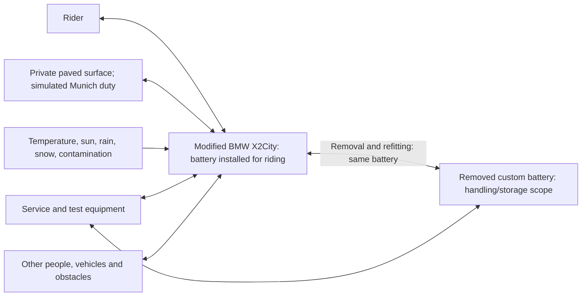

# PD-001 — Project Definition

## Electrical Re-Engineering of a BMW X2City Scooter

Defines project scope, boundaries, objectives, constraints and qualification basis. Detailed rider behavior, item interactions and approved requirements are maintained in the [requirements workstream](.devenv/Requirements/README.md). The built battery and selected BMS are fixed inputs; the reviewed [component architecture](.devenv/Architecture/SystemArchitecture/ARCH-001_System_Architecture.md#release-identity) is released, with detailed engineering and qualification still open.

## Document metadata

| Field | Value |
|---|---|
| Document / owner | PD-001 / Dominik |
| Revision / date | **1.5 Draft / 2026-09-14** |
| Status | **Draft change to released PD-001-R1.1; owner-authorized battery, temperature, traction-board and vehicle-controller decisions** |
| Release / prior baseline | PD-001-R1.1, approved 2026-09-09, remains the historical release in [Git](.devenv/Requirements/README.md#release-and-history); this working revision is not released |
| Change basis | Built 14S5P Samsung 35E pack, JBD SP14S004P14S50A/UART selection, −10°C riding minimum, assumption-based mass planning and derived integration obligations; selected unmodified DRV8300DRGE-EVM and WeAct STM32H723VGT6 vehicle host; DEC-BAT-002 / DEC-MAS-001 / DEC-MOTOR-001 |
| Repository role | Sole current PD; original released bytes and prior versions retained in Git history |
| Downstream use | Concept, hazard analysis, requirements and targeted feasibility characterization, subject to the recorded open-issue gates |
| Configuration | [Release authority and Git history](.devenv/Requirements/README.md#release-and-history); current authority is recorded below |

### Approval record

On 2026-09-09 Dominik, project owner, confirmed review of the current PD and instructed its release: “I have reviewed the current PD. Release it.” The complete Revision 1.1 is approved and released as **PD-001-R1.1** with its stated assumptions and controlled open issues. Release preparation changes only administrative metadata and release records; no independent review or new component/vehicle validation is claimed. The owner subsequently reviewed and released the item definition, requirements and supporting records as documented in the workstream index.

Revision 1.2 incorporates the owner's subsequent fixed-pack/BMS, temperature and storage decisions. The approval above applies to historical Revision 1.1, not this changed working document.

### Normative language

**Shall**: mandatory project constraint/objective. **Should**: preference, changeable with recorded justification. **May**: permission. Detailed technical requirements are maintained separately.

## Information-status convention

| Status | Meaning |
|---|---|
| CONFIRMED | Physical inspection, direct project knowledge, measurement or prior successful implementation |
| DESIGN DECISION | Owner choice recorded for this revision; does not itself establish document release or verification |
| REPORTED SPECIFICATION | Supplied/reported component value, not independently verified here |
| ASSUMPTION | Provisional input requiring confirmation, restriction or rejection |
| DERIVED VALUE | Calculation/consequence; inherits input uncertainty |
| OPEN ISSUE | Unresolved information or decision |

Selection of a component does not verify its ratings. Owner decisions are not measured performance; synthetic traffic assumptions are not measured Munich statistics. Unless stated otherwise, project obligations below are DESIGN DECISIONS; component evidence and provisional values retain their explicit status.

## Contents

1. [Purpose](#1-purpose)
2. [Project objectives](#2-project-objectives)
3. [Engineering-process position](#3-engineering-process-position)
4. [Item definition](#4-item-definition)
5. [System and project boundaries](#5-system-and-project-boundaries)
6. [Intended use](#6-intended-use)
7. [Operational scenarios and reasonably foreseeable misuse](#7-operational-scenarios-and-reasonably-foreseeable-misuse)
8. [Operating environment](#8-operating-environment)
9. [Vehicle operating states](#9-vehicle-operating-states)
10. [Existing component selections and project inputs](#10-existing-component-selections-and-project-inputs)
11. [External and boundary interfaces](#11-external-and-boundary-interfaces)
12. [Derived values and preliminary consistency checks](#12-derived-values-and-preliminary-consistency-checks)
13. [Project constraints](#13-project-constraints)
14. [Assumptions](#14-assumptions)
15. [Unresolved issues](#15-unresolved-issues)
16. [Decisions deliberately deferred](#16-decisions-deliberately-deferred)
17. [Explicitly excluded functionality and activities](#17-explicitly-excluded-functionality-and-activities)
18. [Configuration and release authority](#18-configuration-and-release-authority)
19. [Sources and evidence](#19-sources-and-evidence)

## 1. Purpose

Develop a functioning, maintainable, one-off personal scooter from the BMW X2City donor, solely for private-property use. A morning/evening commute is the sizing and validation reference; Munich and Olympiaberg describe simulated duty, not public riding locations. Electrical engineering is the primary educational content; process learning is secondary. Produce usable hardware and proportionate verification evidence.

Fixed starting components, custom-development commitments and project/vehicle boundaries are in §§4–5; mission/performance/SOC limits in §6. ISO 26262 supplies discipline, with no compliance, certification or ASIL objective (§3).

## 2. Project objectives

### OBJ-001 — Functional commuter vehicle

Meet RJ-001 and the separate new-battery RQ-001 qualification (§6): 2 × 20 km/day, five days/week; ≥70 km level range within actual SOC 20–80%. Preserve ≥100 kg payload within 130 kg total / 30 kg vehicle mass. Energy, mass, packaging and motor feasibility remain unproven.

### OBJ-002 — Electrical-engineering focus

Integrate and qualify the already built removable battery pack; integrate the owner-selected DRV8300DRGE-EVM traction board with required adapter/protection, and develop embedded vehicle software. Develop vehicle supervision and a separate controller if needed; the selected off-the-shelf BMS and commercial constituent components are included (§5.4). Mechanical integration and suitability verification support this scope.

### OBJ-003 — Controlled and predictable propulsion

Provide predictable rider-commanded propulsion throughout the validated domain. Address unintended sustained propulsion, uncontrolled acceleration and unexpected torque after startup, reset, fault recovery or reconnection in downstream safety/requirements work.

### OBJ-004 — Preserve independent mechanical control

Retained steering and both mechanical brakes shall remain usable independently of EPCS/electrical power. Integration shall preserve steering/lever travel, rider grip, mechanical actuation, wheel rotation, bell and kickstand use.

### OBJ-005 — Safe electrical-energy handling

Develop and verify the installed battery, distribution, wiring and connected vehicle components against credible electrical, thermal, environmental and misuse hazards, including short circuits, overheating, damaged batteries and connectors.

### OBJ-006 — Integrate the installed hub motor

Characterize and integrate the installed direct-drive rear hub motor with compatible power, sensing, protection and control. It remains the baseline unless evidence shows it cannot meet the required operating, mechanical, thermal and safety envelope.

### OBJ-007 — Integrate the selected rider interfaces

Use the high-voltage VD18MT, selected three-wire Hall accelerator, retained brake-lever contacts with the fixed coded two-wire Y interface (§10.6), and retained lights. Characterize their integration limits.

### OBJ-008 — Reuse verified HMI protocol knowledge

Preserve and reuse the prior successful VD18MT UART implementation as the protocol reference; verify final integration against it (§10.4). Reopen discovery only if incompatibility evidence requires it.

### OBJ-009 — Reliability, maintainability, and diagnosability

Support repeated use, inspection, maintenance and diagnosis through documented interfaces, configuration and procedures. Each normal/unexpected restart performs fresh self-tests; no past-failure history persists. Coverage and measurable completion follow DEC-FLT-007 / OI-047–049.

### OBJ-010 — Evidence-based release

Begin regular commuter use only after donor inspection, electrical verification, staged vehicle integration and important failure-response evaluation; no critical safety anomaly may remain open. Identify the as-built configuration and release only the validated private-property operating envelope.

### OBJ-011 — Useful engineering evidence

Keep important decisions reconstructable through proportionate objective–assumption–hazard–requirement–design–implementation–test–anomaly–release traceability. Documentation volume is not a success measure.

### OBJ-012 — Defined performance and environmental capability

Meet PERF-001–008, the mass limits and −10 °C to +40 °C riding domain (§§6, 8), including wet pavement/light snow and ≥168 h unattended outdoor storage. Reference full performance is dry/+20 °C; permitted adverse-weather reductions apply only within validated operating limits.

### OBJ-014 — Battery SOC operating policy

All thresholds below are **actual battery SOC**:

| Condition | Project policy |
|---|---|
| At/below 20%, before the 10% cutoff has been reached | Drastically reduce maximum positive torque and propulsion speed; numerical caps determined during system validation |
| At/below 10% | Stop positive propulsion; retain this inhibition until SOC exceeds 20% |
| Above 20% | Automatically restore normal propulsion capability, subject to other permissives |
| Regeneration | Maximum 90%, only when all operating/safety/charge-acceptance limits permit |
| Energy above 80% recovered by regeneration | Available for ordinary propulsion; excluded from RQ-001 |
| RQ-001 qualification and initial capacity sizing | Use only the 20–80% interval; no preliminary regenerative-energy credit or guaranteed extra distance |

Low charge alone preserves otherwise permitted regeneration. Powered HMI/lighting continue wherever electrical protection permits. The 10% propulsion cutoff is not an all-load protection floor; derive auxiliary/storage allowances and conservative SOC margins without reducing the 70 km qualification.

[DEC-SOC-001](.devenv/Requirements/DEC-001_Decisions_and_Open_Issues.md#dec-soc-001) and REQ-001 govern transitions, ramps and low-charge indication. [DEC-FLT-005–009](.devenv/Requirements/DEC-001_Decisions_and_Open_Issues.md#dec-flt-005), DEC-TMP-001–002 and DEC-HMI-002/005 govern SOC qualification, common faults and displayed charge. Estimation, protection, balancing, charge acceptance, exact margins and retained-cutoff continuity remain downstream (§15).

## 3. Engineering-process position

### 3.1 Use of ISO 26262

Tailor ISO 26262-inspired item/scenario/hazard analysis, safety goals, requirements, interface definition, traceability, configuration/change control, staged verification, anomaly management and release reasoning to improve this one-off vehicle’s quality, safety and function. Process learning is secondary.

### 3.2 Compliance position

No ISO 26262 compliance/certification, formal ASIL or series-production evidence is targeted or claimed. Use terminology only where useful and accurate.

### 3.3 Broader safety scope

Assess the complete vehicle, including electrical/battery/energy/thermal hazards, unintended propulsion/braking/drag, mechanical integration, steering/braking preservation, environment, wiring/connectors, maintenance and misuse. Scope extends beyond electronic-control malfunctions.

## 4. Item definition

### 4.1 Item name

**Modified BMW X2City personal electric scooter**

### 4.2 Item purpose

Transport one adult and personal luggage on private property through rider-controlled electric propulsion, manual steering and front/rear mechanical braking; §6 defines the reference duty.

### 4.3 Item composition

The safety item is the complete modified scooter: retained platform (§4.5), installed motor, VD18MT and Hall accelerator (§10), custom removable battery, inverter, EPCS functions, and all required mounting, enclosures, protection, wiring, software and calibration. The selected BMS and built cell bank are fixed by §10.8.

### 4.4 Primary development system

The **Electrical Propulsion and Control System (EPCS)** includes traction storage/battery supervision, high-current distribution, motor control and permitted accelerator-requested regeneration, low-voltage supply, rider/brake-input acquisition and validity, vehicle supervision, HMI, lighting, diagnostics, wiring, software and calibration. Make-or-buy commitments are in §5.4.

The complete scooter remains the hazard-analysis/vehicle-validation item because safety depends on EPCS interaction with the rider, retained mechanics, surface and environment.

### 4.5 Retained donor platform

**CONFIRMED:** frame/deck, steering column/handlebar/fork, front wheel, rear-wheel structure with replacement hub motor, both mechanical brakes/levers and their normally open contacts, front/rear lights, kickstand and mechanical bell. The selected coded brake networks/Y are detailed in §10.6.

Retained parts remain inside the item and require inspection, necessary characterization and suitability verification. They are not primary redesign content.

### 4.6 Removed original components

**CONFIRMED removed:** OEM traction battery, motor/controller, display, throttle pedal and associated active propulsion electronics. Compatibility with or recreation of those electronics is excluded.

## 5. System and project boundaries

### 5.1 Vehicle item and project boundary

The **vehicle item** is the complete modified scooter in its riding configuration, including its installed removable battery, hardware, software, calibration, wiring and retained components. The broader vehicle project also covers normal removal/refitting, exposed-empty-bay behavior and storage of the same pack when detached.

This is a **functional context**, not a circuit architecture. The two battery configurations represent the **same physical pack**, not two batteries. Installed regenerative charging is a riding function within the vehicle item. The vehicle project owns its battery docking interface, pack retention, safe handling, exposed contacts, refitting and detached-pack storage.

### 5.2 Inside the vehicle item

The riding item includes the retained/selected hardware in §4 and custom EPCS development in §5.4, including the installed battery, docking/retention, low-voltage power, protection, harnesses and mechanical/thermal integration. Required vehicle supervision is included regardless of whether a separate controller is selected. The same pack remains in handling and storage scope when removed (§5.1).

### 5.3 External entities

Rider, site/surface/infrastructure, surrounding people/vehicles, weather and workshop tools are external to the vehicle. Public-road jurisdiction/approval/registration/insurance work is excluded; that scope boundary does not eliminate responsibilities toward people/property.

### 5.4 Custom development and permitted purchased content

| Area | Project commitment | Status |
|---|---|---|
| Battery pack | Integrate the owner-built, working, bay-fitting 14S5P Samsung INR18650-35E pack; qualify enclosure, interconnections, thermal/protection integration and removability | CONFIRMED construction/initial fit; DESIGN DECISION integration |
| BMS | JBD SP14S004P14S50A selected; UART interaction required. Actual configuration, electrical interface and protection compatibility remain to be qualified | DESIGN DECISION |
| Inverter | Owner-selected unmodified DRV8300DRGE-EVM is the traction-board baseline; develop required host/adapter, independent protection and control implementation | DESIGN DECISION |
| Vehicle controller | Owner-selected WeAct STM32H723VGT6 V1.2 hosts vehicle supervision and motor control; qualify its power, resource and EVM interface integration | DESIGN DECISION |
| Embedded software | Develop and integrate the required vehicle control, communications and diagnostics software; reuse existing verified HMI protocol work | DESIGN DECISION |
| Selected motor, display, and accelerator | Characterize and integrate; do not redesign their internal product functions | DESIGN DECISION |
| Remaining electronics | Select or develop according to requirements and resources; no additional make-or-buy commitment is implied | OPEN ISSUE |

### 5.5 Supporting engineering

Include donor inspection, characterization, electrical/thermal/EMC design, wiring, diagnostics, mounts/enclosures, torque reaction, safety analysis, staged verification and configuration/release control. Preserve handling/folding and user-removable battery access; no separate folding optimization target. Larger energy capacity, speed and winter exposure require retained-part suitability evidence. A need for fundamental mechanical redesign requires a controlled scope decision.

### 5.6 Project resources and delivery constraints

| Resource | Status / constraint |
|---|---|
| Four-channel oscilloscope, multimeter, soldering iron, basic tools | Owner-supplied ASSUMPTION of access; ratings unspecified |
| Missing tools/components | Purchase permitted; no numerical budget or unlimited-spending commitment |
| Private test site | Owner-CONFIRMED unrestricted access; task-specific physical suitability still checked |
| Schedule | No fixed timeframe/deadline |
| Fabrication/specialized testing | May be obtained; unspecified existing access is not assumed |

Before each activity verify suitable ratings, probes, fixtures and additional capabilities; the equipment list is not proof of battery/inverter/environment/vehicle test readiness. Record expenditure decisions before commitments (OI-009/060).

## 6. Intended use

### 6.1 Actual use and reference mission

| ID | Intended-use statement | Status |
|---|---|---|
| IU-001 | One adult, no passenger | DESIGN DECISION |
| IU-002 | Owner is primary rider/maintainer | ASSUMPTION |
| IU-003 | RJ-001: 20 km outward + 20 km return, five days/week | DESIGN DECISION |
| IU-004 | Private-property use only | DESIGN DECISION |
| IU-005 | ≥100 kg payload including rider/clothing/luggage and separately carried equipment | DESIGN DECISION |
| IU-006 | ≤130 kg total scooter-plus-carried mass | DESIGN DECISION |
| IU-007 | One-off personal vehicle; no commercial/rental/fleet use | DESIGN DECISION |
| IU-008 | Paved dry/wet/light-snow surfaces within §8 | DESIGN DECISION |
| IU-009 | Munich is simulation context only | DESIGN DECISION |
| IU-010 | Starts, manoeuvring, cruising, braking/stops and hills at dry/+20 °C reference; §8 reductions allowed | DESIGN DECISION |
| IU-011 | Daylight and darkness | ASSUMPTION for winter commuting |
| IU-012 | Outdoor sun/rain/snow exposure | DESIGN DECISION |
| IU-013 | No flooding, immersion or pressure washing | DESIGN DECISION |
| IU-014 | No racing, jumping, stunts or unpaved off-road use | DESIGN DECISION |

### 6.2 Project mass limit, minimum payload and donor reference

The project maximum total mass is **130 kg** and the minimum usable payload is **100 kg**. Together they impose:

$$
m_{\text{vehicle,max}}=130-100=\boxed{30\ \text{kg}}.
$$

| Quantity | Definition | Status |
|---|---|---|
| Project maximum total mass | **130 kg**, for load-dependent sizing and qualification | DESIGN DECISION |
| Minimum available payload | **100 kg**, including rider, clothing, luggage and separately carried equipment | DESIGN DECISION |
| Maximum ready-to-ride vehicle mass | **30 kg**, including installed battery, motor, all fitted electronics and required riding equipment | DERIVED VALUE |
| Modified vehicle mass | Assumption-based planning budget in DV-012; complete-vehicle weighing deferred to mass acceptance / mass-dependent physical qualification | ASSUMPTION now; verification OPEN ISSUE |
| Actual available payload | 130 kg minus actual ready-to-ride mass; shall be **at least 100 kg** | DERIVED VALUE / DESIGN DECISION |
| Original donor permitted total mass | 150 kg, historical donor rating; not the active project limit | REPORTED SPECIFICATION [S1][S1] |
| Original complete scooter mass | 21 kg; not a measurement of the modified scooter or stripped carrier | REPORTED SPECIFICATION [S2][S2] |

Use the explicit DV-012 planning allowances for the carrier, installed replacement motor, remaining electronics and pack. The owner has no scale and authorizes proceeding with assumptions; the historical 21 kg donor figure does not establish an actual mass or proven pack allowance. Meeting range by reducing payload below 100 kg fails scope. A lower total mass does not prove 40 km/h, hill or environmental suitability.

### 6.3 Reference journey — RJ-001

| Parameter | Baseline | Status |
|---|---|---|
| Purpose | Morning home-to-work journey and evening return | DESIGN DECISION |
| One-way distance | **20 km**, including its reference hill sections | DESIGN DECISION |
| Daily distance | **2 × 20 km = 40 km** | DESIGN DECISION / DERIVED VALUE |
| Frequency | **5 days per week** | DESIGN DECISION |
| Weekly distance | **200 km**, ten one-way journeys | DERIVED VALUE |
| Reference environment | **+20 °C ambient, dry paved surface** | DESIGN DECISION |
| Qualification mass | **130 kg total** | DESIGN DECISION |
| Simulated setting | Munich inner-city stop/start travel, including an Olympiaberg-inspired grade | DESIGN DECISION |
| Full-stop frequency | **2 intermediate full stops/km**; Section 6.4 derives this provisional estimate | DERIVED VALUE from ASSUMPTIONS |
| Stop dwell | **30 s** per intermediate stop | ASSUMPTION |
| Speed between stops | **30 km/h nominal level-section cruise target**, with 20 and 40 km/h sensitivity cases; Section 6.4.1 | ASSUMPTION informed by municipal context |
| Vehicle maximum speed | **40 km/h**; not the journey average | DESIGN DECISION |
| Grade duty | At least 100 m at +14%, sustained climb ≥10 km/h, uphill launch; at least 100 m at −14%, reference descent 20 km/h | DESIGN DECISION |
| Grade-event frequency | One ascent/descent pair per 20 km leg | ASSUMPTION accepted as the initial release basis |
| Detailed route trace | A reproducible synthetic trace, not an actual public-road route; precise event positions and partial slowdowns follow in requirements/simulation | ASSUMPTION / OPEN ISSUE for implementation |

Each full stop reaches zero. Forty intermediate stops exclude departure/arrival; any hill-start stop counts within those forty. Hill lengths replace part of the 20 km course. Standstill launch and sustained uphill speed are separate cases. Winter performance follows §§6.5–6.6; no full-performance winter-distance guarantee is implied.

### 6.4 Derivation of the Munich stop-frequency estimate

**Source/assumption boundary:** Municipal descriptions report often-below-300 m intersections and signal coordination disrupted by traffic, crossings and public-transport priority; they give no measured route stop rate. [S3][S3] [S4][S4] Model 300 m controlled-event spacing, 0.50 stopping probability and one additional stop per 3 km; none is a surveyed route average/probability.

$$
n_\text{stop} = \frac{1}{0.300\ \text{km}}\times0.50+\frac{1}{3\ \text{km}} = 2.0\ \text{stops/km}.
$$

This gives an equivalent mean spacing of **500 m between full stops**, with the following consequences:

| Duty | Baseline at 2 stops/km | Sensitivity at 1–4 stops/km |
|---|---:|---:|
| 20 km one-way journey | 40 stops | 20–80 stops |
| 40 km day | 80 stops | 40–160 stops |
| 200 km week | 400 stops | 200–800 stops |
| 70 km flat-ground range duty, RQ-001 | 140 stops | 70–280 stops |

Use the 1–4 stops/km sensitivity until replaced by a route-specific trace. The baseline is not worst congestion; route, timing, speed and partial slowdowns affect it. No 40 km/h green-wave benefit is assumed.

### 6.4.1 Reference between-stop speed estimate

Municipal end-of-2022 30 km/h-or-lower street context and typically 20 km/h cycling signal progression motivate a **30 km/h nominal level cruise assumption**, with 20/40 km/h sensitivities. These are neither measured route averages nor additional vehicle speed caps; network share is not route-weighted speed. [S10][S10] [S11][S11]

For the provisional RJ-001 model, use the assumptions below. For RQ-001, DEC-RNG-002 has since fixed these nominal speed/ramp/dwell inputs, zero endpoint speeds and uniform 141-segment trace as qualification conditions; only physical trace-following tolerances remain open. Their traffic-estimate origin remains unverified.

| Trace input | Initial model value | Status |
|---|---|---|
| Level-section cruise target | 30 km/h | ASSUMPTION |
| Level acceleration ramp | Constant 0.5 m/s² for the synthetic trace | ASSUMPTION; the product requirement is only the average from 0 to 20 km/h |
| Routine deceleration ramp | 1.0 m/s² | ASSUMPTION; not an emergency-braking requirement |
| Intermediate stops | 2/km, 30 s each | Retained ASSUMPTIONS |
| Initial and final speeds | Zero | ASSUMPTION for simulation |
| Event spacing | Initially uniform, with actual start/end events counted explicitly; hill events substitute within RJ-001 | ASSUMPTION |
| Regenerative energy credit | None for initial capacity sizing | DESIGN DECISION; selected regeneration does not relax the sizing basis |

At 30 km/h, assumed acceleration/deceleration distances are 69.4/34.7 m, fitting the approximate 500 m spacing. DV-013 gives elapsed-time results, not journey-time or consumption requirements. Baseline precise partial slowdowns, event positions and control-compatible ramps downstream; assess range/sizing impact of trace changes. RQ-001 does not guarantee 70 km at continuous 40 km/h.

### 6.5 Gradient and performance requirements

**Common reference:** 130 kg total mass, +20 °C ambient and dry pavement. Under DEC-PERF-001, PERF-001–004 propulsion targets apply only in active Level 5 with full accelerator demand; RQ-001 separately uses Level 5 with trace-following demand under DEC-RNG-001/002. For flat-ground maximum-speed and acceleration qualification, the battery begins at the **normal upper charge limit of 80% actual SOC**, subject to any conservative control tolerance. Full charge never means authorization to charge to 100% actual SOC.

| ID | Project-level requirement | Status |
|---|---|---|
| PERF-001 | Achieve a **40 km/h maximum operating speed** on level ground under the common reference and full normal charge; sustained travel just below 40 km/h is acceptable within a tolerance determined during system validation | DESIGN DECISION |
| PERF-002 | Achieve **average acceleration ≥0.5 m/s² from 0 to 20 km/h** on level ground under the same conditions; equivalent elapsed time ≤11.11 s | DESIGN DECISION / DERIVED VALUE |
| PERF-003 | Sustain **at least 10 km/h** up a **14% grade for at least 100 m** at the common reference | DESIGN DECISION |
| PERF-004 | Start from rest on a **14% uphill grade** at the common reference; launch response and rollback tolerance to be derived | DESIGN DECISION / OPEN ISSUE for detailed acceptance |
| PERF-005 | Support controlled descent at **20 km/h reference speed**, down a **14% grade for at least 100 m**, including at the **90% actual-SOC regenerative ceiling** when regeneration is unavailable | DESIGN DECISION |
| PERF-006 | Preserve front and rear mechanical braking independently of electrical operation and regenerative availability; permitted accelerator-requested regeneration may act alongside mechanical braking | DESIGN DECISION |
| PERF-007 | Permit reduced acceleration, power and speed during cold operation within applicable temperature limits according to validated realization limits; recognized upper/lower temperature-limit violations instead invoke the common fault response under DEC-TMP-001 | DESIGN DECISION |
| PERF-008 | Permit reduced performance in wet or snowy conditions; full ±14% hill performance is required only at +20 °C in dry conditions | DESIGN DECISION |

Accelerator-requested regeneration is supplemental in Levels 1–5; Level 0 coasts at rest. Mechanical brakes remain independent/additive and levers do not request regeneration. [DEC-001](.devenv/Requirements/DEC-001_Decisions_and_Open_Issues.md) and [REQ-001](.devenv/Requirements/REQ-001_Requirements.md) own detailed torque, profile, startup, speed, fault and lighting behavior. Interpretable VD18MT limits above 40 km/h clamp to 40; decoded zero means no limit requested and also sets 40, including startup; changes require simultaneous standstill/physical accelerator rest (DEC-SPD-001). PERF-001 accepts sustained travel just below 40 km/h; system validation shall determine the tolerance (OI-054 / WS-OI-013), preserving mandatory zero commanded torque at/above 40 km/h.

Grade is rise/horizontal distance, not degrees. The owner-defined 14%/100 m reference is not a surveyed Olympiaberg path; initial modelling treats 100 m as slope length (13.9 m elevation). Average acceleration is Δv/Δt, with no constant-waveform or above-20 km/h minimum implied. Hill launch and sustained climb are separate tests. Hill qualification within 20–80% remains required; derive SOC points/tolerances against restricted entry at 20%. Descent assessment covers recovered charge up to 90% and reduced/unavailable regeneration. Flat-performance start remains ≤80%.

Cold/wet/snow reductions preserve controllability, independent braking, warnings and component protection. No full hill/speed/range guarantee applies in those conditions. Recognized component-temperature limit violations instead invoke common **both-sign torque inhibition**, block Ready and require a qualifying restart even after normalization (DEC-TMP-001); qualified required temperature information also gates Ready (DEC-TMP-002). Ambient range does not establish component limits. Remaining coverage, timing, margins and report arbitration are in the workstream issues.

### 6.6 Range, reserve, and energy sizing

The **range-qualification profile RQ-001** is separate from the hilly reference commute RJ-001.

| Parameter | Qualification condition | Status |
|---|---|---|
| Minimum distance | **At least 70 km on one normal charge** | DESIGN DECISION |
| Surface and gradient | **Level paved ground**, nominally 0%; no hill events | DESIGN DECISION |
| Ambient temperature | **+20 °C** | DESIGN DECISION |
| Total vehicle and carried mass | **130 kg** | DESIGN DECISION |
| Battery age | **New / beginning of life** | DESIGN DECISION |
| Qualification charge window | **Actual SOC shall remain at least 20% and shall not exceed 80%; energy recovered above 80% is excluded from the 70 km qualification** | DESIGN DECISION |
| Starting charge | Normal full charge, **no more than 80% actual SOC** | DESIGN DECISION |
| Finishing charge | **At least 20% actual SOC remains at the RQ-001 endpoint**; no additional guaranteed distance. Any subsequent restricted propulsion below 20% is outside the qualification | DESIGN DECISION |
| Additional user-available reserve | **None required beyond 70 km** | DESIGN DECISION |
| Intermediate energy replenishment | None | DESIGN DECISION |
| Stop and speed model | Active Level 5; 140 uniformly spaced intermediate full stops, 30 s dwell, 30 km/h cruise, target 0.5/1.0 m/s² acceleration/deceleration; departure/arrival separate | DESIGN DECISION, DEC-RNG-001/002; [exact trace and remaining acceptance](.devenv/Requirements/System_Requirements/Vehicle_Qualification.md#nominal-reproducible-rq-001-trace); sensitivity cases remain models |
| Surface condition and wind | Dry pavement and negligible wind | ASSUMPTION for qualification |
| Initial battery temperature | Thermally stabilized near +20 °C | ASSUMPTION; exact tolerance downstream |
| Auxiliary loads | Normal riding functions operating, including HMI, controls and lights; exact loads and display settings recorded in the test | ASSUMPTION for qualification |
| Regeneration | May contribute within actual 20–80% SOC using DEC-RNG-001/002; no credit in preliminary sizing and no outside-window energy counts | DESIGN DECISION; complete physical trace-following acceptance under OI-053 / OI-059 |

#### Meaning of full, empty and low charge

Actual SOC 20–80% maps linearly to displayed 0–100%, clamped outside. Displayed empty means the normal range window is depleted: restricted propulsion begins at actual 20%, positive propulsion stops at 10%. Normal full charge is ≤80%; otherwise permitted regenerative energy above it is available for ordinary propulsion, excluded from RQ-001. Untrustworthy SOC displays empty solely as a display fallback, never as an actual SOC control value (DEC-HMI-002/005).

The maximum RQ-001 charge-capacity window is **60 percentage points**, not necessarily 60% of nameplate Wh because voltage varies with SOC. Size using actual interval energy and conservative uncertainty/loss/load margins (DV-011), with no preliminary regeneration credit. Engineering allowances shall not reduce the demonstrated 70 km. BMS voltage protection does not by itself enforce SOC; RQ-001 preparation shall not raise actual SOC above 80%.

Derive separate post-cutoff auxiliary, shutdown and storage consumption/protection allowances. Neither 20% range completion nor 10% propulsion cutoff grants indefinite storage or defines an all-load floor. Storage starts at normal full charge under §8.2; entry tolerance, self-discharge and required margins remain open; cell bank/BMS selection is fixed by §10.8; actual-SOC qualification and remaining protection architecture are open.

#### Scope of the range guarantee

RQ-001 applies only to a new battery and its stated level/+20 °C conditions. No guarantee covers hills, cold/wet/snow, aged batteries or continuous 40 km/h; no numerical battery cycle life/end-of-life range is selected. Evaluate RJ-001 energy/power separately. Under identical consumption, 50 km after 20 km and 30 km after 40 km are arithmetic margins, not SOC percentages, extra reserve or demonstrated hilly range.

**DUR-001 — Vehicle service life (DESIGN DECISION, owner 2026-09-09):** 50,000 km or 5 years, whichever comes first. DEC-LIFE-001 fixes the origin at modified-vehicle commissioning and permits battery/normal wear-part replacement; retained donor age/wear remains separately assessed. OI-050 shall define maintenance and durability acceptance. This does not extend the new-battery RQ-001 range guarantee to end of life.

### 6.7 Battery preparation, parking, and handling

| ID | Intended-use statement | Status |
|---|---|---|
| IU-017 | ≥168 h unattended outdoor sun/rain/snow storage under §8 | DESIGN DECISION |
| IU-018 | Preserve donor handling and normal user battery removal/refitting | DESIGN DECISION |
| IU-019 | Inspect before use/after abnormal events; post-storage inspection allowed | DESIGN DECISION |
| IU-020 | Technically competent owner/maintainer | ASSUMPTION |
| IU-021 | Controlled private test access without owner restriction | CONFIRMED owner input |

Normal-full 80% actual-SOC entry is a vehicle qualification and storage precondition.

## 7. Operational scenarios and reasonably foreseeable misuse

Normal duty, faults, and misuse shall be distinguished. A scenario's inclusion does not require full functionality during misuse; it requires consideration of its risk and acceptable response.

### 7.1 Normal or exceptional operating situations

| ID | Situation | Classification |
|---|---|---|
| OS-001 | Repeated morning/evening urban-style stops, partial slowdowns, and restarts | Normal duty |
| OS-002 | +20 °C, dry reference hill: launch and ≥10 km/h sustained 14% ascent; 20 km/h 14% descent, including from normal-full 80% initial SOC and at the 90% regenerative ceiling when regeneration is unavailable | Intended performance duty |
| OS-003 | Cold-soaked startup, wet/light-snow riding and transition to dry storage or conditioning; reduced performance allowed | Intended environmental duty |
| OS-004 | At least one unattended week of outdoor parking/storage in sun, rain and snow; freezing, thawing and condensation | Intended parking/storage duty |
| OS-006 | Braking while the accelerator is still applied | Foreseeable rider action |
| OS-007 | Hand pushing/handling while off; forward/backward parking while still on after riding | No commanded regeneration until forward travel with applied positive motor torque resumes after each stop; DEC-REG-006. Passive drag and measurable transitions remain open. |
| OS-008 | Loss of power, a disconnected brake-input branch or trunk, a contact/bypass fault that can conceal lever actuation, sensor failure, or a communication failure | Fault condition, not automatically rider misuse; distinguish detected invalid brake input from faults that alias a valid state under §10.6 |

### 7.2 Foreseeable misuse and out-of-domain operation

| ID | Scenario | Reason for inclusion |
|---|---|---|
| FM-001 | Accelerator applied during startup or reactivation | Accidental or habitual control operation |
| FM-002 | Continuing propulsion demand while attempting to brake | Rider-control conflict |
| FM-003 | Unintended accelerator operation during carrying/handling with propulsion enabled | Accidental demand; intended hand parking is separately covered by OS-007 |
| FM-006 | Continued use with a degraded or maladjusted mechanical brake | Reduced braking capability |
| FM-007 | Continuing after a known brake-switch or other safety-related fault | Lost electrical input despite apparently working mechanics |
| FM-008 | Worn, damaged, underinflated, or seasonally unsuitable tyres | Reduced handling and traction |
| FM-009 | Exceeding 130 kg total mass or ignoring battery or carried-equipment mass; allocating less than 100 kg payload is a design nonconformance rather than rider misuse | Overload / mass-budget risk |
| FM-010 | Flooding, immersion, pressure washing, or other exposure beyond the defined environment | Water ingress beyond the intended domain |
| FM-011 | Riding after a crash or impact without inspection | Latent structural or electrical damage |
| FM-012 | Ignoring a fault indication or abnormal battery condition | Continued hazardous use |
| FM-013 | Grades or downhill durations beyond the reference envelope | Excessive braking, voltage, or thermal demand |
| FM-014 | Towing or externally spinning the driven wheel | Unexpected generated voltage or wheel forces |
| FM-015 | Prolonged near-stall operation beyond the reference hill duty | Excessive thermal stress |
| FM-016 | Unreviewed changes to firmware, limits, wiring, or calibration | Invalidated engineering evidence |
| FM-017 | Connector mis-mating or reverse polarity during service | Mixed-voltage interface exposure |
| FM-018 | Riding in a partly assembled condition | Missing retention, covers, or protection |
| FM-019 | Passenger riding, trailers, jumps, or stunts | Outside intended structure and handling use |
| FM-020 | Unpaved off-road terrain, deep snow, ice, or winter exposure beyond the validated domain | Not covered by the light-snow requirement |
| FM-021 | Riding on public roads or public paths | Outside the private-property-only scope |
| FM-023 | Using 40 km/h where snow, grip, visibility, or proximity to others does not permit controlled riding | The maximum speed is not an all-condition operating recommendation |
| FM-024 | Refitting a wet, damaged, incorrectly latched or incorrectly connected battery; leaving accessible contacts contaminated while the pack is removed | Removal/refitting introduces mechanical and electrical interface hazards |
| FM-025 | Bypassing OBJ-014 SOC limits or crediting energy outside 20–80% to RQ-001 | Permitted below-20% restricted propulsion and recovered above-80% energy remain outside range qualification |
| FM-026 | Leaving a nearly depleted usable-range battery unattended beyond its defined storage conditions | Protected SOC and storage-consumption risk |

## 8. Operating environment

### 8.1 Surface and use environment

| Attribute | Project definition | Status |
|---|---|---|
| Actual location | Private property only | DESIGN DECISION |
| Simulation context | Munich inner city and an Olympiaberg-inspired grade | DESIGN DECISION |
| Surface | Paved, dry/wet or lightly snow-covered | DESIGN DECISION |
| Reference journey | **+20 °C, dry pavement** | DESIGN DECISION |
| Light snow | A couple of centimetres; initial numerical interpretation **20 mm loose snow without underlying ice** | DESIGN DECISION qualitative / ASSUMPTION numerical |
| Reference grades | ±14% for ≥100 m, ≥10 km/h ascent and 20 km/h descent, uphill launch; **+20 °C and dry only** | DESIGN DECISION |
| Cold, wet and snow performance | Reduced acceleration, power and speed accepted; actual safe limits derived from realization and validation | DESIGN DECISION / OPEN ISSUE for limits |
| Obstacles and surface defects | Ordinary pavement irregularities; exact obstacle and pothole limits to be derived | OPEN ISSUE |
| Visibility | Day, twilight and darkness | ASSUMPTION consistent with commuting |
| Other people/vehicles | Possible interactions on the private site | ASSUMPTION |
| Off-road/deep snow/ice | Not intended; unexpected ice remains a foreseeable hazard | DESIGN DECISION |

Full reference hills need not be combined with wet/snow or −10 °C startup. Derive safe traction/cold/warning limits while preserving control, steering and mechanical braking. No minimum winter journey distance is specified. Recognized temperature-limit faults follow DEC-TMP-001 rather than continued reduced operation.

### 8.2 Ambient, parking and weather exposure

| Attribute | Project definition | Status |
|---|---|---|
| Riding ambient | **−10 °C to +40 °C**; owner revised minimum for selected 35E cells; actual cell limits/margins still apply | DESIGN DECISION, 2026-09-10 |
| Cold-start performance | Reduced acceleration, power and speed allowed according to validated system limits | DESIGN DECISION |
| Parking/storage ambient | **−15 °C to +40 °C**, under the specified vehicle conditions | DESIGN DECISION |
| Unattended outdoor duration | **At least one week (168 h)** | DESIGN DECISION / DERIVED VALUE |
| Weather exposure | Sun, rain and snow, including workday, overnight and week-long exposure | DESIGN DECISION |
| Parking configurations | Vehicle with battery fitted and with battery removed, leaving the empty bay exposed; detached pack has its own duty below | DESIGN DECISION, DEC-ENV-001 |
| Solar heating | Assess local component temperatures above ambient | DESIGN DECISION |
| Moisture | Rain, wheel spray, snowmelt, condensation, freezing and thawing | DESIGN DECISION |
| Contamination | Dust/grit and winter contamination; salt severity still to be set | DESIGN DECISION / OPEN ISSUE for severity |
| Residual stored energy | Account for pack and vehicle off-state consumption, SOC uncertainty and self-discharge during the storage duty | DESIGN DECISION; allowances OPEN ISSUE |
| Inspection after storage | Establish stored condition before normal temperature conditioning or energy preparation if needed, then pre-ride/refit/startup checks; no routine attendance during storage | DESIGN DECISION, DEC-STO-002 |
| Immersion/pressure washing | Not intended | DESIGN DECISION |

The same removed battery shall support **at least 672 h unattended dry indoor storage at 15–30 °C** ([DEC-STO-001](.devenv/Requirements/DEC-001_Decisions_and_Open_Issues.md#dec-sto-001)). Both battery storage duties require **normal full charge at 80% actual SOC**, subject to the qualified conservative preparation/control tolerance ([DEC-STO-002](.devenv/Requirements/DEC-001_Decisions_and_Open_Issues.md#dec-sto-002)). Entry below qualified normal full or above 80%, including up to 90% after regeneration, is outside these duration qualifications. This does not select forced discharge or guarantee immediate riding/remaining range afterward. Ordinary parking and handling retain their applicable protection requirements.

The HMI is reported for −15 °C to +40 °C operation and −20 °C to +50 °C storage; the latter does not enlarge the complete vehicle domain. [S5][S5] Derive exposure severities, solar/local temperatures, cycling, salt and normal-full entry tolerance; separately budget post-propulsion-cutoff loads. Donor ratings do not verify expanded winter/weather capability: assess tyres, brakes, steering, removal hardware and seals. [S2][S2]

### 8.3 Mechanical and electromagnetic environment

Road-induced vibration, handling shocks, motor torque reaction, steering-induced harness flexing, and electrical switching near sensor wiring shall be considered. Rider-accessible interfaces require consideration of electrostatic discharge and environmental contamination. Quantitative shock, vibration, ingress, solar-load, and electromagnetic-compatibility tests are downstream requirements, not selected test standards in this definition.

### 8.4 Battery handling and service environment

| Attribute | Project definition | Status |
|---|---|---|
| Battery handling | Battery is removed/refitted only through the defined normal sequence; the exposed bay and detached contacts retain their protection obligations | DESIGN DECISION |
| Installed charge acceptance | Selected 35E cell-surface charge range is 0…45°C for regeneration; derive stricter integrated limits/margins (§10.8) | REPORTED SPECIFICATION / remaining qualification |
| Condensation | Include cold-to-warm transfer and wet battery exterior handling before refitting or service | DESIGN DECISION |
| Workshop equipment | Four-channel oscilloscope, multimeter, soldering iron and basic tools assumed accessible; additional tools may be bought | ASSUMPTION / DESIGN DECISION |
| Test facilities | Controlled private-property access available; specific site suitability and equipment ratings checked before use | CONFIRMED input / downstream verification |

## 9. Vehicle operating states

These states describe **externally meaningful vehicle and removable-battery conditions**, not a prescribed controller state machine. Detached-pack storage may coexist with the vehicle parked without its battery. Parallel conditions shall not be forced into a single software state list.

| State ID | Operating state | Project-level meaning | Propulsion expectation | Status |
|---|---|---|---|---|
| VS-001 | Service-isolated | Propulsion energy source physically isolated or removed; stored/generated energy still considered | No propulsion | DESIGN DECISION |
| VS-002 | Parked / off | Vehicle outdoors, battery fitted or removed, including one-week unattended weather exposure | No commanded propulsion | DESIGN DECISION |
| VS-003 | Startup / initialization | Normal activation or unexpected restart, including refit/cold soak | Zero commanded torque of either sign until all freshly assessed Ready conditions pass; DEC-STA-001 | DESIGN DECISION |
| VS-004 | Ready | Qualified vehicle may accept deliberate rider demand | Readiness is not a torque request; apply current demand/operating permissives | DESIGN DECISION |
| VS-005 | Propelling | Reference or derated riding inside the SOC and environmental envelope | Controlled positive torque within the validated limits | DESIGN DECISION |
| VS-006 | Coasting / braking | Includes 20 km/h reference 14% descent at +20 °C dry; SOC may reach 90% through regeneration | Mechanical brakes remain independent; accelerator-requested regeneration in Levels 1–5 is subject to operating/safety limits and the 90% ceiling; Level 0 coasts at accelerator rest | DESIGN DECISION |
| VS-008 | Fault or performance-limited operation | Distinguish ordinary permitted weather/low-SOC reductions from faults | OBJ-014 governs low charge; DEC-FLT-007 / DEC-TMP-001–002 govern retained both-sign fault inhibition and fresh restart; DEC-FLT-009 preserves auxiliaries where protection permits | DESIGN DECISION; response details OPEN ISSUE |
| VS-009 | Shutdown | Transition out of active use, including end of usable range | No new propulsion request; account for residual energy demand | DESIGN DECISION |
| VS-010 | Diagnostic / development | Deliberate test/calibration/service activity | Energization or wheel rotation explicitly controlled in test context | DESIGN DECISION |
| VS-011 | Battery removal / refitting | Normal user handling between installed and removed pack configurations | No commanded propulsion during the handling operation | DESIGN DECISION |
| VS-012 | Removed-battery storage | Detached pack idle or cold-soaked within the defined storage duty | No vehicle propulsion from the detached pack | DESIGN DECISION |

Additional scenarios include pushing, carrying, wheel-off-ground testing, tip-over, connector contamination and cold-to-warm condensation. Detailed thresholds, transition logic, safeguards and software allocation are deferred.

## 10. Existing component selections and project inputs

### 10.1 Mechanical donor platform

Retained hardware is listed once in §4.5; mass definitions and historical donor ratings are in §6.2. Preserve normal pack removal/refitting with the custom battery; docking, retention, fitted-part identity and expanded-duty suitability remain open.

### 10.2 Installed rear hub motor

| Parameter | Project record | Status |
|---|---|---|
| Installation | Built into the rear wheel | CONFIRMED |
| Motor type | Brushless, gearless direct-drive hub motor | CONFIRMED |
| Phase system | Three-phase motor connection | CONFIRMED |
| Rotor-position sensing | Three Hall outputs switch cleanly at 3.3 V during wheel rotation with +5 V to Vcc, common Gnd and external 3.3 V pull-ups | CONFIRMED OBSERVATION; topology/order unqualified |
| Temperature sensing | Temp-to-Gnd resistance 9.257 kilohm; housing IR measurement 23.8 °C after standing | CONFIRMED OBSERVATION; internal temperature/sensor type/curve unqualified |
| Main motor connection | Three motor phase conductors | CONFIRMED |
| Sensor connection | Six-pin Hall-sensor and temperature connector | CONFIRMED |
| Voltage | 70 V | REPORTED SPECIFICATION |
| Current | 20 A | REPORTED SPECIFICATION |
| Power | 1,000 W | REPORTED SPECIFICATION |
| Speed constant | 9.5 rpm/V, apparently at or near no load | REPORTED SPECIFICATION |
| Quoted torque | 25–38 N·m | REPORTED SPECIFICATION |
| Pole information | Documentation states “42 poles” in a manner that may mean 42 poles or 42 pole-pairs | OPEN ISSUE |
| Manufacturer and exact model | Unknown | OPEN ISSUE |
| Continuous and peak rating definitions | Not yet established | OPEN ISSUE |

The reported ratings shall be treated as preliminary sizing inputs until their definitions and applicability are verified. [MOT-001](.devenv/Motor/MOT-001_Motor_Interface_Evidence.md) is canonical for the measured phase, Hall and temperature-interface evidence and its limitations. [MCD-001 Hall-sensored FOC design](.devenv/Motor/MCD-001_Hall_Sensored_FOC_Technical_Design.md) selects the traction-control method and its 40-km/h voltage-headroom gate; it neither changes the target nor proves that the reported 9.5 rpm/V or 58.8-V outer-cell reference provides sufficient loaded operating margin.

### 10.3 Selected HMI

**DESIGN DECISION:** retain the high-voltage VD18MT. Five-pin connection, 5 V-class UART, pinout and prior communication are **CONFIRMED**; §11.4 and the independent interface reference own device details. Operating/storage ratings are **REPORTED**, not verified vehicle capability (§8.2). Selected-unit hardware/firmware identity, supply/brownout, current, power-lock and precise UART electrical limits remain open (OI-026–031). Protocol rediscovery is excluded (§10.4).

No distinct Ready or pending-setting indication is required (DEC-HMI-007). The scooter always takes the VD18MT-communicated level, with no required cross-boot restoration (DEC-LVL-003). Battery current shall be provided continuously to the VD18MT (DEC-HMI-008); report discharge/regenerative-current magnitude clamped to 51 A, or 0 A when current information is unavailable/invalid. Quantization, validity criteria, accuracy and update bounds remain OI-032 / WS-OI-009.

### 10.4 Existing VD18MT test implementation

**CONFIRMED owner-provided evidence:** the prior successful implementation established UART parameters, framing, message content, sequencing/timing, display reactions/requests and relevant startup/runtime behavior for its display configuration. Reference implementation: commit `30fcc91f2066eb2d2e554e1c2776fe32549a0752`, `src/VD18MT`; current independent protocol reference: [VD18MT interface](.devenv/VD18MT/VD18MT_Tongsheng_UART_Interface.md).

Preserve available source, definitions/message tables, traces, scripts/results, observations and display hardware/firmware identity under configuration control. Verify final integration against this reference. Basic rediscovery is excluded unless selected-unit incompatibility is evidenced; availability of a source reference does not invent missing test records or validate every project-specific display use.

### 10.5 Selected accelerator

**DESIGN DECISION:** selected hand-operated Hall accelerator. Three-pin connection is **CONFIRMED**; 3.3 V tolerance and analogue ratiometric output are **REPORTED**. Supply/ground/signal roles are expected, but physical pin order, actual supply/idle/full ranges, mechanical return/hysteresis/travel, mounting ergonomics and environmental suitability require characterization (OI-033–036). §11.5 defines the signal relation; no acquisition realization is selected.

### 10.6 Retained brake switches

**CONFIRMED retained hardware:** one normally open contact in each mechanical lever. **DESIGN DECISION:** the fixed terminal interface comprises passive, polarity-independent finite-resistance handle networks connected in parallel through a Y to one shared two-wire trunk. The left lever operates the front mechanical brake; the right operates the rear. Distinct left/right resistance coding provides four intended fault-free combinations: neither, left, right, both; invalid input means unknown actuation/identity.

The [Brake Input Reference](.devenv/Requirements/evidence/Brake_Input_Reference.md) is canonical for the adopted network/coding, four historical assembled-Y terminal measurements from one development assembly, and evidence limits. No historical sensing circuit, excitation, acquisition settings, thresholds, firmware or bring-up result is adopted as the sensing realization/evidence.

An open switch-only bypass can hide a press while retaining released resistance; component/resistive faults may alias valid codes. Y/trunk common paths prevent claiming independent safety channels or universal damage detection. Derive sensing, protection, diagnostics/coverage, code acceptance and residual-fault treatment downstream. OI-037/049 retain fitted BOM/tolerances, handle/connector identity, verification of left/front and right/rear mapping, contact resistance/bounce/closure point/minimum load, harness/fault envelope, environment and end-to-end verification. Terminal records do not prove production suitability. Preserve mechanical independence (OBJ-004 / CON-008).

### 10.7 Retained lights

**CONFIRMED:** front and rear lights retained. **Owner-provided interface:** rear light uses two wires, VCC/GND; normal rear illumination is dim and brake indication full brightness, without a separate brake wire. DEC-HMI-003 / DEC-LGT-001–002 define normal commands and brake-light behavior, including full rear brightness while powered with unqualified lever or actual-braking state. Realization remains open.

OI-038/039 retain verification of electrical serviceability, rated/permitted voltage, current, polarity/grounding, actual connector/pinout, dim/full suitability, internal electronics, undervoltage/overvoltage and environmental condition. Required vehicle lighting functions are defined; their electrical capability remains unverified.

### 10.8 Built battery and selected BMS

**CONFIRMED by owner, 2026-09-10:** a fabricated working pack fits the scooter bay, using **70 Samsung INR18650-35E cells in 14S5P**. **DESIGN DECISION:** use **JBD SP14S004P14S50A** and its **UART**. The owner confirms the BMS is connected but not fully configured; engineering shall derive and verify its configuration. Initial fit and construction are settled inputs; integration/qualification does not require repeating selection.

[BAT-001](.devenv/Battery/BAT-001_Selected_Pack_and_BMS.md) owns manufacturer provenance, pack arithmetic, UART information and compatibility qualifications. Derived nominal voltage is **50.4 V**, standard-capacity basis **16.75 Ah**, nominal-voltage energy product **844.2 Wh**, and bare-cell mass bound **3.50 kg**. None is measured complete-pack usable energy or mass. **58.8 V** is the full cell-test voltage reference, not an 80% actual-SOC setpoint. Ideal cell-bank continuous discharge/charge ceilings are **40 A / 10 A**, with stricter integrated riding and regenerative limits to be derived; the BMS's 50 A designation does not override them.

The owner revised riding ambient to **−10…+40°C** to address the cell discharge-temperature incompatibility. Cell-surface discharge limits are **−10…60°C** and charge-acceptance limits for regeneration are **0…45°C**; ambient permission does not prove permissible cell temperatures. Outdoor storage retains **−15…+40°C**. The BMS does not establish thermal coverage or enforce the existing fault policy by itself. DEC-TMP-003 permits propulsion at qualified discharge-only cell temperatures while regeneration is ordinarily unavailable; actual applicable operating-limit/information faults retain the common fault response.

Resolve the manufacturer's non-isolated UART restriction, actual board/firmware/settings, protection coordination and SOC calibration before dependent integration. Regeneration, range, mass, retention and weather qualification remain required. Loaded 40 km/h compatibility at the selected pack voltage is unresolved against the motor's reported speed constant; BAT-001 records the provisional calculation. The EVM host/adapter and protection augmentation remain to be designed and qualified.

## 11. External and boundary interfaces

### 11.1 Item-level external interfaces

| Interface ID | External entity | Interface description | Status |
|---|---|---|---|
| IF-EXT-001 | Rider | Standing support, steering, accelerator operation, brake operation, HMI interaction, bell operation, vehicle handling | CONFIRMED / DESIGN DECISION |
| IF-EXT-002 | Private paved surface | Tyre-road forces, shocks, ±14% grades, rolling resistance, wet and light-snow traction | DESIGN DECISION / DERIVED VALUE |
| IF-EXT-003 | Private-site surroundings | Interactions with people, vehicles, obstacles, and site operating arrangements; urban traffic represented in simulation | ASSUMPTION / DESIGN DECISION |
| IF-EXT-004 | Ambient environment | **−10 °C to +40 °C riding**, rain, snow, humidity, contamination, solar heating, and separate outdoor parking conditions | DESIGN DECISION |
| IF-EXT-006 | Service equipment | Programming, diagnostics, measurement, calibration, and electrical isolation | OPEN ISSUE |
| IF-EXT-007 | Outdoor parking environment | At least 168 h unattended with sunlight, rain, snow and −15 °C to +40 °C ambient; battery bay exposed when pack removed | DESIGN DECISION |

### 11.2 EPCS-to-retained-platform interfaces

The following interfaces connect new electrical development to retained or provided elements inside the vehicle item. Some of those elements, including the motor and HMI, also belong to the EPCS functional system; this table describes the development responsibility boundary, not their exclusion from the functional system.

| Interface ID | Retained or provided element | Interface type |
|---|---|---|
| IF-EPCS-001 | Rear hub motor | Three-phase power, Hall signals, temperature signal, mechanical torque, motor-generated voltage |
| IF-EPCS-002 | Left lever for front mechanical brake | Actuation represented through the shared resistance-coded two-wire Y interface in §11.6 |
| IF-EPCS-003 | Right lever for rear mechanical brake | Actuation represented through the same shared resistance-coded two-wire Y interface in §11.6 |
| IF-EPCS-004 | Front light | Electrical power and any switching function |
| IF-EPCS-005 | Rear light | Electrical power and any switching function |
| IF-EPCS-006 | VD18MT HMI | Battery supply, ground, switched power-lock line, and 5 V UART |
| IF-EPCS-007 | Accelerator handle | Sensor supply, reference ground, and ratiometric analogue signal |
| IF-EPCS-008 | Mechanical carrier | Component mounting, **battery removal/refitting and retention**, cable routing, heat transfer, vibration, environmental protection |
| IF-EPCS-009 | Mechanical brakes and steering | Preservation of clearance, travel, access, and electrical independence |

### 11.3 Rear hub-motor electrical interface

#### Phase interface

Three phase conductors are **CONFIRMED**. Each pair measured 0.56 ohm under unrecorded test conditions; this is line-to-line resistance, not a per-winding value. Phase identity/order/rotation, connector, conductor current/insulation capability, compensated winding resistance, inductance and phase-to-housing insulation require characterization (OI-020/024); see [MOT-001](.devenv/Motor/MOT-001_Motor_Interface_Evidence.md).

#### Hall and temperature interface

Six-pin connector functions are owner-identified as Vcc, Gnd, Temp, Hall1, Hall2 and Hall3; physical pin order remains open. Three Hall outputs switched cleanly at 3.3 V during wheel rotation with +5 V to Vcc, common Gnd and external 3.3 V pull-ups. Temp-to-Gnd measured 9.257 kilohm; the housing measured 23.8 °C by IR after standing, while internal sensor temperature remains unmeasured. These separate observations establish neither Hall make, topology/order/electrical angle nor an NTC identity/curve/location/limit. The eventual signal path is conditioning/acquisition → qualified Hall state → configuration-qualified electrical rotor sector/direction/edge time for traction; at rest a valid static state can support sector only after map/alignment qualification, without proving speed/standstill. See [MOT-001](.devenv/Motor/MOT-001_Motor_Interface_Evidence.md); OI-021–025 remain open.

#### Mechanical and environmental motor interface

Direct drive and retained rear brake are **CONFIRMED**; axle torque reaction is **DERIVED**. Inspect retention, alignment, cable exit/strain relief and sealing; measure loaded circumference/calibrate retained nominal 16-inch wheels independently of VD18MT wheel settings (DEC-SPD-002). Verify actual-speed accuracy and propulsion/regenerative torque capability (OI-011/013).

### 11.4 VD18MT HMI interface

The confirmed connector mixes battery-class supply/power-lock and 5 V UART conductors. The verified pinout and protocol are canonical in the [independent VD18MT interface](.devenv/VD18MT/VD18MT_Tongsheng_UART_Interface.md): black ground; green display RX; yellow battery P+; white display TX; red switched-P+ power lock (pins 1–5 respectively). Directions are from the display perspective.

Characterize supply/brownout and active/off current; power-lock voltage/drop/current/leakage/timing/abnormal behavior; exact UART levels/thresholds/unpowered behavior; connector/retention/sealing (OI-026–031). Power-architecture use of the lock line remains deferred.

### 11.5 Accelerator interface

For the reported ratiometric signal (§10.5), the derived normalized relation is

$$
r_\mathrm{ACC}=V_\mathrm{SIG}/V_\mathrm{SUP}.
$$

Verify physical supply/ground/signal pinout and voltage/range/return characteristics. Acquisition, thresholds, plausibility, filtering and numerical curves remain downstream; DEC-TRQ-001–003 govern the rider-level torque policy.

### 11.6 Brake-switch interfaces

Use the fixed shared terminal interface and evidence boundary in §10.6 / [Brake Input Reference](.devenv/Requirements/evidence/Brake_Input_Reference.md). IF-EPCS-002/003 identify mechanical-brake associations, not separate electrical lines. The mechanical association is left/front and right/rear; sensing/diagnostic realization remains open.

Detected-invalid input is unknown, not a physical press. DEC-FLT-002–003 / REQ-SYS-FLT-004–006 govern session torque/report inhibition and fresh normal/unexpected-restart assessment. DEC-LGT-001 separately requires full rear brightness while powered with invalid brake information, released after both levers are validly released and actual electrical braking ceases, even if fault inhibition remains. These responses imply no detection of electrically aliased faults; timing/coverage require derivation and verification.

### 11.7 Lighting interfaces

§10.7 fixes the owner-given rear VCC/GND interface and required dim/full function. Characterize front/rear electrical limits separately under OI-038/039. DEC-HMI-003 / DEC-LGT-001 govern lighting behavior, including brake priority; no dimming/supply topology is selected.

### 11.8 Battery removal and service interfaces

| Interface | Project-level definition | Status |
|---|---|---|
| Vehicle-to-pack interface | Normal removal/refitting, secure retention and electrical connection, no need to recreate removed BMW electronic protocols | DESIGN DECISION |
| Exposed bay/pack contacts | Handling, contamination, moisture and unintended connection considered in fitted, intermediate and detached configurations | DESIGN DECISION; safeguards downstream |
| Service | Controlled maintenance, firmware identification, measurements and diagnostic access | DESIGN DECISION; implementation OPEN ISSUE |

Preserving battery removability does not require electrical interchangeability with the removed OEM battery. It does require normal user removal/refitting rather than workshop disassembly. Existing mechanical interfaces shall be characterized before changing access or retention.

## 12. Derived values and preliminary consistency checks

All DV-001–013 are **DERIVED VALUES** for feasibility/consistency, inheriting the stated reported-data and modelling uncertainties. They select no component sizes and demonstrate no vehicle capability.

### DV-001 — Approximate no-load speed at 70 V

Reported $K_v=9.5$ rpm/V gives $n_0\approx K_vV=665$ rpm at 70 V. This is a near-no-load estimate; loaded speed depends on voltage, control, motor parameters/losses and load.

### DV-002 — Vehicle-speed relationship

For loaded circumference $C_\mathrm{wheel}$ (m) and wheel speed $n$ (rpm), $v=nC_\mathrm{wheel}60/1000$ km/h; at 665 rpm, $v=39.9C_\mathrm{wheel}$ km/h. Measure the retained nominal 16-inch wheel’s loaded circumference and verify calibration independently of rider VD18MT wheel settings (DEC-SPD-002). This does not demonstrate the 40 km/h loaded target.

### DV-003 — Idealized torque constant

The ideal conversion $K_t\approx60/(2\pi K_v)\approx1.0$ N·m/A is a plausibility check only. Phase/line, peak/RMS current and back-EMF conventions must be reconciled before use.

### DV-004 — Reported voltage-current product

$70\mathrm{V}\times20\mathrm{A}=1.4$ kW. Comparison with reported 1,000 W requires battery-versus-phase current and continuous/peak definitions.

### DV-005 — Torque, speed, and power consistency

At 1,000 W mechanical output, $P=T\omega$ gives 25 N·m at 382 rpm, 38 N·m at 251 rpm, or 14.4 N·m at 665 rpm. Reported ratings may describe different operating points/duty cycles; they are not assumed simultaneous.

### DV-006 — Pole-count interpretation

42 poles = 21 pole-pairs; 42 pole-pairs = 84 poles. At 665 rpm these imply approximately 233 or 466 Hz electrical frequency, respectively. Resolve before speed estimation/controller configuration.

### DV-007 — Direct-drive motor consequences

Wheel and motor speed are directly related; wheel rotation can generate voltage. Electrical faults may cause braking/drag as well as propulsion loss. Axle retention must withstand propulsion and regenerative torque. Verify motor/inverter regenerative envelope and battery charge acceptance (OI-048).

### DV-008 — Mission distance and reserve margins

$2\times20\times5=200$ km/week. Seventy kilometres equals 3.5 legs or 1.75 daily distances arithmetically; under identical level/+20 °C consumption, 50/30 km remain after 20/40 km. These are not SOC percentages, extra guaranteed reserve, lifetime or proof of hilly RJ-001 endurance. Below-20% energy remains outside RQ-001.

### DV-009 — Reference grade load

At grade 0.14, $\theta=\arctan(0.14)=7.97°$; 100 m slope length gives 13.9 m rise. With $m=130$ kg and $g=9.81$ m/s²:

$$
F_\text{grade}=mg\sin\theta\approx176.8\ \mathrm{N},\qquad T_\text{grade}=176.8r\ \mathrm{N\,m}.
$$

An illustrative **unmeasured 0.20 m radius** gives 35.4 N·m, 2.6 N·m below the reported 38 N·m upper figure, before rolling resistance, launch and margin. Unknown rating/duty definitions, actual radius, traction, thermals, battery and inverter capability prevent closing motor suitability. No 0.5 m/s² hill-start requirement follows from the level acceleration target.

Gravity-only ascent energy is 4.91 Wh; 10 km/h climb needs 491 W for 36 s/100 m. At 20 km/h descent, gravity supplies 982 W for 18 s. Add resistance, losses, transients and braking allocation; these are not component ratings or regenerative-energy credit. Applies to dry/+20 °C RJ-001, not level RQ-001.

### DV-010 — Speed, acceleration and repeated stops

$\bar a=(20/3.6)/t\ge0.5$ m/s² implies $t\le11.11$ s. At 130 kg, time-average net accelerating force is ≥65 N, before resistance; no constant waveform is required. The illustrative constant-0.5 m/s² trace covers 30.9 m to 20 km/h, not a separate distance requirement.

At 40 km/h, translational energy is 8.02 kJ = 2.23 Wh, four times the energy at the original reported 20 km/h. This compares braking energy, not stopping distance/suitability. [S9][S9] At assumed 30 km/h, energy per full acceleration is 1.25 Wh; two restarts/km give 2.51 Wh/km mechanically (4.46 at 40 km/h). The exact RQ-001 trace has 141 departures, giving 176.794 Wh translational acceleration work (2.52563 Wh/km); the [positive-traction model](.devenv/Requirements/System_Requirements/Vehicle_Qualification.md#fixed-pack-energy-and-motor-feasibility) accounts separately for acceleration/cruise resistance, losses and auxiliaries without double-counting braking resistance. Total consumption must also include boundary events, rotational inertia, rolling/aerodynamic resistance, auxiliaries, losses, partial slowdowns and any validated regeneration.

### DV-011 — Range sizing within the SOC window

For qualified battery-side RQ-001 consumption $e_\text{RQ}$ (Wh/km), including normal auxiliaries:

$$
E_\text{journey}\ge70e_\text{RQ},\qquad E_\text{available within 20–80\%}\ge E_\text{journey}+E_\text{necessary allowances}.
$$

The nominal charge-capacity window is 0.60 before margins. For capacity $Q_\text{full}$ (Ah), fractional actual SOC $z$, and relevant discharge voltage $V(z)$:

$$
E_{20\rightarrow80}=Q_\text{full}\int_{0.20}^{0.80}V(z)\,\mathrm{d}z\quad[\mathrm{Wh}].
$$

Use that integral, measured pack data or a suitable cell model. Only with approximately constant voltage and no further allowances does $E_\text{full}\gtrsim70e_\text{RQ}/0.60\approx1.667E_\text{journey}$. This is not a selected size or exact chemistry-independent Wh multiplier. No energy below 20% or recovered above 80% counts toward RQ-001; initial sizing credits no regeneration.

Selected pack references are 50.4 V, 16.75 Ah and 844.2 Wh on the standard-cell-test basis (§10.8); usable interval energy and system qualification remain open.

### DV-012 — Payload and vehicle mass budget

$m_\text{vehicle,max}=130-100=30$ kg, including fitted battery. Pack allowance is 30 kg minus the **actual rest-of-vehicle mass**, not the old complete-scooter mass. Count carried equipment once as fitted mass or payload.

**Current planning basis — assumptions, 2026-09-10:** the owner has no scale for the gutted scooter and authorizes assumption-based progress ([DEC-MAS-001](.devenv/Requirements/DEC-001_Decisions_and_Open_Issues.md#dec-mas-001)). The following engineering allowances support requirements, architecture and feasibility planning; they are neither measurements nor mandatory subsystem mass allocations.

| Mass item | Planning allowance | Boundary / basis |
|---|---:|---|
| Current scooter assembly without removable battery | **21 kg** | Includes retained running gear, the already installed replacement rear hub motor and any other currently fitted parts. Historical complete-donor mass supplies only a rough numerical reference; no removed-part credit or measured upper-bound claim. |
| Complete removable battery | **5 kg** | 3.50 kg bare-cell datasheet bound plus **1.50 kg assumed allowance** for BMS, interconnections, insulation, enclosure, connector and pack-side retention. |
| Remaining fitted equipment | **2 kg** | All additions absent from the current assembly/complete-pack allowance: inverter, controller, supplies, remaining harnesses, mounts and enclosures. Count already fitted components only once. |
| Planned ready-to-ride mass | **28 kg** | 21 + 5 + 2 kg; unverified estimate. |
| Unallocated headroom to 30 kg | **2 kg** | Planning reserve, not a demonstrated uncertainty bound. |

At this planning total, available payload is **102 kg** by subtraction from 130 kg; only **at least 100 kg** is required. Each additional kilogram consumes one kilogram of headroom. With the other allowances fixed, an as-is assembly above **23 kg** would exceed the 30 kg target. Reconcile component scope and revise/reallocate allowances as design information improves; do not claim mass compliance from the estimate. No probability or confidence interval is assigned.

Separate weighing of the gutted scooter is **not a prerequisite** for current requirements/architecture work. Verify the complete configured vehicle mass, with appropriate uncertainty, before final mass acceptance and physical tests requiring a qualified mass reference. Range, hill, braking and propulsion models retain **130 kg total**, independently of this provisional vehicle/pack split. Other protection and mechanical test gates remain applicable.

Meeting ≥70 km in the 60-point SOC window, ≥100 kg payload and removable packaging is a coupled feasibility obligation. Initial pack fit is owner-confirmed (§10.8); measured mass and range remain open. Any inability to meet all obligations requires a controlled project decision.

### DV-013 — Synthetic urban level-cycle timing

For distance $D$, $N$ intermediate stops, $N+1$ equal start-to-stop segments, cruise $v$, constant assumed acceleration/deceleration magnitudes $a,b$, and stop dwell $t_d$, **provided cruise is reached in every segment**:

$$
T=\frac{D}{v}+(N+1)\frac{v}{2}\left(\frac1a+\frac1b\right)+Nt_d.
$$

With $v=30/3.6$ m/s, $a=0.5$ m/s², $b=1.0$ m/s² and $t_d=30$ s:

| Level equivalent | Intermediate stops | Model duration | Mean including stops |
|---|---:|---:|---:|
| 20 km | 40 | 68.54 min | 17.51 km/h |
| 70 km / RQ-001 | 140 | 239.38 min | 17.55 km/h |

Includes departure/arrival ramps; excludes destination dwell. RJ-001 hills, nonuniform events and partial slowdowns change the trace. These are engineering scenarios based on §6.4.1, not observed Munich travel or a commute-time requirement.

## 13. Project constraints

### Product and scope constraints

| ID | Constraint |
|---|---|
| CON-001 | Produce a functioning physical scooter meeting the defined use (OBJ-001). |
| CON-002 | Electrical-engineering/embedded development remains primary (OBJ-002). |
| CON-003 | BMW X2City is the fixed baseline mechanical carrier. |
| CON-004 | No fundamental redesign of retained frame, steering, wheels, brakes, kickstand or bell without controlled scope change. |
| CON-005 | Retain installed rear hub motor unless characterization establishes unsuitability. |
| CON-006 | Use the selected high-voltage VD18MT. |
| CON-007 | Use the selected three-wire Hall accelerator handle. |
| CON-008 | Both mechanical brakes remain available independently of EPCS/electrical power. |
| CON-009 | Retain front/rear lights if characterization establishes safe, adequate integration. |
| CON-010 | Use the fixed polarity-independent coded two-wire/Y brake interface; distinguish all four fault-free lever combinations. Derive sensing/diagnostics downstream; no separate lines or independent safety channels (§10.6). |
| CON-011 | Removed BMW electronics/firmware/protocol compatibility is not required. |
| CON-012 | Reuse the prior verified VD18MT protocol baseline (§10.4). |
| CON-013 | Reopen basic protocol discovery only on incompatibility evidence. |

### Safety and quality constraints

| ID | Constraint |
|---|---|
| CON-014 | Use proportionate ISO 26262-inspired discipline, without a compliance target. |
| CON-015 | Make no ISO 26262 compliance or ASIL claim. |
| CON-016 | Steering/braking shall not depend on phone, cloud, wireless or internet. |
| CON-017 | Essential propulsion/fault handling shall not depend on phone, cloud, wireless or internet. |
| CON-018 | Use verified component limits or conservative documented assumptions. |
| CON-019 | Verify complete voltage/current-envelope compatibility of battery, control, HMI, motor, harness and protection; nominal ratings alone are insufficient. |
| CON-020 | Preserve steering/lever travel, rider grip, bell, wheel and brake operation. |
| CON-021 | Identify and protect mixed-voltage interfaces against incorrect connection. |
| CON-022 | Configuration-control important hardware, software, calibration, interfaces and test artifacts. |
| CON-023 | Assess safety-related changes and perform applicable re-verification. |
| CON-024 | Stage powered development from inspection/low-energy bench work to controlled vehicle tests. |
| CON-025 | No regular commuter use with an unresolved critical safety anomaly. |
| CON-026 | Identify the as-built configuration uniquely at release. |
| CON-027 | Maintain/inspect according to documented procedures. |

### Operating-scope constraints

| ID | Constraint |
|---|---|
| CON-028 | One rider only. |
| CON-029 | Exclude passenger, towing, stunts, racing and unpaved off-road use. |
| CON-031 | Actual operation and powered riding tests are private-property-only. |
| CON-032 | Retired in Rev0.5: jurisdiction-driven definition excluded. |
| CON-033 | Retired in Rev0.5: public-road approval transfer excluded; retained-part technical suitability still requires verification. |

### Mission and development commitments

All constraints below are **DESIGN DECISIONS** except where an assumption or downstream open condition is explicitly referenced.

| ID | Constraint |
|---|---|
| CON-034 | Meet §6.2: ≤130 kg total, ≥100 kg payload, ≤30 kg ready-to-ride vehicle including battery. |
| CON-035 | Meet RJ-001 and ≥70 km RQ-001 under §6.6; exclude energy outside 20–80% actual SOC. |
| CON-036 | Use the provisional §6.4–6.4.1 trace and sensitivities for initial sizing; retain assumption status. |
| CON-037 | Meet dry/+20 °C/130 kg reference ±14%/≥100 m duties: ≥10 km/h ascent, standstill uphill launch, 20 km/h descent. |
| CON-038 | Meet dry/level/+20 °C/130 kg flat performance: 40 km/h and ≥0.5 m/s² average 0–20 km/h, starting at normal charge ≤80% actual SOC. |
| CON-039 | Meet −10 °C to +40 °C riding, wet/light-snow and ≥168 h unattended sun/rain/snow storage at −15 °C to +40 °C; permitted reductions follow §8. |
| CON-040 | Keep component-rating incompatibilities visible; no silent reduction of agreed targets. |
| CON-041 | Integrate the owner-built 14S5P Samsung INR18650-35E pack (§10.8); custom-develop the traction inverter and embedded vehicle software. |
| CON-042 | Use selected JBD SP14S004P14S50A BMS and its UART for system interaction; qualify integration. Develop a separate supervisor only if needed. |
| CON-045 | Preserve donor handling and normal user pack removal/refitting; no separate folding-optimization objective. |
| CON-046 | Quality, safety and functionality motivate process discipline; process education is secondary. |
| CON-047 | Core function, suitability and verification remain required despite excluding public-road approval. |
| CON-048 | Implement OBJ-014 / DEC-SOC-001: 20% severe positive-torque/speed reduction, retained 10% positive cutoff until >20%, normal-full/RQ-001 entry ≤80%, ≤90% regeneration; ordinary use of recovered energy and detailed transitions remain as defined there. |
| CON-049 | Display usable charge linearly over actual 20–80%, clamped outside; displayed zero marks restriction, not zero actual SOC/immediate stop. RQ-001 uses only that window. |
| CON-050 | Conservatively address SOC uncertainty, post-ride/storage/auxiliary loads without reducing 70 km or violating OBJ-014; derive all-load protection independently of the 10% propulsion cutoff. |
| CON-053 | Full hill duty is dry/+20 °C only; adverse-weather reductions retain controllability and verified limits. Temperature-limit faults follow DEC-TMP-001. |
| CON-054 | No fixed deadline; extra tools/components may be purchased. Verify task-specific equipment adequacy (§5.6). |
| CON-055 | Fit required removable energy storage within 30 kg vehicle and ≥100 kg payload; resolve feasibility conflicts through controlled decisions. |

## 14. Assumptions

Assumptions are provisional, not confirmed component capability or approved reductions in user objectives. Each shall be confirmed, restricted, or rejected before the design commitment that relies on it.

| ID | Assumption and disposition |
|---|---|
| ASM-001 | Donor frame/joints undamaged; verify 130 kg, 40 km/h expanded duty (OI-010/052). |
| ASM-002 | Steering serviceable; cold/weather suitability unverified. |
| ASM-003 | Wheels/tyres/bearings/attachments serviceable; verify speed/light-snow use. |
| ASM-004 | Brakes retainable after repeated-stop, dry/+20 °C hill-descent and reduced winter/wet validation; OEM capability does not prove 40 km/h suitability. |
| ASM-005 | Mechanical brakes/steering function with EPCS unpowered. |
| ASM-006 | Motor/axle attachment retainable after torque-reaction/grade assessment. |
| ASM-007 | Reported motor ratings (§10.2) are preliminary characterization inputs only. |
| ASM-008 | Three Hall outputs show clean 3.3 V switching with +5 V Vcc/common Gnd/external pull-ups; usable aligned rotor-sector interpretation, timing and fault coverage remain to qualify. |
| ASM-009 | A Temp-to-Gnd resistive path is 9.257 kilohm with a 23.8 °C housing IR observation; internal sensor temperature, identity and useful limits remain to qualify. |
| ASM-010 | Owner-selected unmodified DRV8300DRGE-EVM can be integrated with the characterized motor only after host/adapter, independent shutdown, current/thermal and modulation-envelope qualification; hill performance remains unproven. |
| ASM-011 | Selected high-voltage HMI supply compatibility must be verified over the actual 14S pack envelope; reported HMI temperature ratings encompass the revised −10°C riding minimum. |
| ASM-012 | Selected display matches prior verified protocol implementation. |
| ASM-013 | Available reference source/evidence can be preserved (§10.4). |
| ASM-014 | Accelerator supports suitable 3.3 V-class supply and monotonic ratiometric output; verify limits. |
| ASM-015 | Accelerator has effective mechanical return. |
| ASM-016 | Retained lights remain safe/useful within required conditions. |
| ASM-017 | Initial fit of the built 14S5P pack is owner-confirmed. Its RQ-001 capability and ≤30 kg complete vehicle / ≥100 kg payload remain coupled feasibility assumptions. DV-012 now provides an authorized assumption-based mass budget; weighing is deferred under DEC-MAS-001. |
| ASM-019 | Listed tools accessible (§5.6); verify ratings/gaps before work. Purchases permitted. |
| ASM-021 | ACCESS CLOSED: unrestricted private-site access confirmed; physical/task suitability still checked. |
| ASM-022 | Personal use only; no commercial/rental/fleet operation. |
| ASM-023 | Routine owner inspection/maintenance acceptable. |
| ASM-024 | Retired: public-road commuting excluded. |
| ASM-025 | Superseded: rain/light snow/outdoor parking now objectives; immersion/pressure washing excluded. |
| ASM-026 | Stop model: 300 m controlled-event spacing, 0.50 full-stop probability, plus one stop/3 km (§6.4). |
| ASM-027 | 30 s dwell; sensitivity 1–4 full stops/km. |
| ASM-028 | One hill pair/20 km leg and 100 m interpreted along slope are provisional; required speeds/dry/+20 °C are decisions. |
| ASM-029 | RQ-001 surface/wind/thermal preparation/auxiliaries remain provisional (§6.6). DEC-RNG-001/002 fixes the nominal Level 5 trace; its physical conformance tolerances remain open. Distance/new-battery/mass/ambient/SOC window are decisions. |
| ASM-030 | “A couple of centimetres” initially means 20 mm loose snow, no underlying ice; qualify exact boundary. |
| ASM-031 | Duration/temperature/configurations CLOSED: ≥168 h outdoor, −15 °C to +40 °C sun/rain/snow, both battery-fitted and empty exposed bay (DEC-ENV-001). DEC-STO-002 fixes normal-full 80% entry for the fitted pack; entry tolerance and exposure profiles remain open. |
| ASM-033 | Referenced donor specification applies to fitted variant; verify type plate/discrepancies. Lower component limits need impact assessment, never silently replace 130 kg project limit. |
| ASM-034 | 30 km/h nominal level model; 20/40 sensitivities. No measured route average/additional speed cap. |
| ASM-035 | Synthetic constant acceleration/deceleration 0.5/1.0 m/s², uniform stops, zero endpoint speeds; product acceleration requirement is only the 0–20 km/h average. |
| ASM-036 | Initial built-pack bay fit is owner-confirmed; adequate range energy, retention, contacts and environmental suitability remain unverified. |
| ASM-037 | No numerical budget; record expenditure before commitment. Purchase permission is not unlimited spending. |

## 15. Unresolved issues

### 15.1 Project-definition and operating-domain issue dispositions

Existing identifiers are preserved. A closed scope question can still have explicitly identified downstream verification work.

| ID | Topic | Current disposition | Remaining action / gate |
|---|---|---|---|
| OI-001 | Jurisdiction/public-road approval | CLOSED: private-property-only scope | No road-approval work; retain restriction |
| OI-002 | Design load/payload | CLOSED: §6.2 mass limits | Verify mass budget, fit and load-dependent performance |
| OI-003 | Reference commute | DEFINED: RJ-001; provisional trace in §6.4.1 | Baseline model before sizing freeze |
| OI-004 | Gradient | DEFINED: PERF-003–005; provisional event density | Derive launch criterion and test SOC points |
| OI-005 | Range/reserve | DEFINED: RQ-001; no outside-window credit | Derive interval energy, allowances and tolerances |
| OI-006 | Performance | DEFINED: PERF-001–008 | Derive tolerances and verify capability |
| OI-007 | Environment | DEFINED: §8; reduced adverse-weather performance | Derive permissible envelope/exposure/storage qualification |
| OI-008 | Handling/removability | DEFINED: normal user removal/refitting | Characterize bay/retention/contacts and safe handling |
| OI-009 | Resources | Access/purchases/schedule in §5.6 | Record budget/expenditures and task-specific capabilities or bounded assumptions |

Protocol discovery is not reopened. Physical display identification and electrical characterization are distinct from its already verified protocol.

### 15.2 Donor-platform and mechanical-interface issues

| ID | Open issue | Required outcome | Target activity |
|---|---|---|---|
| OI-010 | Donor-platform condition and expanded duty | Record condition and assess suitability for **130 kg**, 40 km/h, steep descent, and winter/outdoor exposure | Initial inspection before concept commitment; full validation before release |
| OI-011 | Rear hub-motor attachment | Verify axle retention, propulsion and regenerative-braking torque reaction for hill duty, alignment, cable exit, and brake compatibility | Before powered high-torque testing |
| OI-012 | Packaging/mass/payload | Initial fit confirmed; use DV-012 mass assumptions for current planning and later verify complete mass / §6.2 payload; RQ-001 energy remains separate | Mass weighing before final mass acceptance and mass-dependent physical tests, not a prerequisite for requirements/architecture planning; other integration gates remain |
| OI-013 | Loaded wheel circumference | Measure/calibrate speed and distance for the retained nominal 16-inch wheels, independently of rider VD18MT wheel-size settings; verify actual-speed accuracy (DEC-SPD-002) | Characterization |

### 15.3 Motor issues

| ID | Open issue | Required outcome | Target activity |
|---|---|---|---|
| OI-014 | Motor manufacturer and model | Establish traceable identification where practicable | Characterization |
| OI-015 | Meaning of 70 V rating | Determine nominal, rated, test, or maximum voltage meaning | Characterization |
| OI-016 | Meaning of 20 A rating | Determine DC-bus versus phase current and continuous versus peak duty | Characterization |
| OI-017 | Meaning of 1,000 W rating | Determine input/output and continuous/peak definition | Characterization |
| OI-018 | Torque/hill feasibility | Verify PERF-003/004; illustrative loads in DV-009 do not establish ratings/margins | Before inverter/pack sizing commitment |
| OI-019 | Pole count | Resolve 42 total poles versus 42 pole-pairs | Characterization |
| OI-020 | Phase mapping | Identify phase order and rotation direction | Characterization |
| OI-021 | Hall/Temp connector mapping | Functions Vcc/Gnd/Temp/Hall1–3 are owner-identified; record physical pin order/orientation, connector family and return arrangement | Characterization |
| OI-022 | Hall electrical characteristics | Clean 3.3 V switching was observed with +5 V Vcc/common Gnd/external pull-ups; characterize output type, pull-up range, state order, timing, electrical angle, alignment and fault coverage | Characterization |
| OI-023 | Temp-path characteristics | Temp-to-Gnd is 9.257 kilohm with a 23.8 °C housing IR observation; determine sensor identity/topology, curve, location, internal-temperature relation, thermal response and useful limits | Characterization |
| OI-024 | Electrical motor parameters | Line-to-line phase resistance is 0.56 ohm under unrecorded conditions; repeat with lead compensation, measure inductance/insulation, verify speed constant/back-EMF, and establish loaded inverter/battery modulation headroom for the MCD-001 40-km/h feasibility gate | Characterization |
| OI-025 | Motor thermal envelope | Verify reference hill/repeated-stop capability and permitted cold performance within component limits. Temperature faults/required-information loss follow DEC-TMP-001–002; derive thermal references, margins, coverage and finite response (WS-OI-019). | Requirements and validation |

### 15.4 HMI issues

The VD18MT protocol message set and relevant behaviour are **not** open issues.

| ID | Open issue | Required outcome | Target activity |
|---|---|---|---|
| OI-026 | VD18MT exact hardware and firmware identification | Record selected unit and correlate it with the prior test implementation | Configuration control |
| OI-027 | VD18MT supply range | Establish permissible continuous voltage and brownout behaviour for the selected unit | Electrical characterization |
| OI-028 | VD18MT current consumption | Measure active and off-state input current | Electrical characterization |
| OI-029 | Power-lock electrical characteristics | Establish pin-5 voltage, current capability, leakage, timing, and abnormal behaviour | Electrical characterization |
| OI-030 | UART electrical characteristics | Establish exact high/low levels, thresholds, and unpowered behaviour | Electrical characterization |
| OI-031 | HMI connector family and sealing | Identify mating connector, retention, and environmental requirements | Interface characterization |
| OI-032 | Required HMI function set | Owner-selected behavior is in DEC-001 / REQ-001; resolve remaining messages, indications, encodings, selected-unit presentation and integration evidence (WS-OI-009). | Functional requirements |

### 15.5 Accelerator, brake-switch, and lighting issues

| ID | Open issue | Required outcome | Target activity |
|---|---|---|---|
| OI-033 | Accelerator pinout and supply range | Verify supply, ground, and signal pins and permissible voltage | Characterization |
| OI-034 | Accelerator signal range | Measure idle, active, and full-demand ratios over relevant conditions | Characterization |
| OI-035 | Accelerator mechanical behaviour | Verify travel, return spring, hysteresis, and mounting ergonomics | Characterization |
| OI-036 | Accelerator environmental suitability | Establish water, vibration, temperature, and connector capability | Characterization |
| OI-037 | Coded brake interface qualification | §10.6 fixes terminal coding/Y only. Derive sensing, diagnostics/coverage, thresholds/error budget and residual-fault treatment; qualify fitted BOM/identity, contact/load behavior, harness/fault/environment limits, four-state recognition and the confirmed left/front–right/rear mapping. Assess aliases/common paths; no independent-channel or universal-detection claim. | Characterization, hazard analysis and verification before interface qualification |
| OI-038 | Front-light characteristics | Determine voltage, current, polarity, functions, connector, and condition | Characterization |
| OI-039 | Rear-light electrical characteristics | Verify owner-given two-wire VCC/GND dim/full interface (§10.7): voltage/current, polarity/pinout, internal electronics, electrical/environmental suitability and condition. | Characterization |

### 15.6 Remaining system selections

| ID | Open issue | Required outcome | Target activity |
|---|---|---|---|
| OI-040 | Built removable battery qualification | Cell model, 14S5P construction and initial fit confirmed (§10.8). Verify assembled mass, actual usable energy, interconnections, cell/current/thermal envelopes and RJ-001/RQ-001 compatibility | Before dependent integration/qualification; mass measurement uses DV-012 gate, and cell selection is settled |
| OI-041 | Selected BMS integration and SOC compatibility | SP14S004P14S50A/UART selected. BMS connection confirmed, configuration incomplete: derive then qualify effective settings, revision, UART electrical restriction/readback, protection, current/thermal limits, SOC accuracy and balancing within 80%; coordinate recovery, auxiliaries and all-load protection. BAT-001 owns source facts | Before battery/UART/regenerative-control integration acceptance |
| OI-043 | Selected traction board integration | DRV8300DRGE-EVM is owner-held unmodified with actual revision/jumpers unrecorded. Define and qualify host/adapter, external independent gate-inhibit/protection, current/voltage/timing/thermal envelopes, generated-energy response, 5-V Hall supply with 3.3-V pull-ups, enclosure and motor/pack/speed/hill compatibility. The EVM alone supplies no independent fault shutdown. | System design |
| OI-044 | Selected vehicle controller | WeAct STM32H723VGT6 V1.2 is the shared vehicle host for supervision and motor control. Qualify complete EVM PWM/ADC/Hall, rider/BMS/lamp resource allocation, timer/DMA/cache timing, power/reset/backfeed and common-cause/fault response; no firmware pin implementation is selected.  | Functional concept and architecture |
| OI-045 | Low-voltage supply and power distribution | Define voltage rails, protection, switching, and service isolation | System architecture |
| OI-046 | Wiring and connector strategy | Define conductor sizes, routing, connectors, sealing, strain relief, and identification | System architecture |
| OI-047 | Diagnostic/service interface | [Service acceptance](.devenv/Requirements/System_Requirements/Service_and_Durability.md#service-acceptance-contract) and SVCIF-001 define current observations/identity and configuration-specific return guards. Derive task procedures, access/transport, self-test coverage, effective-configuration checks and programming/calibration controls; no persistent failure history after restart (DEC-FLT-007). | System architecture |
| OI-048 | Regenerative braking | INCLUSION/ROLE DEFINED: accelerator-requested supplemental regeneration, independent/additive mechanical brakes, no lever request (DEC-REG-001). Preserve post-stop hand parking without commanded regeneration until forward powered travel resumes (DEC-REG-006). Derive quantitative limits/transitions, charge acceptance, motor/inverter and axle capability, safety and verification; OBJ-014 / RQ-001 limits remain. | Hazard analysis, functional concept and operating-limit verification |
| OI-049 | Vehicle-level fault responses | Owner behavior is defined in DEC-FLT-001–009 / DEC-TMP-001–002 / DEC-HMI-006 / DEC-LGT-001. Derive fault catalogue/classification, diagnostic/self-test coverage and initialization periods, finite response, additional protection/isolation/regenerative-energy behavior and auxiliary protection boundaries. Retain unknown brake actuation and assess coded-interface aliases/common paths with OI-037. DEC-FLT-010 specifies the Draft lowest-code rule for indistinguishable earliest ties; recognition-order resolution remains open (WS-OI-010/018/019). | Hazard analysis and safety concept |
| OI-050 | Verification and durability targets | DUR-001: 50,000 km or 5 years from modified-vehicle commissioning, first reached; DEC-LIFE-001 permits battery/normal wear-part replacement. Define duty, maintenance/replacement criteria and durability acceptance/tests, assessing retained donor condition separately. Replacement does not reset the vehicle-life clock; retain 200 km/week reference usage | Verification planning |

### 15.7 Compatibility and qualification issue dispositions

| ID | Issue | Required resolution | Latest closure gate |
|---|---|---|---|
| OI-051 | HMI cold mismatch | CLOSED historically in Rev0.6 at −15°C; current riding minimum is −10°C per DEC-BAT-002. Component-domain conflict resolved; complete vehicle thermal capability remains unverified | Verify adopted cold envelope before cold-use release |
| OI-052 | Retained mechanical system at 40 km/h | Establish braking, tyres, bearings, steering, frame, and attachment suitability; original speed capability is insufficient evidence | Before high-speed riding tests |
| OI-053 | 70 km range qualification | Age/SOC/distance basis DEFINED by §6.6; below-20% energy excluded. Baseline precise level trace, tolerances, auxiliary data, SOC/energy allowances and thermal preparation; coordinate 20% endpoint with restricted entry (OI-061). | Before capacity freeze |
| OI-054 | Performance-condition matrix | Core PERF-001–008 choices DEFINED. Derive launch acceptance, test SOC/tolerances and permitted reduced envelope; validate the accepted sustained-speed tolerance just below 40 km/h while retaining zero torque at/above 40, and coordinate the RQ-001 20% endpoint with restricted entry. Cover descent through 90% actual SOC with regeneration reduced/unavailable. | Before performance requirements baseline |
| OI-055 | Light-snow/winter envelope | Qualify provisional 20 mm loose snow/no ice, permitted reduced capability and salt severity | Environmental requirements/validation |
| OI-056 | Outdoor storage qualification | ≥168 h unattended, −15 °C to +40 °C sun/rain/snow fixed. DEC-ENV-001 fixes fitted/removed configurations. DEC-STO-002 fixes normal-full 80% entry; derive exposure/local solar temperatures, entry tolerance and consumption allowances. Entry above 80% is outside duration qualification. | Before enclosure/environmental qualification freeze |
| OI-059 | Reference cycle completion | RQ-001 nominal trace is fixed by DEC-RNG-002; complete its physical conformance acceptance. Define the separate RJ-001 hill/event trace from §6.3/6.4.1 assumptions and apply the qualified positive-traction energy model | Before energy/performance simulation baseline |
| OI-060 | Custom-development resources | Record budget/expenditures and needed probes/fixtures/fabrication/test capabilities within §5.6 | Bounded assumption at first review; task readiness before use |
| OI-061 | SOC operating-policy evidence | Verify OBJ-014 / DEC-SOC-001 / DEC-FLT-005–007 / DEC-HMI-002/005: actual-SOC reference/uncertainty/margins; validation-set severe torque/speed caps; transition/ramp/report bounds; 10% cutoff retention until >20%; restart/refit continuity; truthful usable/fallback display; SOC qualification/loss and common fault response. Derive protection/auxiliary and battery-fault limits (WS-OI-017/018). Coordinate RQ-001 endpoints and performance with restricted entry; no energy outside 20–80% counts. | Before BMS/regenerative-control requirements freeze |
| OI-062 | Removable battery interface | Initial bay fit owner-confirmed; characterize and qualify retention, handling, contacts/weather, cycle durability and complete mass; no OEM electronic compatibility required | Before interface acceptance or relevant layout/enclosure changes; complete-mass verification uses DV-012 gate |
| OI-063 | Range/propulsion endpoints, auxiliaries and storage | Qualify DEC-STO-002 normal-full 80% entry/tolerance for the 168 h fitted and 672 h detached duties; derive residual-load/self-discharge/uncertainty allowances and all-load protection. Assess post-cutoff HMI/lighting; 10% is not an all-load floor and neither endpoint grants indefinite storage. Preserve ≥70 km within 20–80%. | Before energy-capacity/storage qualification freeze |

Remaining characterization and architecture issues need not all be closed to start hazard analysis. Each shall have an owner, required closure evidence, affected design decision, and latest closure milestone in the project register. The project owner is the default responsible person until otherwise assigned.

## 16. Decisions deliberately deferred

Project scope/qualification is fixed by PD-001; owner-selected rider behavior is in DEC-001 and approved requirements in REQ-001. The following remaining derivation/realization work is mandatory, not a reopening of settled choices.

### Functional and safety concept

Derive quantitative demand/torque/regen/transition criteria, safe-state/protection details, diagnostic coverage, thermal/validity limits, self-test criteria and selected-unit fault-reporting evidence. DEC-FLT-011 now assigns lost required actual motor-output information to the common riding fault response; the requirements catalogue distinguishes startup waiting, recognized faults and ordinary restrictions. For the fixed coded brake input derive sensing/protection, acceptance/error budgets, residual-fault treatment and verification. Startup, HMI-loss, restart, fault and lighting policies already decided in DEC-001 remain controlling.

### Electrical and electronic architecture

Battery cells, 14S5P configuration and BMS/UART selection are fixed (§10.8). The unmodified DRV8300DRGE-EVM is selected as traction-board baseline; derive its host/adapter, external independent protection, qualified operating envelope and integration, rather than a replacement inverter topology. Derive qualified as-built pack/BMS configuration and UART electrical integration; separate/combined supervisor; switching/pre-charge/discharge; low-voltage rails; HMI power-lock/wake/shutdown and UART level/isolation interfaces; grounding; fuses/protection; extra communications; service isolation; sensor protection/acquisition/filtering.

### Software architecture and control

Derive allocation, state-machine implementation, motor control, arbitration/limits, numerical accelerator curves/filtering, timeouts, diagnostics/self-tests, permitted logging, calibration/SOC estimation and update/bootloader strategy. Preserve no persistent past-failure history across any restart (DEC-FLT-007); behavior and implementation are distinct.

### Detailed mechanical integration

Qualify existing and derive remaining pack enclosure, retention and contact protection; derive controller location, heat sinking, routing/connectors, torque reaction, HMI/accelerator mounting, ingress protection and justified thermal provisions. Preserve the fixed removal/refitting function and shared brake interface.

## 17. Explicitly excluded functionality and activities

### 17.1 Excluded product functionality

| ID | Exclusion |
|---|---|
| EXC-001 | Passenger transport |
| EXC-002 | Trailer towing |
| EXC-003 | Racing, stunt riding, jumping, or competition use |
| EXC-004 | Purpose-built off-road operation |
| EXC-005 | Autonomous driving |
| EXC-006 | Remote propulsion control |
| EXC-007 | Essential dependence on a mobile phone, wireless link, cloud service, or internet connection |
| EXC-008 | Operation in flooding, immersion, or deep standing water |
| EXC-009 | Pressure-washer exposure as a normal cleaning method |
| EXC-010 | Operation outside the defined/validated load, temperature, gradient, speed, and environmental envelope; light-snow use remains in scope |
| EXC-011 | Maximizing speed or power beyond the specified 40 km/h and reference performance requirements |
| EXC-012 | Maintenance-free lifetime operation |
| EXC-026 | Public-road or public-path operation |
| EXC-027 | Unpaved off-road riding, deep snow, or deliberate ice riding |
| EXC-032 | Regenerative charging above 90%, or using energy above 80% or energy below 20% to meet the 70 km qualification |
| EXC-033 | A 70 km guarantee with an aged battery or outside RQ-001 reference conditions |
| EXC-034 | Full reference acceleration/speed/hill performance under cold, wet or snowy conditions |

### 17.2 Excluded baseline development activities

| ID | Exclusion |
|---|---|
| EXC-013 | Formal ISO 26262 compliance or certification |
| EXC-014 | Formal ASIL classification or claim |
| EXC-015 | Series-production industrialization |
| EXC-016 | Commercial sale, rental, or fleet operation |
| EXC-017 | Fundamental redesign of the BMW X2City frame or steering geometry |
| EXC-018 | Development of new mechanical brake mechanisms |
| EXC-019 | Design and manufacture of a new electric motor |
| EXC-020 | Electromagnetic redesign or rewinding of the installed hub motor |
| EXC-021 | Recreation of removed BMW electronics, firmware, or proprietary protocols |
| EXC-022 | Electrical/protocol interchangeability with the removed OEM battery, motor, controller, display or pedal. **This does not exclude preservation of the battery removal/refitting function and required mechanical access.** |
| EXC-023 | Repeating basic VD18MT UART protocol reverse engineering already completed by the prior test implementation |
| EXC-024 | Treating regenerative braking as the sole or primary mechanical stopping method |
| EXC-025 | Designing unrelated consumer connectivity features before the core vehicle is functional and verified |
| EXC-028 | Jurisdiction selection, public-road approval, registration, and insurance work packages |
| EXC-030 | Redesigning folding or portability as a standalone learning objective |

Excluded functions may enter scope only through explicit change and impact assessment. Regeneration and OBJ-014 are selected vehicle functions; separate supervisory hardware and implementation details remain conditional/open (§16).

## 18. Configuration and release authority

README is the sole current vehicle PD. PD-001-R1.1 was approved by Dominik on 2026-09-09; this 1.5 revision is Draft and has not been released. The owner authorized the current pack/BMS, temperature, traction-board and vehicle-host decisions. Their obligations, open gates and change effects are stated in this PD and the linked DEC, requirement, architecture and evidence records. Git retains released baselines and prior revisions; retrieval authority is in the [workstream index](.devenv/Requirements/README.md#release-and-history). Controlled revision, owner approval and affected re-verification are required for later changes.

## 19. Sources and evidence

### 19.1 Project-provided evidence

Owner inputs establish selections, retained/installed condition, HMI pinout/prior successful protocol use and mission/scope choices; they do not demonstrate new performance. Preserve available source, photos, measurements and test records under configuration control.

[DEC-001](.devenv/Requirements/DEC-001_Decisions_and_Open_Issues.md) records current owner decisions, provenance and supersession; [REQ-001](.devenv/Requirements/REQ-001_Requirements.md) contains approved requirements/planned acceptance. Their subsequent owner approval is recorded in the workstream index; planned verification remains distinct from executed evidence. HMI protocol source/reference is identified in §10.4; project code assignments and selected-display presentation remain distinct from independent datasheet labels.

The owner requested brake-interface restoration on 2026-09-08 from `.devenv/specification/application/brake-input.md` at commit `9dd60546a82fee2378cfa95ee90f783e7083c84a` (2026-08-28, “Implemented Brake Input detection”). The [Brake Input Reference](.devenv/Requirements/evidence/Brake_Input_Reference.md) preserves the adopted terminal interface, four assembled-Y resistance records and intrinsic limitations. Only that fixed interface is inherited; historical sensing circuitry/acquisition/thresholds/firmware bring-up and claimed diagnostic capability are excluded. Derive and verify sensing/diagnostics downstream.

### 19.2 External references

S1–S5 and S9 retain the 2026-09-05 baseline review provenance; S4 was rechecked and S10/S11 added that day. No new external research or component testing is claimed. The OEM manual is a primary document via a public mirror. Municipal 2017/end-of-2022 context is historical, not current measured route data; no GPS trace/travel survey validates the synthetic model. HMI protocol evidence is the existing implementation.

| Ref. | Source | Use in this document |
|---|---|---|
| S1 | KETTLER Alu-Rad / BMW Motorrad, X2City original operating instructions, document 877-00113_1.2_06.08.2018, type-plate example, online page 16 | Original 150 kg permitted total mass; retained as donor provenance, **not** the lower 130 kg project limit |
| S2 | Same manufacturer instructions, technical-data table 16, online page 33 / printed page 31 | Original 21 kg mass and narrower original temperature/environment context |
| S3 | City of Munich, Rathaus Umschau, 5 October 2017, printed pages 7–8, “Grüne Wellen verringern Schadstoffbelastung” | Dense intersection spacing and reasons signal coordination cannot eliminate all stops |
| S4 | City of Munich, “Optimierte Ampelschaltungen” | Direction/timing dependence of signal coordination; not a measured stop-frequency dataset |
| S5 | APT / Varstrom, VD18MT UART user manual, specification page 2 | Published display operation −15 °C to +40 °C and storage −20 °C to +50 °C; used only for component-environment compatibility |
| S9 | BMW Group, BMW Motorrad X2City product information, 28 May 2019 | Original production vehicle speed of 20 km/h for the derived braking-energy comparison |
| S10 | City of Munich / München unterwegs, interview with traffic-safety coordinator Matthias Mück | Historical end-of-2022 prevalence of 30 km/h-or-lower street sections; context for the assumed 30 km/h level cruise, not a route-weighted speed statistic |
| S11 | City of Munich / München unterwegs, “Projekte rund ums Rad”, green-wave section | Typical 20 km/h cycling signal-progression basis and possible public-transport interruptions; slower-cycle context, not a speed mandate for the private scooter |

[S1]: https://www.manualslib.com/manual/2007429/Bmw-Motorrad-X2city.html?page=16
[S2]: https://www.manualslib.com/manual/2007429/Bmw-Motorrad-X2city.html?page=33
[S3]: https://ru.muenchen.de/pdf/2017/ru-2017-10-05.pdf
[S4]: https://stadt.muenchen.de/infos/ampelschaltungen.html
[S5]: https://cdn.shopify.com/s/files/1/0588/1125/2889/files/Varstrom_VD18_MT_BF_UART_User_Manual_EN.pdf?v=1763112121
[S9]: https://www.press.bmwgroup.com/deutschland/article/detail/T0296294DE/bmw-motorrad-x2city?language=de
[S10]: https://muenchenunterwegs.de/angebote/interview-mit-dem-verkehrssicherheitskoordinator-matthias-mueck
[S11]: https://muenchenunterwegs.de/information/projekte-rund-ums-rad

### End of document

**Document:** PD-001\
**Revision:** 1.5 Draft\
**Prior released baseline:** PD-001-R1.1\
**Status:** Draft; owner-authorized changes, not released\
**Change authority:** Dominik, project owner; battery/temperature, EVM and WeAct selections recorded through 2026-09-14\
**Revision date:** 2026-09-14
